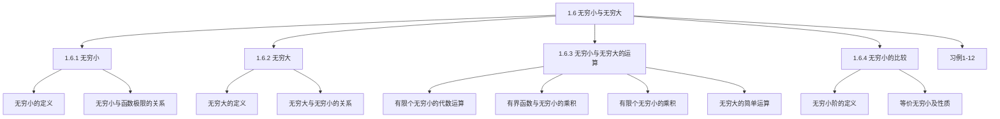

## 第1章 函数与极限

## 1.6 无穷小与无穷大

1.6.1 无穷小
1.6.2 无穷大
1.6.3 无穷小与无穷大的运算
1.6.4 无穷小的比较

## 1.6 无穷小与无穷大

## 一、无穷小

## 1.无穷小的定义

定义1 若 $\lim _{x \rightarrow x_{0}} f(x)=0$ ，则称 $f(x)$ 当 $x \rightarrow x_{0}$ 时为无穷小。 $(\varepsilon-\delta)$ 定义：若 $\forall \varepsilon>0, \exists \delta>0$ ，当 $0<\left|x-x_{0}\right|<\delta$ 时 $|f(x)|<\varepsilon$ ，则称 $f(x)$ 当 $x \rightarrow x_{0}$ 时为无穷小。

若 $\lim _{x \rightarrow \infty} f(x)=0$ ，则称 $f(x)$ 当 $x \rightarrow \infty$ 时为无穷小。比如 $\lim _{\boldsymbol{x} \rightarrow \infty} \frac{\mathbf{1}}{\boldsymbol{x}}=\mathbf{0}, \quad \lim _{\boldsymbol{x} \rightarrow \mathbf{0}} \boldsymbol{x}=\mathbf{0}, \quad \lim _{\boldsymbol{x} \rightarrow x_{\mathbf{0}}} \mathbf{0}=\mathbf{0} \quad \lim _{x \rightarrow 1}(x-1)=0$
注意：（1）无穷小并不是一个很小的数．
（2）数＂ 0 ＂是无穷小量。
（3）无穷小是一类特殊函数，是在某一变化过程中极限为 $\mathbf{0}$ 的函数，并且在一个过程中为无穷小的量在另一过程中可能不是无穷小量．

## 2.无穷小与函数极限的关系

## （以下定理中“ $\lim$ ”表示 $x \rightarrow x_{0}$ 或 $x \rightarrow \infty$ 等都成立）

定理1 $\lim f(x)=A \Leftrightarrow f(x)=A+\alpha(x)$ ，其中 $\lim \alpha(x)=0$ ．
证明：仅证明 $x \rightarrow x_{0}$ 的情况。
必要性：设 $\lim _{x \rightarrow x_{0}} f(x)=A$ ，则对
$\forall \varepsilon>0, \exists \delta>0$ ，当 $0<\left|x-x_{0}\right|<\delta$ 时有 $|f(x)-A|<\varepsilon$ 成立，于是令 $\alpha(x)=f(x)-A$ ，则 $\alpha(x)$ 是 $x \rightarrow x_{0}$ 时的无穷小。
即 $f(x)=A+\alpha(x)$ ，其中 $\lim _{x \rightarrow x_{0}} \alpha(x)=0$ ．
充分性：设 $f(x)=A+\alpha(x)$ ，且 $\lim \alpha(x)=0$ ；则 $f(x)-A=\alpha(x)$ ．
于是对 $\forall \varepsilon>0, \exists \delta>0$ ，当 $0<\left|x-x_{0}\right|<\delta$ 时，
有 $|f(x)-A|=|\alpha(x)|<\varepsilon$ 成立。
即 $\lim _{\mathrm{x} \rightarrow \mathrm{x}_{0}} f(x)=A$ 。

## 二、无穷大

## 1.无穷大的定义

定义2 若 $\lim _{x \rightarrow x_{0}} f(x)=\infty$ ，则称 $f(x)$ 当 $x \rightarrow x_{0}$ 时为无穷大。
$(M-\delta)$ 定义：若 $\forall M>0, \exists \delta>0$ ，当 $0<\left|x-x_{0}\right|<\delta$ 时
$f(x)>M$ ，则称 $f(x)$ 当 $x \rightarrow x_{0}$ 时为无穷大。
若 $\lim _{x \rightarrow \infty} f(x)=\infty$ ，则称 $f(x)$ 当 $x \rightarrow \infty$ 时为无穷大。
注意：（1）无穷大是变量，不能与很大的数混淆．
（2）切勿将 $\lim _{x \rightarrow x_{0}} f(x)=\infty$ 认为极限存在．
（3）无穷大是一种特殊的无界变量，但是无界变量未
必是无穷大。如： $1,2, \cdots, n, \cdots$ ；与 $0,1,0,2, \cdots, 0, n, \cdots$ ．
例1．证明 $\lim _{x \rightarrow 0} \frac{1}{x}=\infty$ 和 $\lim _{x \rightarrow 1} \frac{1}{x-1}=\infty$ ．

## 2.无穷大与无穷小的关系

定理2 在自变量的同一变化过程中，如果 $f(x)$ 为无穷大，则 $\frac{1}{f(x)}$ 为无穷小。反之，如果 $f(x)$ 为无穷小，且 $f(x) \neq 0$ ，则 $\frac{1}{f(x)}$ 为无穷大。
证明：设 $\lim _{\mathrm{x} \rightarrow \mathrm{x}_{0}} f(x)=\infty$ ，则 $\forall \varepsilon>0$ ，根据无穷大的定义，对于 $M=\frac{1}{\varepsilon}$ ，
$\exists \delta>0$ ，当 $0<\left|x-x_{0}\right|<\delta$ 时，有 $|f(x)|>M=\frac{1}{\varepsilon}$ ，即 $\left|\frac{1}{f(x)}\right|<\varepsilon$ 成立。
所以 $\lim _{x \rightarrow x_{0}} \frac{1}{f(x)}=0$ ，即 $\frac{1}{f(x)}$ 为当 $x \rightarrow x_{0}$ 时的无穷小。
反之，如果 $f(x)$ 为无穷小，且 $f(x) \neq 0 . \forall M>0$ ，根据无穷小的定义，
对于 $\varepsilon=\frac{1}{M}, \exists \delta>0$ ，当 $0<\left|x-x_{0}\right|<\delta$ 时，有

$$
|f(x)|<\varepsilon=\frac{1}{M} \quad \text { 即 }\left|\frac{1}{f(x)}\right|>M
$$

所以 $\lim _{x \rightarrow x_{0}} \frac{1}{f(x)}=\infty$ ，即 $\frac{1}{f(x)}$ 为当 $x \rightarrow x_{0}$ 时的无穷大。

定理2也可以叙述为：
（1）若 $\lim f(x)=\infty$ ，则 $\lim \frac{1}{f(x)}=0$ ；
（2）若 $\lim f(x)=0$ ，且 $f(x) \neq 0$ ，则 $\lim \frac{1}{f(x)}=\infty$ ．

## 三、无穷小与无穷大的运算

定理3（1）有限个无穷小的代数和仍为无穷小。
即若 $\lim \alpha(x)=0, \lim \beta(x)=0$ ，则 $\lim [\alpha(x) \pm \beta(x)]=0$ ．
证明：不妨设 $\lim _{x \rightarrow x_{0}} \alpha(x)=0, \lim _{x \rightarrow x_{0}} \beta(x)=0$ ．
$\forall \varepsilon>0, \exists \delta_{1}>0$ ，当 $0<\left|x-x_{0}\right|<\delta_{1}$ 时，有 $|\alpha(x)|<\frac{\varepsilon}{2}$ ；
$\exists \delta_{2}>0$ ，当 $0<\left|x-x_{0}\right|<\delta_{2}$ 时，有 $|\beta(x)|<\frac{\varepsilon}{2}$ ．
取 $\delta=\min \left\{\delta_{1}, \delta_{2}\right\}$ ，当 $0<\left|x-x_{0}\right|<\delta$ 时，
有 $|\alpha(x) \pm \beta(x)| \leq|\alpha(x)|+|\beta(x)|<\frac{\varepsilon}{2}+\frac{\varepsilon}{2}=\varepsilon$ ．
$\therefore \lim _{x \rightarrow x_{0}}[\alpha(x) \pm \beta(x)]=\mathbf{0}$.
注意：无穷多个无穷小的代数和未必是无穷小。
例如，$n \rightarrow \infty$ 时，$\frac{1}{n}$ 是无穷小，但 $n$ 个 $\frac{1}{n}$ 之和为 1 不是无穷小。

定理4 有界函数与无穷小的乘积是无穷小．
即若 $|u(x)| \leq M, \lim _{x \rightarrow x_{0}} \alpha(x)=0 \Rightarrow \lim _{x \rightarrow x_{0}} u(x) \cdot \alpha(x)=0$ ．
证明：$\because \lim _{x \rightarrow x_{0}} \alpha(x)=0$ ．
$\forall \varepsilon>0, \exists \delta>0$ ，当 $0<\left|x-x_{0}\right|<\delta$ 时，有 $|\alpha(x)|<\frac{\varepsilon}{M}$ ；
则 $|u(x) \cdot \alpha(x)|=|u(x)| \cdot |\alpha(x)|<M \cdot \frac{\varepsilon}{M}=\varepsilon$ 。
$\therefore \lim _{x \rightarrow x_{0}} u(x) \cdot \alpha(x)=\mathbf{0}$ ．

例如．计算下列极限
（1） $\lim _{x \rightarrow 0} x \cdot \sin \frac{1}{x}=0$ ；
（2） $\lim _{x \rightarrow \infty} x \cdot \sin \frac{1}{x}=\lim _{x \rightarrow \infty} \frac{\sin \frac{1}{x}}{\frac{1}{x}}=1$ ；
（3） $\lim _{x \rightarrow 0} \frac{\sin x}{x}=1$ ；
（4） $\lim _{x \rightarrow \infty} \frac{\sin x}{x}=\lim _{x \rightarrow \infty} \frac{1}{x} \cdot \sin x=0$ ．

推论1．在同一过程中，有极限的变量与无穷小的乘积是无穷小。
推论2．常数与无穷小的乘积是无穷小。
推论3．有限个无穷小的乘积也是无穷小。
证明：不妨设 $\lim _{x \rightarrow x_{0}} \alpha(x)=0, \lim _{x \rightarrow x_{0}} \beta(x)=0$ ．
$\forall \varepsilon>0, \exists \delta_{1}>0$ ，当 $0<\left|x-x_{0}\right|<\delta_{1}$ 时，有 $|\alpha(x)|<\sqrt{\varepsilon}$ ；
$\exists \delta_{2}>0$ ，当 $0<\left|x-x_{0}\right|<\delta_{2}$ 时，有 $|\beta(x)|<\sqrt{\varepsilon}$ ．
取 $\delta=\min \left\{\delta_{1}, \delta_{2}\right\}$ ，当 $0<\left|x-x_{0}\right|<\delta$ 时，
有 $|\alpha(x) \cdot \beta(x)|=|\alpha(x)| \cdot|\beta(x)|<\sqrt{\varepsilon} \cdot \sqrt{\varepsilon}=\varepsilon$ ．
$\therefore \lim _{x \rightarrow x_{0}} \alpha(x) \cdot \beta(x)=0$.

## 定理5 对于自变量相同变化趋势下的无穷大有如下性质：
（1）有限个无穷大的乘积是无穷大；
（2）无穷大与有界量之和是无穷大．
证（1）设 $\lim _{x \rightarrow x_{0}} f(x)=\infty, ~ \lim _{x \rightarrow x_{0}} g(x)=\infty$ ，下证 $\lim _{x \rightarrow x_{0}}[f(x) g(x)]=\infty$ ． $\forall M>0$ ，因 $\lim _{x \rightarrow x_{0}} f(x)=\infty, \exists \delta_{1}>0$ 当 $0<\left|x-x_{0}\right|<\delta_{1}$ 时，有 $|f(x)|>\sqrt{M}$ ，

又 $\lim _{x \rightarrow x_{0}} g(x)=\infty, \exists \delta_{2}>0$ 当 $0<\left|x-x_{0}\right|<\delta_{2}$ 时，有 $|g(x)|>\sqrt{M}$取 $\delta=\min \left\{\delta_{1}, \delta_{2}\right\}$ ，则当 $0<\left|x-x_{0}\right|<\delta$ 时，有

$$
|f(x) g(x)|>\sqrt{M} \cdot \sqrt{M}=M .
$$

这就证明了 $\lim _{x \rightarrow x_{0}}[f(x) g(x)]=\infty$ ，即两个无穷大的乘积是无穷大
注意：两个无穷大的和与差不一定是无穷大：$\infty-\infty$无穷大与有界函数的乘积也不一定是无穷大。 $0 \cdot \infty$

## 四、无穷小的比较

## 1.无穷小阶的定义

例如，当 $x \rightarrow 0$ 时，$x, 3 x, x^{2}, \sin x, x^{2} \sin \frac{1}{x}$ 都是无穷小。

$$
\begin{array}{ll}
\lim _{x \rightarrow 0} \frac{x^{2}}{3 x}=0, & x^{2} \text { 比 } 3 x \text { 要快得多; } \\
\lim _{x \rightarrow 0} \frac{\sin x}{3 x}=\frac{1}{3}, & \sin x \text { 与 } 3 x \text { 大致相同; } \\
\lim _{x \rightarrow 0} \frac{x^{2} \sin \frac{1}{x}}{x^{2}}=\lim _{x \rightarrow 0} \sin \frac{1}{x} \text { 不存在. 不可比。 }
\end{array}
$$

极限不同，反映了趋向于零的＂快慢＂程度不同。

定义3 设 $\lim \alpha=0, \lim \beta=0$ ，且 $\alpha \neq 0$ ．
（1）如果 $\lim \frac{\beta}{\alpha}=0$ ，就说 $\beta$ 是比 $\alpha$ 高阶的无穷小，记作 $\beta=o(\alpha)$ ；
（2）如果 $\lim \frac{\beta}{\alpha}=\infty$ ，就说 $\beta$ 是比 $\alpha$ 低阶的无穷小；
（3）如果 $\lim \frac{\beta}{\alpha}=C(C \neq 0)$ ，就说 $\beta$ 与 $\alpha$ 是同阶的无穷小，记作 $\beta=O(\alpha)$ ；
（4）如果 $\lim \frac{\beta}{\alpha}=1$ ，则称 $\beta$ 与 $\alpha$ 是等价的无穷小；记作 $\alpha \sim \beta$ ；
（5）如果 $\lim \frac{\beta}{\alpha^{k}}=C(C \neq 0, k>0)$ ，就说 $\beta$ 是 $\alpha$ 的 $k$ 阶无穷小。

例1 证明：当 $x \rightarrow 0$ 时，$\sqrt[n]{1+x}-1 \sim \frac{1}{n} x$
例2 证明：当 $\boldsymbol{x} \rightarrow \mathbf{0}$ 时， $\ln (1+x) \sim x$
例3 证明当 $x \rightarrow 0$ 时，$e^{x}-1 \sim x$

例1 证明：当 $x \rightarrow 0$ 时，$\sqrt[n]{1+x}-1 \sim \frac{1}{n} x$
证 $\quad \lim _{x \rightarrow 0} \frac{\sqrt[n]{1+x}-1}{\frac{1}{n} x}$

$$
\begin{aligned}
& \lim_{x \rightarrow 0} \frac{\sqrt[n]{1+x}-1}{\frac{1}{n} x} \xlongequal{a=\sqrt[n]{1+x},\, b=1} \lim_{x \rightarrow 0} \frac{1}{\frac{1}{n} \cdot \left[(\sqrt[n]{1+x})^{n-1}+(\sqrt[n]{1+x})^{n-2}+\cdots+1\right]}=1 \\
& \therefore \text{当 } x \rightarrow 0 \text{ 时，} \sqrt[n]{1+x}-1 \sim \frac{1}{n} x
\end{aligned}
$$

例2 证明：当 $\boldsymbol{x} \rightarrow \mathbf{0}$ 时， $\ln (1+x) \sim x$
证

$$
\begin{aligned}
\lim _{x \rightarrow 0} \frac{\ln (1+x)}{x} & =\lim _{x \rightarrow 0} \ln (1+x)^{\frac{1}{x}} \\
& =\ln \boldsymbol{e}=\mathbf{1 .}
\end{aligned}
$$

所以，当 $\boldsymbol{x} \rightarrow \mathbf{0}$ 时， $\ln (1+x) \sim x$

## 例3 证明当 $x \rightarrow 0$ 时，$e^{x}-1 \sim x$

解 令 $e^{x}-1=y$ ，则 $x=\ln (1+y)$ ，
当 $x \rightarrow 0$ 时，$y \rightarrow 0$ ．

$$
\lim _{x \rightarrow 0} \frac{e^{x}-1}{x}=\lim _{y \rightarrow 0} \frac{y}{\ln (1+y)}=\lim _{y \rightarrow 0} \frac{1}{\ln (1+y)^{\frac{1}{y}}}=1 .
$$

同理可得 $\quad \lim _{x \rightarrow 0} \frac{a^{x}-1}{x}=\ln a$ ，则 $a^{x}-1 \sim x \ln a, ~(x \rightarrow 0$ 时）．

## 2.等价无穷小的性质

定理6 设 $\alpha, \beta$ 为无穷小，则 $\alpha \sim \beta \Leftrightarrow \beta-\alpha=o(\alpha)$ ．

证明：⇒ 若 $\alpha \sim \beta$ ，

$$
\begin{aligned}
& \text { 则 } \lim \frac{\beta-\alpha}{\alpha}=\lim \left(\frac{\beta}{\alpha}-1\right)=\lim \frac{\beta}{\alpha}-1=1-1=0 \\
& \therefore \beta-\alpha=o(\alpha) \text {. }
\end{aligned}
$$

$\Leftarrow$ 若 $\beta-\alpha=o(\alpha)$ ，则 $\beta=\alpha+o(\alpha)$ ，
则 $\lim \frac{\beta}{\alpha}=\lim \frac{\alpha+o(\alpha)}{\alpha}=\lim \left[1+\frac{o(\alpha)}{\alpha}\right]=1$
$\therefore \alpha \sim \beta$.

设 $\alpha \sim \alpha^{\prime}, \beta \sim \beta^{\prime}$ ，且 $\lim \frac{\beta^{\prime}}{\alpha^{\prime}}$ 存在，则 $\lim \frac{\beta}{\alpha}=\lim \frac{\beta^{\prime}}{\alpha^{\prime}}$ ．证明：

$$
\begin{aligned}
& \because \alpha(x) \sim \alpha^{\prime}(x), \quad \beta(x) \sim \beta^{\prime}(x), \\
& \therefore \lim \frac{\alpha^{\prime}(x)}{\alpha(x)}=1, \quad \lim \frac{\beta^{\prime}(x)}{\beta(x)}=1 . \\
& \therefore \lim \frac{\beta(x)}{\alpha(x)}=\lim \left(\frac{\beta(x)}{\beta^{\prime}(x)} \frac{\beta^{\prime}(x)}{\alpha^{\prime}(x)} \frac{\alpha^{\prime}(x)}{\alpha(x)}\right) \\
& =\lim \frac{\beta(x)}{\beta^{\prime}(x)} \lim \frac{\beta^{\prime}(x)}{\alpha^{\prime}(x)} \lim \frac{\alpha^{\prime}(x)}{\alpha(x)}=\lim \frac{\beta^{\prime}(x)}{\alpha^{\prime}(x)} .
\end{aligned}
$$

例。证明：当 $x \rightarrow 0$ 时， $4 x \tan ^{3} x$ 为 $x$ 的四阶无穷小。
证明：$\because \lim _{x \rightarrow 0} \frac{4 x \tan ^{3} x}{x^{4}}=4 \lim _{x \rightarrow 0}\left(\frac{\tan x}{x}\right)^{3}=4$ ，
故当 $x \rightarrow 0$ 时， $4 x \tan ^{3} x$ 为 $x$ 的四阶无穷小。

注意：
（1）任何无穷小与其本身是等价无穷小。
（2）等价无穷小代换只适用于乘积中；对于代数和或复合函数中各无穷小不能分别替换。
（3）熟记一些常用的等价无穷小（当 $x \rightarrow 0$ 时）

$$
\begin{array}{ll}
\sin x \sim x, & \tan x \sim x, \\
\arcsin x \sim x, & \arctan x \sim x, \\
\ln (1+x) \sim x, & e^{x}-1 \sim x, \\
1-\cos x \sim \frac{x^{2}}{2}, & \sqrt[n]{1+x}-1 \sim \frac{x}{n} .
\end{array}
$$

因为 $\beta \sim \alpha \Leftrightarrow \beta=\alpha+o(\alpha)$ 所以有：

$$
\begin{array}{ll}
\sin x=x+o(x), & \tan x=x+o(x), \\
\arcsin x=x+o(x), & \arctan x=x+o(x), \\
\ln (1+x)=x+o(x), & e^{x}-1=x+o(x), \\
1-\cos x=\frac{x^{2}}{2}+o\left(x^{2}\right), & \sqrt[n]{1+x}-1=\frac{x}{n}+o(x) .
\end{array}
$$

## 五、无穷小与无穷大例题分析

例1．计算极限 $\lim _{x \rightarrow 0} \frac{\sqrt{1+2 x^{2}}-1}{\arcsin \frac{x}{2} \arctan \frac{x}{3}}$ ．

例2．计算极限 $\lim _{x \rightarrow 0} \frac{e^{\sin 2 x}-1}{\arcsin \frac{x}{2}}$ ．
例3．计算极限 $\lim _{x \rightarrow 0} \arccos \frac{\sqrt{1+x}-1}{\sin x}$ ．

例4．计算极限 $\lim _{x \rightarrow 0} \frac{e^{x}-e^{\sin x}}{x-\sin x}$ ．
例5．计算极限 $\lim _{x \rightarrow 0} \frac{\tan x-\sin x}{\sin ^{3} x}$ ．

例6．计算极限 $\lim _{x \rightarrow 0^{+}} \frac{1-\sqrt{\cos x}}{x(1-\cos \sqrt{x})}$ ．
例7．设 $\lim _{x \rightarrow 0} \frac{\ln \left(1+\frac{f(x)}{\sin x}\right)}{a^{x}-1}=A(a>0, a \neq 1)$ ，求 $\lim _{x \rightarrow 0} \frac{f(x)}{x^{2}}$ ．
例8．当 $x \rightarrow 0$ 时，$e^{x^{2}}-\left(a x^{2}+b x+c\right)$ 是比 $x^{2}$ 高阶的无穷小，求 $a, b, c$ 。

例9． $\lim _{x \rightarrow+\infty}\left[\left(x^{5}+7 x^{4}+2\right)^{c}-x\right]$ 存在且不为零，求 $c$ 及极限

例1．计算极限 $\lim _{x \rightarrow 0} \frac{\sqrt{1+2 x^{2}}-1}{\arcsin \frac{x}{2} \arctan \frac{x}{3}}$ ．
解：$\because \sqrt{1+2 x^{2}}-1 \sim \frac{1}{2} \cdot 2 x^{2}=x^{2}$
$\arcsin \frac{x}{2} \sim \frac{x}{2}, \quad \arctan \frac{x}{3} \sim \frac{x}{3}$,
$\therefore \lim _{x \rightarrow 0} \frac{\sqrt{1+2 x^{2}}-1}{\arcsin \frac{x}{2} \arctan \frac{x}{3}}=\lim _{x \rightarrow 0} \frac{x^{2}}{\frac{x}{2} \cdot \frac{x}{3}}=6$.

例2．计算极限 $\lim _{x \rightarrow 0} \frac{e^{\sin 2 x}-1}{\arcsin \frac{x}{2}}$ ．
解： $\lim _{x \rightarrow 0} \frac{\mathrm{e}^{\sin 2 x}-1}{\arcsin \frac{x}{2}}=\lim _{x \rightarrow 0} \frac{\sin 2 x}{\frac{x}{2}}$

$$
=\lim _{x \rightarrow 0} \frac{2 x}{\frac{x}{2}}=4 .
$$

例3．计算极限 $\lim _{x \rightarrow 0} \arccos \frac{\sqrt{1+x}-1}{\sin x}$ ．

$$
\begin{aligned}
& \text { 解: } \lim _{x \rightarrow 0} \arccos \frac{\sqrt{1+x}-1}{\sin x}=\arccos \left(\lim _{x \rightarrow 0} \frac{\sqrt{1+x}-1}{\sin x}\right) \\
& =\arccos \left(\lim _{x \rightarrow 0} \frac{x}{\sin x}\right) \\
& =\arccos \frac{1}{2}=\frac{\pi}{3}
\end{aligned}
$$

例4．计算极限 $\lim _{x \rightarrow 0} \frac{e^{x}-e^{\sin x}}{x-\sin x}$ ．

解： $\lim _{x \rightarrow 0} \frac{e^{x}-e^{\sin x}}{x-\sin x}=\lim _{x \rightarrow 0} \frac{e^{\sin x}\left(e^{x-\sin x}-1\right)}{x-\sin x}$

$$
\begin{aligned}
& =\lim _{x \rightarrow 0} \frac{e^{\sin x}(x-\sin x)}{x-\sin x} \\
& =\lim _{x \rightarrow 0} e^{\sin x}=1
\end{aligned}
$$

例5．计算极限 $\lim _{x \rightarrow 0} \frac{\tan x-\sin x}{\sin ^{3} x}$ ．
解：当 $x \rightarrow 0$ 时， $\sin x \sim x, 1-\cos x \sim \frac{1}{2} x^{2}$ ．

$$
\begin{aligned}
\therefore & \lim _{x \rightarrow 0} \frac{\tan x-\sin x}{\sin ^{3} x}=\lim _{x \rightarrow 0} \frac{\tan x-\sin x}{x^{3}} \\
& =\lim _{x \rightarrow 0} \frac{\sin x(1-\cos x)}{x^{3} \cos x} \\
& =\lim _{x \rightarrow 0} \frac{x \cdot \frac{1}{2} x^{2}}{x^{3} \cos x}=\frac{1}{2}
\end{aligned}
$$

错解 ：：当 $x \rightarrow 0$ 时， $\tan x \sim x, \sin x \sim x$ ．
∴ 原式 $=/ \lim _{x \rightarrow 0} \frac{x-x}{x^{3}}=0$.
错误原因：$\because \lim _{x \rightarrow 0} \frac{0}{\tan x-\sin x}=0 \neq 1$

$$
\therefore \quad \tan x-\sin x \nsim x-x=0
$$

注 不能滥用等价无穷小代换。在用等价无穷小代换时，要用与分子或分母整体等价的无穷小代换。
$1^{\circ}$ 对于代数和中各无穷小，一般不能分别代换。即遇无穷小＂＋＂，＂－＂时，一般不能代换；
$2^{\circ}$ 遇无穷小乘积时，可用各无穷小的等价无穷小进行代换。

例6．计算极限 $\lim _{x \rightarrow 0^{+}} \frac{1-\sqrt{\cos x}}{x(1-\cos \sqrt{x})}$ ．
解： $\lim _{x \rightarrow 0^{+}} \frac{1-\sqrt{\cos x}}{x(1-\cos \sqrt{x})}=\lim _{x \rightarrow 0^{+}} \frac{1-\cos x}{x(1-\cos \sqrt{x})(1+\sqrt{\cos x})}$

$$
=\lim _{x \rightarrow 0^{+}} \frac{\frac{x^{2}}{2}}{x \cdot \frac{x}{2} \cdot(1+\sqrt{\cos x})}=\frac{1}{2} .
$$

例7．设 $\lim _{x \rightarrow 0} \frac{\ln \left(1+\frac{f(x)}{\sin x}\right)}{a^{x}-1}=A(a>0, a \neq 1)$ ，求 $\lim _{x \rightarrow 0} \frac{f(x)}{x^{2}}$ ．
解：$\because \lim _{x \rightarrow 0} \frac{f(x)}{\sin x}=0, \quad \therefore \lim _{x \rightarrow 0} f(x)=0$ ．
$\therefore \lim _{x \rightarrow 0} \frac{\ln \left(1+\frac{f(x)}{\sin x}\right)}{a^{x}-1}=\lim _{x \rightarrow 0} \frac{\frac{f(x)}{\sin x}}{e^{x \ln a}-1}=\lim _{x \rightarrow 0} \frac{f(x)}{x \ln a \cdot \sin x}$
$=\lim _{x \rightarrow 0} \frac{f(x)}{x^{2} \ln a}=\frac{1}{\ln a} \lim _{x \rightarrow 0} \frac{f(x)}{x^{2}}=A, \therefore \lim _{x \rightarrow 0} \frac{f(x)}{x^{2}}=A \ln a$.

例8．当 $x \rightarrow 0$ 时，$e^{x^{2}}-\left(a x^{2}+b x+c\right)$ 是比 $x^{2}$ 高阶的无穷小，求 $a, b, c$ 。
解：$\because \lim _{x \rightarrow 0} \frac{e^{x^{2}}-\left(a x^{2}+b x+c\right)}{x^{2}}=0$ ，
$\therefore \lim _{x \rightarrow 0}\left[e^{x^{2}}-\left(a x^{2}+b x+c\right)\right]=0, \quad \therefore c=1$ ．
又 $\lim _{x \rightarrow 0} \frac{1}{x} \cdot\left(\frac{e^{x^{2}}-1}{x}-\frac{a x^{2}}{x}-b\right)=0$ ，
则 $\lim _{x \rightarrow 0}\left(\frac{e^{x^{2}}-1}{x}-\frac{a x^{2}}{x}-b\right)=0, \quad \therefore b=0$ ．
从而 $\lim _{x \rightarrow 0}\left(\frac{e^{x^{2}}-1}{x^{2}}-a\right)=0, \quad \therefore a=1$ ．
$\therefore a=1, b=0, c=1$ ．

例9． $\lim _{x \rightarrow+\infty}\left[\left(x^{5}+7 x^{4}+2\right)^{c}-x\right]$ 存在且不为零，求 $c$ 及极限．
解：$\because \lim _{x \rightarrow+\infty}\left[\left(x^{5}+7 x^{4}+2\right)^{c}-x\right]$

$$
\begin{aligned}
& =\lim _{x \rightarrow+\infty}\left[x^{5 c}\left(1+\frac{7}{x}+\frac{2}{x^{5}}\right)^{c}-x\right] \\
& =\lim _{x \rightarrow+\infty} x\left[x^{5 c-1}\left(1+\frac{7}{x}+\frac{2}{x^{5}}\right)^{c}-1\right],
\end{aligned}
$$

则 $\lim _{x \rightarrow+\infty}\left[x^{5 c-1}\left(1+\frac{7}{x}+\frac{2}{x^{5}}\right)^{c}-1\right]=0$ ．
又由于 $\lim _{x \rightarrow+\infty}\left(1+\frac{7}{x}+\frac{2}{x^{5}}\right)^{c}=1, \quad$ 必有 $5 c-1=0$ ．
否则 $\lim _{x \rightarrow+\infty} x^{5 c-1}\left(1+\frac{7}{x}+\frac{2}{x^{5}}\right)^{c} \neq 1 . \quad \therefore c=\frac{1}{5}$ ．

$$
\begin{aligned}
& \text { 原式 }=\lim _{x \rightarrow+\infty} x\left[\left(1+\frac{7}{x}+\frac{2}{x^{5}}\right)^{\frac{1}{5}}-1\right] \\
& =\lim _{x \rightarrow+\infty} \frac{\sqrt[5]{1+\frac{7}{x}+\frac{2}{x^{5}}}-1}{\frac{1}{x}} \quad \because \sqrt[n]{1+x}-1 \sim \frac{x}{n}(x \rightarrow 0) \\
& =\lim _{x \rightarrow+\infty} \frac{\frac{1}{5}\left(\frac{7}{x}+\frac{2}{x^{5}}\right)}{\frac{1}{x}}=\lim _{x \rightarrow+\infty} \frac{1}{5}\left(7+\frac{2}{x^{4}}\right)=\frac{7}{5} .
\end{aligned}
$$

## 伯考题 任何两个无穷小都可以比较吗？

## 解答

不能。

例如，当 $x \rightarrow \infty$ 时 $f(x)=\frac{1}{x}, \quad g(x)=\frac{\sin x}{x} \quad$ 都是无穷小量
但 $\lim _{x \rightarrow+\infty} \frac{g(x)}{f(x)}=\lim _{x \rightarrow+\infty} \sin x$
不存在且不为无穷大
故当 $x \rightarrow \infty$ 函数 $f(x)$ 和 $g(x)$ 不能比较。

## 1.7 无穷小与无穷大

## 一.填空

1．当 $x \rightarrow 0$ 时， $\ln (1+x)$ 是 $x$ 的等价无穷小量；
2．当 $x \rightarrow 0$ 时， $\arctan x$ 与 $\frac{a x}{\cos x}$ 是等价无穷小，则 $a=\underline{1}$
3． $\lim _{x \rightarrow 0} x^{3} \cos \frac{1}{x^{3}}=0$
4．当 $x \rightarrow \infty$ 时，若 $f(x)=\frac{p x^{2}-2}{x^{2}+1}+3 q x+5$ 为无穷大量，则 $p$ 为 任意常数，$q$ 为 非零常数，若 $f(x)$ 为无穷小量，则 $p=\underline{-5}, \underline{q}=\underline{0}$ ．

5．当 $x \rightarrow \infty$ 时，若 $\frac{1}{a x^{2}+b x+c} \sim \frac{1}{x+1}$ ，则 $a=\underline{0}, b=\underline{1}, c$ 为任意常数．
6．当 $x \rightarrow \infty$ 时，若 $\frac{1}{a x^{2}+b x+c}=o\left(\frac{1}{x+1}\right)$ ，则 $a$ 为 $\neq 0, b$ 为任意常数，$c$ 为任意常数。

二．当 $x \rightarrow 1$ 时，$f(x)=\sqrt[3]{1-\sqrt{x}}$ 与 $g(x)=x-1$ 都是无穷小，问 $f(x)$ 是 $g(x)$ 的几阶无穷小？

解．由 $\lim _{x \rightarrow 1} \frac{f(x)}{[g(x)]^{k}}=\lim _{x \rightarrow 1} \frac{\sqrt[3]{1-\sqrt{x}}}{(1-x)^{k}} \stackrel{1-\sqrt{x}-x^{t}}{=} \lim _{t \rightarrow 0} \frac{t}{\left(2 t^{3}-t^{6}\right)^{k}}$ ，可见，若取 $k=\frac{1}{3}$ ，则 $\lim _{x \rightarrow 1} \frac{f(x)}{[g(x)]^{\varepsilon}}=\lim _{t \rightarrow 0} \frac{t}{\left(2 t^{3}-t^{6}\right)^{k}}=\frac{1}{\sqrt[3]{2}}$ ，即 $f(x)$ 是 $g(x)$ 的 $\frac{1}{3}$ 阶无穷小。

三．当 $x \rightarrow 0$ 时，$\sqrt[3]{1+a x^{2}}-1$ 与 $\cos x-1$ 是等价无穷小，试求常数 $a$ 的值．
解．因当 $x \rightarrow 0$ 时，$\sqrt[3]{1+a x^{2}}-1 \sim \frac{1}{3} a x^{2}, \cos x-1 \sim-\frac{1}{2} x^{2}$ ，所以 $\lim _{x \rightarrow 0} \frac{\sqrt[3]{1+a x^{2}}-1}{\cos x-1}=\lim _{x \rightarrow 0} \frac{\frac{1}{3} a x^{2}}{-\frac{1}{2} x^{2}}=-\frac{2}{3} a$ ，由已知 $-\frac{2}{3} a=1$ ，所以 $a=-\frac{3}{2}$ ．

四．已知 $f(x)=a(x-1)^{2}+b(x-1)+c-\sqrt{x^{2}+3}$ 是 $x$ 趋于 1 时 $(x-1)^{2}$ 的高阶无穷小，求常数 $a, b, c$ ．

解．由条件得： $\lim _{x \rightarrow 1}\left[a(x-1)^{2}+b(x-1)+c-\sqrt{x^{2}+3}\right]=0, \quad \therefore c=2$ ．又

$$
\begin{aligned}
& \lim _{x \rightarrow 1} \frac{a(x-1)^{2}+b(x-1)+2-\sqrt{x^{2}+3}}{(x-1)^{2}}=\lim _{x \rightarrow 1} \frac{a(x-1)+b+\frac{1-x^{2}}{\left(2+\sqrt{x^{2}+3}\right)(x-1)}}{x-1}=0 \\
& \therefore b=\frac{1}{2}, \quad \text { 又 } \\
& \lim _{x \rightarrow 1} \frac{a(x-1)^{2}+\frac{1}{2}(x-1)+2-\sqrt{x^{2}+3}}{(x-1)^{2}}=\lim _{x \rightarrow 1}\left(a+\frac{\frac{1}{2}-\frac{1+x}{2+\sqrt{x^{2}+3}}}{x-1}\right) \\
& =\lim _{x \rightarrow 1}\left(a+\frac{\sqrt{x^{2}+3}-2 x}{2\left(2+\sqrt{x^{2}+3}\right)(x-1)}\right)=\lim _{x \rightarrow 1}\left(a+\frac{3\left(1-x^{2}\right)}{2\left(2+\sqrt{x^{2}+3}\right)\left(\sqrt{x^{2}+3}+2 x\right)(x-1)}\right)=0 \\
& \therefore a=\frac{3}{16}
\end{aligned}
$$
