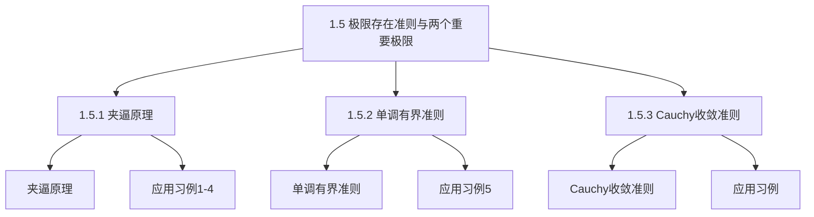

## 第1章 函数与极限
1.5 极限存在准则 两个重要极限

## 1.5.1 夹逼原理

1.5.2 单调有界准则
1.5.3 Cauchy收敛准则
1.5 极限存在准则 两个重要极限

## 一、夹逼原理

定理1（夹逼原理－准则1）
在给定的变化过程中，如果 $f(x), g(x), h(x)$ 满足
$(1) g(x) \leq f(x) \leq h(x)$
（2） $\lim g(x)=\lim h(x)=A$
则 $\lim f(x)=A$ ．
证明：不失一般性，考虑极限过程 $x \rightarrow x_{0}$ ．
设 $\exists \delta_{0}>0$ ，当 $0<\left|x-x_{0}\right|<\delta_{0}$ 时，$g(x) \leq f(x) \leq h(x)$ ，
$\because \lim _{x \rightarrow x_{0}} g(x)=\lim _{x \rightarrow x_{0}} h(x)=A$ ，
$\forall \varepsilon>0, \exists \delta_{1}>0$ ，当 $0<\left|x-x_{0}\right|<\delta_{1}$ 时，有 $|g(x)-A|<\varepsilon$ ，
即 $A-\varepsilon<g(x)<A+\varepsilon$ ．
$\exists \delta_{2}>0$ ，当 $0<\left|x-x_{0}\right|<\delta_{2}$ 时，有 $|h(x)-A|<\varepsilon$ ，

即 $A-\varepsilon<h(x)<A+\varepsilon$ ．
取 $\delta=\min \left\{\delta_{1}, \delta_{2}, \delta_{0}\right\}$ ．当 $0<\left|x-x_{0}\right|<\delta$ 时，
有 $A-\varepsilon<g(x) \leq f(x) \leq h(x)<A+\varepsilon$ ，
即 $|f(x)-A|<\varepsilon$ ．
$\therefore \lim _{x \rightarrow x_{0}} f(x)=A$.
极限过程为 $x \rightarrow x_{0}^{+}, \boldsymbol{x} \rightarrow \boldsymbol{x}_{\mathbf{0}}^{-}, \boldsymbol{x} \rightarrow \infty, \boldsymbol{x} \rightarrow+\infty, x \rightarrow-\infty$ 同理可证。
定理2 如果数列 $x_{n}, y_{n}, z_{n}$ 满足
（1）$y_{n} \leq x_{n} \leq z_{n}(n=1,2, \cdots)$
（2） $\lim _{n \rightarrow \infty} y_{n}=\lim _{n \rightarrow \infty} z_{n}=a$
则 $\lim _{n \rightarrow \infty} x_{n}=a$ ．

## 夹逼准则应用习例

例4。设 $a_{1}, a_{2}, \cdots, a_{k}>0, k$ 为正整数，
证明 $\lim _{n \rightarrow \infty} \sqrt[n]{a_{1}^{n}+a_{2}^{n}+\cdots+a_{k}^{n}}=\max \left\{a_{1}, a_{2}, \cdots, a_{k}\right\}$

例1．求 $\lim _{n \rightarrow \infty} n \cdot\left(\frac{1}{n^{2}+\pi}+\frac{1}{n^{2}+2 \pi}+\ldots+\frac{1}{n^{2}+n \pi}\right)$ ．
解：

$$
\because \frac{n^{2}}{n^{2}+n \pi} \leq n\left(\frac{1}{n^{2}+\pi}+\frac{1}{n^{2}+2 \pi}+\cdots+\frac{1}{n^{2}+n \pi}\right) \leq \frac{n^{2}}{n^{2}+\pi}
$$

又 $\lim _{n \rightarrow \infty} \frac{n^{2}}{n^{2}+n \pi}=1, \quad \lim _{n \rightarrow \infty} \frac{n^{2}}{n^{2}+\pi}=1$ ．
由夹逼准则得

$$
\lim _{n \rightarrow \infty} n \cdot\left(\frac{1}{n^{2}+\pi}+\frac{1}{n^{2}+2 \pi}+\ldots+\frac{1}{n^{2}+n \pi}\right)=1 .
$$

例2．求 $\lim _{n \rightarrow \infty}\left(\frac{1}{n^{2}+1}+\frac{1}{n^{2}+2}+\ldots+\frac{1}{n^{2}+n}\right)$ ．
解：$\because \frac{n}{n^{2}+n} \leq\left(\frac{1}{n^{2}+1}+\frac{1}{n^{2}+2}+\cdots+\frac{1}{n^{2}+n}\right) \leq \frac{n}{n^{2}+1}$
又 $\lim _{n \rightarrow \infty} \frac{n}{n^{2}+n}=0, \quad \lim _{n \rightarrow \infty} \frac{n}{n^{2}+1}=0$ ．
由夹逼准则得

$$
\lim _{n \rightarrow \infty}\left(\frac{1}{n^{2}+1}+\frac{1}{n^{2}+2}+\ldots+\frac{1}{n^{2}+n}\right)=0 .
$$

例3．证明 $\lim _{n \rightarrow \infty} \sqrt[n]{n}=1$ ．
证明：当 $n>1$ 时，$\sqrt[n]{n}>1$ ．

$$
\text { 记 } a_{n}=\sqrt[n]{n}=1+h_{n}\left(h_{n}>0\right) \text {, }
$$

则有 $n=\left(1+h_{n}\right)^{n}=1+n h_{n}+\frac{n(n-1)}{2!} h_{n}^{2}+\cdots+h_{n}^{n} \geq \frac{n(n-1)}{2} h_{n}^{2}$

$$
0 \leq h_{n}^{2} \leq \frac{2}{n-1}, \quad 0 \leq h_{n} \leq \sqrt{\frac{2}{n-1}},
$$

于是有 $1 \leq a_{n}=1+h_{n} \leq 1+\sqrt{\frac{2}{n-1}}$ ，而 $\lim _{n \rightarrow \infty}\left(1+\sqrt{\frac{2}{n-1}}\right)=1$ ，

$$
\therefore \lim _{n \rightarrow \infty} \sqrt[n]{n}=1 \text {. 类似可证, } \lim _{n \rightarrow \infty} \sqrt[n]{a}=1(a>0) \text {. }
$$

例4．设 $a_{1}, a_{2}, \cdots, a_{k}>0, k$ 为正整数，证明

$$
\lim _{n \rightarrow \infty} \sqrt[n]{a_{1}^{n}+a_{2}^{n}+\cdots+a_{k}^{n}}=\max \left\{a_{1}, a_{2}, \cdots, a_{k}\right\}
$$

证明：令 $a=\max \left\{a_{1}, a_{2}, \cdots, a_{k}\right\}$ ，

$$
\begin{aligned}
& a=\sqrt[n]{a^{n}}<\sqrt[n]{a_{1}^{n}+a_{2}^{n}+\cdots+a_{k}^{n}}<\sqrt[n]{k a^{n}}=a \cdot \sqrt[n]{k} \\
& \text { 又 } \lim _{n \rightarrow \infty} \sqrt[n]{k}=1, \\
& \therefore \lim _{n \rightarrow \infty} \sqrt[n]{a_{1}^{n}+a_{2}^{n}+\cdots+a_{k}^{n}}=a=\max \left\{a_{1}, a_{2}, \cdots, a_{k}\right\}
\end{aligned}
$$

## 定理3（单调有界准则—准则II）

单调有界数列必有极限。
注意：单增数列只需上有界；单减数列只需下有界．
几何解释：

例 5．设 $a>0$ ，证明数列 $\boldsymbol{x}_{1}=\sqrt{\boldsymbol{a}}, \boldsymbol{x}_{2}=\sqrt{\boldsymbol{a}+\sqrt{\boldsymbol{a}}}$ ， $\boldsymbol{x}_{\mathbf{3}}=\sqrt{\boldsymbol{a}+\sqrt{\boldsymbol{a}+\sqrt{\boldsymbol{a}}}}, \cdots, \boldsymbol{x}_{\boldsymbol{n}}=\sqrt{\boldsymbol{a}+\sqrt{\boldsymbol{a}+\sqrt{\cdots+\sqrt{\boldsymbol{a}}}}}, \cdots$的极限存在，并求其极限．
例6 设 $x_{n+1}=\frac{1}{2}\left(x_{n}+\frac{a}{x_{n}}\right)(n=1,2, \cdots)$ ，且 $x_{1}>0, a>0$ ，求 $\lim _{n \rightarrow \infty} x_{n}$ ．

例 5．设 $a>0$ ，证明数列 $\boldsymbol{x}_{1}=\sqrt{\boldsymbol{a}}, \boldsymbol{x}_{2}=\sqrt{\boldsymbol{a}+\sqrt{\boldsymbol{a}}}$ ，

$$
x_{3}=\sqrt{a+\sqrt{a+\sqrt{a}}}, \cdots, x_{n}=\sqrt{a+\sqrt{a+\sqrt{\cdots+\sqrt{a}}}}, \cdots
$$

的极限存在，并求其极限．
解：$\because x_{n+1}=\sqrt{a+x_{n}} \quad(n=1,2, \cdots)$

$$
\begin{aligned}
& x_{1}=\sqrt{a}>0 \\
& x_{2}=\sqrt{a+x_{1}}>\sqrt{a}=x_{1}
\end{aligned}
$$

假设 $x_{n}>x_{n-1}$ ，
则 $x_{n+1}=\sqrt{a+x_{n}}>\sqrt{a+x_{n-1}}=x_{n}$ 即 $x_{n}$ 单增。
从而 $\frac{x_{n-1}}{x_{n}}<1$ ，

又 $x_{n}=\sqrt{a+x_{n-1}}$ ，则 $x_{n}^{2}=a+x_{n-1}$ ．
$\therefore x_{n}=\frac{x_{n}^{2}}{x_{n}}=\frac{a+x_{n-1}}{x_{n}}=\frac{a}{x_{n}}+\frac{x_{n-1}}{x_{n}}<\frac{a}{\sqrt{a}}+1=\sqrt{a}+1$
即 $x_{n}$ 上有界。 所以数列极限存在。
设 $\lim _{n \rightarrow \infty} x_{n}=A$ ，
则 $\lim _{n \rightarrow \infty} x_{n}^{2}=\lim _{n \rightarrow \infty}\left(a+x_{n-1}\right)=a+\lim _{n \rightarrow \infty} x_{n-1}$ ．
即 $A^{2}=a+A$ ，解得 $A=\frac{1 \pm \sqrt{1+4 a}}{2}$（负号舍去）
$\therefore \lim _{n \rightarrow \infty} x_{n}=\frac{1+\sqrt{1+4 a}}{2}$.

例6 设 $x_{n+1}=\frac{1}{2}\left(x_{n}+\frac{a}{x_{n}}\right)(n=1,2, \cdots)$ ，且

$$
x_{1}>0, a>0 \text {, 求 } \lim _{n \rightarrow \infty} x_{n} \text {. }
$$

证 $1^{\circ}$ 有界性
由 $x_{1}>0$ ，易知 $x_{n}>0(n=1,2, \cdots)$ 。

$$
\begin{aligned}
\because \quad x_{n+1} & =\frac{1}{2}\left(x_{n}+\frac{a}{x_{n}}\right)=\frac{1}{2}\left[\left(\sqrt{x_{n}}\right)^{2}+\left(\sqrt{\frac{a}{x_{n}}}\right)^{2}\right] \\
& \geq \sqrt{x_{n}} \cdot \sqrt{\frac{a}{x_{n}}}=\sqrt{a} \quad(n=1,2, \cdots)
\end{aligned}
$$

$\therefore\left\{\boldsymbol{x}_{\boldsymbol{n}}\right\}$ 有下界。

$$
\begin{aligned}
& x_{n+1}-x_{n}=\frac{1}{2}\left(x_{n}+\frac{a}{x_{n}}\right)-x_{n} \\
&=\frac{1}{2}\left(\frac{a}{x_{n}}-x_{n}\right)=\frac{a-x_{n}^{2}}{2 x_{n}} \leq 0 \quad(n=2,3, \cdots) \\
&(n=2,3, \cdots)
\end{aligned}
$$

或 $\frac{x_{n+1}}{x_{n}}=\frac{1}{2}\left(1+\frac{a}{x_{n}^{2}}\right) \leq \frac{1}{2}\left(1+\frac{a}{a}\right)=1 \quad(n=2,3, \cdots)$
$\therefore\left\{x_{n}\right\}$ 单调减少且有下界。
$\therefore \lim _{n \rightarrow \infty} x_{n}$ 存在，令 $\lim _{n \rightarrow \infty} x_{n}=A$ ，则 $A \geq \sqrt{a}$

由 $x_{n+1}=\frac{1}{2}\left(x_{n}+\frac{a}{x_{n}}\right)$ ，令 $n \rightarrow \infty$
得 $\lim _{n \rightarrow \infty} x_{n+1}=\lim _{n \rightarrow \infty} \frac{1}{2}\left(x_{n}+\frac{a}{x_{n}}\right)$ ，
即 $A=\frac{1}{2}\left(A+\frac{a}{A}\right)$ ，
解得 $\boldsymbol{A}=\sqrt{\boldsymbol{a}}$ 或 $\boldsymbol{A}=-\sqrt{\boldsymbol{a}}$（舍去）

$$
\therefore \quad \lim _{n \rightarrow \infty} x_{n}=\sqrt{a} .
$$

## 三、Cauchy收敛准则

## 定理4（Cauchy收敛准则）

数列 $\left\{x_{n}\right\}$ 收玫的充分必要条件是：
$\forall \varepsilon>0, \exists N \in \mathbf{N}^{+}$，使得当 $m>N, n>N$ 时，有 $\left|x_{n}-x_{m}\right|<\varepsilon$ 。满足上述条件的数列也称Cauchy数列或基本数列．这样， Cauchy收敛准则又可叙述成：
数列 $\left\{x_{n}\right\}$ 收敛的充分必要条件是：$\left\{x_{n}\right\}$ 为Cauchy数列．
证明：必要性 设 $\lim _{n \rightarrow \infty} x_{n}=a, \forall \varepsilon>0$ ，由数列极限的定义，$\exists N \in \mathbf{N}^{+}$，当 $n>N$ 时，有 $\left|x_{n}-a\right|<\frac{\varepsilon}{2}$ 同样，当 $m>N$ 时，也有 $\left|x_{m}-a\right|<\frac{\varepsilon}{2}$因此，当 $m>N, n>N$ 时，有 $\left|x_{n}-x_{m}\right|=\left|\left(x_{n}-a\right)-\left(x_{m}-a\right)\right| \leq\left|x_{n}-a\right|+\left|x_{m}-a\right|$

$$
<\frac{\varepsilon}{2}+\frac{\varepsilon}{2}=\varepsilon
$$

即得 $\left\{x_{n}\right\}$ 为Cauchy数列．

## 注意：
（1）Cauchy收玫准则的几何意义：数列 $\left\{x_{n}\right\}$ 收敛的充分必要条件是：对于任意给定的正数 $\varepsilon$ ，在数轴上一切具有足够大号码的点 $x_{n}$中，任意两点间的距离小于 $\mathcal{E}$ 。
（2）由于Cauchy收敛准则是判断数列收敛的充分必要条件，因此，它不但可以用来判断数列的收玫性，而且也可以用来判断数列的发散
（3）应用上常使用Cauchy收玫准则的一个等价形式：数列 $\left\{x_{n}\right\}$ 收玫的充分必要条件是：$\forall \varepsilon>0, \exists N \in \mathbf{N}^{+}$，使得当 $n>N$ 时，对一切正整数 $p$ ，有 $\left|x_{n+p}-x_{n}\right|<\varepsilon$ 。

## Cauchy收敛准则应用举例

例1设 $x_{n}=\sum_{k=1}^{n} \frac{\sin k}{2^{k}}$ ，证明数列 $\left\{x_{n}\right\}$ 收敛。
证 易知 $\lim _{n \rightarrow \infty} \frac{1}{2^{n}}=0$ ，故对 $\forall \varepsilon>0, \exists N \in \mathbf{N}^{+}$，当 $n>N$ 时，有 $\left|\frac{1}{2^{n}}\right|<\varepsilon$ ，因此，当 $n>N$ 时，对一切正整数 $p$ ，有

$$
\begin{aligned}
\left|x_{n+p}-x_{n}\right| & =\left|\frac{\sin (n+1)}{2^{n+1}}+\frac{\sin (n+2)}{2^{n+2}}+\cdots+\frac{\sin (n+p)}{2^{n+p}}\right| \\
& \leq \frac{1}{2^{n+1}}+\frac{1}{2^{n+2}}+\cdots+\frac{1}{2^{n+p}}=\frac{\frac{1}{2^{n+1}}\left(1-\frac{1}{2^{p}}\right)}{1-\frac{1}{2}}<\frac{1}{2^{n}}<\varepsilon,
\end{aligned}
$$

于是由 Cauchy 收敛准则知 $\left\{x_{n}\right\}$ 收敛。

## Cauchy收敛准则应用举例

例 2 设 $x_{n}=1+\frac{1}{2}+\cdots+\frac{1}{n}(n=1,2, \cdots)$ ，证明数列 $\left\{x_{n}\right\}$ 发散。证 取 $\varepsilon_{0}=\frac{1}{2}$ ，对任意给定的正整数 $N$ ，取 $n_{0}=p_{0}=N+1$ ，则有 $n_{0}>N$ ，但

$$
\begin{aligned}
\left|x_{n_{0}+p_{0}}-x_{n_{0}}\right| & =\frac{1}{N+2}+\frac{1}{N+3}+\cdots+\frac{1}{2 N+2} \\
& \geq \frac{N+1}{2 N+2}=\frac{1}{2}=\varepsilon_{0}
\end{aligned}
$$

所以，数列 $\left\{x_{n}\right\}$ 发散．

## 四、两个重要极限

1．重要极限 $\lim _{x \rightarrow 0} \frac{\sin x}{x}=1$

首先看看在计草机上
进行的数值计算结果：

\begin{tabular}{|l|l|}
\hline $x \rightarrow 0$ & $$
\frac{\sin x}{x} \rightarrow 1
$$ \\
\hline 0.1 & 0.9983341664682815475018 \\
\hline 0.01 & 0.9999833334166664533527 \\
\hline 0.001 & 0.9999998333333416367097 \\
\hline 0.0001 & 0.9999999983333334174773 \\
\hline 0.00001 & 0.9999999999833332209320 \\
\hline 0.000001 & 0.9999999999998333555240 \\
\hline 0.0000001 & 1.0000000000000000000000 \\
\hline 0.00000001 & 1 \\
\hline
\end{tabular}

然后看 $y=\frac{\sin x}{x}$ 的图形。

$$
\lim _{x \rightarrow 0} \frac{\sin x}{x}=1
$$

设单位圆 $O$ ，圆心角 $\angle A O B=x,\left(0<x<\frac{\pi}{2}\right)$作单位圆的切线，得 $\triangle A C O$ ．

扇形 $O A B$ 的圆心角为 $x, \triangle O A B$ 的高为 $B D$ ，于是有 $\sin x=B D, \quad x=$ 弧 $A B, \quad \tan x=A C$ ，
$\therefore \sin x<x<\tan x$ ，即 $\cos x<\frac{\sin x}{x}<1$ ，
上式对于 $-\frac{\pi}{2}<x<0$ 也成立．当 $0<|x|<\frac{\pi}{2}$ 时，
又 $\lim _{x \rightarrow 0} \cos x=1, \quad \therefore \lim _{x \rightarrow 0} \frac{\sin x}{x}=1$ ．

$$
\lim _{x \rightarrow 0} \frac{\sin x}{x}=1
$$

$$
\lim _{u \rightarrow 0} \frac{\sin u}{u}=1
$$

说明：重要极限1的

## 标准式的特点是

1）是 $\frac{0}{0}$ 型未定式
2）含三角式
3）分子的三角函数的弧度数与分母－致。

$$
\lim _{\square \rightarrow 0} \frac{\sin \square}{\square}=1
$$

## 第一重要极限应用习例

例6．求极限：（1） $\lim _{x \rightarrow 0} \frac{\sin 5 x}{x}$ ；（2） $\lim _{x \rightarrow 0} \frac{1-\cos x}{x^{2}}$ ；（3） $\lim _{x \rightarrow \infty} x \sin \frac{1}{x}$ ．例7。求极限 $\lim _{x \rightarrow \infty} x \arcsin \frac{1}{x}$ 。

例8．计算 $\lim _{x \rightarrow 0} \frac{\sqrt{1-\cos x}}{x}$ ．例9．计算 $\lim _{x \rightarrow 2} \frac{x\left(x^{2}-4\right)}{\sin \pi x}$ ．
例10．计算 $\lim _{x \rightarrow 0} \frac{\sqrt{1+x \sin x}-\cos x}{x \sin x}$ ．

例11。计算 $\lim _{x \rightarrow 1}(1-x) \tan \frac{\pi}{2} x$ ．

兡6．求极限：（1） $\lim _{x \rightarrow 0} \frac{\sin 5x}{x}$ ；（2） $\lim _{x \rightarrow 0} \frac{1-\cos x}{x^{2}}$ ；（3） $\lim _{x \rightarrow \infty} x \sin \frac{1}{x}$ ．解：
（1） $\lim _{x \rightarrow 0} \frac{\sin 5 x}{x}=\lim _{x \rightarrow 0} 5 \cdot \frac{\sin 5 x}{5 x}=5 \lim _{u \rightarrow 0} \frac{\sin u}{u}=5 . \quad(u=5 x)$
（2） $\lim _{x \rightarrow 0} \frac{1-\cos x}{x^{2}}=\lim _{x \rightarrow 0} \frac{2 \sin ^{2} \frac{x}{2}}{x^{2}}=\frac{1}{2} \lim _{x \rightarrow 0} \frac{\sin ^{2} \frac{x}{2}}{\left(\frac{x}{2}\right)^{2}}=\frac{1}{2} \lim _{x \rightarrow 0}\left(\frac{\sin \frac{x}{2}}{\frac{x}{2}}\right)^{2}=\frac{1}{2}$
（3） $\lim _{x \rightarrow \infty} x \sin \frac{1}{x}=\lim _{x \rightarrow \infty} \frac{\sin \frac{1}{x}}{\frac{1}{x}}=1$

例7。求极限 $\lim _{x \rightarrow \infty} x \arcsin \frac{1}{x}$ 。
解：令 $\arcsin \frac{1}{x}=t$ ，
则当 $\boldsymbol{x} \rightarrow \infty$ 时， $\boldsymbol{t} \rightarrow \mathbf{0}$ ．

$$
\begin{aligned}
\therefore \lim _{x \rightarrow \infty} x \arcsin \frac{1}{x} & =\lim _{t \rightarrow 0} \frac{t}{\sin t} \\
& =\lim _{t \rightarrow 0} \frac{1}{\frac{\sin t}{t}}=\frac{1}{\lim _{t \rightarrow 0} \frac{\sin t}{t}}=1 .
\end{aligned}
$$

例8．计算 $\lim _{x \rightarrow 0} \frac{\sqrt{1-\cos x}}{x}$ ．
解：

$$
\begin{aligned}
& x \rightarrow 0 \frac{x}{\sqrt{1-\cos x}} \\
& x \\
& \because \frac{\sqrt{2}\left|\sin \frac{x}{2}\right|}{x}
\end{aligned}
$$

$$
\begin{aligned}
& \lim _{x \rightarrow 0^{+}} \frac{\sqrt{1-\cos x}}{x}=\lim _{x \rightarrow 0^{+}} \frac{\sqrt{2} \sin \frac{x}{2}}{x}=\lim _{x \rightarrow 0^{+}} \frac{\sqrt{2} \sin \frac{x}{2}}{x}=\frac{\sqrt{2}}{2} \\
& \lim _{x \rightarrow 0^{-}} \frac{\sqrt{1-\cos x}}{x}=\lim _{x \rightarrow 0^{-}} \frac{\sqrt{2}\left|\sin \frac{x}{2}\right|}{x}=\lim _{x \rightarrow 0^{-}}-\frac{\sqrt{2} \sin \frac{x}{2}}{x}=-\frac{\sqrt{2}}{2} \\
& \therefore \lim _{x \rightarrow 0} \frac{\sqrt{1-\cos x}}{x} \text { 不存在. }
\end{aligned}
$$

例9．计算 $\lim _{x \rightarrow 2} \frac{x\left(x^{2}-4\right)}{\sin \pi x}$ ．
解： $\lim _{x \rightarrow 2} \frac{x\left(x^{2}-4\right)}{\sin \pi x}=\lim _{x \rightarrow 2} \frac{x(x-2)(x+2)}{\sin \pi x}$

$$
\begin{aligned}
& \xlongequal{\text { 令 } x-2=t} \lim _{t \rightarrow 0} \frac{(2+t) t(4+t)}{\sin \pi(2+t)}=\lim _{t \rightarrow 0} \frac{(2+t) t(4+t)}{\sin \pi t} \\
& =\lim _{t \rightarrow 0} \frac{(2+t)(4+t)}{\frac{\sin \pi t}{\pi t} \cdot \pi}=\frac{8}{\pi} .
\end{aligned}
$$

例10．计算 $\lim _{x \rightarrow 0} \frac{\sqrt{1+x \sin x}-\cos x}{x \sin x}$ ．
解：

$$
\begin{aligned}
\lim _{x \rightarrow 0} & \frac{\sqrt{1+x \sin x}-\cos x}{x \sin x}=\lim _{x \rightarrow 0} \frac{1+x \sin x-\cos ^{2} x}{x \sin x(\sqrt{1+x \sin x}+\cos x)} \\
& =\lim _{x \rightarrow 0}\left(\frac{x \sin x+\sin ^{2} x}{x \sin x} \cdot \frac{1}{\sqrt{1+x \sin x}+\cos x}\right) \\
& =\frac{1}{2} \lim _{x \rightarrow 0}\left(1+\frac{\sin x}{x}\right)=1
\end{aligned}
$$

例11．计算 $\lim _{x \rightarrow 1}(1-x) \tan \frac{\pi}{2} x$ 。
解： $\lim _{x \rightarrow 1}(1-x) \tan \frac{\pi}{2} x \xlongequal{t=1-x} \lim _{t \rightarrow 0} t \tan \frac{\pi}{2}(1-t)$

$$
\begin{aligned}
& =\lim _{t \rightarrow 0} t \cot \frac{\pi}{2} t=\lim _{t \rightarrow 0} t \frac{\cos \frac{\pi}{2} t}{\sin \frac{\pi}{2} t} \\
& =\lim _{t \rightarrow 0} \frac{\frac{\pi}{2} t}{\sin \frac{\pi}{2} t} \cdot \frac{\cos \frac{\pi}{2} t}{\frac{\pi}{2}}=\frac{2}{\pi} .
\end{aligned}
$$

2．第二重要极限

$$
\lim _{x \rightarrow \infty}\left(1+\frac{1}{x}\right)^{x}=e
$$

下面分三步进行讨论。
（1）设 $x$ 依次按自然数 $n$ 变化，则函数为

$$
\begin{gathered}
x_{n}=f(n)=\left(1+\frac{1}{n}\right)^{n} \\
x_{n}=1+\frac{n}{1!} \cdot \frac{1}{n}+\frac{n(n-1)}{2!} \cdot \frac{1}{n^{2}}+\cdots+\frac{n(n-1) \cdots(n-n+1)}{n!} \cdot \frac{1}{n^{n}} \\
=1+1+\frac{1}{2!}\left(1-\frac{1}{n}\right)+\cdots+\frac{1}{n!}\left(1-\frac{1}{n}\right)\left(1-\frac{2}{n}\right) \cdots\left(1-\frac{n-1}{n}\right) .
\end{gathered}
$$

类似地，$x_{n+1}=1+1+\frac{1}{2!}\left(1-\frac{1}{n+1}\right)+\cdots$

$$
\begin{aligned}
& +\frac{1}{n!}\left(1-\frac{1}{n+1}\right)\left(1-\frac{2}{n+2}\right) \cdots\left(1-\frac{n-1}{n+1}\right) \\
& +\frac{1}{(n+1)!}\left(1-\frac{1}{n+1}\right)\left(1-\frac{2}{n+2}\right) \cdots\left(1-\frac{n}{n+1}\right) .
\end{aligned}
$$

显然 $x_{n+1}>x_{n}, \quad \therefore\left\{x_{n}\right\}$ 是单调递增的；
$x_{n}<1+1+\frac{1}{2!}+\cdots+\frac{1}{n!}<1+1+\frac{1}{2}+\cdots+\frac{1}{2^{n-1}}=3-\frac{1}{2^{n-1}}<3$,
$\therefore\left\{\boldsymbol{x}_{n}\right\}$ 是有界的；
$\therefore \lim _{n \rightarrow \infty} x_{n}$ 存在 记为 $\lim _{n \rightarrow \infty}\left(1+\frac{1}{n}\right)^{n}=e \quad(e=2.71828 \cdots)$
（2）$x \rightarrow+\infty$ 时，设 $n \leq x<n+1$
于是 $\frac{1}{n+1}<\frac{1}{x} \leq \frac{1}{n}$ ，

$$
\begin{aligned}
& 1+\frac{1}{n+1}<1+\frac{1}{x} \leq 1+\frac{1}{n} \\
& \left(1+\frac{1}{n+1}\right)^{n}<\left(1+\frac{1}{x}\right)^{x}<\left(1+\frac{1}{n}\right)^{n+1}
\end{aligned}
$$

而 $\lim _{n \rightarrow \infty}\left(1+\frac{1}{n+1}\right)^{n}=\lim _{n \rightarrow \infty}\left(1+\frac{1}{n+1}\right)^{n+1} \cdot\left(1+\frac{1}{n+1}\right)^{-1}=e$

$$
\begin{aligned}
& \lim _{n \rightarrow \infty}\left(1+\frac{1}{n}\right)^{n+1}=\lim _{n \rightarrow \infty}\left(1+\frac{1}{n}\right)^{n} \cdot\left(1+\frac{1}{n}\right)=e \\
& \therefore \lim _{x \rightarrow+\infty}\left(1+\frac{1}{x}\right)^{x}=e
\end{aligned}
$$

（3）$x \rightarrow-\infty$ 时，设 $x=-y$ ，则 $y \rightarrow+\infty$

$$
\begin{aligned}
& \lim _{x \rightarrow-\infty}\left(1+\frac{1}{x}\right)^{x}=\lim _{y \rightarrow+\infty}\left(1-\frac{1}{y}\right)^{-y}=\lim _{y \rightarrow+\infty}\left(\frac{y}{y-1}\right)^{y} \\
& =\lim _{y \rightarrow+\infty}\left(1+\frac{1}{y-1}\right)^{y}=\lim _{y \rightarrow+\infty}\left(1+\frac{1}{y-1}\right)^{y-1} \cdot\left(1+\frac{1}{y-1}\right)=e
\end{aligned}
$$

注意：
（1）常用的形式是 $\lim _{\varphi(x) \rightarrow \infty}\left(1+\frac{1}{\varphi(x)}\right)^{\varphi(x)}=e, \quad 1^{\infty}$ 型并以此为工具可求出相应的其它一些函数的极限．
（2）令 $z=\frac{1}{x}$ ，有 $\lim _{z \rightarrow 0}(1+z)^{\frac{1}{z}}=e$ ．

## 第二重要极限应用习例

例12．计算 $\lim _{x \rightarrow \infty}\left(1-\frac{1}{x}\right)^{x}$ ．
例13．计算 $\lim _{x \rightarrow \infty}\left(\frac{x+2}{x+1}\right)^{2 x+1}$ ．
例14．计算 $\lim _{x \rightarrow \infty}\left(\frac{x^{2}}{x^{2}-1}\right)^{x}$ ．

例15．计算 $\lim _{x \rightarrow 0^{+}} \sqrt[x]{\cos \sqrt{x}}$ ．
例16．设 $\lim _{x \rightarrow \infty}\left(\frac{x+a}{x-a}\right)^{x}=9$ ，求 $a$ ．

例12。计算 $\lim _{x \rightarrow \infty}\left(1-\frac{1}{x}\right)^{x} \cdot \quad 1^{\infty}$ 型
解：原式 $=\lim _{x \rightarrow \infty}\left[\left(1+\frac{1}{-x}\right)^{-x}\right]^{-1}=\lim _{x \rightarrow \infty} \frac{1}{\left(1+\frac{1}{-x}\right)^{-x}}=\frac{1}{e}$ ．
例13．计算 $\lim _{x \rightarrow \infty}\left(\frac{x+2}{x+1}\right)^{2 x+1} \cdot 1^{\infty}$ 型
解2：

$$
\begin{aligned}
& \lim _{x \rightarrow \infty}\left(\frac{x+2}{x+1}\right)^{2 x+1}=\lim _{x \rightarrow \infty} \frac{\left(1+\frac{2}{x}\right)^{2 x+1}}{\left(1+\frac{1}{x}\right)^{2 x+1}}=\lim _{x \rightarrow \infty} \frac{\left(1+\frac{2}{x}\right)^{4 \cdot \frac{x}{2}} \cdot\left(1+\frac{2}{x}\right)}{\left(1+\frac{1}{x}\right)^{2 \cdot x} \cdot\left(1+\frac{1}{x}\right)} \\
= & {\left[\lim _{x \rightarrow \infty}\left(1+\frac{2}{x}\right)^{\frac{x}{2}}\right]^{4}\left[\lim _{x \rightarrow \infty}\left(1+\frac{2}{x}\right)\right] /\left[\lim _{x \rightarrow \infty}\left(1+\frac{1}{x}\right)^{x}\right]^{2}\left[\lim _{x \rightarrow \infty}\left(1+\frac{1}{x}\right)\right] } \\
= & \mathbf{e}^{2} .
\end{aligned}
$$

例14．计算 $\lim _{x \rightarrow \infty}\left(\frac{x^{2}}{x^{2}-1}\right)^{x}$ ．

$$
\begin{aligned}
& \text { 解: } \\
& \lim _{x \rightarrow \infty}\left(\frac{x^{2}}{x^{2}-1}\right)^{x}=\lim _{x \rightarrow \infty}\left(\frac{1}{1-\frac{1}{x^{2}}}\right)^{x}=\lim _{x \rightarrow \infty} \frac{1}{\left(1-\frac{1}{x^{2}}\right)^{x}} \\
& =\lim _{x \rightarrow \infty} \frac{1}{\left(1+\frac{1}{x}\right)^{x} \cdot\left(1-\frac{1}{x}\right)^{x}}=\lim _{x \rightarrow \infty} \frac{\left(1-\frac{1}{x}\right)^{-x}}{\left(1+\frac{1}{x}\right)^{x}}=\frac{e}{e}=1
\end{aligned}
$$

例15．计算 $\lim _{x \rightarrow 0^{+}} \sqrt[x]{\cos \sqrt{x}}$ ．
解： $\lim _{x \rightarrow 0^{+}} \sqrt[x]{\cos \sqrt{x}}=\lim _{x \rightarrow 0^{+}}(\cos \sqrt{x})^{\frac{1}{x}}$

$$
\begin{aligned}
& =\lim _{x \rightarrow 0^{+}}[1+(\cos \sqrt{x}-1)]^{\frac{1}{x}} \\
& =\lim _{x \rightarrow 0^{+}}\left(1-2 \sin ^{2} \frac{\sqrt{x}}{2}\right)^{\frac{1}{x}} \\
& =\lim _{x \rightarrow 0^{+}}\left[\left(1-2 \sin ^{2} \frac{\sqrt{x}}{2}\right)^{\frac{-1}{2\sin^{2}\frac{\sqrt{x}}{2}}}\right]^{\frac{-2\sin^{2}\frac{\sqrt{x}}{2}}{x}}=e^{-\frac{1}{2}} .
\end{aligned}
$$

例16．设 $\lim _{x \rightarrow \infty}\left(\frac{x+a}{x-a}\right)^{x}=9$ ，求 $a$ ．
解：$\because \lim _{x \rightarrow \infty}\left(\frac{x+a}{x-a}\right)^{x}=\lim _{x \rightarrow \infty}\left(1+\frac{2 a}{x-a}\right)^{x}$

$$
\begin{aligned}
& =\lim _{x \rightarrow \infty}\left[\left(1+\frac{1}{\frac{x-a}{2 a}}\right)^{\frac{x-a}{2 a}}\right]^{\frac{2 a x}{x-a}} \\
& =\mathrm{e}^{\lim _{x \rightarrow \infty} \frac{2 a x}{x-a}}=\mathrm{e}^{2 a}
\end{aligned}
$$

故 $\mathrm{e}^{2 a}=9, \quad \therefore a=\ln 3$ ．

## 三、小结：

两个重要极限在实践中有很重要的应用，它们的证明应用了夹逼原理和单调有界准则，证明的方法非常简练，值得借鉴，对两个重要极限的认识不能仅仅停留在它们的结果上。
（1） $\lim _{\square \rightarrow 0} \frac{\sin \square}{\square}=1$
（2） $\lim _{\square \rightarrow \infty}\left(1+\frac{1}{\square}\right)^{\square}=e$
或 $\lim _{\square \rightarrow 0}(1+\square)^{\frac{1}{\square}}=e$
注 □代表相同的表达式
