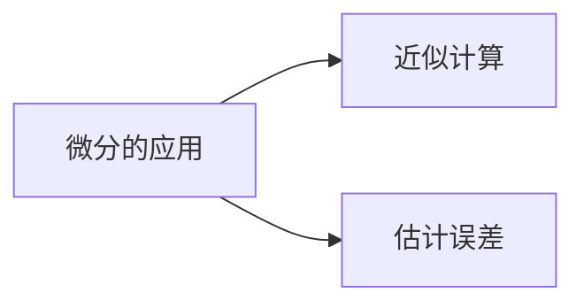

## 第2章 一元函数微分学

## 2.1 导数及微分

## 2.1.13 微分概念

2.1.14 微分的求法 微分形式不变性

## 2.1 导数及微分

## 一.微分的概念

引例：正方形金属薄片受热后面积的改变量．
设边长由 $x_{0}$ 变到 $x_{0}+\Delta x$ ，
∵ 正方形面积 $A=x_{0}{ }^{2}$,

$$
\begin{aligned}
\therefore \Delta A & =\left(x_{0}+\Delta x\right)^{2}-x_{0}^{2} \\
& =\frac{2 x_{0} \cdot \Delta x}{(1)}+\frac{(\Delta x)^{2}}{(2)}
\end{aligned}
$$

（1）$\Delta x$ 的线性函数，且为 $\Delta A$ 的主要部分；
（2）$\Delta x$ 的高阶无穷小，当 $\Delta x \mid$ 很小时可忽略。
问题：这个线性函数（改变量的主要部分）是否所有函数的改变量都有？它是什么？如何求？

## 1.微分定义

定义：若 $y=f(x)$ 在 $x_{0}$ 处的增量 $\Delta y=A \Delta x+o(\Delta x)$ ，其中 $A$ 为常数，则称 $y=f(x)$ 在 $x_{0}$ 可微。而 $A \Delta x$ 称为 $y=f(x)$ 在 $x_{0}$ 的微分。记为

$$
\left.d y\right|_{x=x_{0}}=A \Delta x .
$$

由定义可得：（1）$d y$ 是自变量的改变量 $\Delta x$ 的线性函数；
（2）$\Delta y-d y=o(\Delta x)$ 是比 $\Delta x$ 高阶无穷小；
（3）当 $A \neq 0$ 时，$d y$ 与 $\Delta y$ 是等价无穷小；

$$
\because \frac{\Delta y}{d y}=1+\frac{o(\Delta x)}{A \cdot \Delta x} \rightarrow 1 \quad(\Delta x \underset{\text { (a) }(A)}{\rightarrow} 0) .
$$

（4）$A$ 是与 $\Delta x$ 无关的常数，但与 $f(x)$ 和 $x_{0}$ 有关；
（5）当 $\Delta x$ 很小时，$\Delta y \approx d y$（线性主部）．

## 2.$y=f(x)$ 在 $x_{0}$ 处可导与可微的关系

定理

$$
\begin{aligned}
& y=f(x) \text { 在 } x_{0} \text { 处可微 ⇔ } \\
& y=f(x) \text { 在 } x_{0} \text { 处可导, 且 } f^{\prime}\left(x_{0}\right)=A .
\end{aligned}
$$

证明：⇒ 设 $f(x)$ 在 $x_{0}$ 处可微，则

$$
\begin{gathered}
\Delta y=A \Delta x+o(\Delta x), \frac{\Delta y}{\Delta x}=A+\frac{o(\Delta x)}{\Delta x} . \\
\therefore \lim _{\Delta x \rightarrow 0} \frac{\Delta y}{\Delta x}=\lim _{\Delta x \rightarrow 0}\left[A+\frac{o(\Delta x)}{\Delta x}\right]=A .
\end{gathered}
$$

即 $f^{\prime}\left(x_{0}\right)=A$ ．
$\therefore y=f(x)$ 在 $x_{0}$ 处可导，且 $f^{\prime}\left(x_{0}\right)=A$ ．

⇐ 设 $y=f(x)$ 在 $x_{0}$ 处可导，则

$$
\lim _{\Delta x \rightarrow 0} \frac{\Delta y}{\Delta x}=f^{\prime}\left(x_{0}\right) .
$$

从而 $\frac{\Delta y}{\Delta x}=f^{\prime}\left(x_{0}\right)+\alpha$ ，且 $\lim _{\Delta x \rightarrow 0} \alpha=0$ ，

$$
\Delta y=f^{\prime}\left(x_{0}\right) \Delta x+\alpha \cdot \Delta x=f^{\prime}\left(x_{0}\right) \Delta x+o(\Delta x)
$$

$\therefore y=f(x)$ 在 $x_{0}$ 处可微。

3．微分的计算公式

$$
\left.d y\right|_{x=x_{0}}=f^{\prime}\left(x_{0}\right) \Delta x \quad d y=f^{\prime}(x) \Delta x=y^{\prime} \Delta x
$$

例1．设 $y=x$ ，求 $d y$ 。
解：$\because y^{\prime}=1, \therefore d y=\Delta x \rightarrow d x=\Delta x$ 。
通常把自变量 $x$ 的增量 $\Delta x$ 称为自变量的微分，记作 $d x$ ，即 $d x=\Delta x$ 。
所以微分的计算公式如下：

$$
\left.d y\right|_{x=x_{0}}=f^{\prime}\left(x_{0}\right) d x
$$

$$
d y=f^{\prime}(x) d x=y^{\prime} d x
$$

$$
\therefore d y=f^{\prime}(x) d x . \quad \Longrightarrow \frac{d y}{d x}=f^{\prime}(x) .
$$

即函数的微分 $d y$ 与自变量的微分 $d x$ 之商等于该函数的导数。导数也叫＂微商＂。
（1）一元函数的可导性与可微性是等价的．
（2）微分的两个特点是：
$d y$ 是 $\Delta x$ 的线性函数，且 $\Delta y-d y=o(\Delta x)$ ；
$d y$ 是 $\Delta y$ 的主要部分，且 $\Delta y-d y=o(\Delta y)$ ．

$$
\lim _{\Delta x \rightarrow 0} \frac{\Delta y-d y}{\Delta y}=\lim _{\Delta x \rightarrow 0} \frac{\Delta y-f^{\prime}(x) \Delta x}{\Delta y}=\lim _{\Delta x \rightarrow 0}\left(1-\frac{f^{\prime}(x)}{\frac{\Delta y}{\Delta x}}\right)=0
$$

（3）用微分定义考虑函数是 否可微时，关键看

$$
\lim _{\Delta x \rightarrow 0} \frac{\Delta y-d y}{\Delta x}=0 \text { 是否成立. }
$$

## 4.微分的几何意义

如图所示

$$
\begin{aligned}
& M Q=\Delta x, N Q=\Delta y \\
& \tan \alpha=f^{\prime}\left(x_{0}\right) \\
& \begin{aligned}
d y & =f^{\prime}\left(x_{0}\right) \Delta x \\
& =M Q \cdot \tan \alpha \\
& =P Q
\end{aligned}
\end{aligned}
$$

当 $\Delta y$ 是曲线的纵坐标增量时， $d y$ 就是切线纵坐标对应的增量．

当 $\Delta x$ 很小时，在点 $M$ 的附近，
切线段 $M P$ 可近似代替曲线段 $M N$ ．
$(1) d(C)=0 d x$
（2）$d\left(x^{\mu}\right)=\mu x^{\mu-1} d x$
$(3) d(\sin x)=\cos x d x$
$(4) d(\cos x)=-\sin x d x$
$(5) d(\tan x)=\sec ^{2} x d x$
（6）$d(\cot x)=-\csc ^{2} x d x$
$(7) d(\sec x)=\sec x \tan x d x$
$(8) d(\csc x)=-\csc x \cot x d x$
（9）$d\left(a^{x}\right)=a^{x} \ln a d x$
（10）$d\left(e^{x}\right)=e^{x} d x$
$(11) d\left(\log _{a} x\right)=\frac{1}{x \ln a} d x$
$(12) d(\ln x)=\frac{1}{x} d x$
$(13) d(\arcsin x)=\frac{1}{\sqrt{1-x^{2}}} d x$
$(14) d(\arccos x)=-\frac{1}{\sqrt{1-x^{2}}} d x$
$(15) d(\arctan x)=\frac{1}{1+x^{2}} d x$
$(16) d(\operatorname{arc} \cot x)=-\frac{1}{1+x^{2}} d x$

## 2.四则运算法则

## 定理3.

设 $u, v$ 是可微函数，$C$ 为常数，则 $u \pm v, u \cdot v, C u, \frac{u}{v}$ 也可微，且
（1）$d(u \pm v)=d u \pm d v$
（2）$d(u v)=v d u+u d v$
$(3) d(C u)=C d u$
$(4) d\left(\frac{u}{v}\right)=\frac{v d u-u d v}{v^{2}} \quad(v \neq 0)$

## 3.复合函数的微分法则

定理4．设（1）$u=g(x)$ 在 $x$ 处可微，
（2）$y=f(u)$ 在相应点 $u=g(x)$ 处可微，则 $y=f[g(x)]$ 在 $x$ 处可微，且
$d y=f^{\prime}(u) g^{\prime}(x) d x$ 或 $d\{f[g(x)]\}=f^{\prime}(u) g^{\prime}(x) d x$
注意：当 $u$ 为自变量时，有 $d y=f^{\prime}(u) d u$
当 $u$ 为中间变量时，设 $u=g(x)$ ，则 $d y=f^{\prime}(u) g^{\prime}(x) d x$

$$
\text { 即 } d y=f^{\prime}(u) d u
$$

无论 $u$ 为中间变量还是自变量，都具有同一微分形式。这种性质称为一阶微分形式不变性。

例1．设 $y=\sin (2 x+1)$ ，求 $d y$ 。
例2．设 $y=\ln \left(x+e^{x^{2}}\right)$ ，求 $d y$ ．
例3．设 $y=e^{1-3 x} \cos x$ ，求 $d y$ ．
例4．设 $y=e^{\sin (a x+b)}+\ln \left(1+e^{x^{2}}\right)$ ，求 $d y$ ．
例5．设 $y \sin x-\cos (x-y)=0$ ，求 $\mathrm{d} y$ 。
例6．在下列括号中填入适当的函数使等式成立：
（1）$d(\quad)=\cos \omega t d t ;$
（2）$d\left(\sin x^{2}\right)=(\quad) d(\sqrt{x})$ ．

例1．设 $y=\sin (2 x+1)$ ，求 $d y$ 。
解：$\because y=\sin u, u=2 x+1$ ．

$$
\begin{aligned}
\therefore d y & =\cos u d u \\
& =\cos (2 x+1) d(2 x+1) \\
& =\cos (2 x+1) \cdot 2 d x \\
& =2 \cos (2 x+1) d x .
\end{aligned}
$$

例2．设 $y=\ln \left(x+e^{x^{2}}\right)$ ，求 $d y$ ．

解：$\because y^{\prime}=\frac{1+2 x e^{x^{2}}}{x+e^{x^{2}}}$ ，

$$
\therefore d y=\frac{1+2 x e^{x^{2}}}{x+e^{x^{2}}} d x .
$$

例3．设 $y=e^{1-3 x} \cos x$ ，求 $d y$ ．

$$
\text { 解: } \begin{aligned}
d y & =\cos x \cdot d\left(e^{1-3 x}\right)+e^{1-3 x} \cdot d(\cos x) \\
\because & \left(e^{1-3 x}\right)^{\prime}=-3 e^{1-3 x}, \quad(\cos x)^{\prime}=-\sin x . \\
\therefore d y & =\cos x \cdot\left(-3 e^{1-3 x}\right) d x+e^{1-3 x} \cdot(-\sin x) d x \\
& =-e^{1-3 x}(3 \cos x+\sin x) d x .
\end{aligned}
$$

例4．设 $y=e^{\sin (a x+b)}+\ln \left(1+e^{x^{2}}\right)$ ，求 $d y$ ．
解：$d y=d\left[e^{\sin (a x+b)}\right]+d\left[\ln \left(1+e^{x^{2}}\right)\right]$

$$
\begin{aligned}
& =e^{\sin (a x+b)} d[\sin (a x+b)]+\frac{1}{1+e^{x^{2}}} d\left(1+e^{x^{2}}\right) \\
& =e^{\sin (a x+b)} \cos (a x+b) d(a x+b)+\frac{1}{1+e^{x^{2}}} \cdot e^{x^{2}} d x^{2} \\
& =e^{\sin (a x+b)} \cos (a x+b) \cdot a d x+\frac{1}{1+e^{x^{2}}} \cdot e^{x^{2}} \cdot 2 x d x \\
& =\left[a e^{\sin (a x+b)} \cos (a x+b)+\frac{2 x e^{x^{2}}}{1+e^{x^{2}}}\right] d x
\end{aligned}
$$

例5．设 $y \sin x-\cos (x-y)=0$ ，求 $d y$ 。
解：利用一阶微分形式不变性，有

$$
\begin{gathered}
\mathrm{d}(y \sin x)-\mathrm{d}(\cos (x-y))=0 \\
\sin x \mathrm{~d} y+y \cos x \mathrm{~d} x+\sin (x-y)(\mathrm{d} x-\mathrm{d} y)=0 \\
\mathrm{~d} y=\frac{y \cos x+\sin (x-y)}{\sin (x-y)-\sin x} \mathrm{~d} x
\end{gathered}
$$

例6．在下列括号中填入适当的函数使等式成立：
（1）$d(\quad)=\cos \omega t d t$ ；
（2）$d\left(\sin x^{2}\right)=(\quad) d(\sqrt{x})$ ．

解：（1）$\because d(\sin \omega t)=\omega \cos \omega t d t$ ，

$$
\begin{aligned}
& \therefore \cos \omega t d t=\frac{1}{\omega} d(\sin \omega t)=d\left(\frac{1}{\omega} \sin \omega t\right) ; \\
& \therefore d\left(\frac{1}{\omega} \sin \omega t+C\right)=\cos \omega t d t . \\
& (2) \because \frac{d\left(\sin x^{2}\right)}{d(\sqrt{x})}=\frac{2 x \cos x^{2} d x}{\frac{1}{2 \sqrt{x}} d x}=4 x \sqrt{x} \cos x^{2}, \\
& \therefore d\left(\sin x^{2}\right)=\left(4 x \sqrt{x} \cos x^{2}\right) d(\sqrt{x}) .
\end{aligned}
$$

说明：上述微分的反问题是不定积分要研究的内容．
注意：数学中的反问题往往出现多值性．

四、微分在近似计算中的应用

$$
\Delta y=f^{\prime}\left(x_{0}\right) \Delta x+o(\Delta x)
$$

当 $|\Delta x|$ 很小时，得近似等式：

$$
\begin{gathered}
\Delta y=f\left(x_{0}+\Delta x\right)-f\left(x_{0}\right) \approx f^{\prime}\left(x_{0}\right) \Delta x \\
f\left(x_{0}+\Delta x\right) \approx f\left(x_{0}\right)+f^{\prime}\left(x_{0}\right) \Delta x \\
\begin{array}{c}
\text { 令 } x=x_{0}+\Delta x \\
f(x) \approx f\left(x_{0}\right)+f^{\prime}\left(x_{0}\right)\left(x-x_{0}\right)
\end{array}
\end{gathered}
$$

使用原则：1）$f\left(x_{0}\right), f^{\prime}\left(x_{0}\right)$ 好算；
2）$x$ 与 $x_{0}$ 靠近．

特别当 $x_{0}=0,|x|$ 很小时，

$$
f(x) \approx f(0)+f^{\prime}(0) x
$$

常用近似公式：（ $|x|$ 很小）
（1）$(1+x)^{\alpha} \approx 1+\alpha x$
证明：令 $f(x)=(1+x)^{\alpha}$
得 $f(0)=1, f^{\prime}(0)=\alpha$
∴ 当 $|x|$ 很小时，$(1+x)^{\alpha} \approx 1+\alpha x$
（2） $\sin x \approx x$
（3）$e^{x} \approx 1+x$
（4） $\tan x \approx x$
（5） $\ln (1+x) \approx x$

$$
f(x) \approx f\left(x_{0}\right)+f^{\prime}\left(x_{0}\right)\left(x-x_{0}\right)
$$

例11．求 $\sin 29^{\circ}$ 的近似值．
解：设 $f(x)=\sin x$ ，
取 $x_{0}=30^{\circ}=\frac{\pi}{6}, \quad x=29^{\circ}=\frac{29}{180} \pi$
则 $\mathrm{d} x=-\frac{\pi}{180}$

$$
\begin{aligned}
\sin 29^{\circ} & =\sin \frac{29}{180} \pi \approx \sin \frac{\pi}{6}+\cos \frac{\pi}{6} \cdot\left(-\frac{\pi}{180}\right) \\
& =\frac{1}{2}+\frac{\sqrt{3}}{2} \cdot(-0.0175) \\
& \approx 0.485 \quad \sin 29^{\circ} \approx 0.4848 \cdots
\end{aligned}
$$

例12．计算 $\sqrt[5]{245}$ 的近似值。

$$
\text { 解: } \begin{array}{rlc}
\sqrt[5]{245} & =(243+2)^{\frac{1}{5}} & 3^{5}=243 \\
& =3\left(1+\frac{2}{243}\right)^{\frac{1}{5}} & (1+x)^{\alpha} \approx 1+\alpha x \\
& \approx 3\left(1+\frac{1}{5} \cdot \frac{2}{243}\right) & \\
& =3.0048 &
\end{array}
$$

## 例13.有一批半径为 1 cm 的球，为了提高球面的光洁度，要镀上一层铜，厚度定为 $\mathbf{0 . 0 1 c m}$ ，估计一下，每只球需用铜多少克。（铜的密度： $8.9 \mathrm{~g} / \mathrm{cm}^{3}$ ）

解：已知球体体积为 $V=\frac{4}{3} \pi R^{3}$镀铜体积为 $V$ 在 $R=1, \Delta R=0.01$ 时体积的增量 $\Delta V$ ，

$$
\left.\begin{aligned}
\Delta V & \approx \mathrm{~d} V \left\lvert\, \begin{array}{l}
R=1 \\
\Delta R=0.01
\end{array}=4 \pi R^{2} \Delta R\right.
\end{aligned} \right\rvert\, \begin{aligned}
& R=1 \\
& \Delta R=0.01
\end{aligned}
$$

因此每只球需用铜约为

$$
8.9 \times 0.13=1.16(\mathrm{~g})
$$

五、微分在估计误差中的应用
某量的精确值为 $A$ ，其近似值为 $a$ ，
$A-a \mid$ 称为 $a$ 的绝对误差
$\frac{|A-a|}{|a|}$ 称为 $a$ 的相对误差
若 $|A-a| \leq \delta_{A}$
$\delta_{A}$ 称为测量 $A$ 的绝对误差限
$\frac{\delta_{A}}{|a|}$ 称为测量 $A$ 的相对误差限

## 误差传递公式：

若直接测量某量得 $x$ ，已知测量误差限为 $\delta_{x}$ ，按公式 $y=f(x)$ 计算 $y$ 值时的误差

$$
\begin{aligned}
|\Delta y| \approx|\mathrm{d} y| & =\left|f^{\prime}(x)\right| \cdot|\Delta x| \\
& \leq\left|f^{\prime}(x)\right| \cdot \delta_{x}
\end{aligned}
$$

故 $y$ 的绝对误差限约为 $\delta_{y} \approx\left|f^{\prime}(x)\right| \cdot \delta_{x}$
相对误差限约为 $\frac{\delta_{y}}{|y|} \approx \frac{f^{\prime}(x)}{f(x)} \cdot \delta_{x}$

例14．设测得圆钢截面的直径 $D=60.0 \mathrm{~mm}$ ，测量 $D$ 的绝对误差限 $\delta_{D}=0.05 \mathrm{~mm}$ ，欲利用公式 $A=\frac{\pi}{4} D^{2}$ 计算圆钢截面积，试估计面积的误差。

解：计算 $A$ 的绝对误差限约为

$$
\begin{aligned}
\delta_{A} & =\left|A^{\prime}\right| \cdot \delta_{D}=\frac{\pi}{2} D \cdot \delta_{D}=\frac{\pi}{2} \times 60.0 \times 0.05 \\
& \approx 4.715(\mathrm{~mm})
\end{aligned}
$$

$A$ 的相对误差限约为

$$
\frac{\delta_{A}}{|A|}=\frac{\frac{\pi}{2} D \delta_{D}}{\frac{\pi}{4} D^{2}}=2 \frac{\delta_{D}}{D}=2 \times \frac{0.05}{60.0}=0.17 \%
$$

## 内容小结

1．微分概念

- 微分的定义及几何意义
- 可导 $\_\_\_\_$可微

2．微分运算法则
微分形式不变性： $\mathrm{d} f(u)=f^{\prime}(u) \mathrm{d} u$
（ $u$ 是自变量或中间变量）
3．微分的应用

思考题：习题2.1第1题（15）
思考题参考答案

## 课堂练习：

习题2.1第33题（5）到（7）第37题到第38题
练习参考答案

## 习题课

## 内容小结

## －定义

1．一阶导数的定义
2．高阶导数的定义
3．微分的定义
二．基本公式
1．基本初等函数的导数公式
2．高阶导数公式
3．基本初等函数的微分公式

## 三.求导法则

1．函数的和、差、积、商的求导法则；
2．反函数的求导法则；
3．复合函数的求导法则；
4．隐函数求导法则；
5．对数求导法；
6．参变量函数的求导法则；
7．分段函数的求导法；

四．函数极限存在、函数连续、函数可导、函数可微的关系

## 五.常见题型

## 1.求导数

用定义求导数
复合函数求导数
分段函数的导数
表达式中含有绝对值或最值的函数的导数
参变量函数的导数
隐函数的导数
表达式中含有幂指函数的导数
求高阶导数

2．求微分
3．函数连续性与可导性的讨论
4．利用导数定义证明结论成立
5．求待定参数
6．求曲线的切线与法线

例1 确定 $a, b$ 的值，使函数 $f(x)= \begin{cases}\frac{1}{x}(1-\cos a x), & x<0 \\ 0, & x=0 \\ \frac{1}{x} \ln \left(b+x^{2}\right), & x>0\end{cases}$
在 $(-\infty,+\infty)$ 内处处连续．
例2 设函数 $\varphi(x)$ 在 $x=a$ 处连续，$f(x)=(x-a) \varphi(x)$ ，
（1）证明函数 $f(x)$ 在 $x=a$ 处可导；
（2）若 $g(x)=|x-a| \varphi(x)$ ，函数 $g(x)$ 在 $x=a$ 处可导吗？

例3 用导数定义证明：奇函数的导数是偶函数．
例4 设 $\varphi(x)$ 是二阶可导函数，选择 $a, b, c$ 使函数

$$
f(x)= \begin{cases}\varphi(x), & x \leq x_{0} \\ a\left(x-x_{0}\right)^{2}+b\left(x-x_{0}\right)+c, & x>x_{0}\end{cases}
$$

在 $(-\infty,+\infty)$ 上二阶可导。
例5 设 $f(x)$ 在 $x=0$ 处可导，若 $g(x)= \begin{cases}x^{2} \cos \frac{1}{x}, & x \neq 0, \\ 0, & x=0\end{cases}$求 $\frac{\mathrm{d}}{\mathrm{d} x}[f(g(x))]_{x=0}$ ．

例6 已知 $f(x)=\left\{\begin{array}{ll}x(\cos x)^{x^{-2}}, & x>0, \\ a x+b, & x \leq 0\end{array}\right.$ 处处连续可导，求 $a, b$ 的值．

例7 设 $f(x)$ 有一阶导数，$f(0)=f^{\prime}(0)=1$ ，求 $\lim _{x \rightarrow 0} \frac{f(\sin x)-1}{\ln f(x)}$ ．

例8 设 $y=\frac{e^{-x^{2}} \arcsin \left(e^{-x^{2}}\right)}{\sqrt{1-e^{-2 x^{2}}}}+\frac{1}{2} \ln \left(1-e^{-2 x^{2}}\right)$ ，求 $y^{\prime}$ ．求 $a, b$ 的值．

例9 求由参数方程 $x=3 t^{2}+2 t+3, e^{y} \sin t-y+1=0$所确定的函数 $y=y(x)$ 的微分 $d y$ ．

例10 设 $y=\frac{x}{\sqrt[3]{1+x}}$ ，求 $y^{(n)}$ ．
例11 已知 $f(x)$ 是周期为 5 连续函数，它在 $x=0$ 的某个邻域内满足关系式

$$
f(1+\sin x)-3 f(1-\sin x)=8 x+o(x),
$$

且 $f(x)$ 在 $x=1$ 处可导，求曲线 $y=f(x)$ 在点 $(6, f(6))$处的切线方程。

例1 确定 $a, b$ 的值，使函数 $f(x)= \begin{cases}\frac{1}{x}(1-\cos a x), & x<0 \\ 0, & x=0 \\ \frac{1}{x} \ln \left(b+x^{2}\right), & x>0\end{cases}$在 $(-\infty,+\infty)$ 内处处连续．

解 $\because f(0)=0$ ，

$$
f(0-0)=\lim _{x \rightarrow 0^{-}} f(x)=\lim _{x \rightarrow 0^{-}} \frac{1-\cos a x}{x}=\lim _{x \rightarrow 0^{-}} \frac{\frac{(a x)^{2}}{2}}{x}=0,
$$

$$
f(0+0)=\lim _{x \rightarrow 0^{+}} f(x)=\lim _{x \rightarrow 0^{+}} \frac{\ln \left(b+x^{2}\right)}{x}
$$

由可导必连续，有 ：$f(0-0)=f(0+0)=f(0)$ ，
从而， $\lim _{x \rightarrow 0^{+}} \frac{\ln \left(b+x^{2}\right)}{x}=0, \quad \Rightarrow b=1$ ．

$$
\begin{aligned}
\text { 又 } f_{-}^{\prime}(0) & =\lim _{x \rightarrow 0^{-}} \frac{f(x)-f(0)}{x}=\lim _{x \rightarrow 0^{-}} \frac{\frac{1}{x}(1-\cos a x)-0}{x} \\
& =\lim _{x \rightarrow 0^{-}} \frac{1-\cos a x}{x^{2}}=\lim _{x \rightarrow 0^{-}} \frac{\frac{(a x)^{2}}{2}}{x^{2}}=\frac{a^{2}}{2}
\end{aligned}
$$

$$
\begin{aligned}
f_{+}^{\prime}(0) & =\lim _{x \rightarrow 0^{+}} \frac{f(x)-f(0)}{x}=\lim _{x \rightarrow 0^{+}} \frac{1}{x} \ln \left(1+x^{2}\right)-0 \\
& =\lim _{x \rightarrow 0^{+}} \frac{\ln \left(1+x^{2}\right)}{x^{2}}=1
\end{aligned}
$$

由可导，有 ：$f_{-}^{\prime}(0)=f_{+}^{\prime}(0), ~ \Rightarrow \frac{a^{2}}{2}=1, ~ \Rightarrow a= \pm \sqrt{2}$ ．

例2 设函数 $\varphi(x)$ 在 $x=a$ 处连续，$f(x)=(x-a) \varphi(x)$ ，
（1）证明函数 $f(x)$ 在 $x=a$ 处可导；
（2）若 $g(x)=|x-a| \varphi(x)$ ，函数 $g(x)$ 在 $x=a$ 处可导吗？

解（1）$f^{\prime}(a)=\lim _{x \rightarrow a} \frac{f(x)-f(a)}{x-a}=\lim _{x \rightarrow a} \frac{(x-a) \varphi(x)}{x-a}$

$$
=\lim _{x \rightarrow a} \varphi(x)=\varphi(a) .
$$

$\therefore f(x)$ 在 $x=a$ 处可导。

$$
\text { (2) } \begin{aligned}
g_{-}^{\prime}(a) & =\lim _{x \rightarrow a^{-}} \frac{g(x)-g(a)}{x-a}=\lim _{x \rightarrow a^{-}} \frac{|x-a| \varphi(x)}{x-a} \\
& =\lim _{x \rightarrow a^{-}}-\varphi(x)=-\varphi(a)
\end{aligned}
$$

$$
\begin{aligned}
g_{+}^{\prime}(a) & =\lim _{x \rightarrow a^{+}} \frac{g(x)-g(a)}{x-a}=\lim _{x \rightarrow a^{+}} \frac{|x-a| \varphi(x)}{x-a} \\
& =\lim _{x \rightarrow a^{+}} \varphi(x)=\varphi(a)
\end{aligned}
$$

∴ 当 $\varphi(a)=0$ 时，$g(x)$ 在 $x=a$ 处可导，且 $g^{\prime}(a)=0$ ．
当 $\varphi(a) \neq 0$ 时，$g(x)$ 在 $x=a$ 处不可导。

例3 用导数定义证明：奇函数的导数是偶函数．
证 $\quad \because f(-x)=-f(x)$ ，

$$
\begin{aligned}
\therefore f^{\prime}(-x) & =\lim _{\Delta x \rightarrow 0} \frac{f(-x+\Delta x)-f(-x)}{\Delta x} \\
& =\lim _{\Delta x \rightarrow 0} \frac{f[-(x-\Delta x)]-f(-x)}{\Delta x} \\
& =\lim _{\Delta x \rightarrow 0} \frac{-f(x-\Delta x)+f(x)}{\Delta x} \\
& =\lim _{\Delta x \rightarrow 0} \frac{f(x-\Delta x)-f(x)}{-\Delta x}=f^{\prime}(x)
\end{aligned}
$$

例4 设 $\varphi(x)$ 是二阶可导函数，选择 $a, b, c$ 使函数

$$
f(x)= \begin{cases}\varphi(x), & x \leq x_{0} \\ a\left(x-x_{0}\right)^{2}+b\left(x-x_{0}\right)+c, & x>x_{0}\end{cases}
$$

在 $(-\infty,+\infty)$ 上二阶可导。
解 $\because f\left(x_{0}\right)=\varphi\left(x_{0}\right)$ ，

$$
\begin{aligned}
& f\left(x_{0}-0\right)=\lim _{x \rightarrow x_{0}} \varphi(x)=\varphi\left(x_{0}\right) \\
& f\left(x_{0}+0\right)=\lim _{x \rightarrow x_{0}}\left[a\left(x-x_{0}\right)^{2}+b\left(x-x_{0}\right)+c\right]=c \\
& \text { 由 } f\left(x_{0}+0\right)=f\left(x_{0}-0\right)=f\left(x_{0}\right) \text { 得, } c=\varphi\left(x_{0}\right)
\end{aligned}
$$

$$
\begin{aligned}
\text { 又 } f_{-}^{\prime}\left(x_{0}\right) & =\lim _{x \rightarrow x_{0}^{-}} \frac{f(x)-f\left(x_{0}\right)}{x-x_{0}}=\lim _{x \rightarrow x_{0}^{-}} \frac{\varphi(x)-\varphi\left(x_{0}\right)}{x-x_{0}}=\varphi^{\prime}\left(x_{0}\right) \\
f_{+}^{\prime}\left(x_{0}\right) & =\lim _{x \rightarrow x_{0}^{+}} \frac{f(x)-f\left(x_{0}\right)}{x-x_{0}} \\
& =\lim _{x \rightarrow x_{0}^{+}} \frac{a\left(x-x_{0}\right)^{2}+b\left(x-x_{0}\right)+c-\varphi\left(x_{0}\right)}{x-x_{0}}=b
\end{aligned}
$$

由 $f_{+}^{\prime}\left(x_{0}\right)=f_{-}^{\prime}\left(x_{0}\right)$ 得，$b=\varphi^{\prime}\left(x_{0}\right)$

$$
\therefore f^{\prime}(x)= \begin{cases}\varphi^{\prime}(x), & x<x_{0}  \tag{回}\\ \varphi^{\prime}\left(x_{0}\right), & x=x_{0} \\ 2 a\left(x-x_{0}\right)+b, & x>x_{0}\end{cases}
$$

$$
\begin{aligned}
& f_{-}^{\prime \prime}\left(x_{0}\right)=\lim _{x \rightarrow x_{0}^{-}} \frac{f^{\prime}(x)-f^{\prime}\left(x_{0}\right)}{x-x_{0}}=\lim _{x \rightarrow x_{0}^{-}} \frac{\varphi^{\prime}(x)-\varphi^{\prime}\left(x_{0}\right)}{x-x_{0}}=\varphi^{\prime \prime}\left(x_{0}\right) \\
& f_{+}^{\prime \prime}\left(x_{0}\right)=\lim _{x \rightarrow x_{0}^{+}} \frac{f^{\prime}(x)-f^{\prime}\left(x_{0}\right)}{x-x_{0}} \\
&=\lim _{x \rightarrow x_{0}^{+}} \frac{2 a\left(x-x_{0}\right)+b-\varphi^{\prime}\left(x_{0}\right)}{x-x_{0}}=2 a \\
& \text { 由 } f_{+}^{\prime \prime}\left(x_{0}\right)=f_{-}^{\prime \prime}\left(x_{0}\right) \text { 得, } a=\frac{1}{2} \varphi^{\prime \prime}\left(x_{0}\right)
\end{aligned}
$$

例5 设 $f(x)$ 在 $x=0$ 处可导，若 $g(x)= \begin{cases}x^{2} \cos \frac{1}{x}, & x \neq 0, \\ 0, & x=0\end{cases}$求 $\frac{\mathrm{d}}{\mathrm{d} x}[f(g(x))]_{x=0}$ ．

解 $\because g^{\prime}(0)=\lim _{x \rightarrow 0} \frac{g(x)-g(0)}{x}=\lim _{x \rightarrow 0} \frac{x^{2} \cos \frac{1}{x}-0}{x}=0$ ，

$$
\therefore \frac{d}{d x}\{f[g(x)]\}_{x=0}=f^{\prime}[g(0)] \cdot g^{\prime}(0)=0 .
$$

例6 已知 $f(x)=\left\{\begin{array}{ll}x(\cos x)^{x^{-2}}, & x>0, \\ a x+b, & x \leq 0\end{array}\right.$ 处处连续可导，求 $a, b$ 的值．
解 $\because \lim _{x \rightarrow 0^{+}}(\cos x)^{x^{-2}}=\lim _{x \rightarrow 0^{+}}(\cos x)^{\frac{1}{x^{2}}}=\lim _{x \rightarrow 0^{+}} e^{\frac{\ln \cos x}{x^{2}}}=e^{-\frac{1}{2}}$ ，而 $f(0)=b$ ，
$f(0+0)=\lim _{x \rightarrow 0^{+}} x(\cos x)^{x^{-2}}=\lim _{x \rightarrow 0^{+}} x \cdot \lim _{x \rightarrow 0^{+}}(\cos x)^{x^{-2}}=0$, $f(0-0)=\lim _{x \rightarrow 0^{-}}(a x+b)=b$ ，
由 $f(x)$ 连续有，$f(0+0)=f(0-0)=f(0), \therefore b=0$ ；

$$
\begin{aligned}
\text { 又 } f_{+}^{\prime}(0) & =\lim _{x \rightarrow 0^{+}} \frac{f(x)-f(0)}{x}=\lim _{x \rightarrow 0^{+}} \frac{x(\cos x)^{x^{-2}}-0}{x} \\
& =\lim _{x \rightarrow 0^{+}}(\cos x)^{x^{-2}}=e^{-\frac{1}{2}}, \\
f_{-}^{\prime}(0) & =\lim _{x \rightarrow 0^{-}} \frac{f(x)-f(0)}{x}=\lim _{x \rightarrow 0^{-}} \frac{a x-0}{x}=a,
\end{aligned}
$$

由 $f(x)$ 可导有，$f_{+}^{\prime}(0)=f_{-}^{\prime}(0)$ ，

$$
\therefore a=e^{-\frac{1}{2}} .
$$

例7 设 $f(x)$ 有一阶导数，$f(0)=f^{\prime}(0)=1$ ，求 $\lim _{x \rightarrow 0} \frac{f(\sin x)-1}{\ln f(x)}$ ．
解 $\because f(0)=f^{\prime}(0)=1$ ，

$$
\begin{aligned}
& \therefore \lim _{x \rightarrow 0} \frac{f(\sin x)-1}{\ln f(x)}=\lim _{x \rightarrow 0} \frac{f(\sin x)-1}{\ln \{1+[f(x)-1]\}} \\
& \quad=\lim _{x \rightarrow 0} \frac{f(\sin x)-1}{f(x)-1}=\lim _{x \rightarrow 0} \frac{\frac{f(\sin x)-f(0)}{\sin x}}{\frac{f(x)-f(0)}{x}} \cdot \frac{\sin x}{x} \\
& \quad=\frac{f^{\prime}(0)}{f^{\prime}(0)} \cdot 1=1
\end{aligned}
$$

例8 设 $y=\frac{e^{-x^{2}} \arcsin \left(e^{-x^{2}}\right)}{\sqrt{1-e^{-2 x^{2}}}}+\frac{1}{2} \ln \left(1-e^{-2 x^{2}}\right)$ ，求 $y^{\prime}$ ．
求 $a, b$ 的值．
解 令 $u=e^{-x^{2}}$ ，则 $y=\frac{u \arcsin u}{\sqrt{1-u^{2}}}+\frac{1}{2} \ln \left(1-u^{2}\right)$ ，
由于 $\frac{d y}{d u}=\frac{\arcsin u}{\left(1-u^{2}\right)^{\frac{3}{2}}}=\frac{\arcsin e^{-x^{2}}}{\left(1-e^{-2 x^{2}}\right)^{\frac{3}{2}}}, \quad \frac{d u}{d x}=-2 x e^{-x^{2}}$ ，
所以 $\frac{d y}{d x}=\frac{d y}{d u} \cdot \frac{d u}{d x}=-\frac{2 x e^{-x^{2}} \arcsin e^{-x^{2}}}{\left(1-e^{-2 x^{2}}\right)^{\frac{3}{2}}}$ ．

例9 求由参数方程 $x=3 t^{2}+2 t+3, e^{y} \sin t-y+1=0$
所确定的函数 $y=y(x)$ 的微分 $d y$ ．
解 利用一阶微分形式不变性，有

$$
\begin{aligned}
& \left\{\begin{array}{l}
d x=6 t d t+2 d t \\
e^{y} d y \sin t+e^{y} \cos t d t-d y=0
\end{array}\right. \\
& \text { 从而 }\left\{\begin{array}{l}
d t=\frac{1}{6 t+2} d x \\
d y=\frac{e^{y} \cos t}{1-e^{y} \sin t} d t
\end{array} \therefore d y=\frac{e^{y} \cos t}{\left(1-e^{y} \sin t\right)(6 t+2)} d x .\right.
\end{aligned}
$$

例10 设 $y=\frac{x}{\sqrt[3]{1+x}}$ ，求 $y^{(n)}$ ．
解 $\because y=(1+x)^{\frac{2}{3}}-(1+x)^{-\frac{1}{3}}$

$$
\begin{aligned}
\therefore y^{(n)}= & {\left[(1+x)^{\frac{2}{3}}\right]^{(n)}-\left[(1+x)^{-\frac{1}{3}}\right]^{(n)} } \\
= & \frac{2}{3}\left(\frac{2}{3}-1\right)\left(\frac{2}{3}-2\right) \cdots\left(\frac{2}{3}-n+1\right)(1+x)^{\frac{2}{3}-n} \\
& -\left(-\frac{1}{3}\right)\left(-\frac{1}{3}-1\right)\left(-\frac{1}{3}-2\right) \cdots\left(-\frac{1}{3}-n+1\right)(1+x)^{-\frac{1}{3}-n}
\end{aligned}
$$

$$
\begin{aligned}
= & \frac{2}{3}\left(-\frac{1}{3}\right)\left(-\frac{4}{3}\right) \cdots\left(-\frac{3 n-5}{3}\right)(1+x)^{\frac{2}{3}-n} \\
& -\left(-\frac{1}{3}\right)\left(-\frac{4}{3}\right) \cdots\left(-\frac{3 n-2}{3}\right)(1+x)^{-\frac{1}{3}-n} \\
= & \frac{(-1)^{n-1} 1 \cdot 4 \cdot 7 \cdots(3 n-5)(3 n+2 x)}{3^{n}(1+x)^{\frac{1}{3}+n}}
\end{aligned}
$$

例11 已知 $f(x)$ 是周期为 5 连续函数，它在 $x=0$ 的某个邻域内满足关系式

$$
f(1+\sin x)-3 f(1-\sin x)=8 x+o(x),
$$

且 $f(x)$ 在 $x=1$ 处可导，求曲线 $y=f(x)$ 在点 $(6, f(6))$处的切线方程。

解

$$
\begin{aligned}
& \because f(x+5)=f(x), \quad \therefore f(6)=f(1), \\
& \text { 又 } f^{\prime}(x+5)=f^{\prime}(x), \quad \therefore f^{\prime}(6)=f^{\prime}(1) . \\
& \because f(1+\sin x)-3 f(1-\sin x)=8 x+o(x), \\
& \lim _{x \rightarrow 0}[f(1+\sin x)-3 f(1-\sin x)]=\lim _{x \rightarrow 0}[8 x+o(x)]
\end{aligned}
$$

$$
\begin{aligned}
& -2 f(1)=0 \Rightarrow f(1)=0 \\
& \text { 又 } \frac{f(1+\sin x)-3 f(1-\sin x)}{\sin x}=\frac{8 x+o(x)}{\sin x} \\
& \lim _{x \rightarrow 0} \frac{f(1+\sin x)-3 f(1-\sin x)}{\sin x}=\lim _{x \rightarrow 0} \frac{8 x+o(x)}{\sin x} \\
& \therefore 4 f^{\prime}(1)=8 \Rightarrow f^{\prime}(1)=2 .
\end{aligned}
$$

∴ 切线方程为 $y=2(x-6)$ ．
