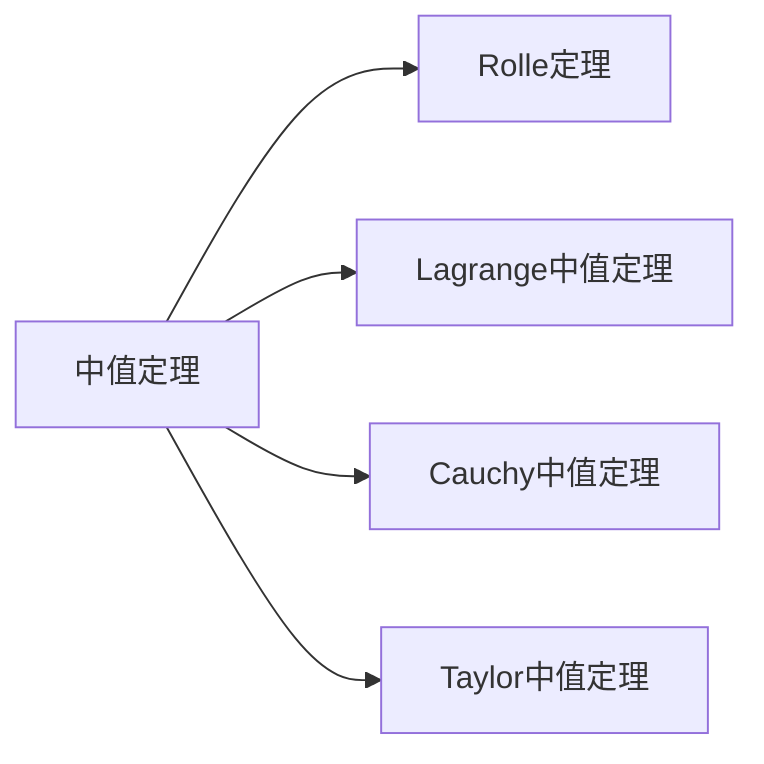
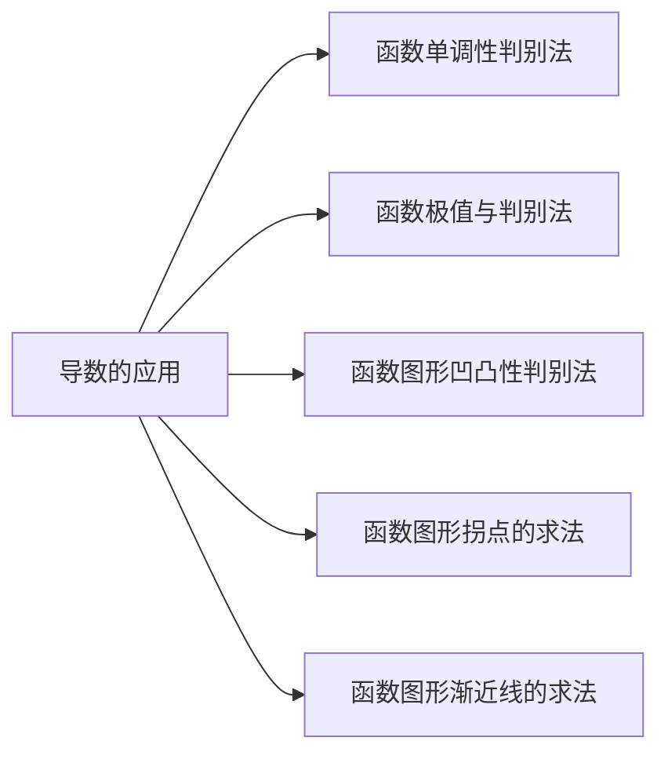

## 第2章 一元函数微分学

## 2.3 导数的应用

## 一.弧微分

1．弧长函数
设函数 $f(x)$ 在区间 $(a, b)$内具有连续导数。基点：$A\left(x_{0}, y_{0}\right)$ ， $M(x, y)$ 为曲线上任意一点，

规定：（1）曲线的正向与 $\boldsymbol{x}$ 增大的方向一致；
（2）$|\widehat{A M}|=s$ ，当 $\widehat{A M}$ 的方向与曲线正向一致时，$s$ 取正号，相反时，$s$ 取负号。

则弧长函数 $s=s(x)$ 是单调递增函数。

## 2.弧长函数的导数与微分

用导数定义求得，如图所示．
当由 $x \rightarrow x+\Delta x$ 时，曲线由 $M \rightarrow M^{\prime}$ ．
则 $\Delta s=\overparen{M}_{0^{\prime} M^{\prime}}^{\prime}-\overparen{M_{0} M}=\overparen{M}{ }^{\prime}$ ，

$$
\begin{aligned}
& \left(\frac{\Delta s}{\Delta x}\right)^{2}=\left(\frac{\overparen{M}^{\prime}}{\Delta x}\right)^{2}=\left(\frac{\overparen{M^{\prime}}}{\left|M M^{\prime}\right|}\right)^{2} \cdot \frac{\left|M M^{\prime}\right|^{2}}{(\Delta x)^{2}} \\
& =\left(\frac{\overparen{M}^{\prime}}{\left|M M^{\prime}\right|}\right)^{2} \cdot \frac{(\Delta x)^{2}+(\Delta y)^{2}}{(\Delta x)^{2}}=\left(\frac{\overparen{M M^{\prime}}}{\left|M M^{\prime}\right|}\right)^{2}\left(1+\left(\frac{\Delta y}{\Delta x}\right)^{2}\right) \\
& \frac{\Delta s}{\Delta x}= \pm \sqrt{\left(\frac{\overparen{M M^{\prime}}}{\left|M M^{\prime}\right|}\right)^{2} \cdot\left(1+\left(\frac{\Delta y}{\Delta x}\right)^{2}\right)}
\end{aligned}
$$

$$
\begin{aligned}
& \because \lim _{\Delta x \rightarrow 0} \frac{\left|\overparen{M M}^{\prime}\right|}{\left|M M^{\prime}\right|}=\lim _{M^{\prime} \rightarrow M} \frac{\left|\overparen{M M}^{\prime}\right|}{\left|M M^{\prime}\right|}=1, \quad \lim _{\Delta x \rightarrow 0} \frac{\Delta y}{\Delta x}=y^{\prime} \\
& \therefore \lim _{\Delta x \rightarrow 0} \frac{\Delta s}{\Delta x}= \pm \lim _{\Delta x \rightarrow 0} \sqrt{\left(\frac{\overparen{M M}^{\prime}}{\mid M M^{\prime}}\right)^{2} \cdot\left(1+\left(\frac{\Delta y}{\Delta x}\right)^{2}\right)}= \pm \sqrt{1+\left(\frac{d y}{d x}\right)^{2}}
\end{aligned}
$$

又 $s=s(x)$ 是单增函数，

$$
\therefore \frac{d s}{d x}=\sqrt{1+\left(\frac{d y}{d x}\right)^{2}}=\sqrt{1+y^{\prime 2}}=\sqrt{1+\left[f^{\prime}(x)\right]^{2}}
$$

弧微分公式
从而 $d s=\sqrt{1+y^{\prime 2}} d x$

## 弧微分计算习例

例1．设有曲线 $\left\{\begin{array}{l}x=\varphi(t) \\ y=\psi(t)\end{array}\right.$（ $t$ 为参数），求 $d s$ ．

例2．设有曲线 $r=r(\theta)$ ，求 $d s$ ．

例1．设有曲线 $\left\{\begin{array}{l}x=\varphi(t) \\ y=\psi(t)\end{array}\right.$（ $t$ 为参数），求 $d s$ ．
解：$\because d x=\varphi^{\prime}(t) d t$ ，

$$
\begin{aligned}
d y & =\psi^{\prime}(t) d t \\
\therefore d s & =\sqrt{1+\left(\frac{d y}{d x}\right)^{2}} d x \\
& =\sqrt{1+\left[\frac{\psi^{\prime}(t)}{\varphi^{\prime}(t)}\right]^{2}} \cdot \varphi^{\prime}(t) d t \\
\therefore d s & =\sqrt{\left[\varphi^{\prime}(t)\right]^{2}+\left[\psi^{\prime}(t)\right]^{2}} d t .
\end{aligned}
$$

例2．设有曲线 $r=r(\theta)$ ，求 $d s$ ．

解：

$$
\begin{aligned}
& \because\left\{\begin{array}{l}
x \\
y \\
y \\
=r(\theta) \cos \theta
\end{array},\right. \\
& \frac{d x}{d \theta}=r^{\prime}(\theta) \cos \theta-r(\theta) \sin \theta, \\
& \frac{d y}{d \theta}=r^{\prime}(\theta) \sin \theta+r(\theta) \cos \theta, \\
& \therefore d s=\sqrt{\left[r^{\prime}(\theta)\right]^{2}+[r(\theta)]^{2}} d \theta .
\end{aligned}
$$

## 二。曲率及其计算公式

1．曲率定义
曲率是描述曲线局部性质（弯曲程度）的量。
曲线的切线转过的角度称为转角。

弧长相同时，弧段弯曲程度越大转角越大

转角相同时，弧段越短弯曲程度越大

## 定义：设 $\overparen{M M}^{\prime}=\Delta s$ ，由 $M$ 到 $M^{\prime}$ 的切线转角为 $\Delta \alpha$ ，

（1） $\left.\bar{K}=\frac{\Delta \alpha}{\Delta s} \right\rvert\,$ 称为平均曲率；
（2）若 $\lim _{\Delta s \rightarrow 0}\left|\frac{\Delta \alpha}{\Delta s}\right|$ 存在，称此极限值为点 $M$ 处的曲率．
记为 $K=\left|\frac{d \alpha}{d s}\right|=\lim _{\Delta s \rightarrow 0}\left|\frac{\Delta \alpha}{\Delta s}\right|$ ．

注意：（1）直线的曲率处处为零；
（2）圆上各点处的曲率等于半径的倒数，且半径越小曲率越大。

## 2.曲率的计算公式

设 $y=f(x)$ 二阶可导，则其上任一点处的曲率 为

$$
K=\frac{\left|y^{\prime \prime}\right|}{\left(1+y^{\prime 2}\right)^{3 / 2}}
$$

证明： $\left.\because K=\frac{d \alpha}{d s} \right\rvert\,$ ，且 $d s=\sqrt{1+y^{\prime 2}} d x$ ．

$$
\begin{aligned}
& \text { 又 } y^{\prime}=\tan \alpha, \\
\therefore y^{\prime \prime} & =\sec ^{2} \alpha \cdot \frac{d \alpha}{d x}=\left(1+y^{\prime 2}\right) \cdot \frac{d \alpha}{d x} \\
\therefore d \alpha & =\frac{y^{\prime \prime}}{1+y^{\prime 2}} d x . \quad \therefore \quad K=\left|\frac{d \alpha}{d s}\right|=\frac{y^{\prime \prime} \mid}{\left(1+y^{\prime 2}\right)^{3 / 2}} .
\end{aligned}
$$

若曲线方程为参数方程：$\left\{\begin{array}{l}x=\varphi(t), \\ y=\psi(t),\end{array}\right.$
则 $\frac{d y}{d x}=\frac{\psi^{\prime}(t)}{\varphi^{\prime}(t)}$ ，

$$
\frac{d^{2} y}{d x^{2}}=\frac{\varphi^{\prime}(t) \psi^{\prime \prime}(t)-\varphi^{\prime \prime}(t) \psi^{\prime}(t)}{\left[\varphi^{\prime}(t)\right]^{3}},
$$

代入曲率的计算公式可得：

$$
K=\frac{\varphi^{\prime}(t) \psi^{\prime \prime}(t)-\varphi^{\prime \prime}(t) \psi^{\prime}(t)}{\left[\varphi^{\prime 2}(t)+\psi^{\prime 2}(t)\right]^{\frac{3}{2}}} .
$$

## 曲率计算习例

例3．求半径为 $R$ 的圆上任意点处的曲率．
例4．我国铁路常用立方抛物线 $y=\frac{1}{6 R l} x^{3}$ 作缓和曲线，其中 $\boldsymbol{R}$ 是圆弧弯道的半径， $\boldsymbol{l}$ 是缓和曲线的长度，且 $\boldsymbol{l} \ll \boldsymbol{R}$ ．求此缓和曲线在其两个端 $\quad O(0,0), B\left(l, \frac{l^{2}}{6 R}\right)$ 处的曲率．点
例5．求椭圆 $\left\{\begin{array}{l}x=a \cos t \\ y=b \sin t\end{array}(0 \leq t \leq 2 \pi)\right.$ 在何处曲率最大？

例3．求半径为 $R$ 的圆上任意点处的曲率．
解：如图所示，

$$
\begin{aligned}
\Delta s & =R \Delta \alpha \\
\therefore \quad K & =\lim _{\Delta s \rightarrow 0}\left|\frac{\Delta \alpha}{\Delta s}\right|=\frac{1}{R}
\end{aligned}
$$

可见： $\boldsymbol{R}$ 愈小，则 $\boldsymbol{K}$ 愈大，圆弧弯曲得愈厉害；
$\boldsymbol{R}$ 愈大，则 $\boldsymbol{K}$ 愈小，圆弧弯曲得愈小。

例4．我国铁路常用立方抛物线 $y=\frac{1}{6 R l} x^{3}$ 作缓和曲线，其中 $\boldsymbol{R}$ 是圆弧弯道的半径，$l$ 是缓和曲线的长度，且 $l \ll \boldsymbol{R}$ ．求此缓和曲线在其两个端点 $O(0,0), B\left(l, \frac{l^{2}}{6 R}\right)$ 处的曲率．

## 说明：

铁路转弯时为保证行车平稳安全，离心力必须连续变化，因此铁道的曲率应连续变化。

点击图片任意处播放 暂停

例4．我国铁路常用立方抛物线 $y=\frac{1}{6 R I} x^{3}$ 作缓和曲线，其中 $\boldsymbol{R}$ 是圆弧弯道径， $\boldsymbol{l}$ 是缓和曲线的长度，且 $l \ll \boldsymbol{R}$ ．求此缓和曲线在其两个端点 $O(0,0), B\left(l, \frac{l^{2}}{6 R}\right)$ 处的曲率．

解：当 $x \in[0, l]$ 时，

$$
\begin{aligned}
\because y^{\prime} & =\frac{1}{2 R l} x^{2} \leq \frac{l}{2 R} \approx 0 \\
y^{\prime \prime} & =\frac{1}{R l} x \\
\therefore K & \approx\left|y^{\prime \prime}\right|=\frac{1}{R l} x
\end{aligned}
$$

显然 $\left.\quad K\right|_{x=0}=0 ;\left.\quad K\right|_{x=l} \approx \frac{1}{R}$

$y=\frac{1}{6 R l} x^{3}$

例5．求椭圆 $\left\{\begin{array}{l}x=a \cos t \\ y=b \sin t\end{array}(0 \leq t \leq 2 \pi)\right.$ 在何处曲率最大？
解：

$$
\begin{array}{ll}
x^{\prime}=-a \sin t ; & x^{\prime \prime}=-a \cos t \\
y^{\prime}=b \cos t ; & y^{\prime \prime}=-b \sin t
\end{array}
$$

$\boldsymbol{x}^{\prime}$ 表示对参数 $\boldsymbol{t}$ 的导数
故曲率为

$$
K=\frac{\left|x^{\prime} y^{\prime \prime}-x^{\prime \prime} y^{\prime}\right|}{\left(x^{\prime 2}+y^{\prime 2}\right)^{3 / 2}}=\frac{a b}{\left(a^{2} \sin ^{2} t+b^{2} \cos ^{2} t\right)^{3 / 2}}
$$

$K$ 最大 $\rightleftarrows f(t)=a^{2} \sin ^{2} t+b^{2} \cos ^{2} t$ 最小
求驻点：

$$
f^{\prime}(t)=2 a^{2} \sin t \cos t-2 b \cos t \sin t=\left(a^{2}-b^{2}\right) \sin 2 t
$$

$$
f^{\prime}(t)=\left(a^{2}-b^{2}\right) \sin 2 t
$$

令 $f^{\prime}(t)=0$ ，得 $t=0, \frac{\pi}{2}, \pi, \frac{3 \pi}{2}, 2 \pi$计算驻点处的函数值：

| $t$ | 0 | $\frac{\pi}{2}$ | $\pi$ | $\frac{3 \pi}{2}$ | $2 \pi$ |
| :---: | :---: | :---: | :---: | :---: | :---: |
| $f(t)$ | $b^{2}$ | $a^{2}$ | $b^{2}$ | $a^{2}$ | $b^{2}$ |

设 $0<b<a$ ，则 $t=0, \pi, 2 \pi$ 时 $f(t)$ 取最小值，从而 $K$ 取最大值。这说明椭圆在点 $( \pm \boldsymbol{a}, \mathbf{0})$ 处曲率最大。

## 三、曲率圆与曲率半径

设 $M$ 为曲线 $C$ 上任一点，在点 $M$ 处作曲线的切线和法线，在曲线的凹向一侧法线上取点 $\boldsymbol{D}$ 使

$$
D M \left\lvert\,=R=\frac{1}{K}\right.
$$

把以 $\boldsymbol{D}$ 为中心， $\boldsymbol{R}$ 为半径的圆叫做曲线在点 $\boldsymbol{M}$ 处的曲率圆（ 密切圆）， $\boldsymbol{R}$ 叫做曲率半径， $\boldsymbol{D}$ 叫做曲率中心。

在点 $\boldsymbol{M}$ 处曲率圆与曲线有下列密切关系：
（1）有公切线；
（2）凹向一致；
（3）曲率相同。

设曲线方程为 $y=f(x)$ ，且 $y^{\prime \prime} \neq 0$ ，求曲线上点 $M$ 处的曲率半径及曲率中心 $D(\alpha, \beta)$ 的坐标公式。

设点 $M$ 处的曲率圆方程为

$$
(\xi-\alpha)^{2}+(\eta-\beta)^{2}=R^{2}
$$

故曲率半径公式为

$$
R=\frac{1}{K}=\frac{\left(1+y^{\prime 2}\right)^{3 / 2}}{\left|y^{\prime \prime}\right|}
$$

$\boldsymbol{\alpha}, \boldsymbol{\beta}$ 满足方程组

$$
\begin{cases}(x-\alpha)^{2}+(y-\beta)^{2}=R^{2} & (M(x, y) \text { 在曲率圆上 }) \\ y^{\prime}=-\frac{x-\alpha}{y-\beta} & (D M \perp M T)\end{cases}
$$

由此可得曲率中心公式

$$
\left\{\begin{array}{l}
\alpha=x-\frac{y^{\prime}\left(1+y^{\prime 2}\right)}{y^{\prime \prime}} \\
\beta=y+\frac{1+y^{\prime 2}}{y^{\prime \prime}}
\end{array}\right.
$$

（注意 $y-\beta$ 与 $y^{\prime \prime}$ 异号）

当点 $M(x, y)$ 沿曲线 $y=f(x)$ 移动时，相应的曲率中心的轨迹 $G$ 称为曲线 $C$ 的渐屈线，
曲线 $C$ 称为曲线 $G$ 的渐伸线。
曲率中心公式可看成渐屈线的参数方程（参数为 $x$ ）．

## 曲率圆与曲率半径习例

例6．$y=a x^{2}+b x+c$ 上哪一点处的曲率最大？并求出该点处的曲率半径。

例7．设一工件内表面的截痕为一椭圆，现要用砂轮磨削其内表面，问选择多大的砂轮比较合适？

例8．求摆线 $\left\{\begin{array}{l}x=a(t-\sin t) \\ y=a(1-\cos t)\end{array}\right.$ 的渐屈线方程．

例6．$y=a x^{2}+b x+c$ 上哪一点处的曲率最大？
并求出该点处的曲率半 径。
解：$\because y^{\prime}=2 a x+b, y^{\prime \prime}=2 a$ ，

$$
\therefore K=\frac{2 a \mid}{\left[1+(2 a x+b)^{2}\right]^{3 / 2}}
$$

只有当 $2 a x+b=0$ ，即 $x=-\frac{b}{2 a}$ 时，$K$ 最大；此时 $y=\frac{4 a c-b^{2}}{4 a}$ ．
∴ 所求点为 $\left(-\frac{b}{2 a}, \frac{4 a c-b^{2}}{4 a}\right)$ ．
且该点处的曲率半径为 $\rho=\frac{1}{K}=\frac{1}{|2 a|}$ ．

例7．设一工件内表面的截痕为一椭圆，现要用砂轮磨削其内表面，问选择多大的砂轮比较合适？

解：设椭圆方程为 $\left\{\begin{array}{l}x=a \cos t \\ y=b \sin t\end{array}(0 \leq x \leq 2 \pi, b \leq a)\right.$由例3可知，椭圆在 $( \pm a, 0)$ 处曲率最大，即曲率半径最小，且为

$$
R=\left.\frac{\left(a^{2} \sin ^{2} t+b^{2} \cos ^{2} t\right)^{3 / 2}}{a b}\right|_{t=0}=\frac{b^{2}}{a}
$$

显然，砂轮半径不超过 $\frac{\boldsymbol{b}^{\mathbf{2}}}{\boldsymbol{a}}$ 时，才不会产生过量磨损，或有的地方磨不到的问题．

例8．求摆线 $\left\{\begin{array}{l}x=a(t-\sin t) \\ y=a(1-\cos t)\end{array}\right.$ 的渐屈线方程．
解：$y^{\prime}=\frac{\frac{\mathrm{d} y}{\mathrm{~d} t}}{\frac{\mathrm{~d} x}{\mathrm{~d} t}}=\frac{\sin t}{1-\cos t}, \quad y^{\prime \prime}=\frac{\frac{\mathrm{d}}{\mathrm{d} t}\left(y^{\prime}\right)}{\frac{\mathrm{d} x}{\mathrm{~d} t}}=\frac{-1}{a(1-\cos t)^{2}}$代入曲率中心公式，得

$$
\begin{aligned}
& \left\{\begin{array}{l}
\alpha=a(t+\sin t) \\
\beta=a(\cos t-1)
\end{array}\right. \\
& \left.\begin{array}{l}
\text { 令 } t=\pi+\tau,\left\{\begin{array}{l}
\xi=\alpha-\pi a \\
\eta=\beta+2 a
\end{array}\right. \\
\xi=a(\tau-\sin \tau) \\
\eta=a(1-\cos \tau)
\end{array} \text { (仍为摆线 }\right)
\end{aligned}
$$

摆线 $\left\{\begin{array}{l}x=a(t-\sin t) \\ y=a(1-\cos t)\end{array}\right.$
半径为 $a$ 的圆周沿直线无滑动地滚动时，其上定点 $M$的轨迹即为摆线。

参数的几何意义

摆线的渐屈线

## 内容小结

1．弧长微分 $\mathrm{d} s=\sqrt{1+y^{\prime 2}} \mathrm{~d} x$ 或 $\mathrm{d} s=\sqrt{(\mathrm{d} x)^{2}+(\mathrm{d} y)^{2}}$
2．曲率公式 $K=\left|\frac{\mathrm{d} \alpha}{\mathrm{d} s}\right|=\frac{\left|y^{\prime \prime}\right|}{\left(1+y^{\prime 2}\right)^{3 / 2}}$

## 3.曲率圆   曲率半径 $\quad R=\frac{1}{K}=\frac{\left(1+y^{\prime 2}\right)^{3 / 2}}{\left|y^{\prime \prime}\right|}$

曲率中心 $\left\{\begin{array}{l}\alpha=x-\frac{y^{\prime}\left(1+y^{\prime 2}\right)}{y^{\prime \prime}} \\ \beta=y+\frac{1+y^{\prime 2}}{y^{\prime \prime}}\end{array}\right.$

课堂练习：习题2.3 第33题到第34题

练习参考答案

## 习题课

1．中值定理

2．L’Hospital法则
3．导数的应用

4．弧微分与曲率的计算

## 二、常见题型

1．证明等式或讨论根的存在性
2．证明不等式
3．L＇Hospital法则的应用
4．单调性与凹凸性的判定，极值与拐点的求法
5．求待定参数
6．应用问题的最值
7．作图

## 典型习题

例1 计算极限 $\lim _{x \rightarrow \infty}\left[\frac{a_{1}^{\frac{1}{x}}+a_{2}^{\frac{1}{x}}+\cdots+a_{n}^{\frac{1}{x}}}{n}\right]^{n x},\left(a_{1}, a_{2}, \cdots, a_{n}>0\right)$ ．

例2 计算极限 $\lim _{x \rightarrow+\infty}\left(\sqrt[3]{x^{3}+3 x^{2}}-\sqrt[4]{x^{4}-2 x^{3}}\right)$ ．

例3 计算极限 $\lim _{x \rightarrow 0} \frac{1+\frac{1}{2} x^{2}-\sqrt{1+x^{2}}}{\left(\cos x-e^{x^{2}}\right) \sin x^{2}}$ ．
例4 试确定常数 $a$ 和 $b$ ，使 $f(x)=x-(a+b \cos x) \sin x$为当 $x \rightarrow 0$ 时关于 $x$ 的 5 阶无穷小。

例5 设函数 $f(x)$ 具有一阶连续导数，$f^{\prime \prime}(0)$ 存在，且 $f(0)=0$ ，

$$
g(x)= \begin{cases}\frac{f(x)}{x}, & x \neq 0 \\ 0, & x=0\end{cases}
$$

（1）确定 $a$ 使 $g(x)$ 处处连续；
（2）对以上所确定的 $a$ ，证明 $g(x)$ 具有一阶连续导数。

例6 设 $f^{\prime \prime}(x)<0, f(0)=0$ ，证明：当 $0<a \leq b$ 时，

$$
f(a+b)<f(a)+f(b) .
$$

例7 设 $f(x)$ 在 $[a, b]$ 上连续可导，且满足 $f^{\prime}(x)>\frac{f(a)}{a-b}$ ， $f(a)<0$ ，证明方程 $f(x)=0$ 在 $(a, b)$ 内有且仅有一根．

例8 设 $f(x)$ 在 $[0,2]$ 上连续，在 $(0,2)$ 内可导，且 $f(2)=5 f(0)$ ，证明存在 $\xi \in(0,2)$ ，使得 $\left(1+\xi^{2}\right) f^{\prime}(\xi)=2 \xi f(\xi)$ ．

例9 试证当 $x>0$ 时，$\left(x^{2}-1\right) \ln x \geq(x-1)^{2}$ ．

例10 设函数 $f(x)$ 二阶可导，满足 $f(0)=1, f^{\prime}(0)=0$ ，且对任意 $x \geq 0$ 有 $f^{\prime \prime}(x)-5 f^{\prime}(x)+6 f(x)>0$ ．证明：对任意 $x>0$ 有 $f(x)>3 e^{2 x}-2 e^{3 x}$ ．

例11 一房地产公司有 $\mathbf{5 0}$ 套公寓要出租，当月租金为 1000 元时，公寓会全部租出去；当月租金每增加 50元时，就会多一套公寓租不出去，而租出去的公寓每月花费100元的维修费。试问房租定为多少可获得最大收入。

例1 计算极限 $\lim _{x \rightarrow \infty}\left[\frac{a_{1}^{\frac{1}{x}}+a_{2}^{\frac{1}{x}}+\cdots+a_{n}^{\frac{1}{x}}}{n}\right]^{n x},\left(a_{1}, a_{2}, \cdots, a_{n}>0\right)$ ．
解 设 $y=\left[\frac{a_{1}^{\frac{1}{x}}+a_{2}^{\frac{1}{x}}+\cdots+a_{n}^{\frac{1}{x}}}{n}\right]^{n x}$

$$
\begin{aligned}
& \ln y=n x\left[\ln \left(a_{1}^{\frac{1}{x}}+a_{2}^{\frac{1}{x}}+\cdots+a_{n}^{\frac{1}{x}}\right)-\ln n\right] \\
& \lim _{x \rightarrow \infty} \ln y=\lim _{x \rightarrow \infty} n x\left[\ln \left(a_{1}^{\frac{1}{x}}+a_{2}^{\frac{1}{x}}+\cdots+a_{n}^{\frac{1}{x}}\right)-\ln n\right]
\end{aligned}
$$

$$
\begin{aligned}
& \xlongequal[t=\frac{1}{x}]{n \lim _{t \rightarrow 0} \frac{\ln \left(a_{1}^{t}+a_{2}^{t}+\cdots+a_{n}^{t}\right)-\ln n}{t}} \\
& =n \lim _{t \rightarrow 0} \frac{a_{1}^{t} \ln a_{1}+a_{2}^{t} \ln a_{2}+\cdots+a_{n}^{t} \ln a_{n}}{a_{1}^{t}+a_{2}^{t}+\cdots+a_{n}^{t}} \\
& =\ln a_{1} a_{2} \cdots a_{n} \\
& \therefore \text { 原式 }=a_{1} a_{2} \cdots a_{n}
\end{aligned}
$$

例2 计算极限 $\lim _{x \rightarrow+\infty}\left(\sqrt[3]{x^{3}+3 x^{2}}-\sqrt[4]{x^{4}-2 x^{3}}\right)$ ．
解 $\lim _{x \rightarrow+\infty}\left(\sqrt[3]{x^{3}+3 x^{2}}-\sqrt[4]{x^{4}-2 x^{3}}\right)$

$$
\begin{aligned}
& =\lim _{x \rightarrow+\infty} x\left(\sqrt[3]{1+\frac{3}{x}}-\sqrt[4]{1-\frac{2}{x}}\right) \\
& \xlongequal{x=\frac{1}{t}} \lim _{t \rightarrow 0^{+}} \frac{\sqrt[3]{1+3 t}-\sqrt[4]{1-2 t}}{t} \\
& =\lim _{t \rightarrow 0^{+}}\left[(1+3 t)^{-\frac{2}{3}}+\frac{1}{2}(1-2 t)^{-\frac{3}{4}}\right]=\frac{3}{2} .
\end{aligned}
$$

例3 计算极限 $\lim _{x \rightarrow 0} \frac{1+\frac{1}{2} x^{2}-\sqrt{1+x^{2}}}{\left(\cos x-e^{x^{2}}\right) \sin x^{2}}$ ．

解1

$$
\begin{aligned}
& \lim _{x \rightarrow 0} \frac{1+\frac{1}{2} x^{2}-\sqrt{1+x^{2}}}{\left(\cos x-e^{x^{2}}\right) \sin x^{2}}=\lim _{x \rightarrow 0} \frac{1+\frac{1}{2} x^{2}-\sqrt{1+x^{2}}}{x^{2}\left(\cos x-e^{x^{2}}\right)} \\
& =\lim _{x \rightarrow 0} \frac{x}{2 x\left(\cos x-e^{x^{2}}\right)+x^{2}\left(-\sin x-2 x e^{x^{2}}\right)} \\
& =\lim _{x \rightarrow 0} \frac{\sqrt{1+x^{2}}-1}{2\left(\cos x-e^{x^{2}}\right)+x\left(-\sin x-2 x e^{x^{2}}\right)}
\end{aligned}
$$

$$
\begin{align*}
& =\lim _{x \rightarrow 0} \frac{\frac{x^{2}}{2}}{2\left(\cos x-e^{x^{2}}\right)-x\left(\sin x+2 x e^{x^{2}}\right)} \\
& =\lim _{x \rightarrow 0} \frac{x}{-2\left(\sin x+2 x e^{x^{2}}\right)-\left(\sin x+2 x e^{x^{2}}\right)-x\left(\cos x+2 e^{x^{2}}+4 x^{2} e^{x^{2}}\right)} \\
& =\lim _{x \rightarrow 0} \frac{x}{-3 \sin x-6 x e^{x^{2}}-x\left(\cos x+2 e^{x^{2}}+4 x^{2} e^{x^{2}}\right)} \\
& =\lim _{x \rightarrow 0} \frac{1}{-\frac{3 \sin x}{x}-6 e^{x^{2}}-\left(\cos x+2 e^{x^{2}}+4 x^{2} e^{x^{2}}\right)}=-\frac{1}{12} . \tag{8}
\end{align*}
$$

解2

$$
\begin{aligned}
& \because \sqrt{1+x^{2}}=\left(1+x^{2}\right)^{\frac{1}{2}}=1+\frac{1}{2} x^{2}+\frac{1}{2!} \frac{1}{2}\left(\frac{1}{2}-1\right) x^{4}+o\left(x^{4}\right) \\
&= 1+\frac{1}{2} x^{2}-\frac{1}{8} x^{4}+o\left(x^{4}\right) \\
& \cos x= 1-\frac{1}{2} x^{2}+o\left(x^{2}\right), \\
& e^{x^{2}}=1+x^{2}+o\left(x^{2}\right), \\
& \sin x^{2} \sim x^{2} \quad(x \rightarrow 0 \text { 时 }),
\end{aligned}
$$

$$
\begin{aligned}
& \therefore 1+\frac{1}{2} x^{2}-\sqrt{1+x^{2}}=\frac{1}{8} x^{4}+o\left(x^{4}\right), \\
& \left(\cos x-e^{x^{2}}\right) \sin x^{2}=-\frac{3}{2} x^{4}+o\left(x^{4}\right), \\
& \therefore \lim _{x \rightarrow 0} \frac{1+\frac{1}{2} x^{2}-\sqrt{1+x^{2}}}{\left(\cos x-e^{x^{2}}\right) \sin x^{2}}=\lim _{x \rightarrow 0} \frac{\frac{1}{8} x^{4}+o\left(x^{4}\right)}{-\frac{3}{2} x^{4}+o\left(x^{4}\right)}=-\frac{1}{12} .
\end{aligned}
$$

例4 试确定常数 $a$ 和 $b$ ，使 $f(x)=x-(a+b \cos x) \sin x$为当 $x \rightarrow 0$ 时关于 $x$ 的 5 阶无穷小。

解 利用泰勒公式得：

$$
\begin{aligned}
& f(x)=x-(a+b \cos x) \sin x \\
& =x-\left[a+b\left(1-\frac{x^{2}}{2!}+\frac{x^{4}}{4!}+o\left(x^{4}\right)\right)\right]\left[x-\frac{x^{3}}{3!}+\frac{x^{5}}{5!}+o\left(x^{5}\right)\right] \\
& =(1-a-b) x+\left(\frac{a+b}{3!}+\frac{b}{2!}\right) x^{3}-\left(\frac{a+b}{5!}-\frac{b}{3!}\right) x^{5}+o\left(x^{5}\right) \\
& \text { 由于 } \lim _{x \rightarrow 0} \frac{f(x)}{x^{5}}=1,
\end{aligned}
$$

因此 $\left\{\begin{array}{l}1-a-b=0 \\ \frac{a+b}{3!}+\frac{b}{2!}=0\end{array}\right.$

$$
\therefore a=\frac{4}{3}, b=-\frac{1}{3} .
$$

例5 设函数 $f(x)$ 具有一阶连续导数，$f^{\prime \prime}(0)$ 存在，且 $f(0)=0$ ，

$$
g(x)= \begin{cases}\frac{f(x)}{x}, & x \neq 0 \\ 0, & x=0\end{cases}
$$

（1）确定 $a$ 使 $g(x)$ 处处连续；
（2）对以上所确定的 $a$ ，证明 $g(x)$ 具有一阶连续导数。
解（1）$\because g(0)=a$ ，

$$
\lim _{x \rightarrow 0} g(x)=\lim _{x \rightarrow 0} \frac{f(x)}{x}=\lim _{x \rightarrow 0} \frac{f(x)-f(0)}{x}=f^{\prime}(0)
$$

∴ 当 $a=f^{\prime}(0)$ 时，$g(x)$ 处处连续．

$$
\begin{aligned}
& \text { (2) 当 } x \neq 0 \text { 时, } g^{\prime}(x)=\left[\frac{f(x)}{x}\right]^{\prime}=\frac{x f^{\prime}(x)-f(x)}{x^{2}} \\
& \text { 当 } x=0 \text { 时, } g^{\prime}(0)=\lim _{x \rightarrow 0} \frac{g(x)-g(0)}{x}=\lim _{x \rightarrow 0} \frac{f(x)}{x}-f^{\prime}(0) \\
& \quad=\lim _{x \rightarrow 0} \frac{f(x)-x f^{\prime}(0)}{x^{2}}=\lim _{x \rightarrow 0} \frac{f^{\prime}(x)-f^{\prime}(0)}{2 x}=\frac{f^{\prime \prime}(0)}{2} \\
& \quad \therefore g^{\prime}(x)= \begin{cases}\frac{x f^{\prime}(x)-f(x)}{x^{2}}, & x \neq 0 \\
\frac{f^{\prime \prime}(0)}{2}, & x=0\end{cases}
\end{aligned}
$$

$$
\text { 且 } \begin{aligned}
\lim _{x \rightarrow 0} g^{\prime}(x) & =\lim _{x \rightarrow 0} \frac{x f^{\prime}(x)-f(x)}{x^{2}} \\
& =\lim _{x \rightarrow 0} \frac{x f^{\prime}(x)-x f^{\prime}(0)+x f^{\prime}(0)-f(x)}{x^{2}} \\
& =\lim _{x \rightarrow 0} \frac{f^{\prime}(x)-f^{\prime}(0)}{x}-\lim _{x \rightarrow 0} \frac{f(x)-x f^{\prime}(0)}{x^{2}} \\
& =f^{\prime \prime}(0)-\lim _{x \rightarrow 0} \frac{f^{\prime}(x)-f^{\prime}(0)}{2 x} \\
& =f^{\prime \prime}(0)-\frac{1}{2} f^{\prime \prime}(0)=\frac{1}{2} f^{\prime \prime}(0)
\end{aligned}
$$

即 $\lim _{x \rightarrow 0} g^{\prime}(x)=g^{\prime}(0)$ ，即 $g(x)$ 具有一阶连续导数。

例6 设 $f^{\prime \prime}(x)<0, f(0)=0$ ，证明：当 $0<a \leq b$ 时，

$$
f(a+b)<f(a)+f(b) .
$$

证 在 $[0, a]$ 上应用 Lagrange中值定理得，

$$
f(a)-f(0)=f^{\prime}\left(\xi_{1}\right) a \quad\left(0<\xi_{1}<a\right)
$$

在 $[b, a+b]$ 上应用 Lagrange中值定理得，

$$
f(a+b)-f(b)=f^{\prime}\left(\xi_{2}\right) a \quad\left(b<\xi_{2}<a+b\right)
$$

$\because f^{\prime \prime}(x)<0, \therefore f^{\prime}(x)$ 单调递减，故 $f^{\prime}\left(\xi_{1}\right)>f^{\prime}\left(\xi_{2}\right)$ ．

$$
\therefore f(a)-f(a+b)+f(b)=\left[f^{\prime}\left(\xi_{1}\right)-f^{\prime}\left(\xi_{2}\right)\right] a>0
$$

即 $f(a+b)<f(a)+f(b)$ ．

例7 设 $f(x)$ 在 $[a, b]$ 上连续可导，且满足 $f^{\prime}(x)>\frac{f(a)}{a-b}$ ， $f(a)<0$ ，证明方程 $f(x)=0$ 在 $(a, b)$ 内有且仅有一根．

证 $\quad \because \frac{f(b)-f(a)}{b-a}=f^{\prime}(\xi)>\frac{f(a)}{a-b}$ ，
$\therefore f(b)>0$ ，又 $f(a)<0$ ，由零点定理可知，
方程 $f(x)=0$ 在 $(a, b)$ 内至少存在一个根；
而 $f^{\prime}(x)>\frac{f(a)}{a-b}=\frac{-f(a)}{b-a}>0, \quad f(x)$ 单调递增，
方程 $f(x)=0$ 在 $(a, b)$ 内至多存在一个根；
∴ 方程 $f(x)=0$ 在 $(a, b)$ 内有且仅有一个根

例8 设 $f(x)$ 在 $[0,2]$ 上连续，在 $(0,2)$ 内可导，且 $f(2)=5 f(0)$ ，证明存在 $\xi \in(0,2)$ ，使得 $\left(1+\xi^{2}\right) f^{\prime}(\xi)=2 \xi f(\xi)$ ．

分析 是两个函数轮流求导的差，则考虑一个分式函数如下
证 设 $F(x)=\frac{f(x)}{1+x^{2}}$ ，则 $F(x)$ 在 $[0,2]$ 上连续，在 $(0,2)$ 内可导，

$$
\text { 且 } F(0)=f(0), \quad F(2)=\frac{f(2)}{5}=f(0)=F(0)
$$

由Rolle定理，至少存在一点 $\xi \in(0,2)$ 使得 $F^{\prime}(\xi)=0$
即 $F^{\prime}(\xi)=\left.\frac{\left(1+x^{2}\right) f^{\prime}(x)-2 x f(x)}{\left(1+x^{2}\right)^{2}}\right|_{x=\xi}=0$

$$
\left(1+\xi^{2}\right) f^{\prime}(\xi)-2 \xi f(\xi)=0, \therefore\left(1+\xi^{2}\right) f^{\prime}(\xi)=2 \xi f(\xi) .
$$

（8）（14）（10）$\square \square$

例9 试证当 $x>0$ 时，$\left(x^{2}-1\right) \ln x \geq(x-1)^{2}$ ．证 令 $f(x)=\left(x^{2}-1\right) \ln x-(x-1)^{2}, \quad f(1)=0$ ，

$$
\begin{aligned}
& f^{\prime}(x)=2 x \ln x-x+2-\frac{1}{x}, \quad f^{\prime}(1)=0 \\
& f^{\prime \prime}(x)=2 \ln x+1+\frac{1}{x^{2}}, \quad f^{\prime \prime}(1)=2 \\
& f^{\prime \prime \prime}(x)=\frac{2\left(x^{2}-1\right)}{x^{3}}
\end{aligned}
$$

可见，当 $0<x<1$ 时 $f^{\prime \prime \prime}(x)<0$ ，当 $1<x<+\infty$ 时 $f^{\prime \prime \prime}(x)>0$ ．因此，当 $0<x<+\infty$ 时，$f^{\prime \prime}(x) \geq f^{\prime \prime}(1)=2>0$ ．

又由 $f^{\prime}(1)=0$ 及 $f^{\prime}(x)$ 是单调增函数推知，当 $0<x<1$ 时 $f^{\prime}(x)<0$ ，当 $1<x<+\infty$ 时 $f^{\prime}(x)>0$ ．因此，当 $0<x<+\infty$ 时，$f(x) \geq f(1)=0$ ．故证得当 $x>0$ 时，$\left(x^{2}-1\right) \ln x \geq(x-1)^{2}$ ．

例10 设函数 $f(x)$ 二阶可导，满足 $f(0)=1, f^{\prime}(0)=0$ ，
且对任意 $x \geq 0$ 有 $f^{\prime \prime}(x)-5 f^{\prime}(x)+6 f(x)>0$ ．
证明：对任意 $x>0$ 有 $f(x)>3 e^{2 x}-2 e^{3 x}$ ．
证 令 $G(x)=e^{-3 x}\left[f^{\prime}(x)-2 f(x)\right]$
则 $G^{\prime}(x)=e^{-3 x}\left[f^{\prime \prime}(x)-5 f^{\prime}(x)+6 f(x)\right]>0$
$\therefore G(x)$ 单调递增．
当 $x>0$ 时，$G(x)>G(0)=-2$
即 $e^{-3 x}\left[f^{\prime}(x)-2 f(x)\right]>-2$

$$
\begin{aligned}
& e^{-2 x}\left[f^{\prime}(x)-2 f(x)\right]>-2 e^{x} \\
& e^{-2 x}\left[f^{\prime}(x)-2 f(x)\right]+2 e^{x}>0 \\
& {\left[e^{-2 x} f(x)\right]^{\prime}+\left(2 e^{x}\right)^{\prime}>0} \\
& {\left[e^{-2 x} f(x)+2 e^{x}\right]^{\prime}>0}
\end{aligned}
$$

则函数 $F(x)=e^{-2 x} f(x)+2 e^{x}$ 单调递增．
当 $x>0$ 时，$F(x)>F(0)=3$

$$
\therefore e^{-2 x} f(x)+2 e^{x}>3
$$

从而 $f(x)>3 e^{2 x}-2 e^{3 x}$ ．

例11 一房地产公司有 $\mathbf{5 0}$ 套公寓要出租，当月租金为 1000 元时，公寓会全部租出去；当月租金每增加 50元时，就会多一套公寓租不出去，而租出去的公寓每月花费100元的维修费。试问房租定为多少可获得最大收入。

解 设租金为 $x$ 元 $(x \geq 1000)$ ，则有 $\frac{x-1000}{50}$ 套租不出去，从而可租出去 $\mathbf{5 0}-\frac{\boldsymbol{x}-\mathbf{1 0 0 0}}{\mathbf{5 0}}=\mathbf{7 0}-\frac{\boldsymbol{x}}{\mathbf{5 0}}$ 套，每套租出去后净收入 $\boldsymbol{x}-\mathbf{1 0 0}$ 元，

故总收入为 $y=(x-100)\left(70-\frac{x}{50}\right)=-\frac{x^{2}}{50}+72 x-7000$ ，当 $x=1800$ 时，$y$ 取得最大值．
