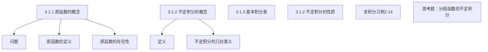

## 第3章 一元函数积分学

## 3.1 不定积分

3.1.1 原函数与不定积分的概念
3.1.2 不定积分的性质
3.1.3 基本积分表

## 3.1 不定积分

## 一、原函数的概念

1．问题
（1）已知速度 $v(t)$ ，求路程 $s(t)$ ．
即 $s^{\prime}(t)=v(t)$（已知），求 $s(t)$ ．
（2）已知曲线上每一点处的 切线斜率 $k(x)$ ，求曲线 $y=f(x)$ ．即 $y^{\prime}=k(x)$（已知），求 $y=f(x)$ ．

2．原函数的定义
若在 $I$ 内，$F^{\prime}(x)=f(x)$ 或 $d F(x)=f(x) d x$ ，则称 $F(x)$ 为 $f(x)$ 在 $I$ 内的一个原函数。

如 $(\sin x)^{\prime}=\cos x, \sin x$ 是 $\cos x$ 的原函数．
$(\ln x)^{\prime}=\frac{1}{x}(x>0), \ln x$ 是 $\frac{1}{x}$ 在区间 $(0,+\infty)$ 内的原函数．

## 3.原函数的存在性

定理1．若函数 $f(x)$ 在区间 $I$ 上连续，则 $f(x)$ 在 $I$ 上存在原函数 $F(x)$ ．

问题：（1）原函数是否唯一？
（2）若不唯一，它们之间有什么联系？
如 $(\sin x)^{\prime}=\cos x \quad(\sin x+C)^{\prime}=\cos x$
（ $\boldsymbol{C}$ 为任意常数）

定理2。设 $F(x)$ 是 $f(x)$ 在区间 $I$ 内的一个原函数，则
（1）$F(x)+C$ 也是 $f(x)$ 的一个原函数，其中 $C$ 为任意常数；
（2）若 $\Phi(x)$ 是 $f(x)$ 的一个原函数，则 $\Phi(x)=F(x)+C$ ．
证明：（1）$\because[F(x)+C]^{\prime}=F^{\prime}(x)=f(x)$ ，

$$
\therefore F(x)+C \text { 是 } f(x) \text { 的一个原函数. }
$$

（2）$\because[\Phi(x)-F(x)]^{\prime}=\Phi^{\prime}(x)-F^{\prime}(x)=f(x)-f(x)=0$

$$
\therefore \Phi(x)-F(x)=C
$$

即 $\Phi(x)=F(x)+C \quad(C$ 为任意常数 $)$.

## 注意：

（1）初等函数在其定义区间上都有原函数．
（2）初等函数的原函数不一定是初等函数．
（3）原函数不唯一。
如 $\frac{1}{2} \sin ^{2} x,-\frac{1}{2} \cos ^{2} x,-\frac{1}{4} \cos 2 x$ 都是 $(\sin x \cos x)$ 的原函数。
（4）如果 $f(x)$ 在 $I$ 上存在原函数，则称 $f(x)$ 在 $I$ 上可积．

## 二、不定积分的概念

1．定义 函数 $f(x)$ 在区间 $I$ 上的原函数全体，称为 $f(x)$ 在 $I$ 上的不定积分．记为

$$
\int f(x) d x
$$

习惯上，称求已知函数 $f(x)$ 的全部原函数的过程，为求函数 $f(x)$ 的不定积分．

求不定积分是求导的逆运算．

## 例如：

$$
\begin{array}{ll}
\left(x^{2}\right)^{\prime}=2 x, & \int 2 x \mathrm{~d} x=x^{2}+C ; \\
(\sin x)^{\prime}=\cos x, & \int \cos x \mathrm{~d} x=\sin x+C ; \\
(\ln |x|)^{\prime}=\frac{1}{x}, & \int \frac{1}{x} \mathrm{~d} x=\ln |x|+C .
\end{array}
$$

每一个求导公式，反过来就是一个求原函数的公式，加上积分常数 $C$就成为一个求不定积分的公式。

注意：（1）尽管不定积分中各个部分都有其独特的含义，但在使用时须作为一个整体看待。
（2）积分变量是指 d 后面的那个量。
如 $\int f(u) d u$ 中 $u$ 为积分变量，比较 $\int u^{x} d x$ 与 $\int u^{x} d u$ 。
（3）不定积分与原函数是两个不同的概念，它们是整体与个体的关系，原函数是一个函数，不定积分是一族函数。
（4）若 $F^{\prime}(x)=f(x)$ ，则 $\int f(x) d x=F(x)+C$ ．

## 2.不定积分的几何意义

若 $F(x)$ 是 $f(x)$ 的一个原函数，则称 $y=F(x)$ 的图形为 $f(x)$ 的一条积分曲线。
则 $\int f(x) d x$ 表示 $f(x)$ 的某一条积分曲线沿着纵轴方向任意地平行移动所得到的 所有积分曲线组成的曲 线族。

这些曲线在横坐标相同处切线平行。

例1．设曲线通过点（ $\mathbf{1}, \mathbf{2}$ ），且其上任一点处的切线斜率等于这点横坐标的两倍，求此曲线方程。

解：设曲线方程为 $y=f(x)$ ，
根据题意知 $\frac{d y}{d x}=2 x$ ，
即 $f(x)$ 是 $2 x$ 的一个原函数．

$$
\because \int 2 x d x=x^{2}+C, \quad \therefore f(x)=x^{2}+C
$$

由曲线通过点 $(1,2) \Rightarrow C=1$ ，
所求曲线方程为 $y=x^{2}+1$ ．

## 三、基本积分表

（1） $\int k d x=k x+C \quad(k$ 是常数）；
（2） $\int x^{\mu} d x=\frac{x^{\mu+1}}{\mu+1}+C \quad(\mu \neq-1)$ ；
特别地， $\int x d x=\frac{x^{2}}{2}+C \int \frac{1}{\sqrt{x}} d x=2 \sqrt{x}+C$

$$
\int \frac{1}{x^{2}} d x=-\frac{1}{x}+C
$$

（3） $\int \frac{d x}{x}=\ln |x|+C$ ；
(4) $\int \frac{1}{1+x^{2}} d x=\arctan x+C$;
(5) $\int \frac{1}{\sqrt{1-x^{2}}} d x=\arcsin x+C$;
(6) $\int \cos x d x=\sin x+C$;
(7) $\int \sin x d x=-\cos x+C$;
(8) $\int \frac{d x}{\cos ^{2} x}=\int \sec ^{2} x d x=\tan x+C$;
(9) $\int \frac{d x}{\sin ^{2} x}=\int \csc ^{2} x d x=-\cot x+C$;
(10) $\int \sec x \tan x d x=\sec x+C$;
(11) $\int \csc x \cot x d x=-\csc x+C$;
(12) $\int e^{x} d x=e^{x}+C$;
(13) $\int a^{x} d x=\frac{a^{x}}{\ln a}+C$;
(14) $\int \sinh x d x=\cosh x+C$;
(15) $\int \cosh x d x=\sinh x+C$;
(16) $\int 0 d x=C$.

## 四、不定积分的性质

不定积分的基本性质：
（1）$\frac{d}{d x}\left[\int f(x) d x\right]=f(x)$ ，或 $d\left[\int f(x) d x\right]=f(x) d x$ ，
（2） $\int F^{\prime}(x) d x=F(x)+C$ ，或 $\int d F(x)=F(x)+C$ ．
（3） $\int[f(x) \pm g(x)] d x=\int f(x) d x \pm \int g(x) d x$ ；
证明：$\because\left[\int f(x) d x \pm \int g(x) d x\right]^{\prime}$

$$
=\left[\int f(x) d x\right] \pm\left[\int g(x) d x\right]^{\prime}=f(x) \pm g(x) .
$$

故结论正确。
（4） $\int k f(x) d x=k \int f(x) d x$ ．（ $k$ 为任意常数）
（5） $\int \sum_{i=1}^{n} k_{i} f_{i}(x) d x=\sum_{i=1}^{n} k_{i} \int f_{i}(x) d x$ ．

性质（1）（2）说明微分运算与求不定积分的运算是互逆的。
性质（3）可推广到有限多个函数之和的情况。

练习1．$d \int d \int d \int f(x) d x=(f(x) d x)$练习2。

设 $\int x f(x) d x=\arccos x+C$ ，则 $f(x)=($

## 五、求不定积分习例－－－直接积分法

例2．计算 $\int \sqrt{x}\left(x^{2}-5\right) d x$ 例3． $\int\left(10^{x} \cdot 3^{2 x}+3 \sin x+\sqrt{x}\right) d x$
例4．计算 $\int \frac{(2 x \sqrt{x}-x+3 \sqrt{x}) \sqrt{x}}{x^{2}} d x \quad$ 例5 $\int\left(2^{x}-3^{x}\right)^{2} d x$
例6． $\int\left(\frac{3}{1+x^{2}}-\frac{2}{\sqrt{1-x^{2}}}\right) d x$ 例7．计算 $\int \frac{1+x+x^{2}}{x\left(1+x^{2}\right)} d x$
例8．计算 $\int \frac{1+2 x^{2}}{x^{2}\left(1+x^{2}\right)} d x$ 例9．计算 $\int \frac{x^{4}+1}{x^{2}+1} d x$ ．
例10． $\int \sec x(\sec x-\tan x) d x \quad$ 例11． $\int \cot ^{2} x d x$ ．
例12．计算 $\int \frac{\cos 2 x}{\cos ^{2} x \sin ^{2} x} d x \quad$ 例13． $\int \frac{1}{\sin ^{2} \frac{x}{2} \cos ^{2} \frac{x}{2}} d x$
例14 $\int \frac{1}{1+\cos 2 x} d x$ ．

例2．计算 $\int \sqrt{x}\left(x^{2}-5\right) d x$ ．
解： $\begin{aligned} & \int \sqrt{x}\left(x^{2}-5\right) d x=\int\left(x^{\frac{5}{2}}-5 x^{\frac{1}{2}}\right) d x \\ & { }_{\text {根据积分公式（2）} \int x^{\mu} d x=\frac{x^{\mu+1}}{\mu+1}+C} \\ & \quad=\int x^{\frac{5}{2}} d x-5 \int x^{\frac{1}{2}} d x\end{aligned}$

$$
=\frac{2}{7} x^{\frac{7}{2}}-\frac{10}{3} x^{\frac{3}{2}}+C
$$

例3．计算 $\int\left(10^{x} \cdot 3^{2 x}+3 \sin x+\sqrt{x}\right) d x$ ．

$$
\text { 解: } \begin{aligned}
& \int\left(10^{x} \cdot 3^{2 x}+3 \sin x+\sqrt{x}\right) d x \\
= & \int 90^{x} d x+3 \int \sin x d x+\int \sqrt{x} d x \\
= & \frac{90^{x}}{\ln 90}-3 \cos x+\frac{2}{3} x^{\frac{3}{2}}+C
\end{aligned}
$$

例4．计算 $\int \frac{(2 \boldsymbol{x} \sqrt{\boldsymbol{x}}-\boldsymbol{x}+\mathbf{3} \sqrt{\boldsymbol{x}}) \sqrt{\boldsymbol{x}}}{\boldsymbol{x}^{\mathbf{2}}} d \boldsymbol{x}$ ．
解： $\int \frac{(\mathbf{2} \boldsymbol{x} \sqrt{\boldsymbol{x}}-\boldsymbol{x}+\mathbf{3} \sqrt{\boldsymbol{x}}) \sqrt{\boldsymbol{x}}}{\boldsymbol{x}^{\mathbf{2}}} d \boldsymbol{x}$

$$
\begin{aligned}
& =\int\left(2-x^{-\frac{1}{2}}+\frac{3}{x}\right) d x \\
& =2 x-2 \sqrt{x}+3 \ln |x|+C
\end{aligned}
$$

例5．计算 $\int\left(2^{x}-3^{x}\right)^{2} d x$ ．
解：

$$
\begin{aligned}
\int\left(2^{x}-3^{x}\right)^{2} d x & =\int\left(4^{x}-2 \cdot 6^{x}+9^{x}\right) d x \\
& =\frac{4^{x}}{\ln 4}-2 \cdot \frac{6^{x}}{\ln 6}+\frac{9^{x}}{\ln 9}+C
\end{aligned}
$$

下面几个例子是对有理函数的不定积分，可用的公式为
（3） $\int \frac{d x}{x}=\ln |x|+C$ ；
（4） $\int \frac{1}{1+x^{2}} d x=\arctan x+C$ ；

例6．计算 $\int\left(\frac{3}{1+x^{2}}-\frac{2}{\sqrt{1-x^{2}}}\right) d x$ ．

$$
\begin{aligned}
\text { 解: } & \int\left(\frac{3}{1+x^{2}}-\frac{2}{\sqrt{1-x^{2}}}\right) d x \\
= & 3 \int \frac{1}{1+x^{2}} d x-2 \int \frac{1}{\sqrt{1-x^{2}}} d x \\
= & 3 \arctan x-2 \arcsin x+C
\end{aligned}
$$

例7．计算 $\int \frac{1+x+x^{2}}{x\left(1+x^{2}\right)} d x$ ．

分式化成最简真分式的代数和

解：

$$
\begin{aligned}
& \int \frac{1+x+x^{2}}{x\left(1+x^{2}\right)} d x=\int \frac{x+\left(1+x^{2}\right)}{x\left(1+x^{2}\right)} d x \\
= & \int\left(\frac{1}{1+x^{2}}+\frac{1}{x}\right) d x=\int \frac{1}{1+x^{2}} d x+\int \frac{1}{x} d x \\
= & \arctan x+\ln |x|+C
\end{aligned}
$$

例8．计算 $\int \frac{1+2 x^{2}}{x^{2}\left(1+x^{2}\right)} d x$ ．

分式化成最简真分式的代数和

解： $\int \frac{1+2 x^{2}}{x^{2}\left(1+x^{2}\right)} d x=\int \frac{1+x^{2}+x^{2}}{x^{2}\left(1+x^{2}\right)} d x$

$$
\begin{aligned}
& =\int \frac{1}{x^{2}} d x+\int \frac{1}{1+x^{2}} d x \\
& =-\frac{1}{x}+\arctan x+C .
\end{aligned}
$$

例9．计算 $\int \frac{x^{4}+1}{x^{2}+1} d x$ ．

解： $\int \frac{x^{4}+1}{x^{2}+1} d x=\int \frac{x^{4}+x^{2}-x^{2}-1+2}{x^{2}+1} d x$

$$
\begin{aligned}
& =\int\left(x^{2}-1+\frac{2}{x^{2}+1}\right) d x \\
& =\frac{1}{3} x^{3}-x+2 \arctan x+C
\end{aligned}
$$

以下几例中的被积函数都含有三角函数，需要对被积函数进行恒等变形，才能使用基本积分表，可用的积分公式为
（6） $\int \cos x d x=\sin x+C$ ；
（7） $\int \sin x d x=-\cos x+C$ ；
（8） $\begin{aligned} \int \frac{\boldsymbol{d x}}{\boldsymbol{\operatorname { c o s }}^{2} \boldsymbol{x}} & =\int \sec ^{2} x d x \\ & =\tan x+C ;\end{aligned}$

$$
\begin{aligned}
& \sin ^{2} x+\cos ^{2} x=1 \\
& \tan ^{2} x+1=\sec ^{2} x \\
& \cot ^{2} x+1=\csc ^{2} x \\
& \sin 2 x=2 \sin x \cos x \\
& \cos 2 x=\cos ^{2} x-\sin ^{2} x
\end{aligned}
$$

（9） $\int \frac{\boldsymbol{d} \boldsymbol{x}}{\boldsymbol{\sin}^{2} \boldsymbol{x}}=\int \csc ^{2} x d x$
（10） $\int \sec x \tan x d x=\sec x+C$ ；
$\cos ^{2} \frac{x}{2}=\frac{\cos x-1}{2}$
（11） $\int \csc x \cot x d x=-\csc x+C$ ；

例10．计算 $\int \sec x(\sec x-\tan x) d x$ ．
解：

$$
\begin{aligned}
& \int \sec x(\sec x-\tan x) d x \\
& =\int\left(\sec ^{2} x-\sec x \tan x\right) d x \\
& =\tan x-\sec x+C
\end{aligned}
$$

例11．计算 $\int \cot ^{2} x d x$ ．
解：

$$
\begin{aligned}
\int \cot ^{2} x d x & =\int\left(\csc ^{2} x-1\right) d x \\
& =-\cot x-x+C
\end{aligned}
$$

例12．计算 $\int \frac{\cos 2 x}{\cos ^{2} x \sin ^{2} x} d x$ ．

$$
\text { 解: } \begin{aligned}
\int \frac{\cos 2 x}{\cos ^{2} x \sin ^{2} x} d x & =\int \frac{\cos ^{2} x-\sin ^{2} x}{\cos ^{2} x \sin ^{2} x} d x \\
& =\int\left(\csc ^{2} x-\sec ^{2} x\right) d x \\
& =-\cot x-\tan x+C .
\end{aligned}
$$

例13．计算 $\int \frac{1}{\sin ^{2} \frac{x}{2} \cos ^{2} \frac{x}{2}} d x$ ．
解： $\int \frac{1}{\sin ^{2} \frac{x}{2} \cos ^{2} \frac{x}{2}} d x=\int \frac{4}{\sin ^{2} x} d x$

$$
\begin{aligned}
& =4 \int \csc ^{2} x d x \\
& =-4 \cot x+C .
\end{aligned}
$$

例14．计算 $\int \frac{1}{1+\cos 2 x} d x$ ．
解： $\int \frac{1}{1+\cos 2 x} d x=\int \frac{1}{1+2 \cos ^{2} x-1} d x$

$$
=\frac{1}{2} \int \frac{1}{\cos ^{2} x} d x=\frac{1}{2} \tan x+C .
$$

说明：被积函数为三角函数时需要进行三角恒等变形，才能使用基本积分表．

思考题———分段函数的不定积分的求法
1．先求各分段部分在相应区间内的原函数
2．考察在分界点处函数的连续性

例15．设 $f(x)=\left\{\begin{array}{c}x+1, x \leq 1 \\ 2 x, x>1\end{array}\right.$ ，求 $F(x)=\int f(x) d x$

例16．求 $\int e^{-|x|} \mathrm{d} x$ 。

例15．设 $f(x)=\left\{\begin{array}{c}x+1, x \leq 1 \\ 2 x, x>1\end{array}\right.$, 求 $F(x)=\int f(x) d x$
解：$x<1$ 时，$F(x)=\int(x+1) d x=\frac{1}{2} x^{2}+x+C_{1}$
$x>1$ 时，$F(x)=\int 2 x d x=x^{2}+C_{2}$
又函数可导必连续，知 $F(x)$ 在 $x=1$ 处有定义且连续
从而有，$F(1+0)=F(1-0)=F(1)$
即：$\frac{1}{2}+1+C_{1}=1+C_{2} \Rightarrow \frac{1}{2}+C_{1}=C_{2}$
令 $C_{1}=C$ ，则 $C_{2}=\frac{1}{2}+C$

所以

$$
F(x)=\left\{\begin{array}{c}
\frac{1}{2} x^{2}+x+C, x \leq 1 \\
x^{2}+\frac{1}{2}+C, x>1
\end{array}\right.
$$

## 例16.求 $\int e^{-|x|} \mathrm{d} x$ 。

解：当 $x>0$ 时， $\int e^{-|x|} \mathrm{d} x=\int e^{-x} \mathrm{~d} x=-e^{-x}+C_{1}$ ，

$$
\text { 当 } x<0 \text { 时, } \int e^{-|x|} \mathrm{d} x=\int e^{x} \mathrm{~d} x=e^{x}+C_{2} \text {, }
$$

由于一个函数的原函数必是连续函数，故

$$
\lim _{x \rightarrow 0^{+}}\left(-e^{-x}+C_{1}\right)=\lim _{x \rightarrow 0^{-}}\left(e^{x}+C_{2}\right)
$$

即有 $C_{1}=C_{2}+2$ ，从而

$$
\int e^{-|x|} \mathrm{d} x=\left\{\begin{array}{cl}
-e^{-x}+2+C, & x \geq 0, \\
e^{x}+C, & x<0 .
\end{array} \text { ( } C \text { 为积分常数. }\right)
$$

<!-- 补充内容来自高数上版本 -->
## 第3章 一元函数积分学
## 3.1 不定积分
## 3.1 不定积分
\begin{tabular}{|l|l|}
\hline 大中夜面治山楽 & \begin{tabular}{l}
3.1.1 原函数的概念 \\
3.1.2 不定积分的概念 \\
3.1.3 基本积分表 \\
3.1.2 不定积分的性质 \\
求积分习例2－14 \\
思考题——分段函数的不定积分
\end{tabular} \\
\hline & \\
\hline
\end{tabular}
## 一、原函数的概念
## 3.原函数的存在性
## 注意：
## 二、不定积分的概念
## 例如：
## 2.不定积分的几何意义
## 三、基本积分表
## 四、不定积分的性质
## 五、求不定积分习例－－－直接积分法
## 例16.求 $\int e^{-|x| \mathrm{d} x$ 。}
