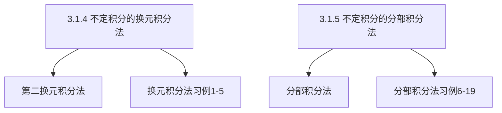

## 第3章 一元函数积分学

## 3.1 不定积分

3.1.4 换元积分法
3.1.5 分部积分法

换元积分法与分部积分法

## 一、第二换元积分法

设 $x=\psi(t)$ 是单调的、可导的函数，并且 $\psi^{\prime}(t) \neq 0$ ，又设 $f[\psi(t)] \psi^{\prime}(t)$ 具有原函数，则有换元公式 $\int f(x) d x=\left[\int f[\psi(t)] \psi^{\prime}(t) d t\right]_{t=\bar{\psi}(x)}$其中 $\bar{\psi}(x)$ 是 $x=\psi(t)$ 的反函数．

应用过程：

$$
\begin{aligned}
\int f(x) d x & \xlongequal{x=\psi(t)} \int f[\psi(t)] \cdot \psi^{\prime}(t) d t=\int g(t) d t=\Phi(t)+C \\
& \xlongequal{t=\overline{\psi(x)}} \Phi[\overline{\psi(x)}]+C
\end{aligned}
$$

## 第二换元积分法习例

例1计算 $\int \frac{x^{5}}{\sqrt{1+x^{2}}} d x$
例2计算 $\int \frac{1}{\sqrt{1+e^{x}}} d x$ ．
例3计算 $\int \frac{1}{\boldsymbol{x}\left(\boldsymbol{x}^{7}+\mathbf{2}\right)} d \boldsymbol{x}$
例4计算 $\int \frac{1}{x^{4} \sqrt{x^{2}+1}} d x$ ．
例5计算 $\int \frac{1}{\sqrt{x}(1+\sqrt[3]{x})} d x$ ．

## 积分中为了消去根式并不一定采用三角

代换，需根据被积函数的情况来定．
例1计算 $\int \frac{\boldsymbol{x}^{5}}{\sqrt{\mathbf{1}+\boldsymbol{x}^{2}}} \boldsymbol{d x}$（三角代换很繁琐）
解（1）令 $t=\sqrt{1+x^{2}} \Rightarrow x^{2}=t^{2}-1, x d x=t d t$ ，

$$
\begin{aligned}
& \int \frac{x^{5}}{\sqrt{1+x^{2}}} d x=\int \frac{x^{4}}{\sqrt{1+x^{2}}} x d x \\
= & \int \frac{\left(t^{2}-1\right)^{2}}{t} t d t=\int\left(t^{4}-2 t^{2}+1\right) d t=\frac{1}{5} t^{5}-\frac{2}{3} t^{3}+t+C \\
= & \frac{1}{5}\left(1+x^{2}\right)^{\frac{5}{2}}-\frac{2}{3}\left(1+x^{2}\right)^{\frac{3}{2}}+\left(1+x^{2}\right)^{\frac{1}{2}}+C .
\end{aligned}
$$

$$
\text { 解(2) } \begin{aligned}
& \int \frac{x^{5}}{\sqrt{1+x^{2}}} d x=\frac{1}{2} \int \frac{x^{4}}{\sqrt{1+x^{2}}} d x^{2}=\frac{1}{2} \int \frac{\left(x^{2}+1\right)\left(x^{2}-1\right)+1}{\sqrt{1+x^{2}}} d x^{2} \\
= & \frac{1}{2} \int\left[\sqrt{1+x^{2}}\left(x^{2}-1\right)+\frac{1}{\sqrt{1+x^{2}}}\right] d x^{2} \\
= & \frac{1}{2} \int\left[\sqrt{1+x^{2}}\left(x^{2}+1-2\right)+\frac{1}{\sqrt{1+x^{2}}}\right] d x^{2} \\
= & \frac{1}{2} \int\left[\left(x^{2}+1\right)^{\frac{3}{2}}-2 \sqrt{1+x^{2}}\right)+\frac{1}{\sqrt{1+x^{2}}} d\left(1+x^{2}\right) \\
= & \frac{1}{5}\left(1+x^{2}\right)^{\frac{5}{2}}-\frac{2}{3}\left(1+x^{2}\right)^{\frac{3}{2}}+\left(1+x^{2}\right)^{\frac{1}{2}}+C .
\end{aligned}
$$

例2 计算 $\int \frac{1}{\sqrt{1+e^{x}}} d x$ ．
解 令 $t=\sqrt{1+e^{x}} \Rightarrow e^{x}=t^{2}-1$ ，

$$
\begin{gathered}
x=\ln \left(t^{2}-1\right), \quad d x=\frac{2 t}{t^{2}-1} d t \\
\int \frac{1}{\sqrt{1+e^{x}}} d x=\int \frac{2}{t^{2}-1} d t=\ln \left|\frac{t-1}{t+1}\right|+C \\
=\ln \left|\frac{\sqrt{1+e^{x}}}{\sqrt{1+e^{x}}}+1\right|+C=2 \ln \left|\sqrt{1+e^{x}}-1\right|-x+C
\end{gathered}
$$

## 当分母的阶较高时，可采用倒代换 $x=\frac{1}{t}$ 。

例3 计算 $\int \frac{1}{x\left(x^{7}+2\right)} d x$
解 令 $x=\frac{1}{t} \Rightarrow d x=-\frac{1}{t^{2}} d t$ ，

$$
\begin{aligned}
& \int \frac{1}{x\left(x^{7}+2\right)} d x=\int \frac{t}{\left(\frac{1}{t}\right)^{7}+2} \cdot\left(-\frac{1}{t^{2}}\right) d t=-\int \frac{t^{6}}{1+2 t^{7}} d t \\
& =-\frac{1}{14} \ln \left|1+2 t^{7}\right|+C=-\frac{1}{14} \ln \left|2+x^{7}\right|+\frac{1}{2} \ln |x|+C .
\end{aligned}
$$

例4 计算 $\int \frac{1}{x^{4} \sqrt{x^{2}+1}} d x$ ．（分母的阶较高）

解 令 $x=\frac{1}{t} \Rightarrow d x=-\frac{1}{t^{2}} d t$ ，

$$
\begin{aligned}
& \int \frac{1}{x^{4} \sqrt{x^{2}+1}} d x=\int \frac{1}{\left(\frac{1}{t}\right)^{4} \sqrt{\left(\frac{1}{t}\right)^{2}+1}}\left(-\frac{1}{t^{2}}\right) d t \\
& =-\int \frac{t^{3}}{\sqrt{1+t^{2}}} d t=-\frac{1}{2} \int \frac{t^{2}}{\sqrt{1+t^{2}}} d t^{2}
\end{aligned}
$$

$$
\begin{aligned}
& =-\frac{1}{2} \int \frac{1+t^{2}-1}{\sqrt{1+t^{2}}} d t^{2} \\
& =-\frac{1}{2} \int\left(\sqrt{1+t^{2}}-\frac{1}{\sqrt{1+t^{2}}}\right) d\left(1+t^{2}\right) \\
& =-\frac{1}{3}\left(\sqrt{1+t^{2}}\right)^{3}+\sqrt{1+t^{2}}+C \\
& =-\frac{1}{3}\left(\frac{\sqrt{1+x^{2}}}{x}\right)^{3}+\frac{\sqrt{1+x^{2}}}{x}+C .
\end{aligned}
$$

当被积函数含有两种或两种以上的根式 $\sqrt[k]{x}, \cdots, \sqrt[l]{x}$时，可采用令 $x=t^{n}$（其中 $n$ 为各根指数的最小公倍数）
例5计算 $\int \frac{1}{\sqrt{x}(1+\sqrt[3]{x})} d x$ 。
解 令 $x=t^{6} \Rightarrow d x=6 t^{5} d t$ ，

$$
\begin{aligned}
& \int \frac{1}{\sqrt{x}(1+\sqrt[3]{x})} d x=\int \frac{6 t^{5}}{t^{3}\left(1+t^{2}\right)} d t=\int \frac{6 t^{2}}{1+t^{2}} d t \\
& =6 \int \frac{t^{2}+1-1}{1+t^{2}} d t=6 \int\left(1-\frac{1}{1+t^{2}}\right) d t \\
& =6[t-\arctan t]+C=6[\sqrt[6]{x}-\arctan \sqrt[6]{x}]+C .
\end{aligned}
$$

## 二、不定积分的分部积分法

问题 $\int x e^{x} d x=$ ？
$\int x d e^{x}$ 和 $\int e^{x} d x$ 哪一个计算简单？
解决思路 利用两个函数乘积的求导法则可将 $\int x d e^{x}$化为容易积分的 $\int e^{x} d x$ 形式。

$$
d x e^{x}=e^{x} d x+x d e^{x}
$$

即

$$
x d e^{x}=d x e^{x}-e^{x} d x
$$

两边积分，得

$$
\begin{equation*}
\int x e^{x} d x=\int x d e^{x}=\int d x e^{x}-\int e^{x} d x=x e^{x}-e^{x}+C \tag{2}
\end{equation*}
$$

设函数 $u=u(x)$ 和 $v=v(x)$ 具有连续导数，

$$
\begin{aligned}
& (u v)^{\prime}=u^{\prime} v+u v^{\prime}, \quad u v^{\prime}=(u v)^{\prime}-u^{\prime} v \\
& \int u v^{\prime} d x=\int(u v)^{\prime} d x-\int u^{\prime} v d x \\
& \int u v^{\prime} d x=u v-\int u^{\prime} v d x, \quad \int u d v=u v-\int v d u
\end{aligned}
$$

定理 设 $u=u(x), v=v(x)$ 具有连续导数，则有分部积分公式

$$
\int u d v=u v-\int v d u
$$

注意（1）分部积分法用于求两类不同函数乘积的积分．
（2）用分部积分法计算的不定积分类型常见的有：

$$
\begin{array}{lll}
\int x^{k} e^{\alpha x} d x, & \int x^{k} \ln ^{m} x d x, & \int x^{k} \sin a x d x, \\
\int x^{k} \cos a x d x, & \int x^{k} \arctan b x d x, & \int e^{\alpha x} \sin b x d x .
\end{array}
$$

（3）分部积分法与换元法经常穿插着使用．
（4）分部积分法常用来推导递推公式。
（5） $\int f(x) g^{\prime}(x) d x=\int u d v=u v-\int v d u$ ．

## 分部积分法习例

例6计算 $\int x \cos x d x$ 。

例7计算 $\int x^{2} e^{x} d x$ 。

例 8 计算 $\int x \arctan x d x$ ．

例9计算 $\int\left(x^{3}+3 x+1\right) \ln x d x$ 。

例10计算 $\int \boldsymbol{e}^{\boldsymbol{x}} \boldsymbol{\sin} \boldsymbol{x} \boldsymbol{d} \boldsymbol{x}$ ．

例11计算 $\boldsymbol{\int} \sqrt{\boldsymbol{x}^{\mathbf{2}}+\boldsymbol{a}^{\mathbf{2}}} \mathbf{d} \boldsymbol{x}$

例12 计算 $\int(\arcsin x)^{2} d x$ ．

例13 计算 $\int \sin (\ln x) d x$ ．

例14计算 $\int \sec ^{3} x d x$.
例15计算 $\int \frac{x \arctan x}{\sqrt{1+x^{2}}} d x$ ．
例16计算 $\int\left(\ln \ln x+\frac{1}{\ln x}\right) d x$ ．

例17 计算 $\int \frac{\ln x}{(1+\ln x)^{2}} d x$ ．

例18计算 $I_{n}=\int \frac{d x}{\left(x^{2}+a^{2}\right)^{n}} \quad(n \in N)$ ．
例19设 $f(x)$ 的一个原函数为 $e^{-x^{2}}$ ，求 $\int x f^{\prime}(x) d x$ ．

例6计算 $\int x \cos x d x$ ．
解（1）令 $u=\cos x, d v=x d x=d\left(\frac{1}{2} x^{2}\right)$ ，

$$
\int x \cos x d x=\int \cos x d\left(\frac{1}{2} x^{2}\right)=\frac{x^{2}}{2} \cos x+\int \frac{x^{2}}{2} \sin x d x
$$

显然，$u, v^{\prime}$ 选择不当，积分更难进行．
解（2）令 $u=x, d v=\cos x d x=d(\sin x)$ ，

$$
\begin{aligned}
\int x \cos x d x & =\int x d \sin x=x \sin x-\int \sin x d x \\
& =x \sin x+\cos x+C
\end{aligned}
$$

例7计算 $\int \boldsymbol{x}^{2} \boldsymbol{e}^{\boldsymbol{x}} \boldsymbol{d} \boldsymbol{x}$ ．
解 $u=x^{2}, d v=e^{x} d x=d e^{x}$ ，

$$
\int x^{2} e^{x} d x=\int x^{2} d e^{x}=x^{2} e^{x}-2 \int x e^{x} d x
$$

（再次使用分部积分法）$u=x, d v=e^{x} d x=d e^{x}$

$$
=x^{2} e^{x}-2\left(x e^{x}-e^{x}\right)+C .
$$

$$
\begin{aligned}
\int x^{2} e^{x} d x & =\int x^{2} d e^{x}=x^{2} e^{x}-2 \int x e^{x} d x=x^{2} e^{x}-2 \int x d e^{x} \\
= & x^{2} e^{x}-2\left(x e^{x}-\int e^{x} d x\right)=x^{2} e^{x}-2\left(x e^{x}-e^{x}\right)+C
\end{aligned}
$$

总结 若被积函数是幂函数和正（余）弦函数或幂函数和指数函数的乘积，就考虑设幂函数为 $u$ ，使其降幂一次（假定幂指数是正整数）

例8计算 $\int x \arctan x d x$ ．
解 令 $u=\arctan x, d v=x d x=d\left(\frac{x^{2}}{2}\right)$ ，

$$
\begin{aligned}
& \int x \arctan x d x=\int \arctan x d\left(\frac{1}{2} x^{2}\right) \\
& =\frac{x^{2}}{2} \arctan x-\int \frac{x^{2}}{2} d(\arctan x) \\
& =\frac{x^{2}}{2} \arctan x-\int \frac{x^{2}}{2} \cdot \frac{1}{1+x^{2}} d x \\
& =\frac{x^{2}}{2} \arctan x-\int \frac{1}{2} \cdot\left(1-\frac{1}{1+x^{2}}\right) d x \\
& =\frac{x^{2}}{2} \arctan x-\frac{1}{2}(x-\arctan x)+C
\end{aligned}
$$

例9 计算 $\int\left(\boldsymbol{x}^{\mathbf{3}} \boldsymbol{+} \mathbf{3} \boldsymbol{x}+\mathbf{1}\right) \boldsymbol{\ln} \boldsymbol{x} \boldsymbol{d} \boldsymbol{x}$ ．
解 $\int\left(x^{3}+3 x+1\right) \ln x d x=\int \ln x d\left(\frac{1}{4} x^{4}+\frac{3}{2} x^{2}+x\right)$

$$
\begin{aligned}
& =\left(\frac{1}{4} x^{4}+\frac{3}{2} x^{2}+x\right) \ln x-\int\left(\frac{1}{4} x^{4}+\frac{3}{2} x^{2}+x\right) \frac{1}{x} d x \\
& =\left(\frac{1}{4} x^{4}+\frac{3}{2} x^{2}+x\right) \ln x-\int\left(\frac{1}{4} x^{3}+\frac{3}{2} x+1\right) d x \\
& =\left(\frac{1}{4} x^{4}+\frac{3}{2} x^{2}+x\right) \ln x-\frac{1}{16} x^{4}-\frac{3}{4} x^{2}-x+C .
\end{aligned}
$$

总结 若被积函数是幂函数和对数函数或幂函数和反三角函数的乘积，就考虑设对数函数或反三角函数为 $u$ ．

例10计算 $\quad \int e^{x} \sin x d x$ ．
解

$$
\begin{aligned}
& \int e^{x} \sin x d x=\int \sin x d e^{x}=e^{x} \sin x-\int e^{x} d(\sin x) \\
& =e^{x} \sin x-\int e^{x} \cos x d x=e^{x} \sin x-\int \cos x d e^{x} \\
& =e^{x} \sin x-\left(e^{x} \cos x-\int e^{x} d \cos x\right) \\
& =e^{x}(\sin x-\cos x)-\int e^{x} \sin x d x \\
& \therefore \int e^{x} \sin x d x=\frac{e^{x}}{2}(\sin x-\cos x)+C .
\end{aligned}
$$

总结 若被积函数是指数函数与三角函数乘积时，可任意令 $u$ ，但要两次使用分部积分，且 $u$ 的设法相同．

## 解题技巧：

选取 $u$ 及 $v^{\prime}$ 的一般方法：
反对幂三指
把被积函数视为两个函数之积，按＂反对幂指三＂
顺序，前者为 $u$ 后者为 $v^{\prime}$ 。

的

反对不要碰，三指动一动

例11求积分 $I=\int \sqrt{x^{2}+a^{2}} \mathrm{~d} x$ ．

$$
\begin{aligned}
& \text { 解 } I=\int \sqrt{x^{2}+a^{2}} \mathrm{~d} x=x \sqrt{x^{2}+a^{2}}-\int \frac{x^{2} \mathrm{~d} x}{\sqrt{x^{2}+a^{2}}} \\
&=x \sqrt{x^{2}+a^{2}}-\int \frac{\left(x^{2}+a^{2}-a^{2}\right) \mathrm{d} x}{\sqrt{x^{2}+a^{2}}} \\
&=x \sqrt{x^{2}+a^{2}}-\int \sqrt{x^{2}+a^{2}} \mathrm{~d} x+a^{2} \int \frac{\mathrm{~d} x}{\sqrt{x^{2}+a^{2}}} \\
&=x \sqrt{x^{2}+a^{2}}-I+a^{2} \ln \left|x+\sqrt{x^{2}+a^{2}}\right| \\
& \therefore I=\int \sqrt{x^{2}+a^{2}} \mathrm{~d} x=\frac{1}{2} x \sqrt{x^{2}+a^{2}}+\frac{a^{2}}{2} \ln \left|x+\sqrt{x^{2}+a^{2}}\right|+C .
\end{aligned}
$$

例12计算 $\int(\arcsin x)^{2} d x$ ．
方法1 $\int(\arcsin x)^{2} d x=x(\arcsin x)^{2}-\int x d(\arcsin x)^{2}$

$$
\begin{aligned}
& =x(\arcsin x)^{2}-2 \int \frac{x \arcsin x}{\sqrt{1-x^{2}}} d x \\
& =x(\arcsin x)^{2}+2 \int \arcsin x d \sqrt{1-x^{2}} \\
& =x(\arcsin x)^{2}+2\left(\sqrt{1-x^{2}} \arcsin x-\int \sqrt{1-x^{2}} d \arcsin x\right) \\
& =x(\arcsin x)^{2}+2\left(\sqrt{1-x^{2}} \arcsin x-\int d x\right) \\
& =x(\arcsin x)^{2}+2 \sqrt{1-x^{2}} \arcsin x-2 x+C .
\end{aligned}
$$

方法 $2 \int(\arcsin x)^{2} d x \xlongequal[x=\sin t]{t=\arcsin x} \int t^{2} \cos t d t=\int t^{2} d \sin t$

$$
\begin{aligned}
& =t^{2} \sin t-2 \int t \sin t d t=t^{2} \sin t+2 \int t d \cos t \\
& =t^{2} \sin t+2\left(t \cos t-\int \cos t d t\right) \\
& =t^{2} \sin t+2 t \cos t-2 \sin t+C
\end{aligned}
$$

$t=\arcsin x$

$$
=x(\arcsin x)^{2}+2 \sqrt{1-x^{2}} \arcsin x-2 x+C .
$$

总结 若被积函数是超越函数（指数函数，对数函数，三角函数，反三角函数）时，直接令超越函数为 $u$ ．

例13计算 $\int \sin (\ln x) d x$ ．

$$
\begin{aligned}
& \text { 解 } \int \sin (\ln x) d x=x \sin (\ln x)-\int x d[\sin (\ln x)] \\
& =x \sin (\ln x)-\int x \cos (\ln x) \cdot \frac{1}{x} d x \\
& =x \sin (\ln x)-\int \cos (\ln x) d x \\
& =x \sin (\ln x)-x \cos (\ln x)+\int x d[\cos (\ln x)] \\
& =x[\sin (\ln x)-\cos (\ln x)]-\int \sin (\ln x) d x \\
& \therefore \int \sin (\ln x) d x=\frac{x}{2}[\sin (\ln x)-\cos (\ln x)]+C .
\end{aligned}
$$

例14计算 $\int \sec ^{3} x d x$ ．
解 $\int \sec ^{3} x d x=\int \sec ^{2} x \sec x d x=\int \sec x d \tan x$

$$
\begin{aligned}
& =\sec x \tan x-\int \tan ^{2} x \sec x d x \\
& =\sec x \tan x-\int\left(\sec ^{2} x-1\right) \sec x d x \\
& =\sec x \tan x-\int\left(\sec ^{3} x-\sec x\right) d x \\
& =\sec x \tan x-\int \sec ^{3} x d x+\int \sec x d x
\end{aligned}
$$

$$
\begin{aligned}
\therefore \int \sec ^{3} x d x & =\frac{1}{2} \sec x \tan x+\frac{1}{2} \int \sec x d x \\
& \left.=\frac{1}{2} \sec x \tan x+\frac{1}{2} \ln \right\rvert\, \sec x+\tan x+C
\end{aligned}
$$

例 15 计算 $\int \frac{x \arctan x}{\sqrt{1+x^{2}}} d x$ ．
解 $\because\left(\sqrt{1+\boldsymbol{x}^{2}}\right)^{\prime}=\frac{\boldsymbol{x}}{\sqrt{1+\boldsymbol{x}^{2}}}$ ，

$$
\begin{aligned}
& \therefore \int \frac{x \arctan x}{\sqrt{1+x^{2}}} d x=\int \arctan x d \sqrt{1+x^{2}} \\
& =\sqrt{1+x^{2}} \arctan x-\int \sqrt{1+x^{2}} d(\arctan x) \\
& =\sqrt{1+x^{2}} \arctan x-\int \sqrt{1+x^{2}} \cdot \frac{1}{1+x^{2}} d x \\
& =\sqrt{1+x^{2}} \arctan x-\int \frac{d x}{\sqrt{1+x^{2}}} \\
& =\sqrt{1+x^{2}} \arctan x-\ln \left(x+\sqrt{1+x^{2}}\right)+C .
\end{aligned}
$$

例16计算 $\int\left(\ln \ln x+\frac{1}{\ln x}\right) d x$ ．
解 原式 $=\int \ln \ln x d x+\int \frac{1}{\ln x} d x$

$$
\begin{aligned}
& =x \ln \ln x-\int x d(\ln \ln x)+\int \frac{1}{\ln x} d x \\
& =x \ln \ln x-\int x \frac{1}{\ln x} \cdot \frac{1}{x} d x+\int \frac{1}{\ln x} d x \\
& =x \ln \ln x-\int \frac{1}{\ln x} d x+\int \frac{1}{\ln x} d x \\
& =x \ln \ln x+C
\end{aligned}
$$

例17计算 $\int \frac{\ln x}{(1+\ln x)^{2}} d x$ ．
解 原式 $=\int \frac{x \ln x}{x(1+\ln x)^{2}} d x=\int \boldsymbol{x} \ln \boldsymbol{x} \boldsymbol{d}\left(-\frac{\mathbf{1}}{\mathbf{1}+\boldsymbol{\ln} \boldsymbol{x}}\right)$

$$
\begin{aligned}
& =-\frac{x \ln x}{1+\ln x}-\int-\frac{1}{1+\ln x} d(x \ln x) \\
& =-\frac{x \ln x}{1+\ln x}+\int \frac{\ln x+1}{1+\ln x} d x \\
& =-\frac{x \ln x}{1+\ln x}+x+C
\end{aligned}
$$

## 利用分部积分法可以得到某些积分的递推公式

例18计算 $I_{n}=\int \frac{d x}{\left(x^{2}+a^{2}\right)^{n}} \quad(n \in N)$ ．
解 $\because \int \frac{d x}{\left(x^{2}+a^{2}\right)^{n-1}}=\frac{x}{\left(x^{2}+a^{2}\right)^{n-1}}+2(n-1) \int \frac{x^{2}}{\left(x^{2}+a^{2}\right)^{n}} d x$

$$
=\frac{x}{\left(x^{2}+a^{2}\right)^{n-1}}+2(n-1)\left[\int \frac{d x}{\left(x^{2}+a^{2}\right)^{n-1}}-\int \frac{a^{2}}{\left(x^{2}+a^{2}\right)^{n}} d x\right]
$$

即 $I_{n-1}=\frac{x}{\left(x^{2}+a^{2}\right)^{n-1}}+2(n-1)\left[I_{n-1}-a^{2} I_{n}\right]$

$$
\begin{aligned}
& \therefore I_{n}=\frac{1}{2 a^{2}(n-1)}\left[\frac{x}{\left(x^{2}+a^{2}\right)^{n-1}}+(2 n-3) I_{n-1}\right] \\
& \text { 且 } I_{1}=\frac{1}{a} \arctan \frac{x}{a}+C .
\end{aligned}
$$

例19 设 $f(x)$ 的一个原函数为 $e^{-x^{2}}$ ，求 $\int x f^{\prime}(x) d x$ ．
解 $\because e^{-x^{2}}$ 是 $f(x)$ 的一个原函数，

$$
\begin{gathered}
\therefore f(x)=\left(e^{-x^{2}}\right)^{\prime}=-2 x e^{-x^{2}} \\
\int f(x) d x=e^{-x^{2}}+C_{1} \\
\therefore \int x f^{\prime}(x) d x=\int x d f(x)=x f(x)-\int f(x) d x \\
=-2 x^{2} e^{-x^{2}}-e^{-x^{2}}+C
\end{gathered}
$$

## 小结：

第二换元法的形式还有倒代换、根式代换等其它。分部积分题目的类型：

1）直接分部化简积分；
2）分部产生循环式，由此解出积分式；
（注意：两次分部选择的 $u, v$ 函数类型不变，解出积分后加 $\boldsymbol{C}$ ）

3）对含自然数 $n$ 的积分，通过分部积分建立递推公式。

思考题：
1．归纳用分部积分法计算不定积分的类型．
2．在接连几次应用分部积分公式时，应注意什么事项？
