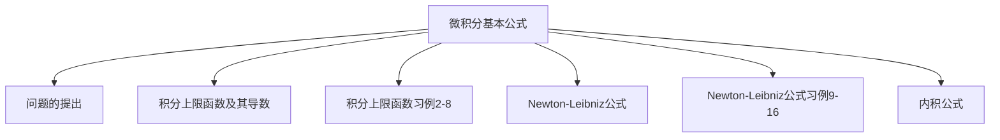

## 第3章 一元函数积分学

3.2 定积分

3.2.4 牛顿莱布尼兹公式

## 3.2 定积分

微积分基本公式

## 一、问题的提出

## 变速直线运动中位置函数与速度函数的联系

设某物体作直线运动，已知速度 $v=v(t)$ 是时间间隔 $\left[T_{1}, T_{2}\right]$ 上 $t$ 的一个连续函数，且 $v(t) \geq 0$ ，求物体在这段时间内所经过的路程。

变速直线运动中路程为 $\int_{T_{1}}^{T_{2}} v(t) d t$
另一方面这段路程可表示为 $s\left(T_{2}\right)-s\left(T_{1}\right)$

$$
\therefore \int_{T_{1}}^{T_{2}} v(t) d t=s\left(T_{2}\right)-s\left(T_{1}\right) \text {. 其中 } s^{\prime}(t)=v(t) \text {. }
$$

## 二、积分上限函数及其导数

## 1.积分上限函数

设函数 $f(x)$ 在区间 $[a, b]$ 上连续，并且设 $x$为 $[a, b]$ 上的一点，考察定积分

$$
\int_{a}^{x} f(x) d x=\int_{a}^{x} f(t) d t
$$

如果上限 $x$ 在区间 $[a, b]$ 上任意变动，则对于每一个取定的 $\boldsymbol{x}$ 值，定积分有一个对应值，所以它在 $[a, b]$ 上定义了一个函数，

记 $\Phi(x)=\int_{a}^{x} f(t) d t$ ．积分上限函数且 $\Phi\left(x_{0}\right)=\int_{a}^{x_{0}} f(t) d t$ ．

## 2.积分上限函数的性质

定理 1 如果 $f(x)$ 在 $[a, b]$ 上连续，则积分上限的函数 $\Phi(x)=\int_{a}^{x} f(t) d t$ 在 $[a, b]$ 上具有导数，且它的导数是 $\Phi^{\prime}(x)=\frac{d}{d x} \int_{a}^{x} f(t) d t=f(x) \quad(a \leq x \leq b)$

证 $\Phi(x+\Delta x)=\int_{a}^{x+\Delta x} f(t) d t$

$$
\begin{aligned}
& \Delta \Phi=\Phi(x+\Delta x)-\Phi(x) \\
& =\int_{a}^{x+\Delta x} f(t) d t-\int_{a}^{x} f(t) d t
\end{aligned}
$$

$$
\begin{aligned}
& =\int_{a}^{x} f(t) d t+\int_{x}^{x+\Delta x} f(t) d t-\int_{a}^{x} f(t) d t \\
& =\int_{x}^{x+\Delta x} f(t) d t
\end{aligned}
$$

上式表明，函数原函数的增量 \(\Delta\Phi\) 可以看成区间 \([x,x+\Delta x]\) 上函数 \(f(t)\) 的积分。当 \(\Delta x\) 很小时，该积分接近于 \(f(\xi)\Delta x\)，其中 \(\xi\in[x,x+\Delta x]\)。利用这一思想，可以通过积分中值定理证明 \(\Phi'(x)=f(x)\)，即微积分基本定理的第一部分。

由积分中值定理得

$$
\begin{aligned}
& \Delta \Phi=f(\xi) \Delta x \quad \xi \in[x, x+\Delta x], \quad \text { o| a } \quad x \xi x+\Delta . \\
& \frac{\Delta \Phi}{\Delta x}=f(\xi), \text { 且 } \Delta x \rightarrow 0, \xi \rightarrow x, \\
& \therefore \Phi^{\prime}(x)=\lim _{\Delta x \rightarrow 0} \frac{\Delta \Phi}{\Delta x}=\lim _{\Delta x \rightarrow 0} f(\xi)=\lim _{\xi \rightarrow 0} f(\xi)=f(x) .
\end{aligned}
$$

## 原函数存在定理

结论1 若 $f(x)$ 在 $[a, b]$ 上连续，则原函数一定存在，且 $\Phi(x)=\int_{a}^{x} f(t) d t$ 就是 $f(x)$ 在 $[a, b]$ 上的原函数．

例1 分别写出 $e^{-x^{2}}$ 与 $\frac{\sin x}{x}$ 的一个原函数．
解 $e^{-x^{2}}$ 的一个原函数是 $\Phi(x)=\int_{a}^{x} e^{-t^{2}} d t$ ， $\frac{\sin x}{x}$ 的一个原函数是 $\Phi(x)=\int_{a}^{x} \frac{\sin t}{t} d t$.

结论2 $\frac{d}{d x} \int_{a}^{\varphi(x)} f(t) d t=\left[\int_{a}^{\varphi(x)} f(t) d t\right]=f[\varphi(x)] \cdot \varphi^{\prime}(x)$ ．
结论3 $\frac{d}{d x} \int_{\varphi(x)}^{b} f(t) d t=\left[\int_{\varphi(x)}^{b} f(t) d t\right]=-f[\varphi(x)] \cdot \varphi^{\prime}(x)$ ．
结论4 $\frac{d}{d x} \int_{\varphi(x)}^{\psi(x)} f(t) d t=f[\psi(x)] \cdot \psi^{\prime}(x)-f[\varphi(x)] \cdot \varphi^{\prime}(x)$ ．

问：$\frac{d}{d x} \int_{a}^{b} f(x) d x=? \quad \frac{d}{d b} \int_{a}^{b} f(x) d x=?$

## 积分上限函数习例

例2 计算 $\frac{d}{d x} \int_{\sin x}^{\cos x} \cos \left(\pi^{2}\right) d t$ ．
例3 求由 $\int_{y^{2}}^{0} e^{t} d t+\int_{0}^{2 x} t^{2} d t=0$ 所确定的隐函数 $y$ 对 $x$ 的导数 $\frac{d y}{d x}$ ．
例4 设 $y=\int_{0}^{x}(x-1)(x-2)^{2} d x$ ，求其极值点．
例5 求 $\lim _{x \rightarrow 0} \frac{\int_{\cos x}^{1} e^{-t^{2}} d t}{x^{2}}$ ．
例6 若 $f(x)$ 在 $[a, b]$ 上连续，

$$
F(x)=\int_{a}^{x} f(t)(x-t) d t \text {, 证明 } F^{\prime \prime}(x)=f(x) \text {. }
$$

（3）（14）（N）（8）

例 7 设 $f(x)$ 在 $(-\infty,+\infty)$ 内连续，且 $f(x)>0$ ．证明函数

$$
F(x)=\frac{\int_{0}^{x} t f(t) d t}{\int_{0}^{x} f(t) d t} \text { 在 }(0,+\infty) \text { 内为单调增加函数. }
$$

例 8 设 $f(x)$ 在 $[0,1]$ 上连续，且 $f(x)<1$ ．证明

$$
2 x-\int_{0}^{x} f(t) d t=1 \text { 在 }[0,1] \text { 上只有一个解. }
$$

例2 计算 $\frac{d}{d x} \int_{\sin x}^{\cos x} \cos \left(\pi t^{2}\right) d t$ ．

$$
\begin{aligned}
& \text { 解 } \begin{aligned}
& \frac{d}{d x} \int_{\sin x}^{\cos x} \cos \left(\pi t^{2}\right) d t \\
= & \cos \left(\pi \cos ^{2} x\right) \cdot(\cos x)^{\prime}-\cos \left(\pi \sin ^{2} x\right) \cdot(\sin x)^{\prime} \\
= & \cos \left(\pi \cos ^{2} x\right) \cdot \sin x-\cos \left(\pi \sin ^{2} x\right) \cdot \cos x
\end{aligned}
\end{aligned}
$$

例3 求由 $\int_{y^{2}}^{0} e^{t} d t+\int_{0}^{2 x} t^{2} d t=0$ 所确定的隐函数 $y$ 对 $x$ 的导数 $\frac{d y}{d x}$ ．
解 方程两边对 $x$ 求导得，

$$
\begin{aligned}
& -e^{y^{2}} 2 y y^{\prime}+4 x^{2} \cdot 2=0 \\
& \therefore \frac{d y}{d x}=\frac{4 x^{2}}{y e^{y^{2}}} .
\end{aligned}
$$

例4 设 $y=\int_{0}^{x}(x-1)(x-2)^{2} d x$ ，求其极值点．
解 $\quad \because y^{\prime}=(x-1)(x-2)^{2}$ ，
令 $y^{\prime}=0$ ，得 $x=1, x=2$ ，

| $\boldsymbol{x}$ | $(-\infty, 1)$ | $\mathbf{1}$ | $(\mathbf{1 , 2})$ | $\mathbf{2}$ | $(\mathbf{2 , + \infty})$ |
| :---: | :--- | :---: | :---: | :---: | :---: |
| $\boldsymbol{y}^{\prime}$ | - | $\mathbf{0}$ | + | $\mathbf{0}$ | + |
| $\boldsymbol{y}$ | $\searrow$ |  | $\nearrow$ |  | $\nearrow$ |

∴ 极小值点为 $\boldsymbol{x}=\mathbf{1}$ ．

例5 求 $\lim _{x \rightarrow 0} \frac{\int_{\cos x}^{1} e^{-t^{2}} d t}{x^{2}}$ ．
分析：这是 $\frac{0}{0}$ 型不定式，应用L＇Hospital法则．
解 $\lim _{x \rightarrow 0} \frac{\int_{\cos x}^{1} e^{-t^{2}} d t}{x^{2}}=\lim _{x \rightarrow 0} \frac{-e^{-\cos ^{2} x}(\cos x)^{\prime}}{2 x}$

$$
\begin{aligned}
& =\lim _{x \rightarrow 0} \frac{\sin x \cdot e^{-\cos ^{2} x}}{2 x} \\
& =\frac{1}{2 e}
\end{aligned}
$$

例6 若 $f(x)$ 在 $[a, b]$ 上连续，

$$
F(x)=\int_{a}^{x} f(t)(x-t) d t \text {, 证明 } F^{\prime \prime}(x)=f(x) \text {. }
$$

证 $\because F(x)=x \int_{a}^{x} f(t) d t-\int_{a}^{x} t f(t) d t$

$$
\begin{aligned}
\therefore F^{\prime}(x) & =\int_{a}^{x} f(t) d t+x f(x)-x f(x) \\
& =\int_{a}^{x} f(t) d t \\
\therefore F^{\prime \prime}(x) & =f(x)
\end{aligned}
$$

例 7 设 $f(x)$ 在 $(-\infty,+\infty)$ 内连续，且 $f(x)>0$ ．证明函数 $F(x)=\frac{\int_{0}^{x} t f(t) d t}{\int_{0}^{x} f(t) d t}$ 在 $(0,+\infty)$ 内为单调增加函数．

证

$$
\begin{aligned}
\because F^{\prime}(x) & =\frac{x f(x) \int_{0}^{x} f(t) d t-f(x) \int_{0}^{x} t f(t) d t}{\left(\int_{0}^{x} f(t) d t\right)^{2}} \\
& =\frac{f(x)}{\left(\int_{0}^{x} f(t) d t\right)^{2}} \int_{0}^{x}(x-t) f(t) d t \\
\because f(x) & >0, \quad(x>0)
\end{aligned}
$$

$$
\begin{aligned}
& \text { 又 } f(x)>0, \quad x \geq t, \\
& \therefore(x-t) f(t) \geq 0, \\
& \text { 从而 } \int_{0}^{x}(x-t) f(t) d t>0, \\
& \therefore F^{\prime}(x)>0 \quad(x>0) .
\end{aligned}
$$

故 $F(x)$ 在 $(0,+\infty)$ 内为单调增加函数．

例 8 设 $f(x)$ 在 $[0,1]$ 上连续，且 $f(x)<1$ ．证明

$$
2 x-\int_{0}^{x} f(t) d t=1 \text { 在 }[0,1] \text { 上只有一个解. }
$$

证 令 $F(x)=2 x-\int_{0}^{x} f(t) d t-1$ ，在 $[0,1]$ 上连续，

$$
\text { 且 } F(0)=-1<0 \text {, }
$$

$$
F(1)=1-\int_{0}^{1} f(t) d t=\int_{0}^{1}[1-f(t)] d t>0,
$$

由零点定理知 $F(x)=0$ 即原方程在 $[0,1]$ 上至少有一个解 ；

$$
\text { 又 } f(x)<1, \therefore F^{\prime}(x)=2-f(x)>0 \text {, }
$$

$F(x)$ 在 $[0,1]$ 上为单调增加函数．
所以 $F(x)=0$ 即原方程在 $[0,1]$ 上只有一个解．

## 三、Newton－Leibniz公式

定理2（微积分基本公式）
如果 $F(x)$ 是连续函数 $f(x)$ 在区间 $[a, b]$ 上的一个原函数，则 $\int_{a}^{b} f(x) d x=F(b)-F(a)$ ．

证 ∵ 已知 $F(x)$ 是 $f(x)$ 的一个原函数，
又 $\because \Phi(x)=\int_{a}^{x} f(t) d t$ 也是 $f(x)$ 的一个原函数，

$$
\therefore F(x)=\Phi(x)+C \quad x \in[a, b]
$$

即 $F(x)=\int_{a}^{x} f(t) d t+C$ ，令 $x=a$ ，得 $F(a)=C$ ，
$\therefore F(x)=\int_{a}^{x} f(t) d t+F(a)$,
再令 $x=b$ 得 $F(b)=\int_{a}^{b} f(t) d t+F(a)$ ，
$\therefore \int_{a}^{b} f(t) d t=F(b)-F(a)$.
注意：（1） $\int_{a}^{b} f(x) d x=F(x){ }_{a}^{b}=F(b)-F(a)$ ．

$$
\int_{a}^{b} f(x) d x=[F(x)]_{a}^{b}=F(b)-F(a) .
$$

（2）当 $a>b$ 时， $\int_{a}^{b} f(x) d x=F(b)-F(a)$ 仍成立。
（3） $\int_{a}^{b} f^{\prime}(x) d x=\left.f(x)\right|_{a} ^{b}=f(b)-f(a)$ ．

## 定积分计算习例

例9 计算 $\int_{a}^{b} e^{x} d x$ ．
例10 计算 $\int_{-2}^{-1} \frac{1}{x} d x$ ．
例11 设 $f(x)=\left\{\begin{array}{ll}x^{2}+1 & 0 \leq x \leq 1 \\ 3-x & 1<x \leq 3\end{array}\right.$ ，求 $\int_{0}^{3} f(x) d x$ ．
例12 计算 $\int_{1}^{3}|x-2| d x$ 。

例13 计算 $\int_{-2}^{2} \max \left\{x, x^{2}\right\} d x$ 。

例14 设 $f(x)=\left\{\begin{array}{ll}x^{2} & 0 \leq x<1 \\ x & 1 \leq x \leq 2\end{array}\right.$ ，求 $\Phi(x)=\int_{0}^{x} f(t) d t$在 $[0,2]$ 上的表达式，并讨论 $\Phi(x)$ 在 $(0,2)$ 内的连续性．

例15 设 $f(x)$ 在 $[0,1]$ 上连续且单调不增，证明对任意的 $a \in(0,1)$ ，有 $\int_{0}^{a} f(x) d x \geq a \int_{0}^{1} f(x) d x$ ．

例16 证明不等式：$\left(\int_{a}^{b} f(x) d x\right)^{2} \leq(b-a) \int_{a}^{b} f^{2}(x) d x$ ．

例9 计算 $\int_{a}^{b} e^{x} d x$ ．
解 $\int_{a}^{b} e^{x} d x=\left.e^{x}\right|_{a} ^{b}=e^{b}-e^{a}$ ．

例10 计算 $\int_{-2}^{-1} \frac{1}{x} d x$ ．
解 $\quad \int_{-2}^{-1} \frac{1}{x} d x=[\ln |x|]_{-2}^{-1}=\ln |-1|-\ln |-2|=-\ln 2$ ．
注意：$\quad \int_{-1}^{1} \frac{1}{x^{2}} d x \neq-\left.\frac{1}{x}\right|_{-1} ^{1}=-2$

例11 设 $f(x)=\left\{\begin{array}{ll}x^{2}+1 & 0 \leq x \leq 1 \\ 3-x & 1<x \leq 3\end{array}\right.$ ，求 $\int_{0}^{3} f(x) d x$ ．
解

$$
\begin{aligned}
\int_{0}^{3} f(x) d x & =\int_{0}^{1} f(x) d x+\int_{1}^{3} f(x) d x \\
& =\int_{0}^{1}\left(x^{2}+1\right) d x+\int_{1}^{3}(3-x) d x \\
& =\left.\left(\frac{x^{3}}{3}+x\right)\right|_{0} ^{1}+\left.\left(3 x-\frac{x^{2}}{2}\right)\right|_{1} ^{3} \\
& =\left(\frac{1}{3}+1\right)-0+\left(9-\frac{9}{2}\right)-\left(3-\frac{1}{2}\right) \\
& =\frac{10}{3}
\end{aligned}
$$

例12 计算 $\int_{1}^{3}|x-2| d x$ ．

解 $\int_{1}^{3}|x-2| d x=\int_{1}^{2}|x-2| d x+\int_{2}^{3}|x-2| d x$

$$
\begin{aligned}
& =\int_{1}^{2}-(x-2) d x+\int_{2}^{3}(x-2) d x \\
& =\left.\left(2 x-\frac{x^{2}}{2}\right)\right|_{1} ^{2}+\left.\left(\frac{x^{2}}{2}-2 x\right)\right|_{2} ^{3} \\
& =(4-2)-\left(2-\frac{1}{2}\right)+\left(\frac{9}{2}-6\right)-(2-4)=1
\end{aligned}
$$

例13 计算 $\int_{-2}^{2} \max \left\{x, x^{2}\right\} d x$ ．

解 $\because f(x)=\max \left\{x, x^{2}\right\}$

$$
=\left\{\begin{array}{lc}
x^{2} & -2 \leq x<0 \\
x & 0 \leq x<1 \\
x^{2} & 1 \leq x \leq 2
\end{array},\right.
$$

∴ 原式 $=\int_{-2}^{0} x^{2} d x+\int_{0}^{1} x d x+\int_{1}^{2} x^{2} d x=\frac{11}{2}$ ．

例14 设 $f(x)=\left\{\begin{array}{ll}x^{2} & 0 \leq x<1 \\ x & 1 \leq x \leq 2\end{array}\right.$ ，求 $\Phi(x)=\int_{0}^{x} f(t) d t$在 $[0,2]$ 上的表达式，并讨论 $\Phi(x)$ 在 $(0,2)$ 内的连续性。
解 当 $0 \leq x<1$ 时，$\Phi(x)=\int_{0}^{x} f(t) d t=\int_{0}^{x} t^{2} d t=\frac{x^{3}}{3}$ ；
当 $1 \leq x \leq 2$ 时，$\Phi(x)=\int_{0}^{x} f(t) d t=\int_{0}^{1} t^{2} d t+\int_{1}^{x} t d t=\frac{x^{2}}{2}-\frac{1}{6}$ ．

$$
\therefore \Phi(x)= \begin{cases}\frac{x^{3}}{3} & 0 \leq x<1 \\ \frac{x^{2}}{2}-\frac{1}{6} & 1 \leq x \leq 2\end{cases}
$$

当 $0<x<1$ 或 $1<x<2$ 时，$\Phi(x)$ 连续，
而 $\lim _{x \rightarrow 1^{-}} \Phi(x)=\lim _{x \rightarrow 1^{-}} \frac{x^{3}}{3}=\frac{1}{3}$ ，

$$
\begin{aligned}
& \lim _{x \rightarrow 1^{+}} \Phi(x)=\lim _{x \rightarrow 1^{+}}\left(\frac{x^{2}}{2}-\frac{1}{6}\right)=\frac{1}{3}, \\
& \Phi(1)=\frac{1}{3},
\end{aligned}
$$

$\therefore \Phi(x)$ 在 $(0,2)$ 内的连续．

例15 设 $f(x)$ 在 $[0,1]$ 上连续且单调不增，
证明对任意的 $a \in(0,1)$ ，有 $\int_{0}^{a} f(x) d x \geq a \int_{0}^{1} f(x) d x$ ．
证 设 $\varphi(a)=\frac{1}{a} \int_{0}^{a} f(x) d x, \quad(0<a<1)$

$$
\text { 且 } \varphi(1)=\int_{0}^{1} f(x) d x \text {. }
$$

$$
\begin{aligned}
& \varphi^{\prime}(a)=\frac{a f(a)-\int_{0}^{a} f(x) d x}{a^{2}}=\frac{\int_{0}^{a} f(a) d x-\int_{0}^{a} f(x) d x}{a^{2}} \\
& =\frac{\int_{0}^{a}[f(a)-f(x)] d x}{a^{2}} \leq 0 . \because f(a) \leq f(x) \quad(0<x<a)
\end{aligned}
$$

$\therefore \varphi(a)$ 单调递减。故 $\varphi(a) \geq \varphi(1)$ ．
即 $\int_{0}^{a} f(x) d x \geq a \int_{0}^{1} f(x) d x$ 。

例16 证明不等式：$\left(\int_{a}^{b} f(x) d x\right)^{2} \leq(b-a) \int_{a}^{b} f^{2}(x) d x$ ．证 设 $F(x)=\left(\int_{a}^{x} f(t) d t\right)^{2}-(x-a) \int_{a}^{x} f^{2}(t) d t$ ，则 $F(a)=0$ ，

$$
\begin{aligned}
F^{\prime}(x) & =2 f(x) \int_{a}^{x} f(t) d t-\int_{a}^{x} f^{2}(t) d t-(x-a) f^{2}(x) \\
& =\int_{a}^{x} 2 f(x) f(t) d t-\int_{a}^{x} f^{2}(t) d t-\int_{a}^{x} f^{2}(x) d t \\
& =-\int_{a}^{x}\left[f^{2}(t)-2 f(x) f(t)+f^{2}(x)\right] d t \\
& =-\int_{a}^{x}[f(t)-f(x)]^{2} d t \leq 0 . \text { 故 } F(x) \text { 单调递减. }
\end{aligned}
$$

∴ 当 $b>a$ 时，$F(b) \leq F(a)=0$ ．

## 内 容 小 结

1．积分上限函数 $\Phi(x)=\int_{a}^{x} f(t) d t$
2．积分上限函数的导数 $\Phi^{\prime}(x)=f(x)$
3．微积分基本公式 $\int_{a}^{b} f(x) d x=F(b)-F(a)$
牛顿—莱布尼茨公式沟通了微分学与积分学之间的关系。
微积分基本公式
设 $f(x) \in C[a, b]$ ，且 $F^{\prime}(x)=f(x)$ ，则有

$$
\int_{a}^{b} f \underbrace{f(x) \mathrm{d} x=f(\xi)(b-a)=F^{\prime}(\xi) \underbrace{(b-a)=F(b)}_{\text {微分中值定理 }}-F(a)}_{\text {牛顿 - 莱布尼兹公式 }}
$$

Here is my favorite calculus textbook quote of all time, from CALCULUS by Ross L. Finney and George B. Thomas, Jr., ©1990.

If you were being sent to a desert island and could take only one equation with you,

$$
\frac{d}{d x} \int_{a}^{x} f(t) d t=f(x)
$$

might well be your choice.

<!-- 补充内容来自高数上版本 -->
## 第3章 一元函数积分学
## 3.2 定积分
\begin{tabular}{|l|l|}
\hline 微秴基荃式 & \begin{tabular}{l}
问题的提出 \\
积分上限函数及其导数 \\
积分上限函数习例2－8 \\
Newton－Leibniz公式 \\
Newton－Leibniz公式习例9－16
\end{tabular} \\
\hline
\end{tabular}
## 一、问题的提出
## 变速直线运动中位置函数与速度函数的联系
## 二、积分上限函数及其导数
## 1.积分上限函数
如果上限 $x$ 在区间 $[a, b]$ 上任意变动，则对于每一个取定的 $x$ 值，定积分有一个对应值，所以它在 $[\boldsymbol{a}, \boldsymbol{b}]$ 上定义了一个函数，
## 2.积分上限函数的性质
定理1 如果 $f(x)$ 在 $[a, b]$ 上连续，则积分上限的函数 $\Phi(x)=\int_{a}^{x} f(t) d t$ 在 $[a, b]$ 上具有导数，且它的导数是 $\Phi^{\prime}(x)=\frac{d}{d x} \int_{a}^{x} f(t) d t=f(x) \quad(a \leq x \leq b)$
& \Delta \Phi=f(\xi) \Delta x \quad \xi \in[x, x+\Delta x], \quad \text { o|a } \quad x \xi x+\Delta . \\
& \frac{\Delta \Phi}{\Delta x}=f(\xi), \quad \text { 且 } \Delta x \rightarrow 0, \xi \rightarrow x, \\
## 原函数存在定理
## 积分上限函数习例
\begin{tabular}{c|l|c|c|c|c}
$\boldsymbol{x}$ & $(-\infty, 1)$ & $\mathbf{1}$ & $(\mathbf{1 , 2})$ & $\mathbf{2}$ & $(\mathbf{2 , + \infty})$ \\
\hline $\boldsymbol{y}^{\prime}$ & - & $\mathbf{0}$ & + & $\mathbf{0}$ & + \\
$\boldsymbol{y}$ & $\searrow$ & & $\nearrow$ & & $\nearrow$
\end{tabular}
## 三、Newton－Leibniz公式
## 定积分计算习例
& =(4-2)-\left(2-\frac{1}{2}\right)+\left(\frac{9}{2}-6\right)-(2-4)=1 .
解 当 $0 \leq x<1$ 时，$\Phi(x)=\int_{0}^{x} f(t) d t=\int_{0}^{x} t^{2} d t=\frac{x^{3}}{3}$ ；当 $1 \leq x \leq 2$ 时，$\Phi(x)=\int_{0}^{x} f(t) d t=\int_{0}^{1} t^{2} d t+\int_{1}^{x} t d t=\frac{x^{2}}{2}-\frac{1}{6}$ ．
即 $\int_{0}^{a} f(x) d x \geq a \int_{0}^{1} f(x) d x$ ．
## 内 容 小 结
\int_{a}^{b} f \underbrace{(x) \underbrace{\mathrm{d} x=f(\xi)(b-a)=F^{\prime}(\xi)}_{\text {积分中值定理 }}(\xi) \underbrace{(b-a)=F(b)}_{\text {微分中值定理 }}-F(a)}_{\text {牛顿 - 莱布尼兹公式 }}
