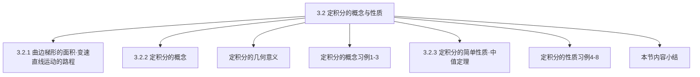

## 第3章 一元函数积分学

## 3.2 定积分

3.2.1 曲边梯形的面积•变速直线运动的路程
3.2.2 定积分的概念
3.2.3 定积分的简单性质•中值定理

## 3.2 定积分

定积分的概念与性质

## 一、曲边梯形的面积•变速直线运动的路程

## 实例1（求曲边梯形的面积）

曲边梯形由连续曲线 $y=f(x)(f(x) \geq 0)$ 、 $x$ 轴与两条直线 $x=a$ 、 $\boldsymbol{x}=\boldsymbol{b}$ 所围成。

思考方法：利用＂矩形面积 $=$ 底 × 高＂。

## 用矩形面积近似取代曲边梯形面积

（四个小矩形）

显然，小矩形越多，矩形总面积越接近曲边梯形面积。

## 观察下列演示过程，注意当分割加细时，矩形面积和与曲边三角形面积的关系。

## 3 个分割点的图示

1．（上和一下和）
1.05556 （积分近似值）

观察下列演示过程，注意当分割加细时，矩形面积和与曲边三角形面积的关系。

观察下列演示过程，注意当分割加细时，矩形面积和与曲边三角形面积的关系。

## 观察下列演示过程，注意当分割加细时，矩形面积和与曲边三角形面积的关系。

## 33 个分割点的图示

0.0909091 （上和—下゙和）
1.00046 （积分近似值）

## 观察下列演示过程，注意当分割加细时，矩形面积和与曲边三角形面积的关系。

## 43 个分割点的图示

0.0697674 （上和—下゙和）
1.00027 （积分近似值）

观察下列演示过程，注意当分割加细时，矩形面积和与曲边三角形面积的关系。

观察下列演示过程，注意当分割加细时，矩形面积和与曲边三角形面积的关系。

观察下列演示过程，注意当分割加细时，矩形面积和与曲边三角形面积的关系。

观察下列演示过程，注意当分割加细时，矩形面积和与曲边三角形面积的关系。

观察下列演示过程，注意当分割加细时，矩形面积和与曲边三角形面积的关系。

观察下列演示过程，注意当分割加细时，矩形面积和与曲边三角形面积的关系。

观察下列演示过程，注意当分割加细时，矩形面积和与曲边三角形面积的关系。

观察下列演示过程，注意当分割加细时，矩形面积和与曲边三角形面积的关系。

观察下列演示过程，注意当分割加细时，矩形面积和与曲边三角形面积的关系。

观察下列演示过程，注意当分割加细时，矩形面积和与曲边三角形面积的关系。

曲边梯形如图所示，
（1）在区间 $[a, b]$ 内插入若干个分点，
$a=x_{0}<x_{1}<x_{2}<\cdots<x_{n-1}<x_{n}=b$,
把区间 $[a, b]$ 分成 $n$
个小区间 $\left[x_{i-1}, x_{i}\right]$ ，
长度为 $\Delta x_{i}=x_{i}-x_{i-1}$ ；
（2）在每个小区间 $\left[x_{i-1}, x_{i}\right]$

上任取一点 $\xi_{i}$ ，以 $\left[x_{i-1}, x_{i}\right]$ 为底，$f\left(\xi_{i}\right)$ 为高的小矩形面积为

$$
f\left(\xi_{i}\right) \Delta x_{i} \approx A_{i}
$$

曲边梯形面积的近似值为

$$
A=\sum_{i=1}^{n} A_{i} \approx \sum_{i=1}^{n} f\left(\xi_{i}\right) \Delta x_{i}
$$

（3）当分割无限加细，即小区间的最大长度 $\lambda=\max \left\{\Delta x_{1}, \Delta x_{2}, \cdots \Delta x_{n}\right\}$ 趋近于零（ $\lambda \rightarrow 0$ ）时，曲边梯形面积为 $A=\lim _{\lambda \rightarrow 0} \sum_{i=1}^{n} f\left(\xi_{i}\right) \Delta x_{i}$

全过程为：分割、近似、求和、取极限．

## 实例2（求变速直线运动的路程）

设某物体作直线运动，已知速度 $v=v(t)$ 是时间间隔 $\left[T_{1}, T_{2}\right]$ 上 $t$ 的一个连续函数，且 $v(t) \geq 0$ ，求物体在这段时间内所经过的路程。

思路：把整段时间分割成若干小段，每小段上速度看作不变，求出各小段的路程再相加，便得到路程的近似值，最后通过对时间的无限细分过程求得路程的精确值．
（1）分割 $T_{1}=t_{0}<t_{1}<t_{2}<\cdots<t_{n-1}<t_{n}=T_{2}$
（2）求和 $s \approx \sum_{i=1}^{n} v\left(\tau_{i}\right) \Delta t_{i}$
（3）取极限 $\lambda=\max \left\{\Delta t_{1}, \Delta t_{2}, \cdots, \Delta t_{n}\right\}$
路程的精确值 $s=\lim _{\lambda \rightarrow 0} \sum_{i=1}^{n} v\left(\tau_{i}\right) \Delta t_{i}$

## 注意：上述两例的共同点

（1）所求量与一个函数及区间有关．
面积 $A----f(x)$ 与 $[a, b]$
路程 $S----v(t)$ 与 $\left[T_{1}, T_{2}\right]$
（2）变与不变的矛盾．
（3）处理方法一样：分割、近似求和、取极限．
（4）结果一样：都是同一形式的和式的极限．

## 二、定积分的概念、定积分的几何意义

1．定义 设函数 $f(x)$ 在 $[a, b]$ 上有界，
（1）在 $[\boldsymbol{a}, \boldsymbol{b}]$ 中任意插入若干个分点
$a=x_{0}<x_{1}<x_{2}<\cdots<x_{n-1}<x_{n}=b$
把区间 $[a, b]$ 分成 $n$ 个小区间，各小区间的长度依次为 $\Delta x_{i}=x_{i}-x_{i-1}, \quad(i=1,2, \cdots)$,
（2）在各小区间上任取一点 $\xi_{i}\left(\xi_{i} \in \Delta x_{i}\right)$ ，
作乘积 $f\left(\xi_{i}\right) \Delta x_{i}(i=1,2, \cdots)$
并作和 $S=\sum_{i=1}^{n} f\left(\xi_{i}\right) \Delta x_{i}$ ，
（3）记 $\lambda=\max \left\{\Delta x_{1}, \Delta x_{2}, \cdots, \Delta x_{n}\right\}$ ，如果不论对 $[a, b]$

怎样的分法，也不论在小区间 $\left[x_{i-1}, x_{i}\right]$ 上点 $\xi_{i}$ 怎样的取法，只要当 $\lambda \rightarrow 0$ 时，和 $S$ 总趋于确定的极限 $I$ ，我们称这个极限 $I$ 为函数 $f(x)$ 在区间 $[a, b]$ 上的定积分，记为

注意：（1）积分值仅与被积函数及积分区间有关，而与积分变量的字母无关。

$$
\int_{a}^{b} f(x) d x=\int_{a}^{b} f(t) d t=\int_{a}^{b} f(u) d u
$$

如果存在，它就是一个确定的数值！
（2）当函数 $f(x)$ 在区间 $[a, b]$ 上的定积分存在时，称 $f(x)$ 在区间 $[a, b]$ 上可积．
（3）规定：当 $a>b$ 时， $\int_{a}^{b} f(x) d x=-\int_{b}^{a} f(x) d x$ ，

$$
\text { 当 } a=b \text { 时, } \int_{a}^{b} f(x) d x=\int_{a}^{a} f(x) d x=0 \text {. }
$$

（4）当 $\lambda \rightarrow 0$ 时，$n \rightarrow \infty$ ；但 $n \rightarrow \infty$ 时不一定有 $\lambda \rightarrow 0$ ．
（5）曲边梯形的面积 $A=\int_{a}^{b} f(x) d x$ ，路程 $S=\int_{T_{1}}^{T_{2}} v(t) d t$ ．
（6）定义中区间的分法和 $\xi_{i}$ 的取法是任意的．
若对区间的不同的分法与 $\xi_{i}$ 的不同的取法所得到的积分和的极限不同或不 存在，则 $f(x)$ 在区间上不可积．

如Dirichlet函数的讨论．
若定积分存在，则可用特殊的区间分法和点的取法来计算定积分。
（7）定积分的存在性有以下两个定理（不加证明）

定理1 若 $f(x)$ 在 $[a, b]$ 上可积，则 $f(x)$ 在 $[a, b]$ 上有界．

定理2 若 $f(x)$ 在 $[a, b]$ 上满足下列条件之一，则 $f(x)$ 在 $[a, b]$ 上可积 ：
（1）$f(x)$ 在 $[a, b]$ 上连续；
（2）$f(x)$ 在 $[a, b]$ 上只有有限个第一类间 断点；
（3）$f(x)$ 在 $[a, b]$ 上单调．
（8）定积分是一个构造性的定义，可利用定义求一些简单函数的定积分；同时可利用定义求 $n$ 项和的极限。

$$
\begin{aligned}
\int_{a}^{b} f(x) d x & =\lim _{n \rightarrow \infty} \sum_{i=1}^{n} f\left[a+\frac{i(b-a)}{n}\right] \cdot \frac{b-a}{n} \\
\int_{0}^{1} f(x) d x & =\lim _{n \rightarrow \infty} \sum_{i=1}^{n} f\left(\frac{i}{n}\right) \cdot \frac{1}{n}
\end{aligned}
$$

## 2.定积分的几何意义

$f(x)>0, \int_{a}^{b} f(x) d x=\lim _{\lambda \rightarrow 0} \sum_{i=1}^{n} f\left(\xi_{i}\right) \Delta x_{i}=A \quad$ 曲边梯形的面积

$$
f(x)<0, \int_{a}^{b} f(x) d x=\lim _{\lambda \rightarrow 0} \sum_{i=1}^{n} f\left(\xi_{i}\right) \Delta x_{i}=-\lim _{\lambda \rightarrow 0} \sum_{i=1}^{n} f\left(\xi_{i}\right) \Delta x_{i}=-A
$$

曲边梯形的面积的负值

$$
\int_{a}^{b} f(x) d x=A_{1}-A_{2}+A_{3}-A_{4}
$$

几何意义：
它是介于 $x$ 轴、函数 $f(x)$ 的图形及两条直线 $x=a, x=b$ 之间的各部分面积的代数和。在 $x$ 轴上方的面积取正号；在 $x$ 轴下方的面积取负号。

## 3.定积分的概念习例

例1 利用定义计算定积分 $\int_{a}^{b} e^{x} d x$ 。

例2 已知 $\int_{0}^{1} \frac{1}{\sqrt{4-x^{2}}} d x=\frac{\pi}{6}$ ，求

$$
\lim _{n \rightarrow \infty}\left(\frac{1}{\sqrt{4 n^{2}-1^{2}}}+\frac{1}{\sqrt{4 n^{2}-2^{2}}}+\cdots+\frac{1}{\sqrt{4 n^{2}-n^{2}}}\right) .
$$

例3 利用定积分的定义计算 $\boldsymbol{y}=\boldsymbol{x}+\mathbf{1}, \boldsymbol{x}=\mathbf{1}$ ， $x=2, y=0$ 所围成的图形的面积。

例 1 利用定义计算定积分 $\int_{a}^{b} e^{x} d x$ ．
解（1）将 $[a, b]$ 分成 $n$ 等分，各小区间长度为 $\Delta x_{i}=\frac{b-a}{n}$ ，分点为 $x_{i}=a+\frac{i(b-a)}{n},(i=1,2, \cdots, n) ;$
（2）取 $\xi_{i}$ 为区间的右端点，即 $\xi_{i}=x_{i}=a+\frac{i(b-a)}{n}$ ，则

$$
\begin{aligned}
& \sum_{i=1}^{n} f\left(\xi_{i}\right) \Delta x_{i}=\sum_{i=1}^{n} e^{\xi_{i}} \Delta x_{i}=\sum_{i=1}^{n} e^{a+\frac{i(b-a)}{n}} \cdot \frac{b-a}{n} \\
& =\frac{b-a}{n} \cdot e^{a} \cdot \sum_{i=1}^{n} e^{\frac{i(b-a)}{n}}=\frac{b-a}{n} \cdot e^{a} \cdot \frac{e^{\frac{b-a}{n}}\left(1-e^{b-a}\right)}{1-e^{\frac{b-a}{n}}}
\end{aligned}
$$

$$
\begin{aligned}
\therefore \lim _{\lambda \rightarrow 0} \sum_{i=1}^{n} f\left(\xi_{i}\right) \Delta x_{i} & =\lim _{n \rightarrow \infty} \frac{b-a}{n} \cdot e^{a} \cdot \frac{e^{\frac{b-a}{n}}\left(e^{b-a}-1\right)}{e^{\frac{b-a}{n}}-1} \\
& =\lim _{n \rightarrow \infty} \frac{b-a}{n} \cdot e^{a} \cdot \frac{\left(e^{b-a}-1\right)}{\frac{b-a}{n}} \\
& =e^{b}-e^{a} \\
\therefore \int_{a}^{b} e^{x} d x=e^{b}-e^{a} & .
\end{aligned}
$$

例2 已知 $\int_{0}^{1} \frac{1}{\sqrt{4-x^{2}}} d x=\frac{\pi}{6}$ ，求

$$
\lim _{n \rightarrow \infty}\left(\frac{1}{\sqrt{4 n^{2}-1^{2}}}+\frac{1}{\sqrt{4 n^{2}-2^{2}}}+\cdots+\frac{1}{\sqrt{4 n^{2}-n^{2}}}\right) .
$$

解 $\lim _{n \rightarrow \infty}\left(\frac{1}{\sqrt{4 n^{2}-1^{2}}}+\frac{1}{\sqrt{4 n^{2}-2^{2}}}+\cdots+\frac{1}{\sqrt{4 n^{2}-n^{2}}}\right)$

$$
\begin{aligned}
& =\lim _{n \rightarrow \infty} \sum_{i=1}^{n} \frac{1}{\sqrt{4 n^{2}-i^{2}}}=\lim _{n \rightarrow \infty} \sum_{i=1}^{n} \frac{1}{\sqrt{4-\left(\frac{i}{n}\right)^{2}}} \cdot \frac{1}{n} \\
& =\int_{0}^{1} \frac{1}{\sqrt{4-x^{2}}} d x=\frac{\pi}{6}
\end{aligned}
$$

例3 利用定积分的定义计算 $\boldsymbol{y}=\boldsymbol{x}+\mathbf{1}, \boldsymbol{x}=\mathbf{1}$ ， $x=2, y=0$ 所围成的图形的面积．

解 依题意 $S=\int_{1}^{2}(x+1) d x$

$$
\begin{aligned}
& =\lim _{n \rightarrow \infty} \sum_{i=1}^{n}\left[\left(1+\frac{i}{n}\right)+1\right] \cdot \frac{1}{n} \\
& =\frac{5}{2} .
\end{aligned}
$$

## 三、定积分的简单性质•中值定理

性质1 $\int_{a}^{b}[f(x) \pm g(x)] d x=\int_{a}^{b} f(x) d x \pm \int_{a}^{b} g(x) d x$.
证

$$
\begin{aligned}
& \int_{a}^{b}[f(x) \pm g(x)] d x=\lim _{\lambda \rightarrow 0} \sum_{i=1}^{n}\left[f\left(\xi_{i}\right) \pm g\left(\xi_{i}\right)\right] \Delta x_{i} \\
& =\lim _{\lambda \rightarrow 0} \sum_{i=1}^{n} f\left(\xi_{i}\right) \Delta x_{i} \pm \lim _{\lambda \rightarrow 0} \sum_{i=1}^{n} g\left(\xi_{i}\right) \Delta x_{i} \\
& =\int_{a}^{b} f(x) d x \pm \int_{a}^{b} g(x) d x .
\end{aligned}
$$

（此性质可以推广到有限多个函数作和的情况）
（定积分对积分区间具有可加性）

性质2 $\int_{a}^{b} k f(x) d x=k \int_{a}^{b} f(x) d x \quad$（ $k$ 为常数）．
证 $\quad \int_{a}^{b} k f(x) d x=\lim _{\lambda \rightarrow 0} \sum_{i=1}^{n} k f\left(\xi_{i}\right) \Delta x_{i}$

$$
\begin{aligned}
& =\lim _{\lambda \rightarrow 0} k \sum_{i=1}^{n} f\left(\xi_{i}\right) \Delta x_{i}=k \lim _{\lambda \rightarrow 0} \sum_{i=1}^{n} f\left(\xi_{i}\right) \Delta x_{i} \\
& =k \int_{a}^{b} f(x) d x
\end{aligned}
$$

$$
\int_{a}^{b} f(x) d x=\int_{a}^{c} f(x) d x+\int_{c}^{b} f(x) d x .
$$

补充：不论 $a, b, c$ 的相对位置如何，上式总成立．
当 $a, b, c$ 的相对位置任意时，例如 $a<b<c$ ，
则有

$$
\begin{aligned}
\quad \int_{a}^{c} f(x) \mathrm{d} x & =\int_{a}^{b} f(x) \mathrm{d} x+\int_{b}^{c} f(x) \mathrm{d} x \\
\therefore \quad \int_{a}^{b} f(x) \mathrm{d} x & =\int_{a}^{c} f(x) \mathrm{d} x-\int_{b}^{c} f(x) \mathrm{d} x \\
& =\int_{a}^{c} f(x) \mathrm{d} x+\int_{c}^{b} f(x) \mathrm{d} x
\end{aligned}
$$

性质4 $\int_{\boldsymbol{a}}^{\boldsymbol{b}} \mathbf{1} \cdot \boldsymbol{d} \boldsymbol{x}=\int_{\boldsymbol{a}}^{\boldsymbol{b}} \boldsymbol{d} \boldsymbol{x}=\boldsymbol{b}-\boldsymbol{a} . \int_{a}^{b} c d x=c(b-a)$性质5 如果在区间 $[a, b]$ 上 $f(x) \geq 0$ ，

$$
\text { 则 } \int_{a}^{b} f(x) d x \geq 0 . \quad(a<b)
$$

证 $\because f(x) \geq 0, \therefore f\left(\xi_{i}\right) \geq 0,(i=1,2, \cdots, n)$

$$
\begin{aligned}
& \because \Delta x_{i} \geq 0, \quad \therefore \sum_{i=1}^{n} f\left(\xi_{i}\right) \Delta x_{i} \geq 0, \\
& \lambda=\max \left\{\Delta x_{1}, \Delta x_{2}, \cdots, \Delta x_{n}\right\} \\
& \therefore \int_{a}^{b} f(x) d x=\lim _{\lambda \rightarrow 0} \sum_{i=1}^{n} f\left(\xi_{i}\right) \Delta x_{i} \geq 0 .
\end{aligned}
$$

## 性质5的推论1：

（1）如果在区间 $[a, b]$ 上 $f(x) \leq g(x)$ ，则 $\int_{a}^{b} f(x) d x \leq \int_{a}^{b} g(x) d x . \quad(a<b)$
证

$$
\begin{aligned}
\because & f(x) \leq g(x), \quad \therefore g(x)-f(x) \geq 0, \\
\therefore & \int_{a}^{b}[g(x)-f(x)] d x \geq 0, \\
& \int_{a}^{b} g(x) d x-\int_{a}^{b} f(x) d x \geq 0,
\end{aligned}
$$

于是 $\int_{a}^{b} f(x) d x \leq \int_{a}^{b} g(x) d x$ ．

性质5的推论2：
（2）$\quad \int_{a}^{b} f(x) d x\left|\leq \int_{a}^{b}\right| f(x) d x . \quad(a<b)$
证 $\quad \because-|f(x)| \leq f(x) \leq|f(x)|$ ，

$$
\begin{aligned}
& \therefore-\int_{a}^{b}|f(x)| d x \leq \int_{a}^{b} f(x) d x \leq \int_{a}^{b}|f(x)| d x, \\
& \text { 即 }\left|\int_{a}^{b} f(x) d x\right| \leq \int_{a}^{b} |f(x)| d x .
\end{aligned}
$$

说明：$|f(x)|$ 在区间 $[a, b]$ 上的可积性是显然的．

性质6 设 $M$ 及 $m$ 分别是函数
$f(x)$ 在区间 $[a, b]$ 上的最大值及最小值，则 $m(b-a) \leq \int_{a}^{b} f(x) d x \leq M(b-a)$ ．

证 $\because m \leq f(x) \leq M$ ，

$$
\begin{aligned}
\therefore \int_{a}^{b} m d x & \leq \int_{a}^{b} f(x) d x \leq \int_{a}^{b} M d x, \\
m(b-a) & \leq \int_{a}^{b} f(x) d x \leq M(b-a) .
\end{aligned}
$$

（此性质可用于估计积分值的大致范围）

## 性质7（定积分中值定理）

如果函数 $f(x)$ 在闭区间 $[a, b]$ 上连续，则在积分区间 $[a, b]$ 上至少存在一个点 $\xi$ ，使 $\int_{a}^{b} f(x) d x=f(\xi)(b-a) . \quad(a \leq \xi \leq b)$

## 积分中值公式

证

$$
\begin{aligned}
& \because m(b-a) \leq \int_{a}^{b} f(x) d x \leq M(b-a) \\
& \therefore m \leq \frac{1}{b-a} \int_{a}^{b} f(x) d x \leq M
\end{aligned}
$$

由闭区间上连续函数的介值定理知

在区间 $[a, b]$ 上至少存在一个点 $\xi$ ，
使 $f(\xi)=\frac{1}{b-a} \int_{a}^{b} f(x) d x$ ，
即 $\int_{a}^{b} f(x) d x=f(\xi)(b-a) . \quad(a \leq \xi \leq b)$
积分中值公式的几何解释：

在区间 $[a, b]$ 上至少存在一个点 $\xi$ ，使得以区间 $[a, b]$ 为底边，以曲线 $y=f(x)$为曲边的曲边梯形的面积等于同一底边而高为 $\boldsymbol{f}(\boldsymbol{\xi})$的一个矩形的面积。

## 说明：

- 积分中值定理对 $a<b$ 或 $a>b$ 都成立．
- 可把 $\frac{\int_{a}^{b} f(x) \mathrm{d} x}{b-a}=f(\xi)$

理解为 $f(x)$ 在 $[a, b]$ 上的平均值．因

$$
\frac{\int_{a}^{b} f(x) \mathrm{d} x}{b-a}=\frac{1}{b-a} \lim _{n \rightarrow \infty} \sum_{i=1}^{n} f\left(\xi_{i}\right) \cdot \frac{b-a}{n}=\lim _{n \rightarrow \infty} \frac{1}{n} \sum_{i=1}^{n} f\left(\xi_{i}\right)
$$

故它是有限个数的平均值概念的推广．

例 4 比较积分值 $\int_{0}^{-2} e^{x} d x$ 和 $\int_{0}^{-2} x d x$ 的大小。
例 5 估计积分 $\int_{0}^{\pi} \frac{1}{3+\sin ^{3} x} d x$ 的值．
例6 不通过计算能否得出下面积分的值： $\int_{-1}^{1} x^{3} d x$ ．
例 7 设 $f(x)$ 可导，且 $\lim _{x \rightarrow+\infty} f(x)=1$ ，
求 $\lim _{x \rightarrow+\infty} \int_{x}^{x+2} t \sin \frac{3}{t} f(t) d t$ ．

例 4 比较积分值 $\int_{0}^{-2} e^{x} d x$ 和 $\int_{0}^{-2} x d x$ 的大小。
解

$$
\begin{aligned}
& \text { 令 } f(x)=e^{x}-x, \quad x \in[-2,0] \\
& \because f(x)>0, \quad \therefore \int_{-2}^{0}\left(e^{x}-x\right) d x>0, \\
& \therefore \int_{-2}^{0} e^{x} d x>\int_{-2}^{0} x d x,
\end{aligned}
$$

于是 $\int_{0}^{-2} e^{x} d x<\int_{0}^{-2} x d x$ 。

例 5 估计积分 $\int_{0}^{\pi} \frac{1}{3+\sin ^{3} x} d x$ 的值．
解

$$
\begin{aligned}
& f(x)=\frac{1}{3+\sin ^{3} x}, \quad \forall x \in[0, \pi] \\
& 0 \leq \sin ^{3} x \leq 1, \quad \frac{1}{4} \leq \frac{1}{3+\sin ^{3} x} \leq \frac{1}{3} \\
& \int_{0}^{\pi} \frac{1}{4} d x \leq \int_{0}^{\pi} \frac{1}{3+\sin ^{3} x} d x \leq \int_{0}^{\pi} \frac{1}{3} d x \\
& \therefore \frac{\pi}{4} \leq \int_{0}^{\pi} \frac{1}{3+\sin ^{3} x} d x \leq \frac{\pi}{3}
\end{aligned}
$$

例 6 不通过计算能否得出下面积分的值： $\int_{-1}^{1} x^{3} d x$ ．解 能！如图．

$$
\begin{aligned}
& \quad \int_{-1}^{0} x^{3} d x=-\int_{0}^{1} x^{3} d x, \\
& \therefore \quad \int_{-1}^{0} x^{3} d x+\int_{0}^{1} x^{3} d x=0 \\
& \text { 即 } \int_{-1}^{1} x^{3} d x=0 .
\end{aligned}
$$

例 7 设 $f(x)$ 可导，且 $\lim _{x \rightarrow+\infty} f(x)=1$ ，求 $\lim _{x \rightarrow+\infty} \int_{x}^{x+2} t \sin \frac{3}{t} f(t) d t$ ．

解 由积分中值定理知有 $\xi \in[x, x+2]$ ，使 $\int_{x}^{x+2} t \sin \frac{3}{t} f(t) d t=\xi \sin \frac{3}{\xi} f(\xi)(x+2-x)$ ，

$$
\begin{aligned}
& \lim _{x \rightarrow+\infty} \int_{x}^{x+2} t \sin \frac{3}{t} f(t) d t=2 \lim _{\xi \rightarrow+\infty} \xi \sin \frac{3}{\xi} f(\xi) \\
& =2 \lim _{\xi \rightarrow+\infty} 3 f(\xi)=6
\end{aligned}
$$

## 内 容 小 结

1．定积分的实质：特殊和式的极限．
2．定积分的思想和方法：

## 3.定积分的性质
