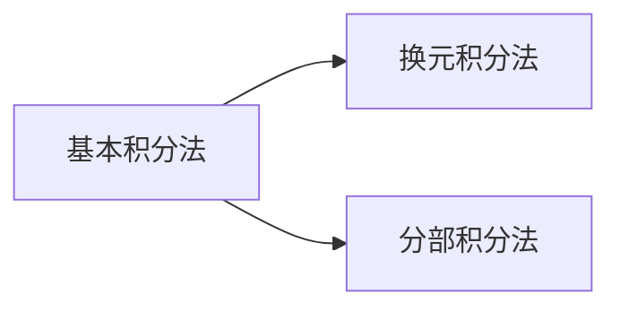

## 第3章 一元函数积分学

3.2 定积分

3.2.5 用换元法计算定积分
3.2.6 用分部积分法计算定积分

## 3.2 定积分

## 一、定积分的换元法

换元法的引入 考虑计算 $\int_{0}^{a} \sqrt{a^{2}-x^{2}} d x$ ，由Newton－Leibniz公式可分三步求得：

$$
\begin{gathered}
\int \sqrt{a^{2}-x^{2}} d x \xlongequal{x=a \sin t} \int a^{2} \cos ^{2} t d t=\frac{a^{2}}{2} t+\frac{a^{2}}{4} \sin 2 t+C \\
\xlongequal{t=\arcsin \frac{x}{a}} \frac{a^{2}}{2} \arcsin \frac{x}{a}+\frac{x}{2} \sqrt{a^{2}-x^{2}}+C \\
\int_{0}^{a} \sqrt{a^{2}-x^{2}} d x=\left[\frac{a^{2}}{2} \arcsin \frac{x}{a}+\frac{x}{2} \sqrt{a^{2}-x^{2}}\right]_{0}^{a}=\frac{\pi a^{2}}{4} \\
\int_{0}^{a} \sqrt{a^{2}-x^{2}} d x \xlongequal{x=a \sin t} \int_{0}^{\frac{\pi}{2}} a^{2} \cos ^{2} t d t=\left.\left(\frac{a^{2}}{2} t+\frac{a^{2}}{4} \sin 2 t\right)\right|_{0} ^{2}=\frac{\pi a^{2}}{4}
\end{gathered}
$$

定理 假设（1）$f(x)$ 在 $[a, b]$ 上连续；
（2）函数 $x=\varphi(t)$ 在 $[\alpha, \beta]$ 上是单值的且有连续导数；
（3）当 $t$ 在区间 $[\alpha, \beta]$ 上变化时，$x=\varphi(t)$ 的值在 $[a, b]$上变化，且 $\varphi(\alpha)=a 、 \varphi(\beta)=b$ ，则有 $\int_{a}^{b} f(x) d x=\int_{\alpha}^{\beta} f[\varphi(t)] \varphi^{\prime}(t) d t$ ．

证 设 $F(x)$ 是 $f(x)$ 的一个原函数，即 $F^{\prime}(x)=f(x)$ ，则 $\int_{a}^{b} f(x) d x=F(b)-F(a)$ ，

而 $F(x)$ 与 $x=\varphi(t)$ 可复合成函数 $\Phi(t)=F[\varphi(t)]$ ，且 $\Phi^{\prime}(t)=\frac{d F}{d x} \cdot \frac{d x}{d t}=f(x) \varphi^{\prime}(t)=f[\varphi(t)] \varphi^{\prime}(t)$,
$\therefore \Phi(t)$ 是 $f[\varphi(t)] \varphi^{\prime}(t)$ 的一个原函数．

$$
\begin{aligned}
\int_{\alpha}^{\beta} f[\varphi(t)] \varphi^{\prime}(t) d t=\Phi(\beta)-\Phi(\alpha) & =F[\varphi(\beta)]-F[\varphi(\alpha)] \\
& =F(b)-F(a)
\end{aligned}
$$

故结论成立。
（1）当 $\alpha>\beta$ 时，换元公式仍成立。
（2）$x=\varphi(t)$ 在 $[a, b]$ 上单值，从而使得每一个 $x \in[a, b]$都有唯一确定的 $t \in[\alpha, \beta]$ 与它相对应
（3）$a<b$ 时，未必 $\alpha<\beta$ ．
（4）在应用换元积分法时换元同时换限。
（5）此换元法对应于不定积分中的第二换元法；也可倒过来使用，这样就对应于第一换元法，即
$\int_{\alpha}^{\beta} f[\varphi(t)] \varphi^{\prime}(t) d t=\int_{a}^{b} f(x) d x$
令 $\varphi(t)=x$ ，且 $\varphi(\alpha)=a, \varphi(\beta)=b$

## 应用换元公式时应注意：

（1）用 $x=\varphi(t)$ 把变量 $x$ 换成新变量 $t$ 时，积分限也相应的改变。
（2）求出 $f[\varphi(t)] \varphi^{\prime}(t)$ 的一个原函数 $\Phi(t)$ 后，不必象计算不定积分那样再要把 $\Phi(t)$ 变换成原变量 $x$ 的函数，而只要把新变量 $t$ 的上、下限分别代 $\lambda \Phi(t)$ 然后相减就行了。

## 定积分换元法习例

例1 计算 $\int_{0}^{\frac{\pi}{2}} \cos ^{5} x \sin x d x$ ．

例2 计算 $\int_{0}^{\pi} \sqrt{\sin ^{3} x-\sin ^{5} x} d x$ ．
例3 计算 $\int_{\sqrt{e}}^{e^{\frac{3}{4}}} \frac{\boldsymbol{d x}}{\boldsymbol{x} \sqrt{\ln \boldsymbol{x}(\mathbf{1}-\boldsymbol{\ln} \boldsymbol{x})}}$ ．

例4 计算 $\int_{0}^{\frac{\pi}{2}} \frac{\cos x}{\sin x+\cos x} d x$ ．
例5 计算 $\int_{0}^{4} \frac{d x}{1+\sqrt{x}}$ ．

例6 计算 $\int_{0}^{a} \frac{1}{x+\sqrt{a^{2}-x^{2}}} d x . \quad(a>0)$
例7 证明：（1）若 $f(x)$ 在 $[-a, a]$ 上连续且为偶函数，则

$$
\int_{-a}^{a} f(x) d x=2 \int_{0}^{a} f(x) d x
$$

（2）若 $f(x)$ 在 $[-a, a]$ 上连续且为奇函数，则 $\int_{-a}^{a} f(x) d x=0$
（3）若 $\varphi(u)$ 连续，则 $\int_{-a}^{a} \varphi\left(x^{2}\right) d x=2 \int_{0}^{a} \varphi\left(x^{2}\right) d x$

例 8 计算 $\int_{-1}^{1} \frac{2 x^{2}+x \cos x}{1+\sqrt{1-x^{2}}} d x$ ．

例9 证明（1） $\int_{0}^{\frac{\pi}{2}} f(\sin x) d x=\int_{0}^{\frac{\pi}{2}} f(\cos x) d x$ ．
（2） $\int_{0}^{\pi} x f(\sin x) d x=\pi \int_{0}^{\frac{\pi}{2}} f(\sin x) d x$ ．
（3） $\int_{0}^{\pi} x f(\sin x) d x=\frac{\pi}{2} \int_{0}^{\pi} f(\sin x) d x$.
由此计算 $\int_{0}^{\pi} \frac{x \sin x}{1+\cos ^{2} x} d x$ ，其中 $f(x)$ 在 $[0,1]$ 上连续。
例10 设 $f(x)=\left\{\begin{array}{ll}\frac{1}{1+x} & x \geq 0 \\ \frac{1}{1+e^{x}} & x<0\end{array}\right.$ 求 $\int_{0}^{2} f(x-1) d x$ ．
例11 设 $f(x)$ 是以 $T$ 为周期的连续函数，证明 $\int_{a}^{a+T} f(x) d x$ 的值与 $a$ 无关

例1 计算 $\int_{0}^{\frac{\pi}{2}} \cos ^{5} x \sin x d x$ ．
解 令 $t=\cos x, d t=d \cos x=-\sin x d x$ ，

$$
\begin{aligned}
x=\frac{\pi}{2} \Rightarrow t=0, \quad x & =0 \Rightarrow t=1 \\
\int_{0}^{\frac{\pi}{2}} \cos ^{5} x \sin x d x & =-\int_{0}^{\frac{\pi}{2}} \cos ^{5} x d \cos x \\
& =-\int_{1}^{0} t^{5} d t=\int_{0}^{1} t^{5} d t \\
& =\left.\frac{t^{6}}{6}\right|_{0} ^{1}=\frac{1}{6} .
\end{aligned}
$$

例2 计算 $\int_{0}^{\pi} \sqrt{\sin ^{3} x-\sin ^{5} x} d x$ ．
解

$$
\begin{aligned}
& \because f(x)=\sqrt{\sin ^{3} x-\sin ^{5} x}=\left|\cos x(\sin x)^{\frac{3}{2}}\right| \\
& \therefore \int_{0}^{\pi} \sqrt{\sin ^{3} x-\sin ^{5} x} d x=\int_{0}^{\pi} \left|\cos x(\sin x)^{\frac{3}{2}}\right| d x \\
& =\int_{0}^{\frac{\pi}{2}} \cos x(\sin x)^{\frac{3}{2}} d x-\int_{\frac{\pi}{2}}^{\pi} \cos x(\sin x)^{\frac{3}{2}} d x \\
& =\int_{0}^{\frac{\pi}{2}}(\sin x)^{\frac{3}{2}} d \sin x-\int_{\frac{\pi}{2}}^{\pi}(\sin x)^{\frac{3}{2}} d \sin x \\
& =\left.\frac{2}{5}(\sin x)^{\frac{5}{2}}\right|_{0} ^{\frac{\pi}{2}}-\left.\frac{2}{5}(\sin x)^{\frac{5}{2}}\right|_{\frac{\pi}{2}} ^{\pi}=\frac{4}{5} .
\end{aligned}
$$

例3 计算 $\int_{\sqrt{e}}^{e^{\frac{3}{4}}} \frac{d x}{x \sqrt{\ln x(1-\ln x)}}$ ．

解

$$
\begin{aligned}
& \text { 原式 }=\int_{\sqrt{e}}^{e^{\frac{3}{4}}} \frac{d(\ln x)}{\sqrt{\ln x(1-\ln x)}} \\
= & \int_{\sqrt{e}}^{e^{\frac{3}{4}}} \frac{d(\ln x)}{\sqrt{\ln x} \sqrt{(1-\ln x)}}=2 \int_{\sqrt{e}}^{e^{\frac{3}{4}}} \frac{d \sqrt{\ln x}}{\sqrt{1-(\sqrt{\ln x})^{2}}} \\
= & 2[\arcsin (\sqrt{\ln x})]_{\sqrt{e}}^{e^{\frac{3}{4}}}=\frac{\pi}{6} .
\end{aligned}
$$

例4 计算 $\int_{0}^{\frac{\pi}{2}} \frac{\cos x}{\sin x+\cos x} d x$ ．
解 原式 $\xlongequal{x=\frac{\pi}{2}-t} \int_{\frac{\pi}{2}}^{0} \frac{\sin t}{\sin t+\cos t}(-d t)$

$$
\begin{aligned}
& =\int_{0}^{\frac{\pi}{2}} \frac{\sin t}{\sin t+\cos t} d t \\
& =\frac{1}{2} \int_{0}^{\frac{\pi}{2}} \frac{\sin t+\cos t}{\sin t+\cos t} d t=\frac{1}{2} \cdot \frac{\pi}{2}=\frac{\pi}{4}
\end{aligned}
$$

例5 计算 $\int_{0}^{4} \frac{d x}{1+\sqrt{x}}$ ．
解 $\quad \int_{0}^{4} \frac{d x}{1+\sqrt{x}} \xlongequal{\sqrt{x}=t} \int_{0}^{2} \frac{2 t}{1+t} d t$

$$
\begin{aligned}
& =2 \int_{0}^{2}\left(1-\frac{1}{1+t}\right) d t \\
& =\left.2(t-\ln (1+t))\right|_{0} ^{2}=2(2-\ln 3)
\end{aligned}
$$

例6 计算 $\int_{0}^{a} \frac{1}{x+\sqrt{a^{2}-x^{2}}} d x . \quad(a>0)$
解 令 $x=a \sin t, \quad d x=a \cos t d t$ ，

$$
\begin{aligned}
& x=a \Rightarrow t=\frac{\pi}{2}, \quad x=0 \Rightarrow t=0, \\
& \text { 原式 }=\int_{0}^{\frac{\pi}{2}} \frac{a \cos t}{a \sin t+\sqrt{a^{2}\left(1-\sin ^{2} t\right)}} d t \\
= & \int_{0}^{\frac{\pi}{2}} \frac{\cos t}{\sin t+\cos t} d t=\frac{1}{2} \int_{0}^{\frac{\pi}{2}}\left(1+\frac{\cos t-\sin t}{\sin t+\cos t}\right) d t \\
= & \frac{1}{2} \cdot \frac{\pi}{2}+\frac{1}{2}[\ln |\sin t+\cos t|]_{0}^{\frac{\pi}{2}}=\frac{\pi}{4} .
\end{aligned}
$$

例 7 证明：（1）若 $f(x)$ 在 $[-a, a]$ 上连续且为偶函数，则

$$
\int_{-a}^{a} f(x) d x=2 \int_{0}^{a} f(x) d x
$$

（2）若 $f(x)$ 在 $[-a, a]$ 上连续且为奇函数，则 $\int_{-a}^{a} f(x) d x=0$
（3）若 $\varphi(u)$ 连续，则 $\int_{-a}^{a} \varphi\left(x^{2}\right) d x=2 \int_{0}^{a} \varphi\left(x^{2}\right) d x$
证

$$
\begin{aligned}
& \text { (1) } \int_{-a}^{a} f(x) d x=\int_{-a}^{0} f(x) d x+\int_{0}^{a} f(x) d x \\
& \stackrel{x=-t}{=} \int_{a}^{0} f(-t)(-d t)+\int_{0}^{a} f(x) d x=2 \int_{0}^{a} f(x) d x
\end{aligned}
$$

$$
\text { (2) } \begin{aligned}
\int_{-a}^{a} f(x) d x & =\int_{-a}^{0} f(x) d x+\int_{0}^{a} f(x) d x \\
& =\int_{a}^{0} f(-t)(-d t)+\int_{0}^{a} f(x) d x=0
\end{aligned}
$$

（3）$\varphi\left(x^{2}\right)$ 为 $[-a, a]$ 上连续的偶函数，由（1）结论成立。

例8 计算 $\int_{-1}^{1} \frac{2 x^{2}+x \cos x}{1+\sqrt{1-x^{2}}} d x$ ．

解

$$
\begin{aligned}
& \text { 原式 }=\int_{-1}^{1} \sqrt{\frac{2 x^{2}}{1+\sqrt{1-x^{2}}}} d x+\int_{-1}^{1} \frac{x \cos x}{1+\sqrt{1-x^{2}}} d x \\
& =4 \int_{0}^{1} \frac{x^{2}}{1+\sqrt{1-x^{2}}} d x=4 \int_{0}^{1} \frac{x^{2}\left(1-\sqrt{1-x^{2}}\right)}{1-\left(1-x^{2}\right)} d x \\
& =4 \int_{0}^{1}\left(1-\sqrt{1-x^{2}}\right) d x=4-4 \int_{0}^{1} \sqrt{1-x^{2}} d x \\
& =4-\pi . \\
& \text { 单位圆的面积 }
\end{aligned}
$$

例9 证明（1） $\int_{0}^{\frac{\pi}{2}} f(\sin x) d x=\int_{0}^{\frac{\pi}{2}} f(\cos x) d x$ ．
（2） $\int_{0}^{\pi} x f(\sin x) d x=\pi \int_{0}^{\frac{\pi}{2}} f(\sin x) d x$ ．
（3） $\int_{0}^{\pi} x f(\sin x) d x=\frac{\pi}{2} \int_{0}^{\pi} f(\sin x) d x$.
由此计算 $\int_{0}^{\pi} \frac{x \sin x}{1+\cos ^{2} x} d x$ ，其中 $f(x)$ 在 $[0,1]$ 上连续。
证（1）令 $x=\frac{\pi}{2}-t, \Rightarrow d x=-d t$ ，

$$
\begin{aligned}
& \int_{0}^{\frac{\pi}{2}} f(\sin x) d x=-\int_{\frac{\pi}{2}}^{0} f\left[\sin \left(\frac{\pi}{2}-t\right)\right] d t \\
& =\int_{0}^{\frac{\pi}{2}} f(\cos t) d t=\int_{0}^{\frac{\pi}{2}} f(\cos x) d x
\end{aligned}
$$

$$
\begin{aligned}
(2) \text { 令 } x=\frac{\pi}{2}-t, & \Rightarrow d x=-d t, \\
\int_{0}^{\pi} x f(\sin x) d x & =-\int_{\frac{\pi}{2}}^{-\frac{\pi}{2}}\left(\frac{\pi}{2}-t\right) \cdot f\left[\sin \left(\frac{\pi}{2}-t\right)\right] d t \\
& =\int_{-\frac{\pi}{2}}^{\frac{\pi}{2}}\left(\frac{\pi}{2}-t\right) \cdot f(\cos t) d t \\
& =\int_{-\frac{\pi}{2}}^{\frac{\pi}{2}} \frac{\pi}{2} f(\cos t) d t-\int_{-\frac{\pi}{2}}^{\frac{\pi}{2}} t f(\cos t) d t \\
& =2 \int_{0}^{\frac{\pi}{2}} \frac{\pi}{2} f(\cos t) d t-0 \\
& =\pi \int_{0}^{\frac{\pi}{2}} f(\cos t) d t=\pi \int_{0}^{\frac{\pi}{2}} f(\sin x) d x .
\end{aligned}
$$

（3）令 $x=\pi-t, d x=-d t$

$$
\begin{aligned}
\int_{0}^{\pi} x f(\sin x) d x & =\int_{\pi}^{0}(\pi-t) f(\sin t)(-d t) \\
& =\int_{0}^{\pi}(\pi-t) f(\sin t) d t \\
& =\pi \int_{0}^{\pi} f(\sin t) d t-\int_{0}^{\pi} t f(\sin t) d t
\end{aligned}
$$

$$
\therefore \int_{0}^{\pi} x f(\sin x) d x=\frac{\pi}{2} \int_{0}^{\pi} f(\sin x) d x
$$

从而 $\int_{0}^{\pi} \frac{x \sin x}{1+\cos ^{2} x} d x=\frac{\pi}{2} \int_{0}^{\pi} \frac{\sin x}{1+\cos ^{2} x} d x=-\frac{\pi}{2} \int_{0}^{\pi} \frac{d \cos x}{1+\cos ^{2} x}$

$$
\left.=-\frac{\pi}{2} \underset{\text { (2) (A) (A) }}{\arctan (\cos x)}\right)_{0}^{\pi}=\frac{\pi^{2}}{4} .
$$

例10 设 $f(x)=\left\{\begin{array}{cc}\frac{1}{1+x} & x \geq 0 \\ \frac{1}{1+e^{x}} & x<0\end{array}\right.$ 求 $\int_{0}^{2} f(x-1) d x$ ．
解 $\because \int_{0}^{2} f(x-1) d x \xlongequal{x-1=t} \int_{-1}^{1} f(t) d t=\int_{-1}^{0} \frac{d x}{1+e^{x}}+\int_{0}^{1} \frac{d x}{1+x}$

$$
\begin{aligned}
& \xlongequal[e^{x}=u]{\int_{\frac{1}{e}}^{1} \frac{d u}{(1+u) u}+\left.\ln (1+x)\right|_{0} ^{1}=\ln \frac{u}{1+u \frac{1}{e}}+\ln 2} \\
& =\ln (e+1)
\end{aligned}
$$

例11设 $f(x)$ 是以 $T$ 为周期的连续函数，证明 $\int_{a}^{a+T} f(x) d x$ 的值与 $a$ 无关。
证 $\quad \because \int_{a}^{a+T} f(x) d x=\int_{a}^{T} f(x) d x+\int_{T}^{a+T} f(x) d x$

$$
\begin{aligned}
& \xlongequal{x=T+t} \int_{a}^{T} f(x) d x+\int_{0}^{a} f(t+T) d t \\
& =\int_{0}^{a} f(t) d t+\int_{a}^{T} f(t) d t \\
& =\int_{0}^{T} f(t) d t=\int_{0}^{T} f(x) d x
\end{aligned}
$$

## 二、定积分的分部积分法

定理 设函数 $u(x) 、 v(x)$ 在区间 $[a, b]$ 上具有连续
导数，则有 $\int_{a}^{b} u d v=[u v]_{a}^{b}-\int_{a}^{b} v d u$ 。
定积分的分部积分公式
证 $\quad(u v)^{\prime}=u^{\prime} v+u v^{\prime}$ ，

$$
\begin{aligned}
& \int_{a}^{b}(u v)^{\prime} d x=[u v]_{a}^{b} \\
& {[u v]_{a}^{b}=\int_{a}^{b} u^{\prime} v d x+\int_{a}^{b} u v^{\prime} d x } \\
\therefore & \int_{a}^{b} u d v=[u v]_{a}^{b}-\int_{a}^{b} v d u
\end{aligned}
$$

## 定积分的分部积分法习例

例12 计算 $\int_{0}^{1} e^{\sqrt{x}} d x$
例13 若 $f^{\prime \prime}(x)$ 为 $[a, b]$ 上的连续函数，则

$$
\int_{a}^{b} x f^{\prime \prime}(x) d x=\left[b f^{\prime}(b)-f(b)\right]-\left[a f^{\prime}(a)-f(a)\right]
$$

例14 计算 $\int_{0}^{\frac{1}{2}} \arcsin x d x$ ．

例15 计算 $\int_{0}^{\frac{\pi}{4}} \frac{x d x}{1+\cos 2 x}$ ．
例16计算 $\int_{0}^{\mathbf{1}} \frac{\ln (\mathbf{1}+\boldsymbol{x})}{(\mathbf{2}+\boldsymbol{x})^{\mathbf{2}}} \boldsymbol{d} \boldsymbol{x}$ ．

例17 设 $f(x)=\int_{1}^{x^{2}} \frac{\sin t}{t} d t$ ，求 $\int_{0}^{1} x f(x) d x$ ．
例18 计算 $I_{n}=\int_{0}^{\frac{\pi}{2}} \sin ^{n} x d x=\int_{0}^{\frac{\pi}{2}} \cos ^{n} x d x$ ．
例19 证明 $\int_{0}^{x}\left[\int_{0}^{u} f(x) d x\right] d u=\int_{0}^{x} f(u)(x-u) d u$ ．

例12计算 $\int_{0}^{1} e^{\sqrt{x}} d x$

解

$$
\begin{aligned}
\int_{0}^{1} e^{\sqrt{x}} d x & \underset{d x=2 t d t}{\stackrel{\sqrt{x}=t}{x}} \int_{0}^{1} 2 t e^{t} d t \\
& =\int_{0}^{1} 2 t d e^{t} \\
& =\left.2 t e^{t}\right|_{0} ^{1}-2 \int_{0}^{1} e^{t} d t \\
& =\left.2\left(t e^{t}-e^{t}\right)\right|_{0} ^{1}=2
\end{aligned}
$$

例13 若 $f^{\prime \prime}(x)$ 为 $[a, b]$ 上的连续函数，则

$$
\int_{a}^{b} x f^{\prime \prime}(x) d x=\left[b f^{\prime}(b)-f(b)\right]-\left[a f^{\prime}(a)-f(a)\right]
$$

证

$$
\begin{aligned}
\because \int_{a}^{b} x f^{\prime \prime}(x) d x & =\int_{a}^{b} x d f^{\prime}(x) \\
& =\left.x f^{\prime}(x)\right|_{a} ^{b}-\int_{a}^{b} f^{\prime}(x) d x \\
& =\left.x f^{\prime}(x)\right|_{a} ^{b}-\left.f(x)\right|_{a} ^{b} \\
& =\left[b f^{\prime}(b)-f(b)\right]-\left[a f^{\prime}(a)-f(a)\right] .
\end{aligned}
$$

例14 计算 $\int_{0}^{\frac{1}{2}} \arcsin x d x$ 。
解 令 $u=\arcsin x, d v=d x$ ，

$$
\begin{aligned}
\text { 则 } d u & =\frac{d x}{\sqrt{1-x^{2}}}, \quad v=x, \\
\int_{0}^{\frac{1}{2}} \arcsin x d x & =[x \arcsin x]_{0}^{\frac{1}{2}}-\int_{0}^{\frac{1}{2}} \frac{x d x}{\sqrt{1-x^{2}}} \\
& =\frac{1}{2} \cdot \frac{\pi}{6}+\frac{1}{2} \int_{0}^{\frac{1}{2}} \frac{1}{\sqrt{1-x^{2}}} d\left(1-x^{2}\right) \\
& =\frac{\pi}{12}+\left[\sqrt{1-x^{2}}\right]_{0}^{\frac{1}{2}}=\frac{\pi}{12}+\frac{\sqrt{3}}{2}-1 .
\end{aligned}
$$

例15 计算 $\int_{0}^{\frac{\pi}{4}} \frac{x d x}{1+\cos 2 x}$ ．
解

$$
\begin{aligned}
& \because 1+\cos 2 x=2 \cos ^{2} x \\
& \therefore \int_{0}^{\frac{\pi}{4}} \frac{x d x}{1+\cos 2 x}=\int_{0}^{\frac{\pi}{4}} \frac{x d x}{2 \cos ^{2} x}=\int_{0}^{\frac{\pi}{4}} \frac{x}{2} d(\tan x) \\
& \quad=\frac{1}{2}[x \tan x]_{0}^{\frac{\pi}{4}}-\frac{1}{2} \int_{0}^{\frac{\pi}{4}} \tan x d x \\
& \quad=\frac{\pi}{8}+\frac{1}{2}[\ln \cos x]_{0}^{\frac{\pi}{4}}=\frac{\pi}{8}-\frac{\ln 2}{4} .
\end{aligned}
$$

例16 计算 $\int_{0}^{1} \frac{\ln (1+x)}{(2+x)^{2}} d x$ ．
解

$$
\begin{aligned}
& \int_{0}^{1} \frac{\ln (1+x)}{(2+x)^{2}} d x=-\int_{0}^{1} \ln (1+x) d \frac{1}{2+x} \\
= & -\left[\frac{\ln (1+x)}{2+x}\right]_{0}^{1}+\int_{0}^{1} \frac{1}{2+x} d \ln (1+x) \\
= & -\frac{\ln 2}{3}+\int_{0}^{1} \frac{1}{2+x} \cdot \frac{1}{1+x} d x \frac{1}{1+x}-\frac{1}{2+x} \\
= & -\frac{\ln 2}{3}+[\ln (1+x)-\ln (2+x)]_{0}^{1}=\frac{5}{3} \ln 2-\ln 3 .
\end{aligned}
$$

例17 设 $f(x)=\int_{1}^{x^{2}} \frac{\sin t}{t} d t$ ，求 $\int_{0}^{1} x f(x) d x$ ．
解 因为 $\frac{\sin t}{t}$ 没有初等函数形式的原函数，无法直接求出 $f(x)$ ，所以采用分部积分法

$$
\begin{aligned}
& \int_{0}^{1} x f(x) d x=\frac{1}{2} \int_{0}^{1} f(x) d x^{2}=\frac{1}{2}\left[x^{2} f(x)\right]_{0}^{1}-\frac{1}{2} \int_{0}^{1} x^{2} d f(x) \\
& =\frac{1}{2} f(1)-\frac{1}{2} \int_{0}^{1} x^{2} f^{\prime}(x) d x\left(f^{\prime}(x)=\frac{\sin x^{2}}{x^{2}} \cdot 2 x=\frac{2 \sin x^{2}}{x}\right) \\
& =0-\frac{1}{2} \int_{0}^{1} 2 x \sin x^{2} d x=-\frac{1}{2} \int_{0}^{1} \sin x^{2} d x^{2} \\
& =\frac{1}{2}\left[\cos x^{2}\right]_{0}^{1}=\frac{1}{2}(\cos 1-1)
\end{aligned}
$$

例18 计算 $I_{n}=\int_{0}^{\pi} \sin ^{n} x d x=\int_{0}^{\pi} \cos ^{n} x d x$ ．
解 $I_{n}=\int_{0}^{\frac{\pi}{2}} \sin ^{n-1} x d(-\cos x)$

$$
\begin{aligned}
& =-\left.\cos x \cdot \sin ^{n-1} x\right|_{0} ^{\frac{\pi}{2}}+\int_{0}^{\frac{\pi}{2}}(n-1) \sin ^{n-2} x \cdot \cos ^{2} x d x \\
& =(n-1) \int_{0}^{\frac{\pi}{2}} \sin ^{n-2} x\left(1-\sin ^{2} x\right) d x \\
& =(n-1) \int_{0}^{\frac{\pi}{2}}\left(\sin ^{n-2} x-\sin ^{n} x\right) d x \\
& =(n-1) I_{n-2}-(n-1) I_{n} \quad \therefore I_{n}=\frac{n-1}{(3)} I_{n-2}
\end{aligned}
$$

$$
\begin{aligned}
& I_{2 m}=\frac{2 m-1}{2 m} I_{2 m-2}=\frac{2 m-1}{2 m} \cdot \frac{2 m-3}{2 m-2} \cdot \frac{2 m-5}{2 m-4} \cdots \cdot \frac{5}{6} \cdot \frac{3}{4} \cdot \frac{1}{2} I_{0} \\
& I_{2 m+1}=\frac{2 m}{2 m+1} I_{2 m-1}=\frac{2 m}{2 m+1} \cdot \frac{2 m-2}{2 m-1} \cdot \frac{2 m-4}{2 m-3} \cdots \cdots \frac{6}{7} \cdot \frac{4}{5} \cdot \frac{2}{3} I_{1}
\end{aligned}
$$

又 $I_{0}=\int_{0}^{\frac{\pi}{2}} d x=\frac{\pi}{2}, I_{1}=\int_{0}^{\frac{\pi}{2}} \sin x d x=1$
$\therefore I_{n}= \begin{cases}\frac{n-1}{n} \cdot \frac{n-3}{n-2} \cdots \cdots \frac{3}{4} \cdot \frac{1}{2} \cdot \frac{\pi}{2} & n \text { 为正偶数 } \\ \frac{n-1}{n} \cdot \frac{n-3}{n-2} \cdots \cdot \cdot \frac{4}{5} \cdot \frac{2}{3} \cdot 1 & n \text { 为大于 } 1 \text { 的正奇数 }\end{cases}$

例19 证明 $\int_{0}^{x}\left[\int_{0}^{u} f(x) d x\right] d u=\int_{0}^{x} f(u)(x-u) d u$ ．证 $\because \frac{d}{d u} \int_{0}^{u} f(x) d x=f(u)$ ，由分部积分公式得，

$$
\begin{aligned}
\int_{0}^{x}\left[\int_{0}^{u} f(x) d x\right] d u & =\left[u \int_{0}^{u} f(x) d x\right]_{0}^{x}-\int_{0}^{x} u f(u) d u \\
& =x \int_{0}^{x} f(x) d x-\int_{0}^{x} u f(u) d u \\
& =x \int_{0}^{x} f(u) d u-\int_{0}^{x} u f(u) d u \\
& =\int_{0}^{x}(x-u) f(u) d u
\end{aligned}
$$

## 内容小结

基本积分法

换元必换限配元不换限边积边代限

:    （2）（10）（16）（8）
