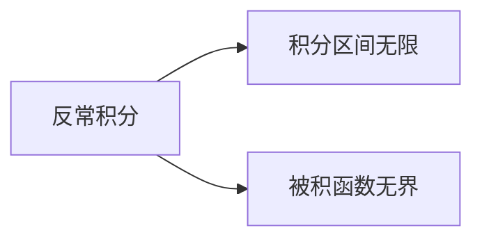

## 第3章 一元函数积分学

## 3.2 定积分

## 3.2.7 广义积分

## 3.2 定积分

我们前面讨论的积分是在有限区间上的有界函数的积分。在科学技术和工程中，往往需要计算无穷区间上的积分或者计算不满足有界条件的函数的积分，有时还需计算不满足有界条件的函数在无穷区间上的积分。这就需要我们将定积分的概念及其计算方法进行推广。

我们将运用极限的方法来完成这个工作。

引例1．曲线 $y=\frac{1}{x^{2}}$ 和直线 $x=1$ 及 $x$ 轴所围成的开口曲边梯形的面积 可记作

$$
A=\int_{1}^{+\infty} \frac{\mathrm{d} x}{x^{2}}
$$

其含义可理解为

$$
\begin{aligned}
A & =\lim _{b \rightarrow+\infty} \int_{1}^{b} \frac{\mathrm{~d} x}{x^{2}}=\lim _{b \rightarrow+\infty}\left(-\frac{1}{x}\right)_{1}^{b} \\
& =\lim _{b \rightarrow+\infty}\left(1-\frac{1}{b}\right)=1
\end{aligned}
$$

引例2：曲线 $y=\frac{1}{\sqrt{x}}$ 与 $x$ 轴，$y$ 轴和直线 $x=1$ 所围成的开口曲边梯形的面积可记作

$$
A=\int_{0}^{1} \frac{\mathrm{~d} x}{\sqrt{x}}
$$

其含义可理解为

$$
\begin{aligned}
A & =\lim _{\varepsilon \rightarrow 0^{+}} \int_{\varepsilon}^{1} \frac{\mathrm{~d} x}{\sqrt{x}}=\left.\lim _{\varepsilon \rightarrow 0^{+}} 2 \sqrt{x}\right|_{\varepsilon} ^{1} \\
& =\lim _{\varepsilon \rightarrow 0^{+}} 2(1-\sqrt{\varepsilon})=2
\end{aligned}
$$

## 一、无穷积分

其形式有： $\int_{a}^{+\infty} f(x) d x, \int_{-\infty}^{b} f(x) d x, \int_{-\infty}^{+\infty} f(x) d x$ ，定义 1：设函数 $f(x)$ 在区间 $[a,+\infty)$ 上连续，取 $b>a$ ，如果极限 $\lim _{b \rightarrow+\infty} \int_{a}^{b} f(x) d x$ 存在，则称此极限为函数 $f(x)$ 在无穷区间 $[a,+\infty)$ 上的积分，记作 $\int_{a}^{+\infty} f(x) d x$ ．

$$
\int_{a}^{+\infty} f(x) d x=\lim _{b \rightarrow+\infty} \int_{a}^{b} f(x) d x
$$

当极限存在时，称无穷积分收敛；当极限不存在时，称无穷积分发散．

定义 2：设函数 $f(x)$ 在区间 $(-\infty, b]$ 上连续，取 $a<b$ ，如果极限 $\lim _{a \rightarrow-\infty} \int_{a}^{b} f(x) d x$ 存在，则称此极限为函数 $f(x)$ 在无穷区间 $(-\infty, b]$ 上的积分，记作 $\int_{-\infty}^{b} f(x) d x$ ．

$$
\int_{-\infty}^{b} f(x) d x=\lim _{a \rightarrow-\infty} \int_{a}^{b} f(x) d x
$$

当极限存在时，称无穷积分收敛；当极限不存在时，称无穷积分发散。

定义 3：设函数 $f(x)$ 在区间 $(-\infty,+\infty)$ 上连续，如果无穷积分 $\int_{-\infty}^{0} f(x) d x$ 和 $\int_{0}^{+\infty} f(x) d x$ 都收敛，则称上述两无穷积分之和为函数 $f(x)$ 在无穷区间 $(-\infty,+\infty)$ 上的无穷积分，记作 $\int_{-\infty}^{+\infty} f(x) d x$ ．

$$
\begin{aligned}
\int_{-\infty}^{+\infty} f(x) d x & =\int_{-\infty}^{0} f(x) d x+\int_{0}^{+\infty} f(x) d x \\
& =\lim _{a \rightarrow-\infty} \int_{a}^{0} f(x) d x+\lim _{b \rightarrow+\infty} \int_{0}^{b} f(x) d x
\end{aligned}
$$

极限存在称无穷积分收敛；否则称无穷积分发散．

按无穷积分的定义：

$$
\begin{aligned}
\int_{-\infty}^{+\infty} f(x) \mathrm{d} x & =\int_{-\infty}^{c} f(x) \mathrm{d} x+\int_{c}^{+\infty} f(x) \mathrm{d} x \\
& =\lim _{a \rightarrow-\infty} \int_{a}^{c} f(x) \mathrm{d} x+\lim _{b \rightarrow+\infty} \int_{c}^{b} f(x) \mathrm{d} x
\end{aligned}
$$

等号右边的两项的极限过程是相互独立的，即 $a$ 与 $b$ 的变化不要求一致。

在数学物理问题中，经常遇到要求 $a$ 与 $b$ 变化一致的情形，即需要考虑 $b=-a$ 的特殊情形。

## 无穷积分的柯西主值

设函数 $f(x)$ 在 $(-\infty,+\infty)$ 上有定义．
$\forall a \in R, a>0, f(x) \in R([-a, a])$ 。记

$$
\text { V.P. } \int_{-\infty}^{+\infty} f(x) \mathrm{d} x=\lim _{a \rightarrow+\infty} \int_{-a}^{a} f(x) \mathrm{d} x,
$$

称之为 $f(x)$ 在 $(-\infty,+\infty)$ 上的无穷积分的柯西主值．
若式中的极限存在，则称此无穷积分在柯西主值意义下收敛，极限值即为柯西主值意义下的无穷积分值；若式中极限不存在，则称该无穷积分在柯西主值意义下发散。

## 讨论无穷积分 $\int_{-\infty}^{+\infty} \sin x \mathrm{~d} x$ 的敛散性

和柯西主值意义下的发散性。
解 因为 $\int_{0}^{+\infty} \sin x \mathrm{~d} x=\lim _{b \rightarrow+\infty} \int_{0}^{b} \sin x \mathrm{~d} x=\left.\lim _{b \rightarrow+\infty}(-\cos x)\right|_{0} ^{b}=1-\lim _{b \rightarrow+\infty} \cos b$ ，
而 $\lim _{b \rightarrow+\infty} \cos b$ 不存在，故积分 $\int_{0}^{+\infty} \sin x \mathrm{~d} x$ 发散。
从而，无穷积分 $\int_{-\infty}^{+\infty} \sin x \mathrm{~d} x$ 发散。
又 V．P． $\int_{-\infty}^{+\infty} \sin x \mathrm{~d} x=\lim _{A \rightarrow+\infty} \int_{-A}^{A} \sin x \mathrm{~d} x=0$ ，奇函数

故无穷积分 $\int_{-\infty}^{+\infty} \sin x \mathrm{~d} x$ 在柯西主值意义下收敛。
由此例想到一点什么没有？

该例说明：

## 无穷积分在柯西主值意义下收敛时，它本身不一定收敛。

由 $\int_{-\infty}^{+\infty} f(x) \mathrm{d} x$ 与V．P． $\int_{-\infty}^{+\infty} f(x) \mathrm{d} x$ 的定义可知：
若 $\int_{-\infty}^{+\infty} f(x) \mathrm{d} x$ 收敛，则V．P． $\int_{-\infty}^{+\infty} f(x) \mathrm{d} x$ 必收敛。
注意：对反常积分，只有在收敛的条件下才能使用 ＂偶倍奇零＂的性质，否则会出现错误。

## 无穷积分计算习例

例2 计算 $\int_{5}^{+\infty} \frac{d x}{x(x+15)}$ ．
例3 证明 $\int_{1}^{+\infty} \frac{d x}{x^{p}}$ ，当 $p>1$ 时收敛，当 $p \leq 1$ 时发散。

例4 计算无穷积分 $\int_{-\infty}^{+\infty} \frac{d x}{1+x^{2}}$ ．

例5 证明无穷积分 $\int_{a}^{+\infty} e^{-p x} d x$ 当 $p>0$ 时收敛，当 $p<0$ 时发散．
例6计算 $\int_{0}^{+\infty} x^{n} e^{-x} d x$（ $n$ 为自然数）．

例2 计算 $\int_{5}^{+\infty} \frac{d x}{x(x+15)}$ ．
解 $\int_{5}^{+\infty} \frac{d x}{x(x+15)}=\lim _{b \rightarrow+\infty} \int_{5}^{b} \frac{d x}{x(x+15)}$

$$
\begin{aligned}
& =\lim _{b \rightarrow+\infty} \int_{5}^{b} \frac{1}{15}\left(\frac{1}{x}-\frac{1}{x+15}\right) d x \\
& =\lim _{b \rightarrow+\infty} \frac{1}{15}[\ln x-\ln (x+15)]_{5}^{b} \\
& =\lim _{b \rightarrow+\infty} \frac{1}{15}\left(\ln \frac{b}{b+15}-\ln \frac{5}{20}\right)=\frac{2}{15} \ln 2
\end{aligned}
$$

例3 证明 $\int_{1}^{+\infty} \frac{d x}{x^{p}}$ ，当 $p>1$ 时收敛，当 $p \leq 1$ 时发散。
证 当 $p=1$ 时, $\int_{1}^{+\infty} \frac{d x}{x^{p}}=\int_{1}^{+\infty} \frac{d x}{x}=\lim _{b \rightarrow+\infty} \int_{1}^{b} \frac{d x}{x}=\left.\lim _{b \rightarrow+\infty} \ln x\right|_{1} ^{b}$

$$
=\lim _{b \rightarrow+\infty} \ln b=+\infty
$$

$$
\text { 当 } \begin{array}{r}
p \neq 1 \text { 时 }, \int_{1}^{+\infty} \frac{d x}{x^{p}}=\lim _{b \rightarrow+\infty} \int_{1}^{b} \frac{d x}{x^{p}}=\left.\lim _{b \rightarrow+\infty} \frac{x^{1-p}}{1-p}\right|_{1} ^{b} \\
=\lim _{b \rightarrow+\infty} \frac{b^{1-p}-1}{1-p}=\frac{1}{p-1}+\lim _{b \rightarrow+\infty} \frac{b^{1-p}}{1-p}
\end{array}
$$

当 $p>1$ 时， $\int_{1}^{+\infty} \frac{d x}{x^{p}}=\frac{1}{p-1}$ ，当 $p<1$ 时， $\int_{1}^{+\infty} \frac{d x}{x^{p}}=+\infty$
∴ 当 $p>1$ 时，原积分收敛；当 $p \leqslant 1$ 时，原积分发散．

例4 计算无穷积分 $\int_{-\infty}^{+\infty} \frac{d x}{1+x^{2}}$ ．

解

$$
\begin{aligned}
& \int_{-\infty}^{+\infty} \frac{d x}{1+x^{2}}=\int_{-\infty}^{0} \frac{d x}{1+x^{2}}+\int_{0}^{+\infty} \frac{d x^{Q}}{1+x^{2}} \\
& =\lim _{a \rightarrow-\infty} \int_{a}^{0} \frac{1}{1+x^{2}} d x+\lim _{b \rightarrow+\infty} \int_{0}^{b} \frac{1}{1+x^{2}} d x \\
& =\lim _{a \rightarrow-\infty}[\arctan x]_{a}^{0}+\lim _{b \rightarrow+\infty}[\arctan x]_{0}^{b} \\
& =-\lim _{a \rightarrow-\infty} \arctan a+\lim _{b \rightarrow+\infty} \arctan b \\
& =-\left(-\frac{\pi}{2}\right)+\frac{\pi}{2}=\pi
\end{aligned}
$$

例5 证明无穷积分 $\int_{a}^{+\infty} e^{-p x} d x$ 当 $p>0$ 时收敛，当 $p<0$ 时发散。
证 $\quad \int_{a}^{+\infty} e^{-p x} d x=\lim _{b \rightarrow+\infty} \int_{a}^{b} e^{-p x} d x=\lim _{b \rightarrow+\infty}\left[-\frac{e^{-p x}}{p}\right]_{a}^{b}$
$=\lim _{b \rightarrow+\infty}\left(\frac{e^{-p a}}{p}-\frac{e^{-p b}}{p}\right)= \begin{cases}\frac{e^{-a p}}{p}, & p>0 \\ \infty, & p<0\end{cases}$
即当 $p>0$ 时收敛，当 $p<0$ 时发散．

例6 计算 $\int_{0}^{+\infty} x^{n} e^{-x} d x$（ $n$ 为自然数）．
解

$$
\begin{aligned}
& \int_{0}^{+\infty} x^{n} e^{-x} d x=\lim _{b \rightarrow+\infty} \int_{0}^{b} x^{n} d\left(-e^{-x}\right) \\
& =\lim _{b \rightarrow+\infty}\left(-\left.e^{-x} x^{n}\right|_{0} ^{b}+n \int_{0}^{b} e^{-x} x^{n-1} d x\right) \\
& =\lim _{b \rightarrow+\infty}\left(-\frac{b^{n}}{e^{b}}+n \int_{0}^{b} x^{n-1} d\left(-e^{-x}\right)\right)=\cdots \cdots \\
& =\lim _{b \rightarrow+\infty} n(n-1) \cdots \cdots 1 \int_{0}^{b} d\left(-e^{-x}\right) \\
& =\left.\lim _{b \rightarrow+\infty} n(n-1) \cdots \cdots 1\left(-e^{-x}\right)\right|_{0} ^{b}=n!
\end{aligned}
$$

注意：（1） $\int_{a}^{+\infty} f(x) d x=\left.F(x)\right|_{a} ^{+\infty}=\lim _{x \rightarrow+\infty} F(x)-F(a)$
（2） $\int_{-\infty}^{b} f(x) d x=\left.F(x)\right|_{-\infty} ^{b}=F(b)-\lim _{x \rightarrow-\infty} F(x)$
$\Gamma$ 函数：$\Gamma(\alpha)=\int_{0}^{+\infty} x^{\alpha-1} e^{-x} d x \quad(\alpha>0)$

$$
\begin{aligned}
& \Gamma(\alpha+1)=\alpha \Gamma(\alpha) \\
& \Gamma(n+1)=n! \\
& \Gamma(1)=1 \\
& \Gamma\left(\frac{1}{2}\right)=\sqrt{\pi}
\end{aligned}
$$

## 二、无界函数的积分

定义 1．设函数 $f(x)$ 在区间 $(a, b]$ 上连续，而在点 $a$ 的右邻域内无界。取 $\varepsilon>0$ ，如果极限 $\lim _{\varepsilon \rightarrow 0^{+}} \int_{a+\varepsilon}^{b} f(x) d x$ 存在，则称此极限为函数 $f(x)$ 在区间 $(a, b]$ 上的瑕积分，记作 $\int_{a}^{b} f(x) d x$ ．

$$
\int_{a}^{b} f(x) d x=\lim _{\varepsilon \rightarrow 0^{+}} \int_{a+\varepsilon}^{b} f(x) d x
$$

当极限存在时，称瑕积分收敛；当极限不存在时，称瑕积分发散。

定义2．设函数 $f(x)$ 在区间 $[a, b)$ 上连续，而在点 $b$ 的左邻域内无界．取 $\varepsilon>0$ ，如果极限 $\lim _{\varepsilon \rightarrow 0^{+}} \int_{a}^{b-\varepsilon} f(x) d x$存在，则称此极限为函数 $f(x)$ 在区间 $[a, b)$ 上的瑕积分，记作 $\int_{a}^{b} f(x) d x$

$$
\int_{a}^{b} f(x) d x=\lim _{\varepsilon \rightarrow 0^{+}} \int_{a}^{b-\varepsilon} f(x) d x
$$

当极限存在时，称瑕积分收敛；当极限不存在时，称瑕积分发散。

定义3．设函数 $f(x)$ 在区间 $[a, b]$ 上除点 $c(a<c<b)$ 外连续，而在点 $c$ 的邻域内无界。如果两个瑕积分 $\int_{a}^{c} f(x) d x$ 和 $\int_{c}^{b} f(x) d x$ 都收敛，则定义

$$
\begin{aligned}
\int_{\boldsymbol{a}}^{\boldsymbol{b}} \boldsymbol{f}(\boldsymbol{x}) \boldsymbol{d} \boldsymbol{x} & =\int_{\boldsymbol{a}}^{\boldsymbol{c}} \boldsymbol{f}(\boldsymbol{x}) \boldsymbol{d} \boldsymbol{x}+\int_{\boldsymbol{c}}^{\boldsymbol{b}} \boldsymbol{f}(\boldsymbol{x}) \boldsymbol{d} \boldsymbol{x} \\
& =\lim _{\varepsilon_{1} \rightarrow 0^{+}} \int_{a}^{c-\varepsilon_{1}} f(x) d x+\lim _{\varepsilon_{2} \rightarrow 0^{+}} \int_{c+\varepsilon_{2}}^{b} f(x) d x
\end{aligned}
$$

否则，就称瑕积分 $\int_{a}^{b} f(x) d x$ 发散。

## （3）瑕积分的柯西主值

设函数 $f(x)$ 在 $[a, b]$ 上有定义，$x=c(a<c<b)$ 为其瑕点．
记

$$
\text { V.P. } \int_{a}^{b} f(x) \mathrm{d} x=\lim _{\varepsilon \rightarrow 0^{+}}\left[\int_{a}^{c-\varepsilon} f(x) \mathrm{d} x+\int_{c-\varepsilon}^{b} f(x) \mathrm{d} x\right],
$$

称之为 $f(x)$ 在 $[a, b]$ 上的瑕积分（瑕点为 $c$ ）的柯西主值．
若式中的极限存在，则称此瑕积分在柯西主值意义下收敛。极限值即为柯西主值意义下的瑕积分值；若式中极限不存在，则称该瑕积分在柯西主值意义下发散。

## 无界函数的积分习例

例7 计算瑕积分 $\int_{0}^{a} \frac{d x}{\sqrt{a^{2}-x^{2}}} \quad(a>0)$ ．
例8 计算 $\int_{1}^{e} \frac{d x}{x \sqrt{1-(\ln x)^{2}}}$ ．
例9 判别反常积分 $\int_{-1}^{1} \frac{1}{x^{2}} d x$ 的敛散性。
例10判别 $\int_{0}^{1} \frac{d x}{x^{q}}$ 的敛散性。
例11 计算广义积分 $\int_{0}^{3} \frac{d x}{(x-1)^{\frac{2}{3}}}$ ．

例7 计算瑕积分 $\int_{0}^{a} \frac{d x}{\sqrt{a^{2}-x^{2}}} \quad(a>0)$ ．
解 $\because \lim _{x \rightarrow a^{-}} \frac{1}{\sqrt{a^{2}-x^{2}}}=+\infty$ ，
$\therefore x=a$ 为被积函数的无穷间断点．

$$
\begin{aligned}
\int_{0}^{a} \frac{\boldsymbol{d} \boldsymbol{x}}{\sqrt{\boldsymbol{a}^{\mathbf{2}}-\boldsymbol{x}^{\mathbf{2}}}} & =\lim _{\varepsilon \rightarrow 0^{+}} \int_{0}^{a-\varepsilon} \frac{d x}{\sqrt{a^{2}-x^{2}}}=\lim _{\varepsilon \rightarrow 0^{+}}\left[\arcsin \frac{x}{a}\right]_{0}^{a-\varepsilon} \\
& =\lim _{\boldsymbol{\varepsilon} \rightarrow \mathbf{0}^{+}}\left[\arcsin \frac{\boldsymbol{a}-\boldsymbol{\varepsilon}}{\boldsymbol{a}}-\mathbf{0}\right]=\frac{\boldsymbol{\pi}}{\mathbf{2}} .
\end{aligned}
$$

例8 计算 $\int_{1}^{e} \frac{d x}{x \sqrt{1-(\ln x)^{2}}}$ ．
解 $\quad \int_{1}^{e} \frac{d x}{x \sqrt{1-(\ln x)^{2}}}=\lim _{\varepsilon \rightarrow 0^{+}} \int_{1}^{e-\varepsilon} \frac{d x}{x \sqrt{1-(\ln x)^{2}}}$

$$
\begin{aligned}
& =\lim _{\varepsilon \rightarrow 0^{+}} \int_{1}^{e-\varepsilon} \frac{1}{\sqrt{1-(\ln x)^{2}}} d \ln x \\
& =\left.\lim _{\varepsilon \rightarrow 0^{+}} \arcsin \ln x\right|_{1} ^{e-\varepsilon} \\
& =\lim _{\varepsilon \rightarrow 0^{+}}[\arcsin \ln (e-\varepsilon)-0]=\frac{\pi}{2}
\end{aligned}
$$

例9 判别反常积分 $\int_{-1}^{1} \frac{1}{x^{2}} d x$ 的敛散性．
解 $\because \int_{-1}^{1} \frac{1}{x^{2}} d x=\int_{-1}^{0} \frac{1}{x^{2}} d x+\int_{0}^{1} \frac{1}{x^{2}} d x$
而 $\int_{-1}^{0} \frac{d x}{x^{2}}=\lim _{\varepsilon \rightarrow 0^{+}} \int_{-1}^{-\varepsilon} \frac{d x}{x^{2}}=\left.\lim _{\varepsilon \rightarrow 0^{+}}\left(-\frac{1}{x}\right)\right|_{-1} ^{-\varepsilon}$

$$
=\lim _{x \rightarrow 0^{+}}\left(\frac{1}{\varepsilon}-1\right)=+\infty
$$

即 $\int_{-1}^{0} \frac{d x}{x^{2}}$ 发散，$\therefore \int_{-1}^{1} \frac{1}{x^{2}} d x$ 发散。

例10 判别 $\int_{0}^{1} \frac{d x}{x^{q}}$ 的敛散性。
解 当 $q=1$ 时， $\int_{0}^{1} \frac{d x}{x^{q}}=\int_{0}^{1} \frac{d x}{x}=\lim _{\varepsilon \rightarrow 0^{+}} \int_{\varepsilon}^{1} \frac{d x}{x}$

$$
=\left.\lim _{\varepsilon \rightarrow 0^{+}} \ln x\right|_{\varepsilon} ^{1}=\lim _{\varepsilon \rightarrow 0^{+}}(-\ln \varepsilon)=+\infty
$$

当 $q \neq 1$ 时, $\int_{0}^{1} \frac{d x}{x^{q}}=\lim _{\varepsilon \rightarrow 0^{+}} \int_{\varepsilon}^{1} \frac{d x}{x^{q}}=\left.\lim _{\varepsilon \rightarrow 0^{+}} \frac{x^{1-q}}{1-q}\right|_{\varepsilon} ^{1}$

$$
=\lim _{\varepsilon \rightarrow 0^{+}}\left(\frac{1}{1-q}-\frac{\varepsilon^{1-q}}{1-q}\right)= \begin{cases}\frac{1}{1-q} & q<1 \\ +\infty & q>1\end{cases}
$$

$$
\therefore \int_{0}^{1} \frac{d x}{x^{q}}= \begin{cases}\frac{1}{1-q} & q<1 \\ +\infty & q \geq 1\end{cases}
$$

例11 计算广义积分 $\int_{0}^{3} \frac{d x}{(x-1)^{\frac{2}{3}}} \cdot x=1$ 瑕点
解

$$
\begin{aligned}
& \int_{0}^{3} \frac{d x}{(x-1)^{\frac{2}{3}}}=\int_{0}^{1} \frac{d x}{(x-1)^{\frac{2}{3}}}+\int_{1}^{3} \frac{d x}{(x-1)^{\frac{2}{3}}} \\
& \int_{0}^{1} \frac{d x}{(x-1)^{\frac{2}{3}}}=\lim _{\varepsilon_{1} \rightarrow 0^{+}} \int_{0}^{1-\varepsilon_{1}} \frac{d x}{(x-1)^{\frac{2}{3}}}=3 \\
& \int_{1}^{3} \frac{d x}{(x-1)^{\frac{2}{3}}}=\lim _{\varepsilon_{2} \rightarrow 0^{+}} \int_{1+\varepsilon_{2}}^{3} \frac{d x}{(x-1)^{\frac{2}{3}}}=3 \cdot \sqrt[3]{2} \\
& \therefore \int_{0}^{3} \frac{d x}{(x-1)^{\frac{2}{3}}}=3(1+\sqrt[3]{2})
\end{aligned}
$$

注意：（1）$x=a$ 为㻓点时， $\int_{a}^{b} f(x) d x=\left.\lim _{\delta \rightarrow a^{+}} F(x)\right|_{a} ^{b}$
（2）$x=b$ 为㻓点时， $\int_{a}^{b} f(x) d x=\left.\lim _{\eta \rightarrow b^{-}} F(x)\right|_{a} ^{b}$
（3）瑕点有时可用换元公式 将其消去。
例如 $\int_{0}^{1} \frac{\mathrm{~d} x}{\sqrt{1-x^{2}}}=\int_{0}^{\frac{\pi}{2}} \mathrm{~d} t$（令 $x=\sin t$ ）

例12 计算 $\int_{0}^{+\infty} \frac{\mathrm{d} x}{x(x-2)}$ ．

> 这是无穷积分与瑕积分混合在一起的广义积分，应设分开。

解 易知，$x=0, x=2$ 为被积函数的瑕点，故

$$
\begin{gathered}
\int_{0}^{+\infty} \frac{\mathrm{d} x}{x(x-2)}=\left(\int_{0}^{1}+\int_{1}^{2}+\int_{2}^{3}+\int_{3}^{+\infty}\right) \frac{\mathrm{d} x}{x(x-2)} \\
=\left(\int_{0}^{1}+\int_{1}^{2}+\int_{2}^{3}+\int_{3}^{+\infty}\right)\left[\frac{1}{2}\left(\frac{1}{x-2}-\frac{1}{x}\right)\right] \mathrm{d} x \\
=\frac{1}{2}\{\ln \left|\frac{x-2}{x}\right|_{0^{+}}^{1}+\underbrace{}_{\underbrace{\ln \left|\frac{x-2}{x}\right|_{1}^{-}}_{\text {不存在 }}+\underbrace{\ln \left|\frac{x-2}{x}\right|_{2^{+}}^{3}}+\ln \left|\frac{x-2}{x}\right|_{3}^{+\infty}\}}
\end{gathered}
$$

由于 $\frac{1}{2} \int_{1}^{2}\left(\frac{1}{x-2}-\frac{1}{x}\right) \mathrm{d} x$ 与 $\frac{1}{2} \int_{2}^{3}\left(\frac{1}{x-2}-\frac{1}{x}\right) \mathrm{d} x$ 不存在，故原积分 $\int_{0}^{+\infty} \frac{\mathrm{d} x}{x(x-2)}$ 发散．

1．反常积分——常义积分的极限

2．两个重要的反常积分

$$
\begin{aligned}
& \int_{a}^{+\infty} \frac{\mathrm{d} x}{x^{p}}=\left\{\begin{array}{cc}
+\infty, & p \leq 1 \\
\frac{1}{(p-1) a^{p-1}}, & p>1
\end{array} \quad(a>0)\right. \\
& \int_{a}^{b} \frac{\mathrm{~d} x}{(x-a)^{q}}=\int_{a}^{b} \frac{\mathrm{~d} x}{(b-x)^{q}}=\left\{\begin{array}{cc}
\frac{(b-a)^{1-q}}{1-q}, & q<1 \\
+\infty, & q \geq 1
\end{array}\right.
\end{aligned}
$$

说明：（1）有时通过换元，反常积分和常义积分可以互相转化。

例如， $\int_{0}^{1} \frac{\mathrm{~d} x}{\sqrt{1-x^{2}}}=\int_{0}^{\frac{\pi}{2}} \mathrm{~d} t$（令 $x=\sin t$ ）

$$
\begin{aligned}
\int_{0}^{1} \frac{x^{2}+1}{x^{4}+1} \mathrm{~d} x & =\int_{0}^{1} \frac{1+\frac{1}{x^{2}}}{x^{2}+\frac{1}{x^{2}}} \mathrm{~d} t=\int_{0}^{1} \frac{\mathrm{~d}\left(x-\frac{1}{x}\right)}{\left(x-\frac{1}{x}\right)^{2}+2} \\
& =\int_{-\infty}^{0} \frac{\mathrm{~d} t}{2+t^{2}} \quad\left(\text { 令 } t=x-\frac{1}{x}\right)
\end{aligned}
$$

（2）当一题同时含两类反常积分时，应划分积分区间，分别讨论每一区间上的反常积分．
（3）有时需考虑主值意义下的反常积分．其定义为

$$
\begin{aligned}
& \text { v.p. } \int_{-\infty}^{+\infty} f(x) \mathrm{d} x=\lim _{a \rightarrow+\infty} \int_{-a}^{a} f(x) \mathrm{d} x \\
& \text { v.p. } \int_{a}^{b} f(x) \mathrm{d} x \quad(c \text { 为瑕点, } a<c<b) \\
& \quad=\lim _{\varepsilon \rightarrow 0^{+}}\left[\int_{a}^{c-\varepsilon} f(x) \mathrm{d} x+\int_{c+\varepsilon}^{b} f(x) \mathrm{d} x\right]
\end{aligned}
$$

注意：主值意义下反常积分存在不等于一般意义下反常积分收敛。
