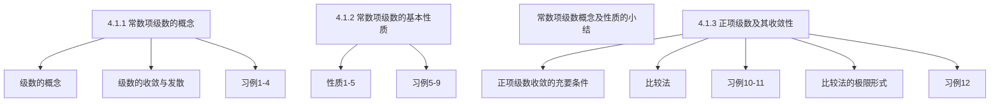

## 第4章 无 穷 级 数

## 4.1 正项级数

## 4.1.1 常数项级数   4.1.2 常数项级数的基本性质 收敛的必要条件   4.1.3 正项级数及其收敛性

## 4.1 正项级数

常数项级数与正项级数

## 一、常数项级数的概念

## 1.级数的定义：

设有数列 $\left\{u_{n}\right\}: u_{1}, u_{2}, \ldots, u_{n}, \ldots$
则称表达式

$$
\sum_{n=1}^{\infty} u_{n}=u_{1}+u_{2}+u_{3}+\cdots+u_{n}+\cdots
$$

为一个无穷级数，合称为级数．
称 $u_{n}$ 为级数的一般项或通项。

若级数 $\sum_{n=1}^{+\infty} u_{n}$ 的每—项 $u_{n}$ 均为常数，
则称该级数为常数项级数。

$$
\sum_{n=1}^{+\infty} \frac{1}{2^{n}}=\frac{1}{2}+\frac{1}{4}+\cdots+\frac{1}{2^{n}}+\cdots ; \quad \sum_{n=1}^{+\infty} n=1+2+\cdots+n+\cdots ;
$$

## 若级数的每—项均为同一个变量的

函数：$u_{n}=u_{n}(x)$ ，则称级数 $\sum_{n=1}^{+\infty} u_{n}(x)$ 为函数项级数．

$$
\begin{aligned}
& \sum_{n=0}^{+\infty} a_{n} x^{n}=a_{0}+a_{1} x+a_{2} x^{2}+\cdots+a_{n} x^{n}+\cdots, \quad|x|<1 . \\
& \sum_{n=1}^{+\infty} \sin n x=\sin x+\sin 2 x+\cdots+\sin n x+\cdots, \quad x \in R .
\end{aligned}
$$

## 2、问题的提出

$$
\frac{1}{3}=0.33333 \cdots=\frac{3}{10}+\frac{3}{100}+\frac{3}{1000}+\cdots+\frac{3}{10^{n}}+\cdots
$$

其结果是一个确定的数。

$$
\text { 又 } \sum_{n=1}^{\infty}(-1)^{n}=-1+1+(-1)+1+(-1)+\cdots=\left\{\begin{array}{c}
0, n=2 k \\
-1, n=2 k+1
\end{array}\right.
$$

其结果是不是一个确定的数。

再看一个例子：

$$
\sum_{n=1}^{\infty} \frac{1}{n(n+1)}=\frac{1}{1 \cdot 2}+\frac{1}{2 \cdot 3}+\cdots+\frac{1}{n(n+1)}+\cdots
$$

其结果多少？

$$
\begin{aligned}
& =\left(1-\frac{1}{2}\right)+\left(\frac{1}{2}-\frac{1}{3}\right)+\left(\frac{1}{3}-\frac{1}{4}\right)+\cdots+\left(\frac{1}{n}-\frac{1}{n+1}\right)+\cdots \\
& s_{1}=1-\frac{1}{2}=\frac{1}{2}, \quad s_{2}=\left(1-\frac{1}{2}\right)+\left(\frac{1}{2}-\frac{1}{3}\right)=1-\frac{1}{3} \\
& , \cdots \quad s_{n}=1-\frac{1}{n+1}, \cdots
\end{aligned}
$$

## 3.级数的敛散性定义

无穷级数 $\sum_{n=1}^{+\infty} u_{n}$ 的前 $n$ 项之和：

$$
S_{n}=\sum_{k=1}^{n} u_{k}=u_{1}+u_{2}+\cdots+u_{n}
$$

称为级数的部分和。
若 $\lim _{n \rightarrow \infty} S_{n}=S$ 存在，则称级数 $\sum_{n=1}^{+\infty} u_{n}$ 收敛。
$S$ 称为级数的和：$\sum_{n=1}^{+\infty} u_{n}=S$ 。
若 $\lim _{n \rightarrow \infty} S_{n}$ 不存在，则称无穷级数发散。

讨论无穷级数 $\sum_{n=1}^{\infty} u_{n}$ ，关心两个问题 ：
$1 . \sum_{n=1}^{\infty} u_{n}$ 是否收敛？
2．若收敛，和为多少？
下面我们讨论判断级数 $\sum_{n=1}^{\infty} u_{n}$ 收敛的方法。
方法一：利用部分和数列的发散性判断

## 常数项级数概念习例

例1 试述 $u_{n}, s_{n}, s$ 的意义及它们的关系，写出 $\sum_{n=0}^{\infty} \frac{1}{(n+1)(n+2)}$ 中的 $u_{3}$ 与 $s_{3}$ ．

例2 判别级数 $\sum_{n=1}^{\infty} \frac{1}{(2 n-1)(2 n+1)}$ 的发散性．
例3 讨论等比级数（几何级数）
$\sum_{n=0}^{\infty} a q^{n}=a+a q+a q^{2}+\cdots+a q^{n}+\cdots(a \neq 0)$ 的收敛性．
例4 判别级数 $\sum_{n=1}^{\infty}(\sqrt{n+1}-\sqrt{n})$ 的发散性。

例1 试述 $u_{n}, s_{n}, s$ 的意义及它们的关系，写出 $\sum_{n=0}^{\infty} \frac{1}{(n+1)(n+2)}$ 中的 $u_{3}$ 与 $s_{3}$ ．

解

$$
\begin{aligned}
& \lim _{n \rightarrow \infty} s_{n}=s, \quad u_{n}=s_{n}-s_{n-1} . \\
& u_{3}=\frac{1}{3 \cdot 4}, \quad s_{3}=\frac{1}{1 \cdot 2}+\frac{1}{2 \cdot 3}+\frac{1}{3 \cdot 4} .
\end{aligned}
$$

例2 判别级数 $\sum_{n=1}^{\infty} \frac{1}{(2 n-1)(2 n+1)}$ 的发散性。
解 $\quad \because u_{n}=\frac{1}{(2 n-1)(2 n+1)}=\frac{1}{2}\left(\frac{1}{2 n-1}-\frac{1}{2 n+1}\right)$ ，

$$
\begin{aligned}
& \therefore s_{n}=\frac{1}{1 \cdot 3}+\frac{1}{3 \cdot 5}+\cdots+\frac{1}{(2 n-1) \cdot(2 n+1)} \\
= & \frac{1}{2}\left(1-\frac{1}{3}\right)+\frac{1}{2}\left(\frac{1}{3}-\frac{1}{5}\right)+\cdots+\frac{1}{2}\left(\frac{1}{2 n-1}-\frac{1}{2 n+1}\right)=\frac{1}{2}\left(1-\frac{1}{2 n+1}\right) \\
& \therefore \lim _{n \rightarrow \infty} s_{n}=\lim _{n \rightarrow \infty} \frac{1}{2}\left(1-\frac{1}{2 n+1}\right)=\frac{1}{2},
\end{aligned}
$$

∴ 级数收敛，和为 $\frac{1}{2}$ 。

例3 讨论等比级数（几何级数）
$\sum_{n=0}^{\infty} a q^{n}=a+a q+a q^{2}+\cdots+a q^{n}+\cdots(a \neq 0)$ 的收敛性.
解 如果 $q \neq 1$ 时
$s_{n}=a+a q+a q^{2}+\cdots+a q^{n-1}=\frac{a-a q^{n}}{1-q}=\frac{a}{1-q}-\frac{a q^{n}}{1-q}$,
当 $q<1$ 时，$\because \lim _{n \rightarrow \infty} q^{n}=0 \therefore \lim _{n \rightarrow \infty} s_{n}=\frac{a}{1-q}$ 级数收敛
当 $q>1$ 时，$\because \lim _{n \rightarrow \infty} q^{n}=\infty \therefore \lim _{n \rightarrow \infty} s_{n}=\infty \quad$ 级数发散
（20）（14）（n） $\mathrm{Al}^{n \rightarrow \infty}$

## 如果 $q \mid=1$ 时

当 $q=1$ 时，$s_{n}=n a \rightarrow \infty$ 级数发散

当 $q=-1$ 时，级数变为 $a-a+a-a+\cdots$
$\therefore \lim _{n \rightarrow \infty} s_{n}$ 不存在 级数发散
综上所述 $\sum_{n=0}^{\infty} a q^{n}\left\{\begin{array}{l}\text { 当 }|q|<1 \text { 时，收敛于 } \frac{a_{1}}{1-q} \text { ．} \\ \text { 当 }|q| \geq 1 \text { 时，发散 }\end{array}\right.$

例4 判别级数 $\sum_{n=1}^{\infty}(\sqrt{n+1}-\sqrt{n})$ 的发散性．
解

$$
\begin{aligned}
& \because s_{n}=(\sqrt{2}-1)+(\sqrt{3}-\sqrt{2})+\cdots+(\sqrt{n+1}-\sqrt{n}) \\
& \quad=\sqrt{n+1}-1 \\
& \lim _{n \rightarrow \infty} s_{n}=\lim _{n \rightarrow \infty}(\sqrt{n+1}-1)=\infty \therefore \text { 原级数发散。 }
\end{aligned}
$$

注意：（1）$\sum_{n=1}^{\infty} u_{n}$ 与 $\sum_{i=1}^{n} u_{i}$ 不同．
（2）$\sum_{n=1}^{\infty} u_{n}$ 是否收敛与 $\lim _{n \rightarrow \infty} s_{n}$ 是否存在有关。
（3）若 $\sum^{\infty} u_{n}$ 收敛，$s_{n}$ 是 $s$ 的近似值。

> 利用部分和数列和敛散性判断无穷级数的发散性，一般不易求得数列和，此法应用范围较小。
> 下面给出利用级数性质判断的方法。

## 二、常数项级数的基本性质

性质1。若级数 $\sum_{n=1}^{\infty} u_{n}$ 收敛于 $S$ ，即 $S=\sum_{n=1}^{\infty} u_{n}$ ，则各项乘以常数 $c$ 所得级数 $\sum_{n=1}^{\infty} c u_{n}$ 也收敛，其和为 $c S$ 。

证：令 $S_{n}=\sum_{k=1}^{n} u_{k}$ ，则 $\sigma_{n}=\sum_{k=1}^{n} c u_{k}=c S_{n}$ ，

$$
\therefore \quad \lim _{n \rightarrow \infty} \sigma_{n}=c \lim _{n \rightarrow \infty} S_{n}=c S
$$

这说明 $\sum_{n=1}^{\infty} c u_{n}$ 收敛，其和为 $c S$ 。
说明：级数各项乘以非零常数后其发散性不变。

性质2．设有两个收敛级数 $S=\sum_{n=1}^{\infty} u_{n}, \sigma=\sum_{n=1}^{\infty} v_{n}$则级数 $\sum_{n=1}^{\infty}\left(u_{n} \pm v_{n}\right)$ 也收敛，其和为 $S \pm \sigma$ ．

证：令 $S_{n}=\sum_{k=1}^{n} u_{k}, \sigma_{n}=\sum_{k=1}^{n} v_{k}$ ，则

$$
\tau_{n}=\sum_{k=1}^{n}\left(u_{k} \pm v_{k}\right)=S_{n} \pm \sigma_{n} \rightarrow S \pm \sigma(n \rightarrow \infty)
$$

这说明级数 $\sum_{n=1}^{\infty}\left(u_{n} \pm v_{n}\right)$ 也收敛，其和为 $S \pm \sigma$ 。
结论：收敛级数可以逐项相加与逐项相减．
（28）（14）（№）（8）

## 说明：

（1）性质2表明收敛级数可逐项相加或减。
（2）若两级数中一个收敛一个发散，则 $\sum_{n=1}^{\infty}\left(u_{n} \pm v_{n}\right)$必发散。（用反证法可证）

但若二级数都发散，$\sum_{n=1}^{\infty}\left(u_{n} \pm v_{n}\right)$ 不一定发散。
例如，取 $u_{n}=(-1)^{2 n}, v_{n}=(-1)^{2 n+1}$ ，而 $u_{n}+v_{n}=0$

性质3．在级数前面加上或去掉有限项，不会影响级数的发散性。

证：将级数 $\sum_{n=1}^{\infty} u_{n}$ 的前 $k$ 项去掉，所得新级数 $\sum_{n=1}^{\infty} u_{k+n}$的部分和为

$$
\sigma_{n}=\sum_{l=1}^{n} u_{k+l}=S_{k+n}-S_{k}
$$

由于 $n \rightarrow \infty$ 时，$\sigma_{n}$ 与 $S_{k+n}$ 极限状况相同，故新旧两级数发散性相同。

当级数收敛时，其和的关系为 $\sigma=S-S_{k}$ 。
类似可证前面加上有限项的情况。

[^0]性质4．收敛级数加括弧后所成的级数仍收敛于原级数的和。

证：设收敛级数 $S=\sum_{n=1}^{\infty} u_{n}$ ，若按某一规律加括弧，例如

$$
\left(u_{1}+u_{2}\right)+\left(u_{3}+u_{4}+u_{5}\right)+\cdots
$$

则新级数的部分和序列 $\sigma_{m}(m=1,2, \cdots)$ 为原级数部分和序列 $S_{n}(n=1,2, \cdots)$ 的一个子序列，因此必有

$$
\lim _{m \rightarrow \infty} \sigma_{m}=\lim _{n \rightarrow \infty} S_{n}=S
$$

## 用反证法可证

推论：若加括弧后的级数发散，则原级数必发散。
注意：收敛级数去括弧后所成的级数不一定收敛。

例如，$(1-1)+(1-1)+\cdots=0$ ，但 $1-1+1-1+\cdots$ 发散。

性质5 若级数 $\sum_{n=1}^{\infty} \boldsymbol{u}_{\boldsymbol{n}}$ 收敛，则 $\lim _{n \rightarrow \infty} \boldsymbol{u}_{\boldsymbol{n}}=\mathbf{0}$ ．
证 $\quad \because \lim _{n \rightarrow \infty} s_{n}=s$ ，且 $u_{n}=s_{n}-s_{n-1}$ ，

$$
\begin{aligned}
\therefore \lim _{n \rightarrow \infty} u_{n} & =\lim _{n \rightarrow \infty} s_{n}-\lim _{n \rightarrow \infty} s_{n-1} \\
& =s-s=0
\end{aligned}
$$

注意：

判别级数发散的充分条件
（1）若 $\lim _{n \rightarrow \infty} u_{n} \neq 0$ ，则 $\sum_{n=1}^{\infty} u_{n}$ 发散．
（2）若 $\lim _{n \rightarrow \infty} u_{n}=0$ ，则 $\sum_{n=1 \text {（28）（Al）}}^{\infty} u_{n}$ 不一定收敛。

注意： $\lim _{n \rightarrow \infty} u_{n}=0$ 并非级数收敛的充分条件．
例5 调和级数 $\sum_{n=1}^{\infty} \frac{1}{n}=1+\frac{1}{2}+\frac{1}{3}+\cdots+\frac{1}{n}+\cdots$虽然 $\lim _{n \rightarrow \infty} u_{n}=\lim _{n \rightarrow \infty} \frac{1}{n}=0$ ，但此级数发散。

事实上，假设调和级数收敛于 $S$ ，则

$$
\lim _{n \rightarrow \infty}\left(S_{2 n}-S_{n}\right)=0
$$

但 $S_{2 n}-S_{n}=\frac{1}{n+1}+\frac{1}{n+2}+\frac{1}{n+3}+\cdots+\frac{1}{2 n}>\frac{n}{2 n}=\frac{1}{2}$矛盾！所以假设不真。

例6 证明级数 $\sum_{n=0}^{\infty} \frac{10 \cdot 5^{n}-1}{6^{n}}$ 收敛。
例7 判别级数 $\sum_{n=1}^{\infty} \frac{5 n}{2 n}$ 的发散性．
例8 判别级数 $\frac{1}{2}+\frac{1}{10}+\frac{1}{4}+\frac{1}{20}+\cdots+\frac{1}{2^{n}}+\frac{1}{10 n}+\cdots$ 的发散性．

例9 设 $\sum_{n=1}^{\infty} u_{n}$ 收敛，下列级数是否收敛：
（1）$\sum_{n=1}^{\infty}\left(u_{n}+0.0001\right)$ ；
（2）$\sum_{n=1}^{\infty} u_{n+1000}$ ；
（3）$\sum_{n=1}^{\infty} \frac{1}{u_{n}}$ ．

例6 证明级数 $\sum_{n=0}^{\infty} \frac{10 \cdot 5^{n}-1}{6^{n}}$ 收敛。

证 $\because \sum_{n=0}^{\infty} \frac{10 \cdot 5^{n}-1}{6^{n}}=\sum_{n=0}^{\infty}\left[10 \cdot\left(\frac{5}{6}\right)^{n}-\left(\frac{1}{6}\right)^{n}\right]$
而 $\sum_{n=0}^{\infty} 10 \cdot\left(\frac{5}{6}\right)^{n}$ 与 $\sum_{n=0}^{\infty}\left(\frac{1}{6}\right)^{n}$ 收敛，
由级数性质可知原级数收敛。

例7 判别级数 $\sum_{n=1}^{\infty} \frac{\mathbf{5 n}}{\mathbf{2 n}+3}$ 的发散性．
解 $\because \lim _{n \rightarrow \infty} \frac{5 n}{2 n+3}=\frac{5}{2} \neq 0$ ，
所以原级数发散．

例8 判别级数 $\frac{1}{2}+\frac{1}{10}+\frac{1}{4}+\frac{1}{20}+\cdots+\frac{1}{2^{n}}+\frac{1}{10 n}+\cdots$ 的发散性．

解 $\because \frac{1}{2}+\frac{1}{10}+\frac{1}{4}+\frac{1}{20}+\cdots+\frac{1}{2^{n}}+\frac{1}{10 n}+\cdots=\sum_{n=1}^{\infty}\left(\frac{1}{2^{n}}+\frac{1}{10 n}\right)$又 $\sum_{n=1}^{\infty} \frac{1}{2^{n}}$ 收敛，$\sum_{n=1}^{\infty} \frac{1}{10 n}$ 发散，

由级数性质可知原级数发散。

例9 设 $\sum_{n=1}^{\infty} u_{n}$ 收敛，下列级数是否收敛 ：
（1）$\sum_{n=1}^{\infty}\left(u_{n}+0.0001\right)$ ；
（2）$\sum_{n=1}^{\infty} u_{n+1000}$ ；
（3）$\sum_{n=1}^{\infty} \frac{1}{u_{n}}$ ．

解（1）$\because \lim _{n \rightarrow \infty}\left(u_{n}+0.0001\right)=0.0001 \neq 0$ ，

$$
\therefore \sum_{n=1}^{\infty}\left(u_{n}+0.0001\right) \text { 发散. }
$$

（2）$\because \sum_{n=1}^{\infty} u_{n+1000}$ 与 $\sum_{n=1}^{\infty} u_{n}$ 同时发散，$\therefore \sum_{n=1}^{\infty} u_{n+1000}$ 收敛。
（3）$\because \lim _{n \rightarrow \infty} \frac{1}{u_{n}}=\infty, \quad \therefore \sum_{n \rightarrow 1}^{\infty} \frac{1}{u_{(n)}}$ 发散．

## 常数项级数概念及性质的小结

## 常数项级数的基本概念

基本审玫法 1．由定义，若 $s_{n} \rightarrow s$ ，则级数收敛；
2．当 $\lim _{n \rightarrow \infty} \boldsymbol{u}_{\boldsymbol{n}} \neq \mathbf{0}$ ，则级数发散；
3 ．按基本性质．
记住1。几何级数（等比级数）$\sum_{n=0}^{\infty} a q^{n}\left\{\begin{array}{l}\text { 当 }|q|<1 \text { 时，收敛 } \\ \text { 当 }|q| \geq 1 \text { 时，发散 }\end{array}\right.$ 2．调和级数 $\sum_{n=1}^{\infty} \frac{1}{n}$ 是发散的。
由性质还有 $\sum_{n=1}^{\infty} \frac{1}{n+3}, \sum_{n=9}^{\infty} \frac{1}{n-5}$ 等都发散

## 三、正项级数及其审敛法

1．定义：如果级数 $\sum_{n=1}^{\infty} u_{n}$ 中各项均有 $u_{n} \geq 0$ ，这种级数称为正项级数．如果 $\boldsymbol{u}_{n}<0$ ，则级数 $\sum_{n=1}^{\infty} \boldsymbol{u}_{n}$ 与正项级数有相同的发散性。

2．正项级数收敛的充要条件：

$$
s_{1} \leq s_{2} \leq \cdots \leq s_{n} \leq \cdots
$$

部分和数列 $\left\{s_{n}\right\}$ 为单调增加数列。

## 定理1（收敛准则）

## 正项级数收敛 ⇔ 部分和所成的数列 $s_{n}$ 有界。

正项级数的部分和数列是单调增加的
单调有界的数列必有极限

在某极限过程中勾极限的量歨界

例1 级数 $\sum_{n=1}^{+\infty} \frac{1}{2^{n}+1}$ 是否收敛？
解 该级数为正项级数，又有 $\frac{1}{2^{n}+1}<\frac{1}{2^{n}}(n=1,2, \ldots)$

$$
S_{n}=\sum_{k=1}^{n} \frac{1}{2^{k}+1}<\sum_{k=1}^{n} \frac{1}{2^{k}}=\frac{\frac{1}{2}\left[1-\left(\frac{1}{2}\right)^{n}\right]}{1-\frac{1}{2}}=1-\frac{1}{2^{n}}<1
$$

即其部分和数列 $\left\{S_{n}\right\}$ 有界，从而，级数 $\sum_{n=1}^{+\infty} \frac{1}{2^{n}+1}$ 收敛。

## 3.正项级数的比较审敛法：

定理2设有两个正项级数 $\sum_{n=1}^{\infty} u_{n}$ 与 $\sum_{n=1}^{\infty} v_{n}$ ，
（1）若 $u_{n} \leq v_{n}(n=1,2, \cdots)$ ，且 $\sum_{n=1}^{\infty} v_{n}$ 收敛，则 $\sum_{n=1}^{\infty} u_{n}$ 收敛；
（2）若 $u_{n} \geq v_{n}(n=1,2, \cdots)$ ，且 $\sum_{n=1}^{\infty} v_{n}$ 发散，则 $\sum_{n=1}^{\infty} u_{n}$ 发散。
证（1）设 $\sum_{n=1}^{\infty} v_{n}$ 的部分和为 $\sigma_{n}$ ，收敛于 $\sigma$ 。
则 $\sum_{n=1}^{\infty} u_{n}$ 的部分和 $s_{n}=u_{1}+u_{2}+\cdots+u_{n} \leq v_{1}+v_{2}+\cdots+v_{n}=\sigma_{n}$

$$
\therefore \lim _{n \rightarrow \infty} s_{n} \leq \lim _{n \rightarrow \infty} \sigma_{\left(0^{n}\right)}=\sigma_{1}
$$

即 $u_{1} \leq s_{n} \leq \sigma$ ，故 $s_{n}$ 有界。 $\therefore \sum_{n=1}^{\infty} u_{n}$ 收敛。
（2）反设 $\sum_{n=1}^{\infty} u_{n}$ 收敛，由（1）可得 $\sum_{n=1}^{\infty} v_{n}$ 收敛，与已知矛盾。
$\therefore \sum_{n=1}^{\infty} \boldsymbol{u}_{n}$ 发散．
注意：（1）比收敛级数还小的级数收敛，
比发散级数还大的级数发散。
（2）若 $u_{n} \leq k v_{n}(n \geq N, k>0)$ ，且 $\sum_{n=1}^{\infty} v_{n}$ 收敛，则 $\sum_{n=1}^{\infty} u_{n}$ 收敛。
（3）若 $u_{n} \geq k v_{n}(n \geq N, k>0)$ ，且 $\sum_{n=1}^{\infty} v_{n}$ 发散，则 $\sum_{n=1}^{\infty} u_{n}$ 发散。
（2）（14）（№）$n=1$

## 正项级数比较法习例

例10 讨论 $\mathbf{p}^{-}$级数
$1+\frac{1}{2^{p}}+\frac{1}{3^{p}}+\frac{1}{4^{p}}+\cdots+\frac{1}{n^{p}}+\cdots$ 的收敛性．$(\boldsymbol{p}>\mathbf{0})$
例11判别级数的发散性：
（1）$\sum_{n=1}^{\infty} \frac{1}{\sqrt{n(n+1)}}$ ；
（2）$\sum_{n=1}^{\infty} \frac{1}{1+n^{2}}$
（3）$\sum_{n=1}^{\infty} \sin \frac{\pi}{2^{n}}$ ；
（4）$\sum_{n=1}^{\infty} \frac{1}{1+a^{n}}(a>0)$ ．

## 例 10 讨论 $\mathbf{p}^{-}$级数

$1+\frac{1}{2^{p}}+\frac{1}{3^{p}}+\frac{1}{4^{p}}+\cdots+\frac{1}{n^{p}}+\cdots$ 的收敛性．$(\boldsymbol{p}>\mathbf{0})$
解 当 $p \leq 1$ 时，$\frac{1}{n^{p}} \geq \frac{1}{n}$ ，则 $p$－级数发散．
当 $p>1$ 时，$n-1 \leq x<n$ 有 $\frac{1}{n^{p}} \leq \frac{1}{x^{p}}$ ，
则 $\frac{1}{n^{p}}=\int_{n-1}^{n} \frac{d x}{n^{p}}<\int_{n-1}^{n} \frac{d x}{x^{p}}=\frac{1}{p-1}\left[\frac{1}{(n-1)^{p-1}}-\frac{1}{n^{p-1}}\right]$
考虑级数 $\sum_{n=2}^{\infty}\left[\frac{1}{(n-1)^{p-1}}-\frac{1}{n^{p-1}}\right]$

$$
\begin{aligned}
s_{n} & =\left(1-\frac{1}{2^{p-1}}\right)+\left(\frac{1}{2^{p-1}}-\frac{1}{3^{p-1}}\right)+\cdots+\left[\frac{1}{n^{p-1}}-\frac{1}{(n+1)^{p-1}}\right] \\
& =1-\frac{1}{(n+1)^{p-1}}
\end{aligned}
$$

$\therefore \lim _{n \rightarrow \infty} s_{n}=1$ ，从而级数（＊）收敛。故 $p$－级数收敛。
$\therefore p$－级数 $\sum_{n=1}^{\infty} \frac{1}{n^{p}}\left\{\begin{array}{l}\text { 当 } p>1 \text { 时，收敛 } \\ \text { 当 } p \leq 1 \text { 时，发散。 }\end{array}\right.$

例 11 判别级数的发散性：
（1）$\sum_{n=1}^{\infty} \frac{1}{\sqrt{n(n+1)}}$ ；
（2）$\sum_{n=1}^{\infty} \frac{1}{1+n^{2}}$
（3）$\sum_{n=1}^{\infty} \sin \frac{\pi}{2^{n}}$ ；
（4）$\sum_{n=1}^{\infty} \frac{1}{1+a^{n}}(a>0)$ ．

解
（1）$\because \frac{1}{\sqrt{n(n+1)}} \geq \frac{1}{n+1}$ ，
而级数 $\sum_{n=1}^{\infty} \frac{1}{n+1}$ 发散，所以原级数发散。
（2）$\because \frac{1}{1+n^{2}} \leq \frac{1}{n^{2}}$ ，
而级数 $\sum_{n=1}^{\infty} \frac{1}{n^{2}}$ 收敛，所以原级数收敛。
（3）$\because \sin \frac{\pi}{2^{n}} \leq \frac{\pi}{2^{n}}$
而 $\sum_{n=1}^{\infty} \frac{\pi}{2^{n}}$ 收敛，所以原级数收敛。
（4）当 $a<1$ 时， $\lim _{n \rightarrow \infty} \frac{1}{1+a^{n}}=1 \neq 0$ ，所以原级数发散。
当 $a=1$ 时， $\lim _{n \rightarrow \infty} \frac{1}{1+a^{n}}=\frac{1}{2} \neq 0$ ，所以原级数发散．
当 $a>1$ 时，$\frac{1}{1+a^{n}} \leq \frac{1}{a^{n}}$ ，而 $\sum_{n=1}^{\infty}\left(\frac{1}{a}\right)^{n}$ 收敛，所以原级数收敛。
比较审玫法的不便：须有参考级数．

4．比较审敛法的极限形式：
定理 3.
设 $\sum_{n=1}^{\infty} u_{n}$ 与 $\sum_{n=1}^{\infty} v_{n}$ 都是正项级数，如果 $\lim _{n \rightarrow \infty} \frac{u_{n}}{v_{n}}=l$ ，
则（1）当 $0<l<+\infty$ 时，两级数有相同的敛散性；
（2）当 $l=0$ 时，若 $\sum_{n=1}^{\infty} v_{n}$ 收敛，则 $\sum_{n=1}^{\infty} u_{n}$ 收敛；
（3）当 $l=+\infty$ 时，若 $\sum_{n=1}^{\infty} v_{n}$ 发散，则 $\sum_{n=1}^{\infty} u_{n}$ 发散；
（20）（10）（n）（－）
（1）由 $\lim _{n \rightarrow \infty} \frac{u_{n}}{v_{n}}=l$ 对于 $\varepsilon=\frac{l}{2}>0$ ， $\exists N$ ，当 $n>N$ 时，$\quad l-\frac{l}{2}<\frac{u_{n}}{v_{n}}<l+\frac{l}{2}$即 $\frac{l}{2} v_{n}<u_{n}<\frac{3 l}{2} v_{n}(n>N)$
由比较审玫法的推论，得证。
（2）取 $\varepsilon=1$ ，可得结论．
（3）$\because \lim _{n \rightarrow \infty} \frac{u_{n}}{v_{n}}=+\infty$ ，则 $u_{n}>v_{n}$ ，
∴ 若 $\sum_{n=1}^{\infty} v_{n}$ 发散，则 $\sum_{n=1}^{\infty} u_{n}$ 发散。

## 正项级数比较法的极限形式习例

例12 判定下列级数的敛散性：
（1）$\sum_{n=1}^{\infty} \sin \frac{1}{n}$ ；
（2）$\sum_{n=1}^{\infty} \frac{1}{3^{n}-n}$ ；

例 12 判定下列级数的敛散性：
（1）$\sum_{n=1}^{\infty} \sin \frac{1}{n}$ ；
（2）$\sum_{n=1}^{\infty} \frac{1}{3^{n}-n}$ ；

解（1）$\because \lim _{n \rightarrow \infty} \frac{\sin \frac{1}{n}}{\frac{1}{n}}=1>0$ ，而 $\sum_{n=1}^{\infty} \frac{1}{n}$ 发散，
故原级数发散．
$\because \lim _{n \rightarrow \infty} \frac{1^{n}}{\frac{3^{n}-n}{3^{n}}}=\lim _{n \rightarrow \infty} \frac{1}{1-\frac{n}{3^{n}}}=1>0$,
$\because \sum_{n=1}^{\infty} \frac{1}{3^{n}}$ 收敛，故原级数收敛．
$\sum u_{n}, \sum v_{n}$ 是两个正项级数， $\lim _{n \rightarrow \infty} \frac{u_{n}}{v_{n}}=l$ ，
（1）当 $0<l<\infty$ 时，两个级数同时收敛或发散；
（2）当 $l=0$ 且 $\sum v_{n}$ 收敛时，$\sum u_{n}$ 也收敛；
（3）当 $l=\infty$ 且 $\sum v_{n}$ 发散时，$\sum u_{n}$ 也发散。
特别取 $v_{n}=\frac{1}{n^{p}}$ ，对正项级数 $\sum u_{n}$ ，可得如下结论：

$$
\lim _{n \rightarrow \infty} n^{p} u_{n}=l\left\{\begin{array}{l}
p \leq 1,0<l \leq \infty \Longrightarrow \sum u_{n} \text { 发散 } \\
p>1,0 \leq l<\infty \Longrightarrow \sum u_{n} \text { 收敛 }
\end{array}\right.
$$

例13．判别级数 $\sum_{n=1}^{\infty} \ln \left[1+\frac{1}{n^{2}}\right]$ 的敛散性． $\ln \left(1+\frac{1}{n^{2}}\right) \sim \frac{1}{n^{2}}$解：$\because \lim _{n \rightarrow \infty} n^{2} \ln \left[1+\frac{1}{n^{2}}\right]=\lim _{n \rightarrow \infty} n^{2} \cdot \frac{1}{n^{2}}=1$

根据比较审敛法的极限形式知

$$
\sum_{n=1}^{\infty} \ln \left[1+\frac{1}{n^{2}}\right] \text { 收敛. }
$$

例14 判别级数 $\sum_{n=1}^{+\infty} \frac{1!+2!+\cdots+n!}{(2 n)!}$ 的敛散性。
解（ $u_{n}=\frac{1!+2!+\cdots+n!}{(2 n)!} \leq \frac{n(n!)}{(2 n)!}$

$$
=\frac{1}{2(n+1)(n+2) \cdots(2 n-1)} \leq \frac{1}{2(n+1)(n+2)}=v_{n}
$$

而 $\lim _{n \rightarrow \infty} n^{2} \frac{1}{2(n+1)(n+2)}=\frac{1}{2}$ ，即 $0<l=\frac{1}{2}<+\infty$ ，

由比较判别法及 $P$ 级数的收敛性可知：

$$
\sum_{n=1}^{+\infty} \frac{1}{2(n+1)(n+2)}=\sum_{n=1}^{+\infty} v_{n} \text { 收敛, 从而原级数收敛。 }
$$

二．利用正项级数的比较审玫法及其极限形式
（1）大收则小收，小发则大发．
（2）$\sum u_{n}, \sum v_{n}$ 是两个正项级数， $\lim _{n \rightarrow \infty} \frac{u_{n}}{v_{n}}=l$ ，
（1）当 $0<l<\infty$ 时，两个级数同时收敛或发散；
（2）当 $l=0$ 且 $\sum v_{n}$ 收敛时，$\sum u_{n}$ 也收敛；
（3）当 $l=\infty$ 且 $\sum v_{n}$ 发散时，$\sum u_{n}$ 也发散。

$$
\lim _{n \rightarrow \infty} n^{p} u_{n}=l\left\{\begin{array}{l}
p \leq 1,0<l \leq \infty \Longrightarrow \sum u_{n} \text { 发散 }  \tag{3}\\
p>1,0 \leq l \leq \infty \Longrightarrow \sum u_{n} \text { 收敛 }
\end{array}\right.
$$

## 思考题

1．当一个级数 $\sum_{n=1}^{\infty} u_{n}$ 的一般项 $u_{n}$ 收敛于 0 时，该级数是否收敛？

2．一个级数是否收敛与级数前面有限项的取值是否有关？
3．如果加括号后所成的级数收敛，那去括号后原来的级数是否也收敛？

4．如何应用正项级数的比较审敛法？

[^0]:    （28）（10）（№）（8）
