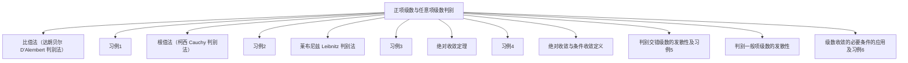

## 第4章 无穷级数

## 4. 1 正项级数 4.2 交错级数与任意项级数

4.1.3 正项级数及其收敛性（2）
4.2.1 交错级数及其审敛法
4.2.2 条件收敛与绝对收敛

## 4. 1 正项级数 4.2 交错级数与任意项级数

## 一、正项级数审敛法

## 1.比值审敛法（达朗贝尔D＇Alembert判别法）：

定理 1 设 $\sum_{n=1}^{\infty} u_{n}$ 是正项级数，如果 $\lim _{n \rightarrow \infty} \frac{u_{n+1}}{u_{n}}=\rho(\rho$ 数或 $+\infty)$
则（1）$\rho<1$ 时级数收敛；
（2）$\rho>1$ 时级数发散；
（3）$\rho=1$ 时失效．
证 当 $\rho$ 为有限数时，对 $\forall \varepsilon>0$ ，
$\exists N$ ，当 $n>N$ 时，有 $\left|\frac{u_{n+1}}{u_{n}}-\rho\right|<\varepsilon$ ，
即 $\rho-\varepsilon<\frac{u_{n+1}}{u_{n}}<\rho+\varepsilon \quad(n>N)$
（1）当 $\rho<1$ 时，取 $\varepsilon<1-\rho$ ，使 $r=\varepsilon+\rho<1$ ， $\boldsymbol{u}_{N+2}<r \boldsymbol{u}_{N+1}, \boldsymbol{u}_{N+3}<r \boldsymbol{u}_{N+2}<r^{2} \boldsymbol{u}_{N+1}, \cdots$, $\boldsymbol{u}_{N+m}<\boldsymbol{r}^{m-1} \boldsymbol{u}_{N+1}$ ，而级数 $\sum_{m=1}^{\infty} r^{m-1} \boldsymbol{u}_{N+1}$ 收敛， $\therefore \sum_{m=1}^{\infty} \boldsymbol{u}_{N+m}=\sum_{n=N+1}^{\infty} \boldsymbol{u}_{u}$ 收敛。
（2）当 $\rho>1$ 时，取 $\varepsilon<\rho-1$ ，使 $r=\rho-\varepsilon>1$ ，当 $n>N$ 时，$u_{n+1}>r u_{n}>u_{n}, \lim _{n \rightarrow \infty} u_{n} \neq 0$ ．故级数发散．
（3）$\sum_{n=1}^{\infty} \frac{1}{n}$ 发散，但 $\lim _{n \rightarrow \infty} \frac{u_{n+1}}{u_{n}}=\lim _{n \rightarrow \infty} \frac{n}{n+1}=1$ ； $\sum_{n=1}^{\infty} \frac{1}{n^{2}}$ 收敛，但 $\lim _{n \rightarrow \infty} \frac{u_{n+1}}{u_{n}}=\lim _{n \rightarrow \infty} \frac{n^{2}}{(n+1)^{2}}=1$ ．

## 比值法习例

例 1 判别下列级数的收敛性：
（1）$\sum_{n=1}^{\infty} \frac{1}{n!}$ ；
（2）$\sum_{n=1}^{\infty} \frac{n!}{10^{n}}$ ；
（3）$\sum_{n=1}^{\infty} \frac{1}{(2 n-1) \cdot 2 n}$ ．

例 1 判别下列级数的收敛性：
（1）$\sum_{n=1}^{\infty} \frac{1}{n!}$ ；
（2）$\sum_{n=1}^{\infty} \frac{n!}{\mathbf{1 0}^{n}}$ ；
（3）$\sum_{n=1}^{\infty} \frac{1}{(2 n-1) \cdot 2 n}$ ．

解（1）$\because \lim _{n \rightarrow \infty} \frac{u_{n+1}}{u_{n}}=\lim _{n \rightarrow \infty} \frac{n!}{(n+1)!}=\lim _{n \rightarrow \infty} \frac{1}{n+1}=0 \quad<1$ ，由正项级数的比值审敛法知原级数 $\sum_{n=1}^{\infty} \frac{1}{n!}$ 收敛。
（2）$\because \lim _{n \rightarrow \infty} \frac{u_{n+1}}{u_{n}}=\lim _{n \rightarrow \infty} \frac{(n+1)!}{10^{n+1}} \cdot \frac{\mathbf{1 0}^{n}}{n!}=\lim _{n \rightarrow \infty} \frac{n+1}{10}=\infty>1$ ，由正项级数的比值审玫法知原级数 $\sum_{n=1}^{\infty} \frac{n!}{10^{n}}$ 发散。
（3）$\because \lim _{n \rightarrow \infty} \frac{u_{n+1}}{u_{n}}=\lim _{n \rightarrow \infty} \frac{(2 n-1) \cdot 2 n}{(2 n+1) \cdot(2 n+2)}=1$ ，
比值审玫法失效，改用比较审玫法
$\because \frac{1}{(2 n-1) \cdot 2 n}<\frac{1}{n^{2}}$ ，而级数 $\sum_{n=1}^{\infty} \frac{1}{n^{2}}$ 收敛，

由正项级数的比较审玫法知原级数 $\sum_{n=1}^{\infty} \frac{1}{2 n \cdot(2 n-1)}$ 收敛。
说明：比值审玫法一般适用于级数通项
中含 $n!, n^{\alpha}, \alpha^{n}$ 等因子的形式的正项级数。

2．根值审敛法（柯西Cauchy判别法）：
定理 2.

$$
\begin{aligned}
& \text { 设 } \sum_{n=1}^{\infty} u_{n} \text { 是正项级数, 如果 } \\
& \lim _{n \rightarrow \infty} \sqrt[n]{u_{n}}=\rho(\rho \text { 为数或 }+\infty),
\end{aligned}
$$

则（1）$\rho<1$ 时级数收敛；
（2）$\rho>1$ 时级数发散；
（3）$\rho=1$ 时失效．证 从略．
注（1）当通项含有 $n!$ 或连乘积时，优先选择比值审敛法。
（2）当通项含有 $n$ 次方时，优先选择根值审玫法。
（3）当 $\rho=1$ 时，比值法与根值法都失效 ，须用比较法或比较法的 极限形式

例2 判别级数的发散性：
（1）$\sum_{n=1}^{\infty} \frac{2 \cdot 5 \cdot 8 \cdots[2+3(n-1)]}{1 \cdot 5 \cdot 9 \cdots[1+4(n-1)]}$ ；
（2）$\sum_{n=1}^{\infty} \frac{3^{n} \cdot n!}{n^{n}}$
（3）$\sum_{n=1}^{\infty} \ln \left(1+\frac{1}{n^{2}}\right)$ ；
（4）$\sum_{n=1}^{\infty} \frac{3+(-1)^{n}}{2^{n}}$ ．

## 例2 判别级数的敛散性：

（1）$\sum_{n=1}^{\infty} \frac{2 \cdot 5 \cdot 8 \cdots[2+3(n-1)]}{1 \cdot 5 \cdot 9 \cdots[1+4(n-1)]}$ ；
（2）$\sum_{n=1}^{\infty} \frac{3^{n} \cdot n!}{n^{n}}$
（3）$\sum_{n=1}^{\infty} \ln \left(1+\frac{1}{n^{2}}\right)$ ；
（4）$\sum_{n=1}^{\infty} \frac{3+(-1)^{n}}{2^{n}}$ ．

解（1）$\because \lim _{n \rightarrow \infty} \frac{u_{n+1}}{u_{n}}=\lim _{n \rightarrow \infty} \frac{2+3 n}{1+4 n}=\frac{3}{4}<1$ ，
由正项级数的比值审玫法知原级数收敛。

$$
\begin{align*}
\because \lim _{n \rightarrow \infty} \frac{u_{n+1}}{u_{n}}=\lim _{n \rightarrow \infty} \frac{3^{n+1}(n+1)!}{(n+1)^{n+1}} \cdot \frac{n^{n}}{3^{n} n!} & =\lim _{n \rightarrow \infty} 3\left(\frac{n}{n+1}\right)^{n}  \tag{2}\\
& =\frac{3}{e}>1,
\end{align*}
$$

由正项级数的比值审玫法知原级数发散．
（3）$\because \lim _{n \rightarrow \infty} \frac{u_{n}}{v_{n}}=\lim _{n \rightarrow \infty} \frac{\ln \left(1+\frac{1}{n^{2}}\right)}{1}=1>0$ ，
而级数 $\sum_{n=1}^{\infty} \frac{1}{n^{2}}$ 收敛，由正项级数的比较法知原级数收敛。
（4）$\because \lim _{n \rightarrow \infty} \frac{u_{n+1}}{u_{n}}=\frac{1}{2} \lim _{n \rightarrow \infty} \frac{3+(-1)^{n+1}}{3+(-1)^{n}}$ 不存在，
故不能用比值法，可用根值法和比较法来判别．
$\lim _{n \rightarrow \infty} \sqrt[n]{u_{n}}=\lim _{n \rightarrow \infty} \frac{\sqrt[n]{3+(-1)^{n}}}{2}=\frac{1}{2}<1$ ，所以原级数收敛。
或 $\frac{3+(-1)^{n}}{2^{n}} \leq \frac{4}{2^{n}}$ ，且 $\sum_{n=1}^{\infty} \frac{4}{2^{n}}$ 收敛，所以原级数收敛。

上述判别正项级数发散性的四个审敛法，都是充分条件，如果用其中的某一个审敛法不能判定所给级数的发散性，那么就要改用其它的审敛法以及级数收敛与发散的定义，收敛的性质、必要条件等去判别，这需要学生通过练习不断总结各种方法优劣及适用范围，熟练而灵活地使用它们。
（28）（14）（№）（3）

## 二、交错级数及其审敛法

1．定义：正、负项相间的级数称为交错级数．

$$
\sum_{n=1}^{\infty}(-1)^{n-1} u_{n} \text { 或 } \sum_{n=1}^{\infty}(-1)^{n} u_{n} \quad\left(\text { 其中 } u_{n}>0\right)
$$

2．判别法（定理 3）：
Leibnitz 定理 如果交错级数满足条件：
（ i ）$u_{n} \geq u_{n+1}(n=1,2,3, \cdots)$ ；（ii） $\lim _{n \rightarrow \infty} u_{n}=0$ ，则级数收敛，且其和 $s \leq u_{1}$ ，其余项 $r_{n}$ 的绝对值 $\left|\boldsymbol{r}_{\boldsymbol{n}}\right| \leq \boldsymbol{u}_{\boldsymbol{n + 1}}$.

证 $\because \boldsymbol{u}_{n-1}-\boldsymbol{u}_{n} \geq 0$ ，

$$
\because s_{2 n}=\left(u_{1}-u_{2}\right)+\left(u_{3}-u_{4}\right)+\cdots+\left(u_{2 n-1}-u_{2 n}\right)
$$

数列 $s_{2 n}$ 是单调增加的，

$$
\begin{aligned}
\text { 又 } s_{2 n} & =u_{1}-\left(u_{2}-u_{3}\right)-\cdots-\left(u_{2 n-2}-u_{2 n-1}\right)-u_{2 n} \\
& \leq u_{1}
\end{aligned}
$$

数列 $s_{2 n}$ 是有界的，

$$
\begin{aligned}
& \therefore \lim _{n \rightarrow \infty} s_{2 n}=s \leq u_{1} . \\
& \because \lim _{n \rightarrow \infty} u_{2 n+1}=\mathbf{0},
\end{aligned}
$$

$\therefore \lim _{n \rightarrow \infty} s_{2 n+1}=\lim _{n \rightarrow \infty}\left(s_{2 n}+u_{2 n+1}\right)=s$ ，
∴ 级数收敛于和 $s$ ，且 $s \leq u_{1}$ ．
余项 $\boldsymbol{r}_{n}= \pm\left(\boldsymbol{u}_{n+1}-\boldsymbol{u}_{n+2}+\cdots\right)$ ，

$$
\left|\boldsymbol{r}_{n}\right|=\boldsymbol{u}_{n+1}-\boldsymbol{u}_{n+2}+\cdots,
$$

满足收敛的两个条件，$\quad \therefore\left|\boldsymbol{r}_{n}\right| \leq \boldsymbol{u}_{n+1}$ ．

例 3 判别级数 $\sum_{n=2}^{\infty} \frac{(-1)^{n} \sqrt{n}}{n-1}$ 的收敛性．
解 $\quad \because\left(\frac{\sqrt{x}}{x-1}\right)^{\prime}=\frac{-(1+x)}{2 \sqrt{x}(x-1)^{2}}<0 \quad(x \geq 2)$
故函数 $\frac{\sqrt{x}}{x-1}$ 单调递减，

$$
\begin{aligned}
& \therefore u_{n}>u_{n+1}, \\
& \text { 又 } \lim _{n \rightarrow \infty} u_{n}=\lim _{n \rightarrow \infty} \frac{\sqrt{n}}{n-1}=0 .
\end{aligned}
$$

原级数收敛．

## 用Leibnitz 判别法判别下列级数的发散性：

$\begin{array}{ll}\text { 1）} & 1-\frac{1}{2}+\frac{1}{3}-\frac{1}{4}+\cdots+ \\ \text { 2）} & 1-\frac{1}{2!}+\frac{1}{3!}-\frac{1}{4!}+\cdots\end{array} \quad \begin{gathered}\frac{u_{n+1}}{u_{n}}=\frac{\frac{n+1}{10^{n+1}}}{\frac{n}{10^{n}}}=\frac{1}{10} \cdot \frac{n+1}{n}\end{gathered}$
3）$\frac{1}{10}-\frac{2}{10^{2}}+\frac{3}{10^{3}}-\frac{4}{10^{4}}+\cdots+(-1)^{n-1} \frac{n}{10^{n}}+\cdots$ 收敛上述级数各项取绝对值后所成的级数是否收敛？
1）$\sum_{n=1}^{\infty} \frac{1}{n}$ ；发散
2）$\sum_{n=1}^{\infty} \frac{1}{n!}$ ；收敛
3）$\sum_{n=1}^{\infty} \frac{n}{10^{n}}$ ．收敛

## 三、条件收敛与绝对收敛

1．定义：正项和负项任意出现的级数称为任意项级数．即级数中含有无穷多个正项和负项，且排列是任意的．

定理 4．若 $\sum_{n=1}^{\infty}\left|\boldsymbol{u}_{n}\right|$ 收敛，则 $\sum_{n=1}^{\infty} \boldsymbol{u}_{n}$ 收敛。

证 令 $v_{n}=\frac{1}{2}\left(u_{n}+u_{n}\right) \quad(n=1,2, \cdots)$ ，
显然 $v_{n}=\left\{\begin{array}{ll}u_{n} & u_{n}>0 \\ 0 & u_{n} \leq 0\end{array}\right.$ ，即 $\sum_{n=1}^{\infty} v_{n}$ 为正项级数，
且 $v_{n} \leq\left|u_{n}\right|, \therefore \sum_{n=1}^{\infty} v_{n}$ 收敛，
又 $\sum_{n=1}^{\infty} u_{n}=\sum_{n=1}^{\infty}\left(2 v_{n}-\left|u_{n}\right|\right), \therefore \sum_{n=1}^{\infty} u_{n}$ 收敛。

## 以上定理的作用：

定义：若 $\sum_{n=1}^{\infty}\left|\boldsymbol{u}_{n}\right|$ 收敛，则称 $\sum_{n=1}^{\infty} \boldsymbol{u}_{n}$ 为绝对收敛；
若 $\sum_{n=1}^{\infty} \boldsymbol{u}_{n}$ 发散，而 $\sum_{n=1}^{\infty} \boldsymbol{u}_{n}$ 收敛，则称 $\sum_{n=1}^{\infty} \boldsymbol{u}_{n}$ 为条件收敛．
注意：（1）若 $\sum_{n=1}^{\infty}\left|u_{n}\right|$ 收敛，则 $\sum_{n=1}^{\infty} u_{n}$ 收敛；
（2）若 $\sum_{n=1}^{\infty}\left|\boldsymbol{u}_{\boldsymbol{n}}\right|$ 发散，而 $\sum_{\boldsymbol{n}=1}^{\infty} \boldsymbol{u}_{\boldsymbol{n}}$ 不一定发散．
如 $\sum_{n=1}^{\infty} \frac{1}{n}$ 发散，而 $\sum_{n=1}^{\infty}(-1)^{n+1} \frac{1}{n}$ 收敛。（条件收敛）

## 绝对收敛定理的作用：

例4 判别级数的发散性：
（1）$\sum_{n=1}^{\infty}(-1)^{n-1} \frac{n!}{n^{n}}$ ；
（2）$\sum_{n=1}^{\infty} \frac{\alpha^{n}}{n!} \quad(\alpha \in R)$ ；
（3）$\sum_{n=1}^{\infty} \frac{\sin n}{n^{2}}$ ．

解（1）考虑加绝对值后的级数 $\sum_{n=1}^{\infty} \frac{n!}{n^{n}}$ ，
$\because \lim _{n \rightarrow \infty} \frac{u_{n+1}}{u_{n}}=\lim _{n \rightarrow \infty} \frac{(n+1)!}{(n+1)^{n+1}} \frac{n^{n}}{n!}=\lim _{n \rightarrow \infty}\left(\frac{n}{n+1}\right)^{n}=\frac{1}{e}<1$,
$\therefore \sum_{n=1}^{\infty} \frac{n!}{n^{n}}$ 收敛，故原级数绝对收敛。
（2）考虑加绝对值后的级数 $\sum_{n=1}^{\infty} \frac{\alpha^{n}}{n!}$ ，
$\because \lim _{n \rightarrow \infty} \frac{u_{n+1}}{u_{n}}=\lim _{n \rightarrow \infty} \frac{\alpha^{n+1}}{(n+1)!} \frac{n!}{|\alpha|^{n}}=\lim _{n \rightarrow \infty} \frac{\alpha \mid}{n+1}=0<1$,
$\therefore \sum_{n=1}^{\infty} \frac{|\alpha|^{n}}{n!}$ 收敛，故原级数绝对收敛。
（3）$\because\left|\frac{\sin n}{n^{2}}\right| \leq \frac{1}{n^{2}}$ ，而 $\sum_{n=1}^{\infty} \frac{1}{n^{2}}$ 收敛，
$\therefore \sum_{n=1}^{\infty}\left|\frac{\sin n}{n^{2}}\right|$ 收敛，故由定理知原级数绝对收敛。

例5 级数 $\sum_{n=1}^{+\infty}(-1)^{n+1} \frac{1}{\sqrt{n+1}}$ 是否绝对收敛？
解 $\left|(-1)^{n+1} \frac{1}{\sqrt{n+1}}\right|=\frac{1}{\sqrt{n+1}}>\frac{1}{n+1}$
由调和级数的发散性可知，$\sum_{n=1}^{\infty} \frac{1}{n+1}$ 发散，
故 $\sum_{n=1}^{\infty}\left|(-1)^{n+1} \frac{1}{\sqrt{n+1}}\right|$ 发散．

原级数是一个交错级数，且满足：

$$
\begin{aligned}
& u_{n}=\frac{1}{\sqrt{n+1}}>\frac{1}{\sqrt{n+2}}=\frac{1}{\sqrt{(n+1)+1}}=u_{n+1}, \\
& \lim _{n \rightarrow \infty} u_{n}=0,
\end{aligned}
$$

由莱布尼兹判别法可知，该交错级数收敛。故原级数是条件收敛，不是绝对收敛的．

4．判别一般项级数的发散性：
若用比值法判定 $\sum_{n=1}^{\infty} u_{n}$ 发散，则原级数 $\sum_{n=1}^{\infty} u_{n}$ 发散。
即若级数 $\sum_{n=1}^{\infty} u_{n}$ 满足

$$
\lim _{n \rightarrow \infty}\left|\frac{u_{n+1}}{u_{n}}\right|=\rho
$$

则（1）当 $\rho<1$ 时，$\sum_{n=1}^{\infty} u_{n}$ 绝对收敛；
（2）当 $\rho>1$ 时，$\sum_{n=1}^{\infty} u_{n}$ 发散。

5．利用级数收敛的必要条件可证明： $\lim _{n \rightarrow \infty} u_{n}=0$ ．
例6 证明 $\lim _{n \rightarrow \infty} \frac{a^{n}}{n!}=0(a>1)$ ．
证 考虑级数 $\sum_{n=1}^{\infty} \frac{a^{n}}{n!} \quad(a>1)$ ，
$\because \lim _{n \rightarrow \infty} \frac{u_{n+1}}{u_{n}}=\lim _{n \rightarrow \infty} \frac{a^{n+1}}{(n+1)!} \frac{n!}{a^{n}}=\lim _{n \rightarrow \infty} \frac{a}{n+1}=0<1$,
所以该级数收敛．
从而 $\lim _{n \rightarrow \infty} \frac{a^{n}}{n!}=0(a>1)$ ．

例7 判别级数的发散性：
（1）$\sum_{n=1}^{\infty}(-1)^{n+1} \frac{n}{n+1}$ ；
（2）$\sum_{n=1}^{\infty} u_{n}=1-\left(\frac{1}{7}\right)^{2}+\frac{1}{3^{2}}-\left(\frac{1}{7}\right)^{4}+\frac{1}{5^{2}}-\left(\frac{1}{7}\right)^{6}+\cdots$
例8 判别下列级数是绝对收敛，条件收敛，发散？
（1）$\sum_{n=1}^{\infty}(-1)^{n}\left(\frac{2 n+100}{3 n+1}\right)^{n}$ ；
（2）$\sum_{n=1}^{\infty} \frac{n \cdot \cos \frac{2 n \pi}{3}}{2^{n}}$ ；
（3）$\sum_{n=1}^{\infty} \frac{(-1)^{n+1}}{\sqrt{2 n+1}}$ ；
（4）$\sum_{n=1}^{\infty}(-1)^{n-1} \frac{\sqrt{2^{n}}}{n^{10}}$ ；
（5）$\sum_{n=1}^{\infty}(-1)^{n}\left[1-\frac{(n-1)^{2}}{(n+1)^{2}}\right]$ ．

例7 判别级数的敛散性：
（1）$\sum_{n=1}^{\infty}(-1)^{n+1} \frac{n}{n+1}$ ；
（2）$\sum_{n=1}^{\infty} u_{n}=1-\left(\frac{1}{7}\right)^{2}+\frac{1}{3^{2}}-\left(\frac{1}{7}\right)^{4}+\frac{1}{5^{2}}-\left(\frac{1}{7}\right)^{6}+\cdots$
解（1）$\because \lim _{n \rightarrow \infty} u_{n}=\lim _{n \rightarrow \infty} \frac{n}{n+1}=1 \neq 0$ ，所以原级数发散。
（2）$\because \sum_{n=1}^{\infty} u_{n}=\sum_{n=1}^{\infty}\left[\frac{1}{(2 n-1)^{2}}-\left(\frac{1}{7}\right)^{2 n}\right]$而 $\sum_{n=1}^{\infty} \frac{1}{(2 n-1)^{2}}$ 与 $\sum_{n=1}^{\infty}\left(\frac{1}{7}\right)^{2 n}$ 都收敛。所以原级数收敛。但显然不满足 $u_{n} \geq u_{n+1}$ ．

例8 判别下列级数是绝对收敛，条件收敛，发散？

$$
\text { (1) } \sum_{n=1}^{\infty}(-1)^{n}\left(\frac{2 n+100}{3 n+1}\right)^{n} \text {; }
$$

解 考虑 $\sum_{n=1}^{\infty}\left(\frac{2 n+100}{3 n+1}\right)^{n}$ ，

$$
\lim _{n \rightarrow \infty} \sqrt[n]{u_{n}}=\lim _{n \rightarrow \infty} \sqrt[n]{\left(\frac{2 n+100}{3 n+1}\right)^{n}}=\lim _{n \rightarrow \infty} \frac{2 n+100}{3 n+1}=\frac{2}{3}<1
$$

故原级数绝对收敛。
（2）$\sum_{n=1}^{\infty} \frac{n \cdot \cos \frac{2 n \pi}{3}}{2^{n}}$ ；
解 考虑 $\sum_{n=1}^{\infty} \frac{n \cdot\left|\cos \frac{2 n \pi}{3}\right|}{2^{n}}$ ，且 $\frac{\boldsymbol{n \cdot | \operatorname { c o s } \frac { \mathbf { 2 n } \pi } { \mathbf { 3 } } |}}{\mathbf{2}^{\boldsymbol{n}}} \leq \frac{\boldsymbol{n}}{\mathbf{2}^{\boldsymbol{n}}}$ ，
对于 $\sum_{n=1}^{\infty} \frac{n}{2^{n}}, ~ \lim _{n \rightarrow \infty} \frac{u_{n+1}}{u_{n}}=\lim _{n \rightarrow \infty} \frac{n+1}{2^{n+1}} \cdot \frac{2^{n}}{n}=\frac{1}{2}<1$ ，

故原级数绝对收敛。
（3）$\sum_{n=1}^{\infty} \frac{(-1)^{n+1}}{\sqrt{2 n+1}}$ ；
解 考虑 $\sum_{n=1}^{\infty} \frac{1}{\sqrt{2 n+1}}$ ，此级数发散。
但 $\frac{1}{\sqrt{2 n+1}}>\frac{1}{\sqrt{2(n+1)+1}}$ ，即 $u_{n}>u_{n+1}$ ，

$$
\lim _{n \rightarrow \infty} u_{n}=\lim _{n \rightarrow \infty} \frac{1}{\sqrt{2 n+1}}=0,
$$

原级数是莱布尼茨型交错级数，故原级数条件收敛。
（4）$\sum_{n=1}^{\infty}(-1)^{n-1} \frac{\sqrt{2^{n}}}{n^{10}}$ ；
解 考虑 $\sum_{n=1}^{\infty} \frac{\sqrt{2^{n}}}{n^{10}}$ ，

$$
\lim _{n \rightarrow \infty} \frac{u_{n+1}}{u_{n}}=\lim _{n \rightarrow \infty} \frac{\sqrt{2^{n+1}}}{(n+1)^{10}} \cdot \frac{n^{10}}{\sqrt{2^{n}}}=\sqrt{2}>1
$$

故原级数发散．
（5）$\sum_{n=1}^{\infty}(-1)^{n}\left[1-\frac{(n-1)^{2}}{(n+1)^{2}}\right]$ ．
解 考虑 $\sum_{n=1}^{\infty} \frac{4 n}{(n+1)^{2}}$ ，此级数发散。
易得 $u_{n}>u_{n+1}, ~ \lim _{n \rightarrow \infty} u_{n}=\lim _{n \rightarrow \infty} \frac{4 n}{(n+1)^{2}}=0$ ，故原级数条件收敛．

1．利用正项级数审敛法

2．利用绝对收敛定理和莱布尼兹判别法讨论任意项级数的绝对收敛与条件收敛

对任意项级数，先用正项级数的审玫法判断它是否绝对收敛，否则，再用莱布尼兹审敛法判断它是否收敛，若收敛，则知它是条件收敛。

<!-- 补充内容来自高数上版本 -->
## 第4章 无穷级数
## 4. 1 正项级数 4.2 交错级数与任意项级数
## 4. 1 正项级数 4.2 交错级数与任意项级数

## 一、正项级数审敛法
## 1.比值审敛法（达朗贝尔D＇Alembert判别法）：
## 比值法习例
解
\text { (1) } \because \lim _{n \rightarrow \infty} \frac{u_{n+1}}{u_{n}}=\lim _{n \rightarrow \infty} \frac{n!}{(n+1)!}=\lim _{n \rightarrow \infty} \frac{1}{n+1}=0<1 \text {, }
故级数 $\sum_{n=1}^{\infty} \frac{1}{n!}$ 收敛。
（2）$\because \lim _{n \rightarrow \infty} \frac{u_{n+1}}{u_{n}}=\lim _{n \rightarrow \infty} \frac{(n+1)!}{10^{n+1}} \cdot \frac{10^{n}}{n!}=\lim _{n \rightarrow \infty} \frac{n+1}{10}=\infty>1$ ，故级数 $\sum_{n=1}^{\infty} \frac{n!}{10^{n}}$ 发散．
故级数 $\sum_{n=1}^{\infty} \frac{1}{2 n \cdot(2 n-1)}$ 收敛。
（3）当 $\rho=1$ 时，比值法与根值法都失效 ，须用比较法或比较法的 极限形式。
所以原级数收敛。
（2）$\because \lim _{n \rightarrow \infty} \frac{u_{n+1}}{u_{n}}=\lim _{n \rightarrow \infty} \frac{3^{n+1}(n+1)!}{(n+1)^{n+1}} \cdot \frac{n^{n}}{3^{n} n!}$
=\lim _{n \rightarrow \infty} 3\left(\frac{n}{n+1}\right)^{n}=\frac{3}{e}>1
所以原级数发散．
（3）$\because \lim _{n \rightarrow \infty} \frac{u_{n}}{v_{n}}=\lim _{n \rightarrow \infty} \frac{\ln \left(1+\frac{1}{n^{2}}\right)}{\frac{1}{n^{2}}}=1>0$ ，而级数 $\sum_{n=1}^{\infty} \frac{1}{n^{2}}$ 收敛，所以原级数收敛。
（4）$\because \lim _{n \rightarrow \infty} \frac{u_{n+1}^{n=1}}{u_{n}}=\frac{1}{2} \lim _{n \rightarrow \infty} \frac{3+(-1)^{n+1}}{3+(-1)^{n}}$ 不存在，
或 $\frac{3+(-1)^{n}}{2^{n}} \leq \frac{4}{2^{n}}$ ，且 $\sum_{n=1}^{\infty} \frac{4}{2^{n}}$ 收敛，所以原级数收敛。
## 二、交错级数及其审敛法
解
\because\left(\frac{\sqrt{x}}{x-1}\right)^{\prime}=\frac{-(1+x)}{2 \sqrt{x}(x-1)^{2}}<0 \quad(x \geq 2)
## 用Leibnitz 判别法判别下列级数的发散性：
$\begin{array}{ll}\text { 1）} & 1-\frac{1}{2}+\frac{1}{3}-\frac{1}{4}+\cdots+ \\ \text { 2）} & 1-\frac{1}{2!}+\frac{1}{3!}-\frac{1}{4!}+\cdots\end{array} \quad \begin{gathered}u_{n+1}=\frac{\frac{n+1}{10^{n+1}}}{u_{n}}=\frac{1}{\frac{n}{10^{n}}}=\frac{n+1}{10}\end{gathered}$
## 三、条件收敛与绝对收敛
定理4。若 $\sum_{n=1}^{\infty} \boldsymbol{u}_{n}$ 收敛，则 $\sum_{n=1}^{\infty} \boldsymbol{u}_{n}$ 收敛。
## 绝对收敛定理的作用：
$\therefore \sum_{n=1}^{\infty} \frac{n!}{n^{n}}$ 收敛，故原级数收敛。
$\therefore \sum_{n=1}^{\infty} \frac{\mid \alpha^{n}}{n!}$ 收敛，故原级数收敛。
$\therefore \sum_{n=1}^{\infty}\left|\frac{\sin n}{n^{2}}\right|$ 收敛，故由定理知原级数收敛。
2．绝对收敛与条件收敛：
若 $\sum_{n=1}^{\infty}\left|u_{n}\right|$ 收敛，则称 $\sum_{n=1}^{\infty} u_{n}$ 为绝对收敛；
若 $\sum_{n=1}^{\infty}\left|u_{n}\right|$ 发散，而 $\sum_{n=1}^{\infty} u_{n}$ 收敛，则称 $\sum_{n=1}^{\infty} u_{n}$ 为条件收敛。
注意：（1）若 $\sum_{n=1}^{\infty}\left|\boldsymbol{u}_{n}\right|$ 收敛，则 $\sum_{n=1}^{\infty} \boldsymbol{u}_{n}$ 收敛；
（2）若 $\sum_{n=1}^{\infty}\left|\boldsymbol{u}_{n}\right|$ 发散，而 $\sum_{n=1}^{\infty} \boldsymbol{u}_{n}$ 不一定发散．
\begin{tabular}{|l|l|l|}
\hline & 正 项 级 数 & 任意项级数 \\
\hline \multirow{2}{*}{审敛} & \multicolumn{2}{|l|}{\begin{tabular}{l}
1．若 $S_{n} \rightarrow S$ ，则级数收敛； \\
2．当 $n \rightarrow \infty, u_{n} \nrightarrow 0$ ，则级数发散； \\
3．按基本性质；
\end{tabular}} \\
\hline & \begin{tabular}{l}
4．充要条件 \\
5．比较法 \\
6．比值法 \\
7．根值法
\end{tabular} & \begin{tabular}{l}
4．绝对收敛定理 \\
5．交错级数 \\
（莱布尼茨定理）
\end{tabular} \\
\hline
\end{tabular}
3．判别交错级数的发散性：
若 $\sum_{n=1}^{\infty}(-1)^{n+1} u_{n}$ 不满足Leibniz定理中的条件 $\lim _{n \rightarrow \infty} u_{n} \neq 0$ ，则原级数发散．
注意：
若 $\sum_{n=1}^{\infty}(-1)^{n+1} u_{n}$ 满足 $\lim _{n \rightarrow \infty} u_{n}=0$ ，
而不满足 $u_{n} \geq u_{n+1}$ ，则原级数不一定发散。
例5 判别级数的发散性：
（2）$\because \sum_{n=1}^{\infty} u_{n}=\sum_{n=1}^{\infty}\left[\frac{1}{(2 n-1)^{2}}-\left(\frac{1}{7}\right)^{2 n}\right]$
而 $\sum_{n=1}^{\infty} \frac{1}{(2 n-1)^{2}}$ 与 $\sum_{n=1}^{\infty}\left(\frac{1}{7}\right)^{2 n}$ 都收敛。所以原级数收敛。但显然不满足 $u_{n} \geq u_{n+1}$ ．
5．利用级数收敛的必要条件可证明： $\lim _{n \rightarrow \infty} u_{n}=0$ ．
例7 判别下列级数是绝对收敛，条件收敛，发散？
（5）$\sum_{n=1}^{\infty}(-1)^{n}\left[1-\frac{(n-1)^{2}}{(n+1)^{2}}\right]$.
例8 判别下列级数的发散性：
（1）$\sqrt{2}+\sqrt{2-\sqrt{2}}+\sqrt{2-\sqrt{2+\sqrt{2}}}+\cdots+\sqrt{2-\sqrt{2+\cdots+\sqrt{2}}}$ ；
（2）$\sum_{n=1}^{\infty} \int_{0}^{\frac{1}{n}} \frac{\sqrt{x}}{1+x^{2}} d x ; \quad$（3） $1-\frac{1}{2^{\alpha}}+\frac{1}{3}-\frac{1}{4^{\alpha}}+\frac{1}{5}-\frac{1}{6^{\alpha}}+\cdots$ ；
例7 判别下列级数是绝对收敛，条件收敛，发散？
解 考虑 $\sum_{n=1}^{\infty}\left(\frac{\mathbf{2 n + 1 0 0}}{\mathbf{3 n + 1}}\right)^{n}$ ，
$\lim _{n \rightarrow \infty} u_{n}=\lim _{n \rightarrow \infty} \frac{1}{\sqrt{2 n+1}}=0$ ，故原级数条件收敛。
$(5) \sum_{n=1}^{\infty}(-1)^{n}\left[1-\frac{(n-1)^{2}}{(n+1)^{2}}\right]$ ．
例8 判别下列级数的发散性：
（1）$\sqrt{2}+\sqrt{2-\sqrt{2}}+\sqrt{2-\sqrt{2+\sqrt{2}}}+\cdots+\sqrt{2-\sqrt{2+\cdots+\sqrt{2}}}$ ；
解 $\because \sqrt{2}=2 \cdot \frac{\sqrt{2}}{2}=2 \sin \frac{\pi}{4}=2 \sin \frac{\pi}{2^{2}}$ ，
& \sqrt{2-\sqrt{2}}=\sqrt{2-2 \cos \frac{\pi}{4}}=\sqrt{2 \cdot 2 \sin ^{2} \frac{\pi}{8}}=2 \sin \frac{\pi}{2^{3}} \\
& \sqrt{2-\sqrt{2+\sqrt{2}}}=\sqrt{2-\sqrt{2 \cdot 2 \cos ^{2} \frac{\pi}{8}}}=\sqrt{2-2 \cos \frac{\pi}{8}}=2 \sin \frac{\pi}{2^{4}}
一般地，
\therefore & \sqrt{2}+\sqrt{2-\sqrt{2}}+\sqrt{2-\sqrt{2+\sqrt{2}}}+\cdots+\sqrt{2-\sqrt{2+\cdots+\sqrt{2}}} \\
& =2 \sin \frac{\pi}{2^{2}}+2 \sin \frac{\pi}{2^{3}}+\cdots+2 \sin \frac{\pi}{2^{n+1}}+\cdots=\sum_{n=1}^{\infty} 2 \sin \frac{\pi}{2^{n+1}}
例8 判别下列级数的发散性：
（2）$\sum_{n=1}^{\infty} \int_{0}^{\frac{1}{n}} \frac{\sqrt{x}}{1+x^{2}} d x$ ；
解 $\int_{0}^{\frac{1}{n}} \frac{\sqrt{x}}{1+x^{2}} d x \leq \int_{0}^{\frac{1}{n}} \sqrt{x} d x=\left.\frac{2}{3} x^{\frac{3}{2}}\right|_{0} ^{\frac{1}{n}}=\frac{2}{3} \frac{1}{n^{3 / 2}}$
由比较法知 $\sum_{n=1}^{\infty} \int_{0}^{\frac{1}{n}} \frac{\sqrt{x}}{1+x^{2}} d x$ 收敛
例8 判别下列级数的发散性：
\text { (3) } 1-\frac{1}{2^{\alpha}}+\frac{1}{3}-\frac{1}{4^{\alpha}}+\frac{1}{5}-\frac{1}{6^{\alpha}}+\cdots \text {; }
解 当 $\alpha=1$ 时，
1-\frac{1}{2^{\alpha}}+\frac{1}{3}-\frac{1}{4^{\alpha}}+\frac{1}{5}-\frac{1}{6^{\alpha}}+\cdots=\sum_{n=1}^{\infty}(-1)^{n-1} \frac{1}{n} \text {, 条件收敛. }
当 $\alpha>1$ 时，$\sum_{n=1}^{\infty} \frac{1}{(2 n)^{\alpha}}$ 收敛，
$1-\frac{1}{2^{\alpha}}+\frac{1}{3}-\frac{1}{4^{\alpha}}+\frac{1}{5}-\frac{1}{6^{\alpha}}+\cdots=\sum_{n=1}^{\infty}\left[\frac{1}{2 n-1}-\frac{1}{(2 n)^{\alpha}}\right]$ ，发散。
& \text { 当 } \alpha<1 \text { 时, } 1-\frac{1}{2^{\alpha}}+\frac{1}{3}-\frac{1}{4^{\alpha}}+\frac{1}{5}-\frac{1}{6^{\alpha}}+\cdots \\
& \quad=1-\left(\frac{1}{2^{\alpha}}-\frac{1}{3}\right)-\cdots-\left[\frac{1}{(2 n)^{\alpha}}-\frac{1}{2 n+1}\right]-\cdots, \\
& \text { 而 } \lim _{n \rightarrow \infty} \frac{\frac{1}{(2 n)^{\alpha}}-\frac{1}{2 n+1}}{\frac{1}{n^{\alpha}}}=\frac{1}{2^{\alpha}}>0, \quad \text { 且 } \sum_{n=1}^{\infty} \frac{1}{n^{\alpha}} \text { 发散, }
故原级数发散。
∴ 当 $\alpha=1$ 时，原级数条件收敛；当 $\alpha \neq 1$ 时，原级数发散。
