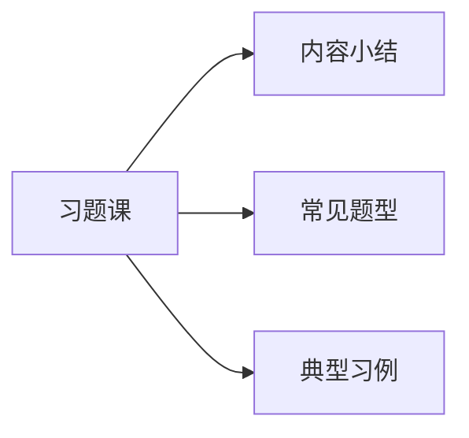
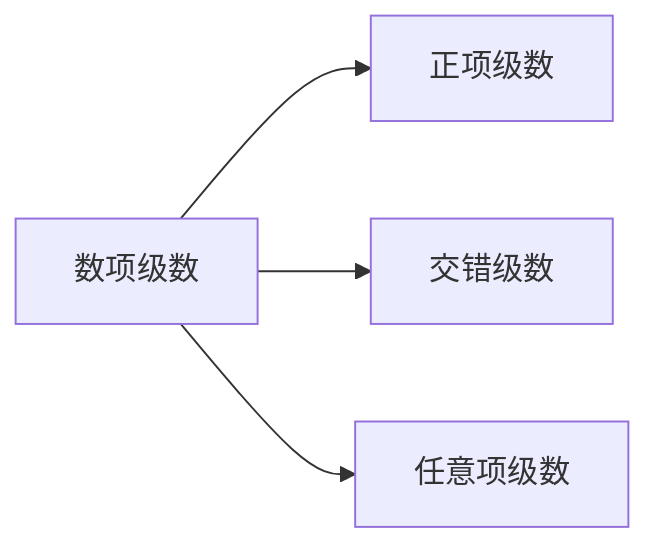
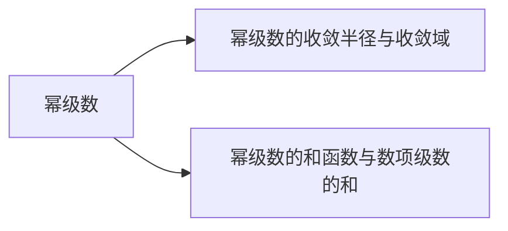

## 第4章 无穷级数

4.3 幂级数

4.3.3 幂级数的运算性质
4.3.4 幂级数和函数的性质

## 4.3 幂级数

习题课

## 一、幂级数的运算性质

$$
\begin{aligned}
& \quad \text { 设 } \sum_{n=0}^{\infty} a_{n} x^{n} \text { 和 } \sum_{n=0}^{\infty} b_{n} x^{n} \text { 的收玫半径各为 } R_{1} \text { 和 } R_{2} \text {, } \\
& \boldsymbol{R}=\min \left\{R_{1}, R_{2}\right\} \\
& \text { 加 } \\
& \text { 减 } \sum_{n=0}^{\infty} a_{n} x^{n} \pm \sum_{n=0}^{\infty} b_{n} x^{n}=\sum_{n=0}^{\infty}\left(a_{n} \pm b_{n}\right) x^{n} \cdot x \in(-R, R) \\
& \text { 法 } \\
& \text { 乘 }\left(\sum_{n=0}^{\infty} a_{n} x^{n}\right) \cdot\left(\sum_{n=0}^{\infty} b_{n} x^{n}\right)=\sum_{n=0}^{\infty} c_{n} x^{n} \cdot x \in(-R, R) \\
& \text { 法 (其中 } \left.c_{n}=a_{0} \cdot b_{n}+a_{1} \cdot b_{n-1}+\cdots+a_{n} \cdot b_{0}\right)
\end{aligned}
$$

除 $\frac{\sum_{n=0}^{\infty} a_{n} x^{n}}{\sum_{n=0}^{\infty} b_{n} x^{n}}=\sum_{n=0}^{\infty} c_{n} x^{n}$ ．（收玫域内 $\sum_{n=0}^{\infty} b_{n} x^{n} \neq 0$ ）
（相除后的收玫区间比原来两级数的收玫区间小得多）

## 二、幂级数的和函数的性质

连续性幂级数 $\sum_{n=0}^{\infty} a_{n} x^{n}$ 的和函数 $s(x)$ 在收敛区间 $(-\boldsymbol{R}, \boldsymbol{R})$ 内连续．

且幂级数在区间端点收敛时，和函数在该区间端点连续。
即幂级数的收敛区间为闭区间时，和函数的连续区间也是该闭区间．

可 幂级数 $\sum_{n=0}^{\infty} a_{n} x^{n}$ 的和函数 $s(x)$ 在收玫区间性 $(-\boldsymbol{R}, \boldsymbol{R})$ 内可导，并可逐项求导任意次。

即 $s^{\prime}(x)=\left(\sum_{n=0}^{\infty} a_{n} x^{n}\right)^{\prime}=\sum_{n=0}^{\infty}\left(a_{n} x^{n}\right)^{\prime}=\sum_{n=1}^{\infty} n a_{n} x^{n-1}$ 。 （收敛半径不变）

可积 幂级数 $\sum_{n=0}^{\infty} a_{n} x^{n}$ 的和函数 $s(x)$ 在收玫区间性 $(-R, R)$ 内可积，且对 $\forall x \in(-R, R)$ 可逐项积分．

即 $\int_{0}^{x} s(x) d x=\int_{0}^{x}\left(\sum_{n=0}^{\infty} a_{n} x^{n}\right) d x$

$$
=\sum_{n=0}^{\infty} \int_{0}^{x} a_{n} x^{n} d x=\sum_{n=0}^{\infty} \frac{a_{n}}{n+1} x^{n+1}
$$

（收敛半径不变）

例1 求 $\frac{x}{1 \cdot 3}+\frac{x^{2}}{2 \cdot 3^{2}}+\frac{x^{3}}{3 \cdot 3^{3}}+\cdots+\frac{x^{n}}{n \cdot 3^{n}}+\cdots$ 的和函数。例2 求 $\sum_{n=1}^{\infty} n x^{n-1}$ 的收玫域与和函数，并求 $\sum_{n=1}^{\infty} \frac{n}{2^{n-1}}$ ．例3 求 $\sum_{n=1}^{\infty} \frac{2 n-1}{2^{n}} x^{2 n-2}$ 的收玫域与和函数，并求 $\sum_{n=2}^{\infty} \frac{2 n-1}{2^{n}}$ ．例 4 求 $\sum_{n=1}^{\infty} \frac{n(n+1)}{2^{n}}$ 的和．

方法：通过恒等变形或遂项求导或遂项求积把原级数化为可求和的级数（等比级数）．

例 1 求 $\frac{x}{1 \cdot 3}+\frac{x^{2}}{2 \cdot 3^{2}}+\frac{x^{3}}{3 \cdot 3^{3}}+\cdots+\frac{x^{n}}{n \cdot 3^{n}}+\cdots$ 的和函数。
解 $\quad \because \rho=\lim _{n \rightarrow \infty}\left|\frac{a_{n+1}}{a_{n}}\right|=\lim _{n \rightarrow \infty} \frac{n 3^{n}}{(n+1) 3^{n+1}}=\frac{1}{3}, \therefore R=3$ ．
当 $x=3$ 时，原幂级数成为 $\sum_{n=1}^{\infty} \frac{1}{n}$ ，发散；
当 $x=-3$ 时，原幂级数成为 $\sum_{n=1}^{\infty} \frac{(-1)^{n}}{n}$ ，收玫。
∴ 收敛域为 $[-\mathbf{3 , 3})$ ．

$$
\begin{aligned}
& \text { 设 } s(x)=\sum_{n=1}^{\infty} \frac{x^{n}}{n \cdot 3^{n}}, \quad \text { 且 } s(0)=0 . \quad x \in[-3,3) . \\
& \text { 则 } s^{\prime}(x)=\sum_{n=1}^{\infty} \frac{x^{n-1}}{3^{n}}=\frac{1}{3} \sum_{n=1}^{\infty}\left(\frac{x}{3}\right)^{n-1}=\frac{1}{3} \frac{1}{1-\frac{x}{3}}=\frac{1}{3-x} . \\
& s(x)-s(0)=\int_{0}^{x} s^{\prime}(x) d x=\int_{0}^{x} \frac{1}{3-x} d x=-\ln (3-x)+\ln 3 \\
& \therefore s(x)=-\ln (3-x)+\ln 3, \quad x \in[-3,3) .
\end{aligned}
$$

例 2 求 $\sum_{n=1}^{\infty} n x^{n-1}$ 的收玫域与和函数，并求 $\sum_{n=1}^{\infty} \frac{n}{2^{n-1}}$ ．
解
（1）$\because \rho=\lim _{n \rightarrow \infty}\left|\frac{a_{n+1}}{a_{n}}\right|=\lim _{n \rightarrow \infty} \frac{n+1}{n}=1, \therefore R=1$ ．
当 $x=1$ 时，原幂级数成为 $\sum_{n=1}^{\infty} n$ ，发散；
当 $x=-1$ 时，原幂级数成为 $\sum_{n=1}^{\infty}(-1)^{n} n$ ，发散。
∴ 收玫域为（－1，1）．
(2) 设 $s(x)=\sum_{n=1}^{\infty} n x^{n-1}$, 且 $s(0)=1$.

$$
\begin{aligned}
& =1+2 x+3 x^{2}+\cdots+n x^{n-1}+\cdots \\
& =\left(x+x^{2}+x^{3}+\cdots+x^{n}+\cdots\right)^{\prime} \\
& =\left(\sum_{n=1}^{\infty} x^{n}\right)^{\prime} \\
& =\left(\frac{1}{1+x}-1\right)^{\prime}=\left(\frac{x}{1-x}\right)^{\prime}=\frac{1}{(1-x)^{2}} .
\end{aligned}
$$

(3) $\sum_{n=1}^{\infty} \frac{n}{2^{n-1}}=\sum_{n=1}^{\infty} n\left(\frac{1}{2}\right)^{n-1}=s\left(\frac{1}{2}\right)=\frac{1}{\left(1-\frac{1}{2}\right)^{2}}=4$.

例 3 求 $\sum_{n=1}^{\infty} \frac{2 n-1}{2^{n}} x^{2 n-2}$ 的收玫域与和函数，并求 $\sum_{n=2}^{\infty} \frac{2 n-1}{2^{n}}$ ．
解（1）$\because \lim _{n \rightarrow \infty}\left|\frac{u_{n+1}}{u_{n}}\right|=\lim _{n \rightarrow \infty}\left|\frac{(2 n+1) x^{2 n}}{2^{n+1}} \cdot \frac{2^{n}}{(2 n-1) x^{2 n-2}}\right|=\frac{1}{2}|x|^{2}$ ，
当 $\frac{|x|^{2}}{2}<1$ 即 $|x|<\sqrt{2}$ 时，原级数绝对收敛；
当 $\frac{|\boldsymbol{x}|^{2}}{2}>1$ 即 $|\boldsymbol{x}|>\sqrt{2}$ 时，原级数发散；
当 $\frac{|x|^{2}}{2}=1$ 即 $|x|=\sqrt{2}$ 时，原级数为 $\sum_{n=1}^{\infty} \frac{2 n-1}{2}$ ，发散。
∴ 收敛域为 $(-\sqrt{2}, \sqrt{2})$ ．

$$
\begin{aligned}
& (2) \text { 设 } s(x)=\sum_{n=1}^{\infty} \frac{2 n-1}{2^{n}} x^{2 n-2}=\frac{1}{2}+\frac{3}{2^{2}} x^{2}+\frac{5}{2^{3}} x^{4}+\cdots+\frac{2 n-1}{2^{n}} x^{2 n-2}+\cdots \\
& =\left(\frac{1}{2} x+\frac{1}{2^{2}} x^{3}+\frac{1}{2^{3}} x^{5}+\cdots+\frac{1}{2^{n}} x^{2 n-1}+\cdots\right)^{\prime} \\
& =\left(\frac{1}{x} \sum_{n=1}^{\infty}\left(\frac{x^{2}}{2}\right)^{n}\right)^{\prime}=\left(\frac{1}{x}\left(\frac{1}{1-\frac{x^{2}}{2}}-1\right)\right)^{\prime}=\left(\frac{x}{2-x^{2}}\right)^{\prime}=\frac{2+x^{2}}{\left(2-x^{2}\right)^{2}}
\end{aligned}
$$

$$
\text { (3) } \begin{aligned}
\sum_{n=2}^{\infty} \frac{2 n-1}{2^{n}} & =\sum_{n=1}^{\infty} \frac{2 n-1}{2^{n}}-\frac{1}{2} \\
& =s(1)-\frac{1}{2}=3-\frac{1}{2}=\frac{5}{2} .
\end{aligned}
$$

## 例 4 求 $\sum_{n=1}^{\infty} \frac{n(n+1)}{2^{n}}$ 的和．

解 考虑级数 $\sum_{n=1}^{\infty} n(n+1) x^{n}$ ，收玫区间 $(-1,1)$ ，
则 $\boldsymbol{s}(\boldsymbol{x})=\sum_{n=1}^{\infty} \boldsymbol{n}(\boldsymbol{n}+\mathbf{1}) \boldsymbol{x}^{\boldsymbol{n}}$

$$
\begin{aligned}
& =x\left(1 \cdot 2+2 \cdot 3 \cdot x+3 \cdot 4 \cdot x^{2}+\cdots+n(n+1) x^{n-1}+\cdots\right) \\
& =x\left(x^{2}+x^{3}+\cdots+x^{n+1}+\cdots\right)^{\prime \prime} \\
& =x\left(\frac{1}{1-x}-1-x\right)^{\prime \prime}=\frac{\mathbf{2}}{(\mathbf{1}-\boldsymbol{x})^{\mathbf{3}}}
\end{aligned}
$$

故 $\sum_{n=1}^{\infty} \frac{n(n+1)}{2^{n}}=s\left(\frac{1}{2}\right)=8$ ．

## 内容小结

幂级数的性质
1）两个幂级数在公共收敛区间内可进行加、减与乘法运算。

2）在收敛区间内幂级数的和函数连续；
3）幂级数在收敛区间内可逐项求导和求积分．

## 思考题

幂级数逐项求导后，收玫半径不变，那么它的收敛域是否也不变？

## 内容小结

1．数项级数

2．幂级数

## 常见题型

1．判别数项级数的玫散性
2．求幂级数的收敛半径与收敛域
3．求幂级数的和函数
4．求数项级数的和

例1 判断级数玫散性 ：$\sum_{n=1}^{\infty} \frac{n^{n+\frac{1}{n}}}{\left(n+\frac{1}{n}\right)^{n}}$ ；
例2 判断级数玫散性：$\sum_{n=1}^{\infty} \frac{\ln (n+2)}{\left(a+\frac{1}{n}\right)^{n}} \quad(a>0)$ ．
例3 判断级数 $\sum_{n=1}^{\infty} \frac{(-1)^{n}}{n-\ln n}$ 是否收玫？如果收敛，是条件收敛还是绝对收敛？

例4 讨论级数 $1-\frac{1}{2^{\alpha}}+\frac{1}{3}-\frac{1}{4^{\alpha}}+\frac{1}{5}-\frac{1}{6^{\alpha}}+\cdots$ 的玫散性．如果收敛，说明是条件收敛还是绝对收敛。

例 5 求级数 $\sum_{n=0}^{\infty}(n+1)(x-1)^{n}$ 收玫域及和函数．

例1 判断级数玫散性 ：$\sum_{n=1}^{\infty} \frac{n^{n+1}}{\left(n+\frac{1}{n}\right)^{n}}$ ；
解 $\because \lim _{n \rightarrow \infty} u_{n}=\lim _{n \rightarrow \infty} \frac{n^{n} \cdot n^{\frac{1}{n}}}{\left(n+\frac{1}{n}\right)^{n}}=\lim _{n \rightarrow \infty} \frac{n^{\frac{1}{n}}}{\left(1+\frac{1}{n^{2}}\right)^{n}}$

$$
=\lim _{n \rightarrow \infty} \frac{\sqrt[n]{n}}{\left[\left(1+\frac{1}{n^{2}}\right)^{n^{2}}\right]^{\frac{1}{n}}}=\frac{1}{e^{0}}=1 \neq 0
$$

根据级数收玫的必要条件，原级数发散．

例2 判断级数玫散性 ：$\sum_{n=1}^{\infty} \frac{\ln (n+2)}{\left(a+\frac{1}{n}\right)^{n}} \quad(a>0)$ ．
解 $\because \lim _{n \rightarrow \infty} \sqrt[n]{u_{n}}=\lim _{n \rightarrow \infty} \frac{\sqrt[n]{\ln (n+2)}}{a+\frac{1}{n}}=\frac{1}{a} \lim _{n \rightarrow \infty} \sqrt[n]{\ln (n+2)}$ ，
又 $n \geq 2$ 时，$n+2<e^{n}$ ，
从而有 $1<\sqrt[n]{\ln (n+2)}<\sqrt[n]{n}$ ，则 $\lim _{n \rightarrow \infty} \sqrt[n]{\ln (n+2)}=1$ ，
$\therefore \lim _{n \rightarrow \infty} \sqrt[n]{u_{n}}=\frac{1}{a}$.

当 $a>1$ 即 $0<\frac{1}{a}<1$ 时，原级数收敛；
当 $0<a<1$ 即 $\frac{1}{a}>1$ 时，原级数发散；
当 $a=1$ 时，原级数为 $\sum_{n=1}^{\infty} \frac{\ln (n+2)}{\left(1+\frac{1}{n}\right)^{n}}$ ，
$\because \lim _{n \rightarrow+\infty} \frac{\ln (n+2)}{\left(1+\frac{1}{n}\right)^{n}}=+\infty$ ，所以原级数也发散。

例3 判断级数 $\sum_{n=1}^{\infty} \frac{(-1)^{n}}{n-\ln n}$ 是否收玫？如果收玫，是条件收敛还是绝对收敛？

解 $\because \frac{1}{n-\ln n}>\frac{1}{n}$ ，而 $\sum_{n=1}^{\infty} \frac{1}{n}$ 发散，

$$
\therefore \quad \sum_{n=1}^{\infty}\left|\frac{(-1)^{n}}{n-\ln n}\right|=\sum_{n=1}^{\infty} \frac{1}{n=\ln n} \text { 发散, }
$$

即原级数不是绝对收玫的．
$\sum_{n=1}^{\infty} \frac{(-1)^{n}}{n-\ln n}$ 是交错级数，由莱布尼茨定理：
$\lim _{n \rightarrow \infty} \frac{1}{n-\ln n}=\lim _{n \rightarrow \infty} \frac{\frac{1}{n}}{1-\frac{\ln n}{n}}=0$,
$\because \quad f(x)=x-\ln x \quad(x>0)$,
$f^{\prime}(x)=1-\frac{1}{x}>0 \quad(x>1)$,
$\therefore f(x)=x-\ln x$ 在 $(1,+\infty)$ 上单增，

即 $\frac{1}{x-\ln x}$ 单减，
故 $\frac{1}{n-\ln n}$ 当 $n>1$ 时单减，
$\therefore \quad u_{n}=\frac{1}{n-\ln n}>\frac{1}{(n+1)-\ln (n+1)}=u_{n+1}(n>1)$,
所以此交错级数收玫，故原级数是条件收玫．

例4 讨论级数 $1-\frac{1}{2^{\alpha}}+\frac{1}{3}-\frac{1}{4^{\alpha}}+\frac{1}{5}-\frac{1}{6^{\alpha}}+\cdots$ 的玫散性．
如果收敛，说明是条件收敛还是绝对收敛。
解（1）当 $\alpha=1$ 时，原级数为 $\sum_{n=1}^{\infty}(-1)^{n} \frac{1}{n}$ ，它为条件收玫。
（2）当 $\alpha>1$ 时，$\sum_{n=1}^{\infty} \frac{1}{n^{\alpha}}$ 收玫，$\sum_{n=1}^{\infty} \frac{1}{(2 n)^{\alpha}}$ 收玫，而 $\sum_{n=1}^{\infty} \frac{1}{2 n+1}$ 发散，故原级数发散。
（3）当 $\alpha<1$ 时，考察加括号的级数 ：

$$
1-\left(\frac{1}{2^{\alpha}}-\frac{1}{3}\right)-\left(\frac{1}{4^{\alpha}}-\frac{1}{5}\right)-\cdots-\left[\frac{1}{(2 n)^{\alpha}}-\frac{1}{2 n+1}\right]-\cdots
$$

除第一项外均为负项，且

$$
\lim _{n \rightarrow \infty} \frac{\frac{1}{(2 n)^{\alpha}}-\frac{1}{2 n+1}}{\frac{1}{n^{\alpha}}}=\lim _{n \rightarrow \infty} \frac{(2 n+1)-(2 n)^{\alpha}}{(2 n+1) 2^{\alpha}}=\frac{1}{2^{\alpha}}
$$

因为 $\alpha<1$ 时，$\sum_{n=1}^{\infty} \frac{1}{n^{\alpha}}$ 为发散级数，
故由比较审玫法的极限 形式知加括号的级数发 散，故原级数发散。

例 5 求级数 $\sum_{n=0}^{\infty}(n+1)(x-1)^{n}$ 收玫域及和函数．
解 $\because \sum_{n=0}^{\infty}(n+1)(x-1)^{n}$ 的收玫半径为 $R=1$ ，
∴ 收敛域为 $-1<x-1<1$ ，即 $0<x<2$ ，
设此级数的和函数为 $s(x)$ ，则有

$$
\begin{aligned}
s(x) & =\sum_{n=0}^{\infty}(n+1)(x-1)^{n}=\left[\sum_{n=0}^{\infty}(x-1)^{n+1}\right]^{\prime} \\
& =\left[\frac{x-1}{1-(x-1)}\right]^{\prime}=\left(\frac{x-1}{2-x}\right)^{\prime}=\frac{1}{(2-x)^{2}}
\end{aligned}
$$

<!-- 补充内容来自高数上版本 -->
## 第4章 无穷级数
## 4.3 幂级数
## 一、幂级数的运算性质
## 二、幂级数的和函数的性质
## 例 4 求 $\sum_{n=1^{\infty} \frac{n(n+1)}{2^{n}}$ 的和．}
## 内容小结
## 思考题
## 内容小结
## 常见题型
