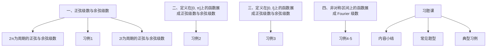
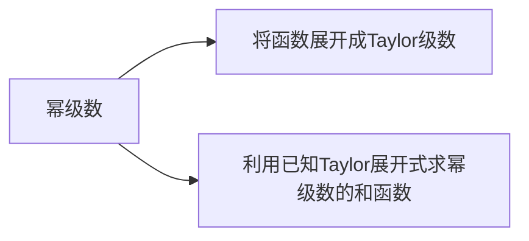

## 第4章 无穷级数
4.6 函数展开成正弦级数与余弦级数

## 4.6 函数展开成正弦级数与余弦级数

## 一.正弦级数与余弦级数

## 定理1
（1）当周期为 $2 \pi$ 的奇函数 $\boldsymbol{f}(\boldsymbol{x})$ 展开为 Fourier级数时，它的 Fourier 系数为

$$
\begin{array}{ll}
a_{n} & =0 \\
b_{n} & =\frac{2}{\pi} \int_{0}^{\pi} f(x) \sin n x d x
\end{array} \quad(n=0,1,2, \cdots) ~(n=1,2, \cdots) ~ 10.0
$$

（2）当周期为 $2 \pi$ 的偶函数 $f(x)$ 展开成
Fourier 级数时，它的 Fourier 系数为

$$
\begin{aligned}
& a_{n}=\frac{2}{\pi} \int_{0}^{\pi} f(x) \cos n x d x \quad(n=0,1,2, \cdots) \\
& b_{n}=0 \quad(n=1,2, \cdots)
\end{aligned}
$$

证（1）设 $f(x)$ 是奇函数，

$$
\begin{aligned}
& a_{n}=\frac{1}{\pi} \int_{-\pi}^{\pi} \frac{f(x) \cos n x d x}{\text { 奇函数 }}=0 \quad(n=0,1,2,3, \cdots) \\
& b_{n}=\frac{1}{\pi} \int_{-\pi}^{\pi} \frac{f(x) \sin n x d x}{\text { 偶函数 }}=\frac{2}{\pi} \int_{0}^{\pi} f(x) \sin n x d x \\
& (n=1,2,3, \cdots)
\end{aligned}
$$

同理可证（2）定理证毕．

定义：如果 $\boldsymbol{f}(\boldsymbol{x})$ 为奇函数，Fourier级数 $\sum_{n=1}^{\infty} \boldsymbol{b}_{n} \boldsymbol{\sin} \boldsymbol{n} \boldsymbol{x}$称为正弦级数。
如果 $f(x)$ 为偶函数，Fourier 级数 $\frac{a_{0}}{2}+\sum_{n=1}^{\infty} a_{n} \cos n x$称为余弦级数．

例1 将 $f(x)=\left\{\begin{array}{ll}-a & -\pi \leq x<0 \\ 0 & x=0 \\ a & 0<x \leq \pi\end{array}\right.$ 展成Fourier级数．
解 将 $f(x)$ 作周期延拓，如图

显然 $f(x)$ 在 $[-\pi, \pi]$ 上满足收敛定理条件。
可见 $f(x)$ 的Fourier级数在 $x=0$ 处收敛于

$$
\frac{f(0+0)+f(0-0)}{2}=\frac{a+(-a)}{2}=0 ;
$$

在 $x= \pm \pi$ 处收敛于 $\frac{f(-\pi+0)+f(\pi-0)}{2}=\frac{-a+a}{2}=0$ ；在 $-\pi<x<0,0<x<\pi$ 时收敛于 $f(x)$ 。
由于 $f(x)$ 在 $[-\pi, \pi]$ 上为奇函数，故Fourier级数为正弦级数．

$$
a_{n}=0, \quad b_{n}=\frac{2}{\pi} \int_{0}^{\pi} a \sin n x d x=\frac{2 a\left[1+(-1)^{n+1}\right]}{n \pi}
$$

$\therefore \sum_{n=1}^{\infty} \frac{2 a\left[1+(-1)^{n+1}\right]}{n \pi} \sin n x= \begin{cases}-a, & -\pi<x<0 \\ a, & 0<x<\pi \\ 0, & x=0, x= \pm \pi\end{cases}$
即 $\frac{4 a}{\pi} \sum_{n=1}^{\infty} \frac{\sin (2 n-1) x}{2 n-1}=\left\{\begin{array}{ll}-a, & -\pi<x<0 \\ a, & 0<x<\pi \\ 0, & x=0, x= \pm \pi\end{array}\right.$ ．

## 定理 2.

设 $f(x)$ 是以 $2 l$ 为周期的周期函数，且满足收敛定理的条件，
（1）如果 $f(x)$ 为奇函数，则有

$$
f(x)=\sum_{n=1}^{\infty} b_{n} \sin \frac{n \pi x}{l},
$$

其中系数 $b_{n}$ 为 $b_{n}=\frac{2}{i} \int_{0}^{l} f(x) \sin \frac{n \pi x}{i} d x,(n=1,2, \cdots)$
（2）如果 $f(x)$ 为偶函数，则有

$$
f(x)=\frac{a_{0}}{2}+\sum_{n=1}^{\infty} a_{n} \cos \frac{n \pi x}{l},
$$

其中系数 $a_{n}$ 为 $a_{n}=\frac{2}{l} \int_{0}^{l} f(x) \cos \frac{n \pi x}{l} d x \quad(n=0,1,2, \cdots)$

## 二.定义在 $[0, \pi]$ 上的函数展成正弦级数 与余弦级数

若 $f(x)$ 在 $[0, \pi]$ 上满足收敛定理的条件，则可展成Fourier级数。具体作法分两种情况进行：

1．将 $f(x)$ 在 $[0, \pi]$ 上展成正弦级数．具体步骤是：
（1）奇延拓 ：在 $[-\pi, 0]$ 上补充定义得到 $F(x)$ ，使 $F(x)$ 为 $[-\pi, \pi]$ 上的奇函数
（2）对 $F(x)$ 作周期延拓
（3）将经过奇延拓与周期延拓后的函数展成 Fourier级数，必为正弦级数
（4）限制 $x$ 的取值范围为 $[0, \pi]$
（5）对收敛性进行讨论，类似于前面讨论的情况

2．将 $f(x)$ 在 $[0, \pi]$ 上展成余弦级数．具体步骤是：
（1）偶延拓：在 $[-\pi, 0]$ 上补充定义得到 $F(x)$ ，使 $F(x)$ 为 $[-\pi, \pi]$ 上的偶函数
（2）对 $F(x)$ 作周期延拓
（3）将经过偶延拓与周期延拓后的函数展成 Fourier级数，必为余弦级数
（4）限制 $x$ 的取值范围为 $[0, \pi]$
（5）对收敛性进行讨论，类似于前面讨论的情况

例2 将 $f(x)=x^{2}, x \in[0, \pi]$ 分别展为正弦级数与余弦级数。
解（1）将 $f(x)$ 作奇延拓，再作周期延拓。如图

可见 $f(x)$ 的Fourier级数在 $x=\pi$ 处收敛于

$$
\frac{f(\pi+0)+f(\pi-0)}{2}=\frac{-\pi^{2}+\pi^{2}}{2}=0 ;
$$

在 $0 \leq x<\pi$ 时收敛于 $f(x)$ ．
且 $a_{n}=0, b_{n}=\frac{2}{\pi} \int_{0}^{\pi} x^{2} \sin n x d x=\frac{2}{\pi}\left[-\frac{2}{n^{3}}+(-1)^{n}\left(\frac{2}{n^{3}}-\frac{\pi^{2}}{n}\right)\right]$
$\therefore \sum_{n=1}^{\infty} \frac{2}{\pi}\left[-\frac{2}{n^{3}}+(-1)^{n}\left(\frac{2}{n^{3}}-\frac{\pi^{2}}{n}\right)\right] \sin n x= \begin{cases}x^{2}, & 0 \leq x<\pi \\ 0, & x=\pi\end{cases}$
（2）将 $f(x)$ 作偶延拓，再作周期延拓。如图

可见 $f(x)$ 的Fourier级数收敛于 $f(x)$ ．

$$
\begin{aligned}
& \text { 且 } b_{n}=0 \\
& a_{n}=\frac{2}{\pi} \int_{0}^{\pi} x^{2} \cos n x d x=\frac{(-1)^{n} 4}{n^{2}} \\
& a_{0}=\frac{2}{\pi} \int_{0}^{\pi} x^{2} d x=\frac{2}{3} \pi^{2} \\
& \therefore x^{2}=\frac{\pi^{2}}{3}+4 \sum_{n=1}^{\infty} \frac{(-1)^{n}}{n^{2}} \cos n x \quad(0 \leq x \leq \pi)
\end{aligned}
$$

## 三.定义在 $[0, l]$ 上的函数展成正弦级数 与余弦级数

若 $f(x)$ 在 $[0, l]$ 上满足收敛定理的条件，则可展成Fourier级数。具体作法分两种情况进行：

1．将 $f(x)$ 在 $[0, l]$ 上展成正弦级数．具体步骤是：
（1）奇延拓 ：在 $[-l, 0]$ 上补充定义得到 $F(x)$ ，使 $F(x)$ 为 $[-l, l]$ 上的奇函数
（2）对 $F(x)$ 作周期延拓
（3）将经过奇延拓与周期延拓后的函数展成Fourier级数

$$
\text { 必为 } \sum_{n=1}^{\infty} b_{n} \sin \frac{n \pi x}{l} \text {, 且 } b_{n}=\frac{2}{l} \int_{0}^{l} f(x) \sin \frac{n \pi x}{l} d x
$$

（4）限制 $x$ 的取值范围为 $[0, l]$
（5）对收敛性进行讨论

2．将 $f(x)$ 在 $[0, l]$ 上展成余弦级数．具体步骤是：
（1）偶延拓：在 $[-l, 0]$ 上补充定义得到 $F(x)$ ，使 $F(x)$ 为 $[-l, l]$ 上的偶函数
（2）对 $F(x)$ 作周期延拓
（3）将经过偶延拓与周期延拓后的函数展成Fourier级数

$$
\text { 必为 } \frac{a_{0}}{2}+\sum_{n=1}^{\infty} a_{n} \cos \frac{n \pi x}{l} \text {, 且 } a_{n}=\frac{2}{l} \int_{0}^{l} f(x) \cos \frac{n \pi x}{l} d x
$$

（4）限制 $x$ 的取值范围为 $[0, l]$
（5）对收敛性进行讨论

例3 $f(x)=\left\{\begin{array}{ll}x & 0 \leq x<\frac{l}{2} \\ l-x & \frac{l}{2} \leq x \leq l\end{array}\right.$ 展为正弦级数与余弦级数．
解（1）将 $f(x)$ 作奇延拓，再作周期延拓。如图

可见 $f(x)$ 的Fourier级数在 $[0, l]$ 上收敛于 $f(x)$ ．

$$
\begin{aligned}
& \text { 且 } a_{n}=0 \\
& b_{n}=\frac{2}{l} \int_{0}^{l} f(x) \sin \frac{n \pi x}{l} d x \\
& \quad=\frac{2}{l}\left[\int_{0}^{\frac{l}{2}} x \sin \frac{n \pi x}{l} d x+\int_{\frac{l}{2}}^{l}(l-x) \sin \frac{n \pi x}{l} d x=\frac{4 l}{n^{2} \pi^{2}} \sin \frac{n \pi}{2}\right. \\
& \therefore f(x)=\frac{4 l}{\pi^{2}} \sum_{n=1}^{\infty} \frac{\sin \frac{n \pi}{2}}{n^{2}} \sin \frac{n \pi x}{l} \quad(0 \leq x \leq l)
\end{aligned}
$$

（2）将 $f(x)$ 作偶延拓，再作周期延拓。如图

可见 $f(x)$ 的Fourier级数在 $[0, l]$ 上收敛于 $f(x)$ 。

$$
\text { 且 } \begin{aligned}
b_{n}=0, a_{n} & =\frac{2}{l} \int_{0}^{l} f(x) \cos \frac{n \pi x}{l} d x \\
& =\frac{2}{l}\left[\int_{0}^{\frac{l}{2}} x \cos \frac{n \pi x}{l} d x+\int_{\frac{l}{2}}^{l}(l-x) \cos \frac{n \pi x}{l} d x\right. \\
& =\frac{2 l}{n^{2} \pi^{2}}\left(2 \cos \frac{n \pi}{2}-\cos n \pi-1\right)
\end{aligned}
$$

$$
\begin{aligned}
a_{0} & =\frac{2}{l}\left[\int_{0}^{\frac{l}{2}} x d x+\int_{\frac{l}{2}}^{l}(l-x) d x=\frac{l}{2}\right. \\
\therefore f(x) & =\frac{l}{4}+\frac{2 l}{\pi^{2}} \sum_{n=1}^{\infty} \frac{2 \cos \frac{n \pi}{2}-\cos n \pi-1}{n^{2}} \cos \frac{n \pi x}{l} \quad(0 \leq x \leq l)
\end{aligned}
$$

## 四.非对称区间上的函数展 成Fourier级数

对于非对称区间上的函数，只要作适当的变量替换将非对称区间转化为对称区间，再按前面介绍的情形展成Fourier级数，最后代回原来的变量即得所求。

例4 将 $f(x)=\left\{\begin{array}{ll}x & -\frac{\pi}{2} \leq x<\frac{\pi}{2} \\ \pi-x & \frac{\pi}{2} \leq x \leq \frac{3 \pi}{2}\end{array}\right.$ 展开成 Fourier 级数．

例5 将 $f(x)=10-x(5<x<15)$ 展开成Fourier级数．

例4 解 由于 $f(x)$ 为非对称区间上的函数，故应作变量替换将其转化为对称区间上的函数。

$$
f(x)=f\left(z+\frac{\pi}{2}\right)=\left\{\begin{array}{ll}
z+\frac{\pi}{2}, & -\pi \leq z<0 \\
\frac{\pi}{2}-z, & 0 \leq z \leq \pi
\end{array}{ }_{\Delta} \quad \stackrel{\pi}{2},\right. \text { 得 }
$$

$F(z)$ 在 $[-\pi, \pi]$ 上满足收敛定理的条件，它在每一点都连续，它的Fourier级数在 $[-\pi, \pi]$ 上收敛于 $F(z)$ ．

$$
\begin{aligned}
& a_{0}=\frac{1}{\pi} \int_{-\pi}^{0}\left(z+\frac{\pi}{2}\right) d z+\frac{1}{\pi} \int_{0}^{\pi}\left(\frac{\pi}{2}-z\right) d z=0 \\
& a_{n}=\frac{1}{\pi} \int_{-\pi}^{0}\left(z+\frac{\pi}{2}\right) \cos n z d z+\frac{1}{\pi} \int_{0}^{\pi}\left(\frac{\pi}{2}-z\right) \cos n z d z=\frac{2\left[1-(-1)^{n}\right]}{n^{2} \pi} \\
& b_{n}=\frac{1}{\pi} \int_{-\pi}^{0}\left(z+\frac{\pi}{2}\right) \sin n z d z+\frac{1}{\pi} \int_{0}^{\pi}\left(\frac{\pi}{2}-z\right) \sin n z d z=0 \\
& \therefore F(z)=\sum_{n=1}^{\infty} \frac{2\left[1-(-1)^{n}\right]}{n^{2} \pi} \cos n z \quad(-\pi \leq z \leq \pi) \\
& \text { 故 } f(x)=\sum_{n=1}^{\infty} \frac{2\left[1-(-1)^{n}\right]}{n^{2} \pi} \cos n\left(x-\frac{\pi}{2}\right), \quad\left(-\frac{\pi}{2} \leq x \leq \frac{3 \pi}{2}\right)
\end{aligned}
$$

例5 将 $f(x)=10-x(5<x<15)$ 展开成Fourier级数．
解 由于 $f(x)$ 为非对称区间上的函数，故应作变量替换将其转化为对称区间上的函数。
令 $z=x-10$ ，得
$\Delta$
$f(x)=f(z+10)=-z=F(z) \quad(-5<z<5)$
$F(z)$ 在 $(-5,5)$ 上满足收敛定理的条件，它在每一点都连续，它的Fourier级数在 $(-5,5)$ 上收敛于 $F(z)$ ．

$$
\begin{aligned}
& a_{n}=\frac{1}{5} \int_{-5}^{5}(-z) \cos \frac{n \pi z}{5} d z=0 \\
& b_{n}=\frac{1}{5} \int_{-5}^{5}(-z) \sin \frac{n \pi z}{5} d z=\frac{(-1)^{n} 10}{n \pi} \\
& \therefore F(z)=\sum_{n=1}^{\infty} \frac{(-1)^{n} 10}{n \pi} \sin \frac{n \pi z}{5} \quad(-5<z<5) \\
& \text { 从而 } f(x)=\frac{10}{\pi} \sum_{n=1}^{\infty} \frac{(-1)^{n}}{n} \sin \frac{n \pi}{5}(x-10) \quad(-5<x-10<5) \\
& \text { 即 } f(x)=\frac{10}{\pi} \sum_{n=1}^{\infty} \frac{(-1)^{n}}{n} \sin \frac{n \pi x}{5}, \quad(5<x<15)
\end{aligned}
$$

1．幂级数

1．将函数展开成幂级数
2．利用已知幂级数展开式求幂级数的和函数
3．求数项级数的和
4．将函数展开成Fourier级数
5．求Fourier级数的和函数

例1 将 $f(x)=x \arctan x-\ln \sqrt{1+x^{2}}$ 展开成麦克劳林级数。

例2 将 $f(x)=\frac{x-1}{4-x}$ 展开成 $(x-1)$ 的幂级数，并求 $f^{(n)}(1)$ ．

例3 求幂级数 $\sum_{n=1}^{\infty} \frac{n^{2}}{n!} x^{n}$ 的和函数．

例4 证明级数 $\pi^{2}+\frac{\pi^{4}}{3!}+\frac{\pi^{6}}{5!}+\cdots+\frac{\pi^{2 n}}{(2 n-1)!}+\cdots$ 收敛，并求和。

例5 将函数 $f(x)=2+|x| \quad(-1 \leq x \leq 1)$ 内展开成以 2为周期的付氏级数，并 由此求级数 $\sum_{n=1}^{\infty} \frac{1}{n^{2}}$ 的和．

例6 设 $f(x)=\left\{\begin{array}{ll}x & -3 \leq x<0 \\ 2-\frac{2}{3} x & 0 \leq x \leq 3\end{array}\right.$ ，写出以 6 为周期的 Fourier级数在 $[-3,3]$ 上的和函数的表达式。

例7 证明：当 $0 \leq x \leq \pi$ 时，$\sum_{n=1}^{\infty} \frac{\cos n \pi}{n^{2}}=\frac{x^{2}}{4}-\frac{\pi x}{2}+\frac{\pi^{2}}{6}$ ．

例1 将 $f(x)=x \arctan x-\ln \sqrt{1+x^{2}}$ 展开成麦克劳林级数。
解 $\because f^{\prime}(x)=\arctan x=\int_{0}^{x} \frac{1}{1+x^{2}} d x$

$$
\begin{gathered}
=\int_{0}^{x}\left[\sum_{n=0}^{\infty}(-1)^{n} x^{2 n}\right] d x=\sum_{n=0}^{\infty}(-1)^{n} \frac{x^{2 n+1}}{2 n+1} \\
\therefore f(x)=\left(\sum_{n=0}^{\infty}(-1)^{n} \frac{x^{2 n+1}}{2 n+1}\right)^{\prime}=\sum_{n=0}^{\infty}(-1)^{n} \frac{x^{2 n+2}}{(2 n+1)(2 n+2)} .
\end{gathered}
$$

由 $-1<x^{2}<1$ 得 $-1<x<1$

且当 $x= \pm 1$ 时，级数为 $\sum_{n=0}^{\infty} \frac{(-1)^{n}}{(2 n+1)(2 n+2)}$ 都收敛，

$$
\therefore f(x)=\sum_{n=0}^{\infty}(-1)^{n} \frac{x^{2 n+2}}{(2 n+1)(2 n+2)}, \quad(-1 \leq x \leq 1) .
$$

例2 将 $f(x)=\frac{x-1}{4-x}$ 展开成 $(x-1)$ 的幂级数，并求 $f^{(n)}(1)$ ．

解

$$
\begin{aligned}
\because \frac{1}{4-x}= & \frac{1}{3-(x-1)}=\frac{1}{3\left(1-\frac{x-1}{3}\right)}=\frac{1}{3} \sum_{n=0}^{\infty}\left(\frac{x-1}{3}\right)^{n} \\
\therefore \frac{x-1}{4-x} & =(x-1) \cdot \frac{1}{3} \sum_{n=0}^{\infty}\left(\frac{x-1}{3}\right)^{n}=\sum_{n=0}^{\infty}\left(\frac{x-1}{3}\right)^{n+1} \\
\quad=\sum_{n=0}^{\infty} \frac{(x-1)^{n+1}}{3^{n+1}} & \\
\text { 由 }-1 & <\frac{x-1}{3}<1 \text { 得 }-2<x<4
\end{aligned}
$$

$$
\begin{aligned}
& \text { 且当 } x=-2 \text { 或 } 4 \text { 时 } \sum_{n=0}^{\infty} \frac{(x-1)^{n+1}}{3^{n+1}} \text { 都发散, } \\
& \therefore f(x)=\frac{x-1}{4-x}=\sum_{n=0}^{\infty} \frac{(x-1)^{n+1}}{3^{n+1}}, \quad(-2<x<4)
\end{aligned}
$$

由Taylor系数公式可得，

$$
\begin{aligned}
\frac{f^{(n)}(1)}{n!} & =\frac{1}{3^{n}} \\
\therefore f^{(n)}(1) & =\frac{n!}{3^{n}}
\end{aligned}
$$

例3 求幂级数 $\sum_{n=1}^{\infty} \frac{n^{2}}{n!} x^{n}$ 的和函数．
解 $\because \rho=\lim _{n \rightarrow \infty}\left|\frac{a_{n+1}}{a_{n}}\right|=\lim _{n \rightarrow \infty} \frac{(n+1)^{2}}{(n+1)!} \cdot \frac{n!}{n^{2}}=\lim _{n \rightarrow \infty} \frac{1}{n+1}=0$ ，
$\therefore \boldsymbol{R}=+\infty$ ，收敛域为 $(-\infty,+\infty)$ ．

$$
\text { 设 } \begin{aligned}
S(x) & =\sum_{n=1}^{\infty} \frac{n^{2}}{n!} x^{n}=\sum_{n=1}^{\infty} \frac{n^{2}-n+n}{n!} x^{n} \\
& =\sum_{n=1}^{\infty} \frac{n(n-1)+n}{n!} x^{n} \\
& =\sum_{n=1}^{\infty} \frac{n(n-1)}{n!} x^{n}+\sum_{n=1}^{\infty} \frac{1}{(n-1)!} x^{n}
\end{aligned}
$$

$$
\begin{aligned}
& =\sum_{n=2}^{\infty} \frac{1}{(n-2)!} x^{n}+\sum_{n=1}^{\infty} \frac{1}{(n-1)!} x^{n} \\
& =\sum_{n=0}^{\infty} \frac{x^{n+2}}{n!}+\sum_{n=0}^{\infty} \frac{x^{n+1}}{n!} \\
& =x^{2} \sum_{n=0}^{\infty} \frac{x^{n}}{n!}+x \sum_{n=0}^{\infty} \frac{x^{n}}{n!} \\
& =x^{2} e^{x}+x e^{x}
\end{aligned}
$$

例4 证明级数 $\pi^{2}+\frac{\pi^{4}}{3!}+\frac{\pi^{6}}{5!}+\cdots+\frac{\pi^{2 n}}{(2 n-1)!}+\cdots$ 收敛，并求和。
解 设 $S(x)=x^{2}+\frac{x^{4}}{3!}+\frac{x^{6}}{5!}+\cdots(|x|<+\infty)$

$$
\begin{aligned}
& x e^{x}=x+x^{2}+\frac{x^{3}}{2!}+\frac{x^{4}}{3!}+\cdots \\
& x e^{-x}=x-x^{2}+\frac{x^{3}}{2!}-\frac{x^{4}}{3!}+\cdots \quad x e^{x}-x e^{-x}=2 S(x) \\
& S(x)=x \frac{e^{x}-e^{-x}}{2}=x \cdot \sinh x \\
& \therefore S(\pi)=\pi \cdot \sinh \pi .
\end{aligned}
$$

例 5 将函数 $f(x)=2+|x|(-1 \leq x \leq 1)$ 内展开成以 2为周期的付氏级数，并 由此求级数 $\sum_{n=1}^{\infty} \frac{1}{n^{2}}$ 的和。
解 $\because f(x)=2+|x| \quad(-1 \leq x \leq 1)$ 是偶函数，
且 $-1 \leq x \leq 1$ 时处处连续．

$$
\begin{aligned}
\therefore & a_{0}=\frac{2}{1} \int_{0}^{1}(2+x) d x=5 \\
a_{n} & =\frac{2}{1} \int_{0}^{1}(2+x) \cos \frac{n \pi x}{1} d x=2 \int_{0}^{1} x \cos n \pi x d x \\
& =\frac{2}{n \pi} \int_{0}^{1} x d \sin n \pi x=\frac{2}{n^{2} \pi^{2}}\left[(-1)^{n}-1\right]
\end{aligned}
$$

$$
=\left\{\begin{array}{cc}
0, & n=2 k \\
-\frac{4}{n^{2} \pi^{2}}, & n=2 k-1
\end{array} \quad(k=1,2, \cdots), \quad b_{n}=0,\right.
$$

故 $\quad 2+|x|=\frac{5}{2}+\sum_{k=1}^{\infty}-\frac{4}{\pi^{2}(2 k-1)^{2}} \cos (2 k-1) \pi x$

$$
=\frac{5}{2}-\frac{4}{\pi^{2}} \sum_{k=1}^{\infty} \frac{\cos (2 k-1) \pi x}{(2 k-1)^{2}} . \quad(-1 \leq x \leq 1)
$$

取 $x=0$ ，由上式得 $2=\frac{5}{2}-\frac{4}{\pi^{2}} \sum_{k=1}^{\infty} \frac{1}{(2 k-1)^{2}}$ ，

$$
\begin{aligned}
& \therefore \quad \sum_{k=1}^{\infty} \frac{1}{(2 k-1)^{2}}=\frac{\pi^{2}}{8}, \\
& \text { 而 } \sum_{n=1}^{\infty} \frac{1}{n^{2}}=\sum_{k=1}^{\infty} \frac{1}{(2 k-1)^{2}}+\sum_{k=1}^{\infty} \frac{1}{(2 k)^{2}} \\
& \quad=\sum_{k=1}^{\infty} \frac{1}{(2 k-1)^{2}}+\frac{1}{4} \sum_{k=1}^{\infty} \frac{1}{k^{2}}, \\
& \therefore \quad \sum_{n=1}^{\infty} \frac{1}{n^{2}}=\frac{\pi^{2}}{8} \cdot \frac{4}{3}=\frac{\pi^{2}}{6} .
\end{aligned}
$$

例6 设 $f(x)=\left\{\begin{array}{ll}x & -3 \leq x<0 \\ 2-\frac{2}{3} x & 0 \leq x \leq 3\end{array}\right.$ ，写出以 6 为周期的Fourier级数在 $[-3,3]$ 上的和函数的表达式．

解 $f(x)$ 的Fourier级数在 $x=0$ 处收敛于

$$
\frac{f(0+0)+f(0-0)}{2}=\frac{2+0}{2}=1 ;
$$

在 $x= \pm 3$ 处收敛于 $\frac{f(-3+0)+f(3-0)}{2}=\frac{2-2+(-3)}{2}=-\frac{3}{2}$ ；在 $-3<x<3$ 与 $0<x<3$ 时，收敛于 $f(x)$ 。

所以所求的和函数的表达式为：

$$
S(x)= \begin{cases}x, & -3<x<0 \\ 2-\frac{2}{3} x, & 0<x<3 \\ 1, & x=0 \\ -\frac{3}{2}, & x= \pm 3\end{cases}
$$

例7 证明：当 $0 \leq x \leq \pi$ 时，$\sum_{n=1}^{\infty} \frac{\cos n \pi}{n^{2}}=\frac{x^{2}}{4}-\frac{\pi x}{2}+\frac{\pi^{2}}{6}$ ．
证 设 $f(x)=\frac{x^{2}}{4}-\frac{\pi x}{2}$ ，
将 $f(x)$ 在 $[0, \pi]$ 上展开成余弦级数：

$$
\begin{aligned}
& a_{0}=\frac{2}{\pi} \int_{0}^{\pi}\left(\frac{x^{2}}{4}-\frac{\pi x}{2}\right) d x=\frac{2}{\pi}\left(\frac{\pi^{3}}{12}-\frac{\pi^{3}}{4}\right)=-\frac{\pi^{3}}{3} \\
& a_{n}=\frac{2}{\pi} \int_{0}^{\pi}\left(\frac{x^{2}}{4}-\frac{\pi x}{2}\right) \cos n \pi d x
\end{aligned}
$$

$$
\begin{aligned}
& =\frac{2}{n \pi}\left[\left.\left(\frac{x^{2}}{4}-\frac{\pi x}{2}\right) \sin n x\right|_{0} ^{\pi}-\int_{0}^{\pi}\left(\frac{x}{2}-\frac{\pi}{2}\right) \sin n x d x\right] \\
& =\frac{2}{n^{2} \pi} \int_{0}^{\pi}\left(\frac{x}{2}-\frac{\pi}{2}\right) d \cos n x=\frac{2}{n^{2} \pi} \cdot \frac{\pi}{2}=\frac{1}{n^{2}} . \\
& \therefore \quad \frac{x^{2}}{4}-\frac{\pi x}{2}=-\frac{\pi^{2}}{6}+\sum_{n=1}^{\infty} \frac{\cos n \pi}{n^{2}} . \quad(0 \leq x \leq \pi) \\
& \text { 故 } \sum_{n=1}^{\infty} \frac{\cos n \pi}{n^{2}}=\frac{x^{2}}{4}-\frac{\pi x}{2}+\frac{\pi^{2}}{6} .
\end{aligned}
$$
