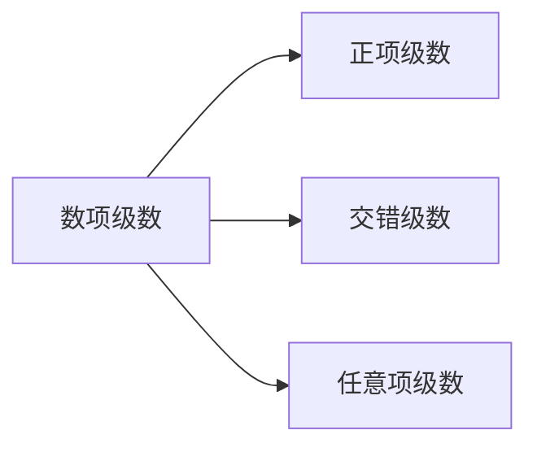
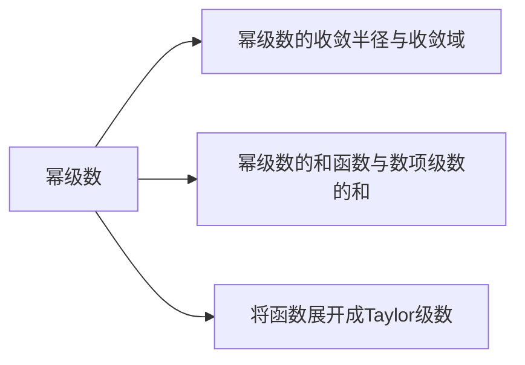
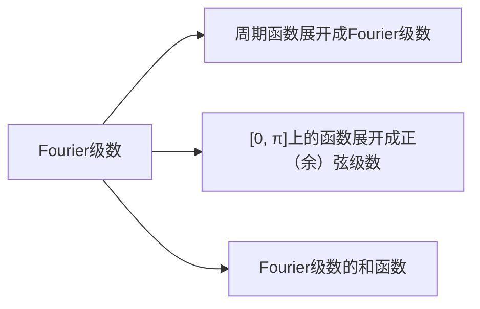

## 第4章 无穷级数复习课

1．数项级数

2．幂级数

3．Fourier级数

1．将函数展开成幂级数
2．利用已知幂级数展开式求幂级数的和函数
3．求数项级数的和
4．将函数展开成Fourier级数
5．求Fourier级数的和函数

例1 将 $f(x)=x \arctan x-\ln \sqrt{1+x^{2}}$ 展开成麦克劳林级数。

例2 将 $f(x)=\frac{x-1}{4-x}$ 展开成 $(x-1)$ 的幂级数，并求 $f^{(n)}(1)$ ．例3 求幂级数 $\sum_{n=1}^{\infty} \frac{n^{2}}{n!} x^{n}$ 的和函数．

例4 证明级数 $\pi^{2}+\frac{\pi^{4}}{3!}+\frac{\pi^{6}}{5!}+\cdots+\frac{\pi^{2 n}}{(2 n-1)!}+\cdots$ 收玫，并求和。

例5 将函数 $f(x)=2+|x| \quad(-1 \leq x \leq 1)$ 内展开成以 2为周期的付氏级数，并 由此求级数 $\sum_{n=1}^{\infty} \frac{1}{n^{2}}$ 的和．

例6 设 $f(x)=\left\{\begin{array}{ll}x & -3 \leq x<0 \\ 2-\frac{2}{3} x & 0 \leq x \leq 3\end{array}\right.$ ，写出以 6 为周期的 Fourier级数在 $[-3,3]$ 上的和函数的表达式。

例7 证明：当 $0 \leq x \leq \pi$ 时，$\sum_{n=1}^{\infty} \frac{\cos n \pi}{n^{2}}=\frac{x^{2}}{4}-\frac{\pi x}{2}+\frac{\pi^{2}}{6}$ ．

例1 将 $f(x)=x \arctan x-\ln \sqrt{1+x^{2}}$ 展开成麦克劳林级数。
解 $\because f^{\prime}(x)=\arctan x=\int_{0}^{x} \frac{1}{1+x^{2}} d x$

$$
\begin{gathered}
=\int_{0}^{x}\left[\sum_{n=0}^{\infty}(-1)^{n} x^{2 n}\right] d x=\sum_{n=0}^{\infty}(-1)^{n} \frac{x^{2 n+1}}{2 n+1} \\
\therefore f(x)=\left(\sum_{n=0}^{\infty}(-1)^{n} \frac{x^{2 n+1}}{2 n+1}\right)^{\prime}=\sum_{n=0}^{\infty}(-1)^{n} \frac{x^{2 n+2}}{(2 n+1)(2 n+2)} .
\end{gathered}
$$

由 $-1<x^{2}<1$ 得 $-1<x<1$

且当 $x= \pm 1$ 时，级数为 $\sum_{n=0}^{\infty} \frac{(-1)^{n}}{(2 n+1)(2 n+2)}$ 都收玫，

$$
\therefore f(x)=\sum_{n=0}^{\infty}(-1)^{n} \frac{x^{2 n+2}}{(2 n+1)(2 n+2)}, \quad(-1 \leq x \leq 1) .
$$

例2 将 $f(x)=\frac{x-1}{4-x}$ 展开成 $(x-1)$ 的幂级数，并求 $f^{(n)}(1)$ ．

解

$$
\begin{aligned}
\because \frac{1}{4-x}= & \frac{1}{3-(x-1)}=\frac{1}{3\left(1-\frac{x-1}{3}\right)}=\frac{1}{3} \sum_{n=0}^{\infty}\left(\frac{x-1}{3}\right)^{n} \\
\therefore \frac{x-1}{4-x} & =(x-1) \cdot \frac{1}{3} \sum_{n=0}^{\infty}\left(\frac{x-1}{3}\right)^{n}=\sum_{n=0}^{\infty}\left(\frac{x-1}{3}\right)^{n+1} \\
= & \sum_{n=0}^{\infty} \frac{(x-1)^{n+1}}{3^{n+1}} \\
\text { 由 }-1 & <\frac{x-1}{3}<1 \text { 得 }-2<x<4
\end{aligned}
$$

$$
\begin{aligned}
& \text { 且当 } x=-2 \text { 或 } 4 \text { 时 } \sum_{n=0}^{\infty} \frac{(x-1)^{n+1}}{3^{n+1}} \text { 都发散, } \\
& \therefore f(x)=\frac{x-1}{4-x}=\sum_{n=0}^{\infty} \frac{(x-1)^{n+1}}{3^{n+1}}, \quad(-2<x<4)
\end{aligned}
$$

由Taylor系数公式可得，

$$
\begin{aligned}
\frac{f^{(n)}(1)}{n!} & =\frac{1}{3^{n}} \\
\therefore f^{(n)}(1) & =\frac{n!}{3^{n}}
\end{aligned}
$$

例3 求幂级数 $\sum_{n=1}^{\infty} \frac{n^{2}}{n!} x^{n}$ 的和函数．
解 $\because \rho=\lim _{n \rightarrow \infty}\left|\frac{a_{n+1}}{a_{n}}\right|=\lim _{n \rightarrow \infty} \frac{(n+1)^{2}}{(n+1)!} \cdot \frac{n!}{n^{2}}=\lim _{n \rightarrow \infty} \frac{1}{n+1}=0$ ，
$\therefore \boldsymbol{R}=+\infty$ ，收敛域为 $(-\infty,+\infty)$ ．

$$
\text { 设 } \begin{aligned}
S(x) & =\sum_{n=1}^{\infty} \frac{n^{2}}{n!} x^{n}=\sum_{n=1}^{\infty} \frac{n^{2}-n+n}{n!} x^{n} \\
& =\sum_{n=1}^{\infty} \frac{n(n-1)+n}{n!} x^{n} \\
& =\sum_{n=1}^{\infty} \frac{n(n-1)}{n!} x^{n}+\sum_{n=1}^{\infty} \frac{1}{(n-1)!} x^{n}
\end{aligned}
$$

$$
\begin{aligned}
& =\sum_{n=2}^{\infty} \frac{1}{(n-2)!} x^{n}+\sum_{n=1}^{\infty} \frac{1}{(n-1)!} x^{n} \\
& =\sum_{n=0}^{\infty} \frac{x^{n+2}}{n!}+\sum_{n=0}^{\infty} \frac{x^{n+1}}{n!} \\
& =x^{2} \sum_{n=0}^{\infty} \frac{x^{n}}{n!}+x \sum_{n=0}^{\infty} \frac{x^{n}}{n!} \\
& =x^{2} e^{x}+x e^{x}
\end{aligned}
$$

例4 证明级数 $\pi^{2}+\frac{\pi^{4}}{3!}+\frac{\pi^{6}}{5!}+\cdots+\frac{\pi^{2 n}}{(2 n-1)!}+\cdots$ 收玫，并求和。
解 设 $S(x)=x^{2}+\frac{x^{4}}{3!}+\frac{x^{6}}{5!}+\cdots(|x|<+\infty)$

$$
\begin{aligned}
& x e^{x}=x+x^{2}+\frac{x^{3}}{2!}+\frac{x^{4}}{3!}+\cdots \\
& x e^{-x}=x-x^{2}+\frac{x^{3}}{2!}-\frac{x^{4}}{3!}+\cdots \quad x e^{x}-x e^{-x}=2 S(x) \\
& S(x)=x \frac{e^{x}-e^{-x}}{2}=x \cdot \sinh x \\
& \therefore S(\pi)=\pi \cdot \sinh \pi .
\end{aligned}
$$

例 5 将函数 $f(x)=2+|x|(-1 \leq x \leq 1)$ 内展开成以 2为周期的付氏级数，并 由此求级数 $\sum_{n=1}^{\infty} \frac{1}{n^{2}}$ 的和。
解 $\because f(x)=2+|x| \quad(-1 \leq x \leq 1)$ 是偶函数，
且 $-1 \leq x \leq 1$ 时处处连续．

$$
\begin{aligned}
\therefore & a_{0}=\frac{2}{1} \int_{0}^{1}(2+x) d x=5 \\
a_{n} & =\frac{2}{1} \int_{0}^{1}(2+x) \cos \frac{n \pi x}{1} d x=2 \int_{0}^{1} x \cos n \pi x d x \\
& =\frac{2}{n \pi} \int_{0}^{1} x d \sin n \pi x=\frac{2}{n^{2} \pi^{2}}\left[(-1)^{n}-1\right]
\end{aligned}
$$

$$
=\left\{\begin{array}{cc}
0, & n=2 k \\
-\frac{4}{n^{2} \pi^{2}}, & n=2 k-1
\end{array} \quad(k=1,2, \cdots), \quad b_{n}=0,\right.
$$

故 $\quad 2+|x|=\frac{5}{2}+\sum_{k=1}^{\infty}-\frac{4}{\pi^{2}(2 k-1)^{2}} \cos (2 k-1) \pi x$

$$
=\frac{5}{2}-\frac{4}{\pi^{2}} \sum_{k=1}^{\infty} \frac{\cos (2 k-1) \pi x}{(2 k-1)^{2}} . \quad(-1 \leq x \leq 1)
$$

取 $x=0$ ，由上式得 $2=\frac{5}{2}-\frac{4}{\pi^{2}} \sum_{k=1}^{\infty} \frac{1}{(2 k-1)^{2}}$ ，

$$
\begin{aligned}
& \therefore \quad \sum_{k=1}^{\infty} \frac{1}{(2 k-1)^{2}}=\frac{\pi^{2}}{8}, \\
& \text { 而 } \sum_{n=1}^{\infty} \frac{1}{n^{2}}=\sum_{k=1}^{\infty} \frac{1}{(2 k-1)^{2}}+\sum_{k=1}^{\infty} \frac{1}{(2 k)^{2}} \\
& \quad=\sum_{k=1}^{\infty} \frac{1}{(2 k-1)^{2}}+\frac{1}{4} \sum_{k=1}^{\infty} \frac{1}{k^{2}}, \\
& \therefore \quad \sum_{n=1}^{\infty} \frac{1}{n^{2}}=\frac{\pi^{2}}{8} \cdot \frac{4}{3}=\frac{\pi^{2}}{6} .
\end{aligned}
$$

例6 设 $f(x)=\left\{\begin{array}{ll}x & -3 \leq x<0 \\ 2-\frac{2}{3} x & 0 \leq x \leq 3\end{array}\right.$ ，写出以 6 为周期的Fourier级数在 $[-3,3]$ 上的和函数的表达式．

解 $f(x)$ 的Fourier级数在 $x=0$ 处收玫于

$$
\frac{f(0+0)+f(0-0)}{2}=\frac{2+0}{2}=1 ;
$$

在 $x= \pm 3$ 处收玫于 $\frac{f(-3+0)+f(3-0)}{2}=\frac{2-2+(-3)}{2}=-\frac{3}{2}$ ；在 $-3<x<3$ 与 $0<x<3$ 时，收敛于 $f(x)$ 。

所以所求的和函数的表达式为：

$$
S(x)= \begin{cases}x, & -3<x<0 \\ 2-\frac{2}{3} x, & 0<x<3 \\ 1, & x=0 \\ -\frac{3}{2}, & x= \pm 3\end{cases}
$$

例7 证明：当 $0 \leq x \leq \pi$ 时，$\sum_{n=1}^{\infty} \frac{\cos n \pi}{n^{2}}=\frac{x^{2}}{4}-\frac{\pi x}{2}+\frac{\pi^{2}}{6}$ ．
证 设 $f(x)=\frac{x^{2}}{4}-\frac{\pi x}{2}$ ，
将 $f(x)$ 在 $[0, \pi]$ 上展开成余弦级数：

$$
\begin{aligned}
& a_{0}=\frac{2}{\pi} \int_{0}^{\pi}\left(\frac{x^{2}}{4}-\frac{\pi x}{2}\right) d x=\frac{2}{\pi}\left(\frac{\pi^{3}}{12}-\frac{\pi^{3}}{4}\right)=-\frac{\pi^{3}}{3} \\
& a_{n}=\frac{2}{\pi} \int_{0}^{\pi}\left(\frac{x^{2}}{4}-\frac{\pi x}{2}\right) \cos n \pi d x
\end{aligned}
$$

$$
\begin{aligned}
& =\frac{2}{n \pi}\left[\left.\left(\frac{x^{2}}{4}-\frac{\pi x}{2}\right) \sin n x\right|_{0} ^{\pi}-\int_{0}^{\pi}\left(\frac{x}{2}-\frac{\pi}{2}\right) \sin n x d x\right] \\
& =\frac{2}{n^{2} \pi} \int_{0}^{\pi}\left(\frac{x}{2}-\frac{\pi}{2}\right) d \cos n x=\frac{2}{n^{2} \pi} \cdot \frac{\pi}{2}=\frac{1}{n^{2}} . \\
& \therefore \quad \frac{x^{2}}{4}-\frac{\pi x}{2}=-\frac{\pi^{2}}{6}+\sum_{n=1}^{\infty} \frac{\cos n \pi}{n^{2}} . \quad(0 \leq x \leq \pi) \\
& \text { 故 } \sum_{n=1}^{\infty} \frac{\cos n \pi}{n^{2}}=\frac{x^{2}}{4}-\frac{\pi x}{2}+\frac{\pi^{2}}{6} .
\end{aligned}
$$
