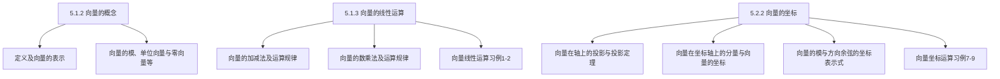

## 5.2 空间直角坐标系与向量坐标表示

5.1.1 引 例
5.1.2 向量的概念
5.1.3 向量的线性运算
5.2 ． 1 空间直角坐标系 习例3－4
5.2.2 向量的坐标

引 例：如图所示，一质量为 $\mathbf{m}$ 的物体受到外力 $\mathbf{F}$ 的作用做直线运动，不计摩擦力。
（1）物体的加速度是多少？方向如何？
（2）物体在 t 时刻的速度是多少？方向如何？
（3）经过 t 时间物体的位移等于多少？方向如何？

答案：（1） $\mathbf{a}=\mathbf{F} / \mathbf{m}$ ，方向向右；
（2）$v=v_{0}+a t$ ，方向向右；
（3）$s=v_{0} t+a t^{2} / 2$ ，向右移动．
