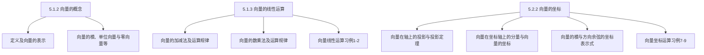

## 5.2 空间直角坐标系与向量坐标表示

5.1.1 引 例
5.1.2 向量的概念
5.1.3 向量的线性运算
5.2 ． 1 空间直角坐标系 习例3－4
5.2.2 向量的坐标

引 例：如图所示，一质量为 $\mathbf{m}$ 的物体受到外力 $\mathbf{F}$ 的作用做直线运动，不计摩擦力。
（1）物体的加速度是多少？方向如何？
（2）物体在 t 时刻的速度是多少？方向如何？
（3）经过 t 时间物体的位移等于多少？方向如何？

答案：（1） $\mathbf{a}=\mathbf{F} / \mathbf{m}$ ，方向向右；
（2）$v=v_{0}+a t$ ，方向向右；
（3）$s=v_{0} t+a t^{2} / 2$ ，向右移动．

## 向量的定义：

定义5.1.1 既有大小又有方向的量叫做向量（或矢量）．注意：向量除了与标量一样有大小以外，还有方向．
向量的表示

常用一条有方向的线段，即有向线段来表示向量．
有向线段的长度表示向量的大小，有向线段的方向表示向量的方向。
以 $\mathbf{M}_{1}$ 为起点、 $\mathbf{M}_{2}$ 为终点的有向线段所表示的向量记作 ${\overrightarrow{M_{1} M_{2}}}$
也用一个黑体字母（书写时，在字母上面加箭头）来表示向量．
例如 $\boldsymbol{a} 、 \boldsymbol{r} 、 \boldsymbol{v} 、 \boldsymbol{F}$ 或 $\bar{a} 、 \bar{r} 、 \bar{v} 、 \bar{F}$ 等等．

1．向量的模：向量的大小或长短，$|\vec{a}|$ 或 $\left|\vec{M}_{1} \vec{M}_{2}\right|$ ．
2．单位向量：模为 1 的向量， $\overrightarrow{a^{\mathbf{0}}}$ 或 $\overrightarrow{M_{1} M_{2}^{\mathbf{0}}}$ ．
3．零向量：模为 $\mathbf{0}$ 的向量， $\overrightarrow{\mathbf{0}}$ ．零向量的起点和终点重合，它的方向可以看做是任意的．

4．自由向量：不考虑起点位置的向量．
5．相等向量：大小相等且方向相同的向量．

$$
\vec{a} \longrightarrow \vec{b} \longrightarrow
$$

6．负向量：大小相等但方向相反的向量．

$$
-\vec{a} \longleftrightarrow \vec{a}
$$

7．向径：起点在原点的向量． $\overrightarrow{O M}$
8．平行向量：
两个非零向量如果它们的方向相同或者相反．
9．共面向量：
设有 $\mathrm{k}(\mathrm{k}>3)$ 个向量，当把它们的起点放在同一点时，如果 k 个终点和公共起点在一个平面上，就称这k个向量共面．

## 二、向量的线性运算

1．向量的加减法加法：$\vec{a}+\vec{b}=\vec{c}$
（平行四边形法则）

$\vec{a}$

（平行四边形法则有时也称为三角形法则）特殊地：若 $\overrightarrow{a l} \vec{b}$ 分为同向和反向

向量的加法符合下列运算规律：
（1）交换律：$\vec{a}+\vec{b}=\vec{b}+\vec{a}$ ．
（2）结合律：$\vec{a}+\vec{b}+\vec{c}=(\vec{a}+\vec{b})+\vec{c}=\vec{a}+(\vec{b}+\vec{c})$ ．
（3）$\vec{a}+(-\vec{a})=\overrightarrow{\mathbf{0}}$ ．
减法：$\vec{a}-\vec{b}=\vec{a}+(-\vec{b})$

$$
\begin{aligned}
\vec{c} & =\vec{a}+(-\vec{b}) \\
& =\vec{a}-\vec{b}
\end{aligned}
$$

## 2.向量与数的乘法

设 $\lambda$ 是一个数，向量 $\vec{a}$ 与数 $\lambda$ 的乘积规定为
（1）$\lambda>0, \quad \lambda \vec{a}$ 与 $\vec{a}$ 同向，$|\lambda \vec{a}|=\lambda|\vec{a}|$
（2）$\lambda=0, \quad \lambda \vec{a}=\overrightarrow{0}$
（3）$\lambda<0, \quad \lambda \vec{a}$ 与 $\vec{a}$ 反向，$|\lambda \vec{a}|=|\lambda| \cdot|\vec{a}|$

$\vec{a}$

$2 \vec{a}$

$$
-\frac{1}{2} \vec{a}
$$

数与向量的乘积符合下列运算规律：
（1）结合律：$\lambda(\mu \vec{a})=\mu(\lambda \vec{a})=(\lambda \mu) \vec{a}$
（2）分配律：$(\lambda+\mu) \vec{a}=\lambda \vec{a}+\mu \vec{a}$

$$
\lambda(\vec{a}+\vec{b})=\lambda \vec{a}+\lambda \vec{b}
$$

两个向量的平行关系：
定理5.1.1 设向量 $\vec{a} \neq 0$ ，那么那么 $\vec{b}$ 平行于 $\vec{a}$ 的充分必要条件是：存在唯一的实数 $\lambda$ ，使 $\vec{b}=\lambda \vec{a}$ ．

证 充分性显然；
必要性 设 $\vec{b} \mid \vec{a}$ 取 $|\lambda|=|\vec{b}|$ ，
当 $\vec{b}$ 与 $\vec{a}$ 同向时 $\lambda$ 取正值，
当 $\vec{b}$ 与 $\vec{a}$ 反向时 $\lambda$ 取负值，即有 $\vec{b}=\lambda \vec{a}$ ．
∵ 此时 $\vec{b}$ 与 $\lambda \vec{a}$ 同向。且 $|\lambda \vec{a}|=\lambda| | \vec{a}\left|=\frac{|\vec{b}|}{|\vec{a}|}\right| \vec{a}|=|\vec{b}|$ ．
$\lambda$ 的唯一性．设 $\vec{b}=\lambda \vec{a}$ ，又设 $\vec{b}=\mu \vec{a}$ ，
两式相减，得 $(\lambda-\mu) \vec{a}=\overrightarrow{0}$ ，即 $|\lambda-\mu||\vec{a}|=0$ ，
$\because \overrightarrow{\boldsymbol{a}} \neq \mathbf{0}$ ，故 $\mid \lambda-\mu=\mathbf{0}$ ，即 $\lambda=\mu$ 。

注：设 $\vec{a}^{0}$ 表示与非零向量 $\vec{a}$ 同方向的单位向量，按照向量与数的乘积的规定，

$$
\vec{a}=|\vec{a}| \vec{a}^{0} \Longrightarrow \frac{\vec{a}}{|\vec{a}|}=\vec{a}^{0}
$$

上式表明：一个非零向量除以它的模的结果是一个与原向量同方向的单位向量．

## 向量线性运算习例

例1．化简 $\vec{a}-\vec{b}+5\left(-\frac{1}{2} \vec{b}+\frac{\vec{b}-3 \vec{a}}{5}\right)$
例2．试用向量方法证明：对角线互相平分的四边形必是平行四边形．

例1．化简 $\vec{a}-\vec{b}+5\left(-\frac{1}{2} \vec{b}+\frac{\vec{b}-3 \vec{a}}{5}\right)$
解 $\vec{a}-\vec{b}+5\left(-\frac{1}{2} \vec{b}+\frac{\vec{b}-3 \vec{a}}{5}\right)$

$$
\begin{aligned}
& =(1-3) \vec{a}+\left(-1-\frac{5}{2}+\frac{1}{5} \cdot 5\right) \vec{b} \\
& =-2 \vec{a}-\frac{5}{2} \vec{b}
\end{aligned}
$$

例2 试用向量方法证明：对角线互相平分的四边形必是平行四边形．

证 $\because \overrightarrow{A M}=\overrightarrow{M C}$

$$
\begin{aligned}
\overrightarrow{B M} & =\overrightarrow{M D} \\
\therefore & \overrightarrow{A D}=\overrightarrow{A M}+\overrightarrow{M D}=\overrightarrow{M C}+\overrightarrow{B M}=\overrightarrow{B C} \\
& \overrightarrow{A D} \text { 与 } \overrightarrow{B C} \text { 平行且相等, 结论得证. }
\end{aligned}
$$

## 1、空间点的直角坐标

三个坐标轴的正方向符合右手系。

即以右手握住 $z$ 轴，当右手的四个手指从正向 $\boldsymbol{x}$ 轴以 $\frac{\pi}{2}$ 角度转向正向 $\boldsymbol{y}$ 轴时，大拇指的指向就是 $z$ 轴的正向。

空间直角坐标系共有八个卦限

空间的点 $\stackrel{1--1}{\longleftrightarrow}$ 有序数组 $(x, y, z)$
特殊点的表示：坐标轴上的点 $\boldsymbol{P}, \boldsymbol{Q}, \boldsymbol{R}$ ，坐标面上的点 $A, B, C, \quad O(0,0,0)$

## 2、空间两点间的距离

设 $M_{1}\left(x_{1}, y_{1}, z_{1}\right) 、 M_{2}\left(x_{2}, y_{2}, z_{2}\right)$ 为空间两点

$$
d=\left|M_{1} M_{2}\right|=?
$$

在直角 $\Delta M_{1} N M_{2}$及直角 $\Delta M_{1} P N$中，使用勾股定理知

$$
\begin{aligned}
& \because\left|M_{1} P\right|=\left|x_{2}-x_{1}\right|, \\
& |P N|=\left|y_{2}-y_{1}\right|, \\
& \left|N M_{2}\right|=\left|z_{2}-z_{1}\right|, \\
& \therefore d=\sqrt{\left|M_{1} P\right|^{2}+|P N|^{2}+\left|N M_{2}\right|^{2}} \\
& \frac{\left|M_{1} M_{2}\right|=\sqrt{\left(x_{2}-x_{1}\right)^{2}+\left(y_{2}-y_{1}\right)^{2}+\left(z_{2}-z_{1}\right)^{2}} .}{\text { 空间两点间距离公式 }}
\end{aligned}
$$

特殊地：若两点分别为 $M(x, y, z), O(0,0,0)$

$$
d=|O M|=\sqrt{x^{2}+y^{2}+z^{2}} .
$$

## 空间直角坐标系习例

例3。 求证以 $M_{1}(4,3,1), M_{2}(7,1,2), M_{3}(5,2,3)$三点为定点的三角形是一个等腰三角形。

例4．设 $P$ 在 $x$ 轴上，它到 $P_{1}(0, \sqrt{2}, 3)$ 的距离为到点 $\boldsymbol{P}_{\mathbf{2}}(0,1,-1)$ 的距离的两倍，求 $\boldsymbol{P}$ 点的坐标。

例3．求证以 $M_{1}(4,3,1), M_{2}(7,1,2), M_{3}(5,2,3)$三点为定点的三角形是一个等腰三角形。

解

$$
\begin{aligned}
& \left|M_{1} M_{2}\right|^{2}=(7-4)^{2}+(1-3)^{2}+(2-1)^{2}=14, \\
& \left|M_{2} M_{3}\right|^{2}=(5-7)^{2}+(2-1)^{2}+(3-2)^{2}=6, \\
& \left|M_{3} M_{1}\right|^{2}=(4-5)^{2}+(3-2)^{2}+(1-3)^{2}=6, \\
& \therefore\left|M_{2} M_{3}\right|=\mid M_{3} M_{1}, \quad \text { 原结论成立. }
\end{aligned}
$$

例4．设 $P$ 在 $x$ 轴上，它到 $P_{1}(0, \sqrt{2}, 3)$ 的距离为到点 $\boldsymbol{P}_{\mathbf{2}}(\mathbf{0 , 1 , - 1})$ 的距离的两倍，求 $\boldsymbol{P}$ 点的坐标．

解 因为 $\boldsymbol{P}$ 在 $\boldsymbol{x}$ 轴上，设 $\boldsymbol{P}$ 点坐标为 $(\boldsymbol{x}, \mathbf{0}, \mathbf{0})$ ，

$$
\begin{aligned}
\left|P P_{1}\right| & =\sqrt{x^{2}+(\sqrt{2})^{2}+3^{2}}=\sqrt{x^{2}+11}, \\
\left|P P_{2}\right| & =\sqrt{x^{2}+(-1)^{2}+1^{2}}=\sqrt{x^{2}+2}, \\
\because\left|P P_{1}\right| & =2 P P_{2} \mid, \quad \therefore \sqrt{x^{2}+11}=2 \sqrt{x^{2}+2}
\end{aligned}
$$

$\Rightarrow x= \pm 1$ ，所求点为 $(1,0,0),(-1,0,0)$ ．
