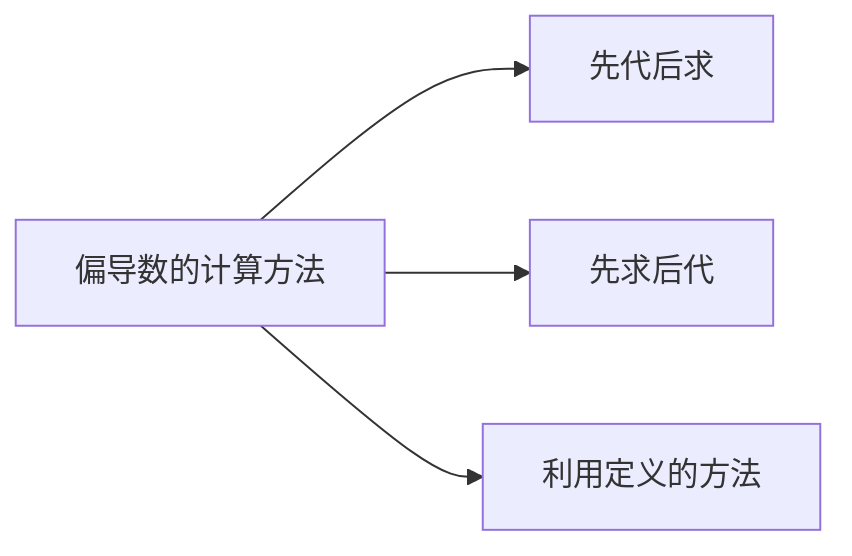

## 内容小结

1．偏导数的概念及有关结论

- 定义；记号；几何意义
- 函数在一点偏导数存在 ⟶ 函数在此点连续
- 混合偏导数连续 → 与求导顺序无关

2．偏导数的计算方法

- 偏导数的计算方法

- 求高阶偏导数的方法 $\_\_\_\_$逐次求导法
（与求导顺序无关时，应选择方便的求导顺序）

## 一、填空题：

1、设 $z=\ln \tan \frac{x}{y}$ ，则 $\frac{\partial z}{\partial x}=$ $\_\_\_\_$ $; \frac{\partial z}{\partial y}=$ $\_\_\_\_$ ．

2、设 $z=e^{x y}(x+y)$ ，则 $\frac{\partial z}{\partial x}=$ $\_\_\_\_$ $; \frac{\partial z}{\partial y}=$ $\_\_\_\_$ ．

3、设 $u=x^{\frac{y}{z}}$ ，则 $\frac{\partial u}{\partial x}=$ $\_\_\_\_$ $; \frac{\partial u}{\partial y}=$ $\_\_\_\_$ ； $\frac{\partial u}{\partial z}=$ $\_\_\_\_$ ．
4、设 $z=\arctan \frac{y}{x}$ ，则 $\frac{\partial^{2} z}{\partial x^{2}}=$ $\_\_\_\_$ $; \frac{\partial^{2} z}{\partial y^{2}}=$ $\_\_\_\_$ ；
$\frac{\partial^{2} z}{\partial x \partial y}=$ $\_\_\_\_$ ．

5、设 $u=\left(\frac{x}{y}\right)^{z}$ ，则 $\frac{\partial^{2} u}{\partial z \partial y}=$ $\_\_\_\_$ ．
二、求下列函数的偏导数：
1、 $z=(1+x y)^{y}$ ；
2、 $\boldsymbol{u}=\arctan (\boldsymbol{x}-\boldsymbol{y})^{z}$ ．
三、曲线 $\left\{\begin{array}{l}z=\frac{x^{2}+y^{2}}{4} \\ y=4\end{array}\right.$ ，在点 $(2,4,5)$ 处的切线与正向 $x$
轴所成的倾角是多少？
四、设 $z=y^{x}$ ，求 $\frac{\partial^{2} z}{\partial x^{2}}, \frac{\partial^{2} z}{\partial y^{2}}$ 和 $\frac{\partial^{2} z}{\partial x \partial y}$ ．
五、设 $z=x \ln (x y)$ ，求 $\frac{\partial^{3} z}{\partial x^{2} \partial y}$ 和 $\frac{\partial^{3} z}{\partial x \partial y^{2}}$ ．

六、验证：
1、 $z=e^{-\left(\frac{1}{x}+\frac{1}{y}\right)}$ ，满足 $x^{2} \frac{\partial z}{\partial x}+y^{2} \frac{\partial z}{\partial y}=2 z$ ；
2、 $r=\sqrt{x^{2}+y^{2}+z^{2}}$ 满足

$$
\frac{\partial^{2} r}{\partial x^{2}}+\frac{\partial^{2} r}{\partial y^{2}}+\frac{\partial^{2} r}{\partial z^{2}}=\frac{z}{r}
$$

七、设

$$
f(x, y)=\left\{\begin{array}{l}
x^{2} \arctan \frac{y}{x}-y^{2} \arctan \frac{x}{y}, x y \neq 0 \\
0, x y=0
\end{array}\right.
$$

求 $f_{x}, f_{x y}$ ．

## 练习题答案

一、 $1 、 \frac{2}{y} \csc \frac{2 x}{y},-\frac{2 x}{y^{2}} \csc \frac{2 x}{y}$ ；
$2 、 e^{x y}\left(x y+y^{2}+1\right), e^{x y}\left(x y+x^{2}+1\right)$ ；
3、 $\frac{y}{z} x^{\frac{y}{z}-1}, \frac{1}{z} x^{\frac{y}{z}} \ln x, \quad-\frac{y}{z^{2}} x^{\frac{y}{z}} \ln x$ ；
4、 $\frac{2 x y}{\left(x^{2}+y^{2}\right)^{2}},-\frac{2 x y}{\left(x^{2}+y^{2}\right)^{2}}, \frac{y^{2}-x^{2}}{\left(x^{2}+y^{2}\right)^{2}}$ ；
5、 $-\left(\frac{x}{y}\right)^{z}\left(\frac{1}{y}+\frac{z}{y} \ln \frac{x}{y}\right)$ ．
二、1、

$$
\frac{\partial z}{\partial x}=y^{2}(1+x y)^{y-1}, \frac{\partial z}{\partial y}=(1+x y)^{y}\left[\ln (1+x y)+\frac{x y}{1+x y}\right] ;
$$

$$
\text { 2、 } \begin{aligned}
\frac{\partial u}{\partial x} & =\frac{z(x-y)^{z-1}}{1+(x-y)^{2 z}}, \frac{\partial u}{\partial y}=\frac{-z(x-y)^{z-1}}{1+(x-y)^{2 z}} \\
\frac{\partial u}{\partial z} & =\frac{(x-y) \ln (x-y)}{1+(x-y)^{2 z}}
\end{aligned}
$$

三、 $\frac{\pi}{4}$ ．
四、 $\frac{\partial^{2} z}{\partial x^{2}}=y^{x} \ln ^{2} y, \frac{\partial^{2} z}{\partial y^{2}}=x(x-1) y^{x-2}$ ，

$$
\frac{\partial^{2} z}{\partial x \partial y}=y^{x-1}(x \ln y+1)
$$

五、 $\frac{\partial^{3} z}{\partial x^{2} \partial y}=0, \frac{\partial^{3} z}{\partial x \partial y^{2}}=-\frac{1}{y^{2}}$ ．

$$
\begin{gathered}
\text { 七. } f_{x}=\left\{\begin{array}{l}
2 x \arctan \frac{y}{x}-y, x y \neq 0 \\
-y, x=0, y \neq 0 \\
0, x=y=0 ; x \neq 0, y=0
\end{array},\right. \\
f_{x y}=\left\{\begin{array}{l}
-1, x=0 \\
\frac{x^{2}-y^{2}}{x^{2}+y^{2}}, x y \neq 0 . \\
1, x \neq 0, y=0
\end{array}\right.
\end{gathered}
$$
