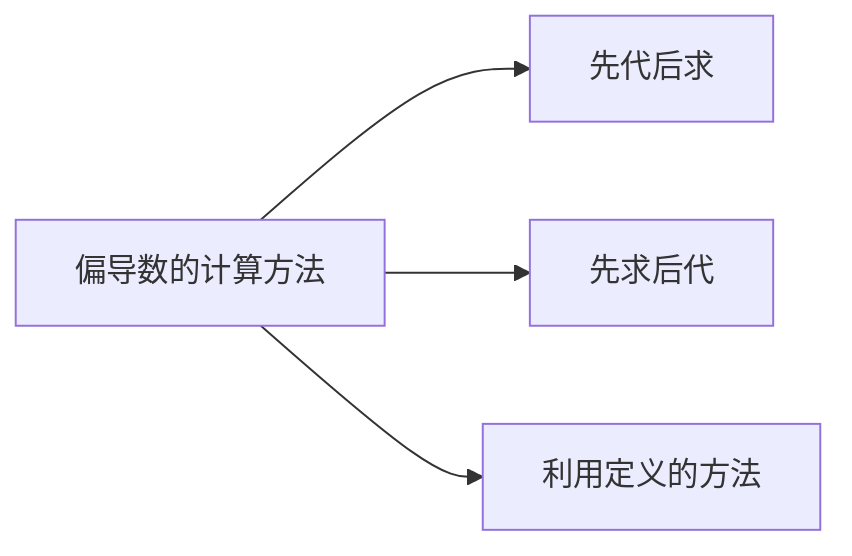

## 内容小结

1．偏导数的概念及有关结论

- 定义；记号；几何意义
- 函数在一点偏导数存在 ⟶ 函数在此点连续
- 混合偏导数连续 → 与求导顺序无关

2．偏导数的计算方法

- 偏导数的计算方法

```mermaid
flowchart LR
    A["偏导数的计算方法"] --> A1["先代后求"]
    A --> A2["先求后代"]
    A --> A3["利用定义的方法"]
```
- 求高阶偏导数的方法 $\_\_\_\_$逐次求导法
（与求导顺序无关时，应选择方便的求导顺序）
