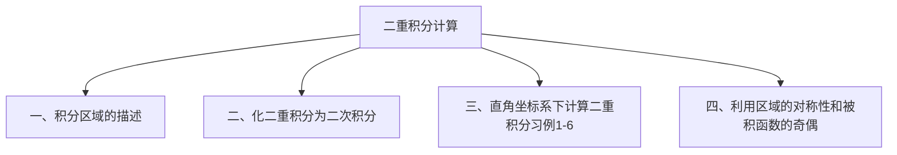

## 7.1 重积分

7.1.2 二重积分的计算

直角坐标系下重积分的计算

```mermaid
flowchart TD
    A["二重积分计算"] --> A1["一、积分区域的描述"]
    A --> A2["二、化二重积分为二次积分"]
    A --> A3["三、直角坐标系下计算二重积分习例1-6"]
    A --> A4["四、利用区域的对称性和被积函数的奇偶"]
```
