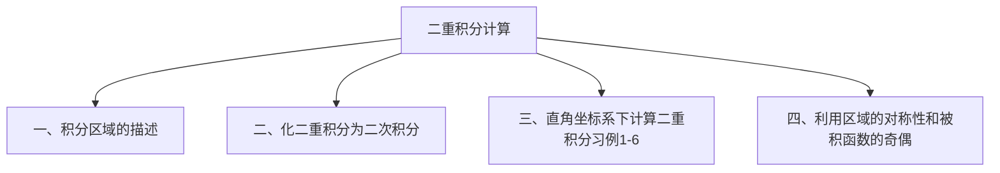

## 7.1 重积分

7.1.2 二重积分的计算

直角坐标系下重积分的计算

## 一、积分区域的描述

在直角坐标系下用平行于坐标轴的直线网来划分区域 $D$ ，如图。

可见，除边缘外，其余均为矩形，其面积为

$$
\Delta \sigma=\Delta x \Delta y
$$

则面积元素为 $d \sigma=d x d y$故二重积分可写为

$$
\iint_{D} f(x, y) d \sigma=\iint_{D} f(x, y) d x d y
$$

其中 $\boldsymbol{d} \boldsymbol{x} \boldsymbol{d} \boldsymbol{y}$ 称为面积元素．

特点：穿过 $D$ 的内部且平行于 $y$ 轴的直线与 $D$ 的边界的交点不多于两个，其不等式组的表示如下
$D_{x}:\left\{\begin{array}{l}\varphi_{1}(x) \leq y \leq \varphi_{2}(x) \\ a \leq x \leq b\end{array}\right.$
则称此积分区域是 $x$ 型区域。

## 利用二重积分的几何意义化二重积分为二次积分

根据二重积分的几何意义：若 $f(x, y) \geq 0$ ，则二重积分是以 $z=f(x, y)$ 为顶的曲顶柱体的体积。
故可以考虑用定积分应用中求平行截面面积为已知的立体的体积的方法。

平行截面面积已知的立体的体积

## （1）当积分区域如图所示

相应的曲顶柱体如右图。
在区间 $[a, b]$ 内任取一点 $x$ ，过此点作与 $y o z$面平行的平面，它与曲顶柱体相交得到一个一个曲边梯形：

在区间 $[a, b]$ 内任取一点 x ，过此点作与 $y \mathrm{oz}$面平行的平面，它与曲顶柱体相交得到一个一个曲边梯形：

> 底为 $\varphi_{1}(x) \leq y \leq \varphi_{2}(x)$
> 高为 $z=f(x, y)$

注意D的特殊之处。

$$
\mathrm{Z} \quad z=f(x, y)
$$

$$
A(x)=\int_{\varphi_{1}(x)}^{\varphi_{2}(x)} f(x, y) d y
$$

y
所以：

$$
\begin{gathered}
\iint_{D} f(x, y) d x d y=\int_{a}^{b} A(x) d x=\int_{a}^{b}\left[\int_{\varphi_{1}(x)}^{\varphi_{2}(x)} f(x, y) d y\right] d x \\
\quad \text { •二重积分 } \quad \rightarrow \text { •二次定积分 }
\end{gathered}
$$

$$
\begin{aligned}
& \therefore A(x)=\int_{\varphi_{1}(x)}^{\varphi_{2}(x)} f(x, y) d y \\
& \therefore \iint_{D} f(x, y) d \sigma=\int_{a}^{b}\left[\int_{\varphi_{1}(x)}^{\varphi_{2}(x)} f(x, y) d y\right] d x
\end{aligned}
$$

## 注意：

（1）先对 $y$ 后对 $x$ 的二次积分，计算时先把 $x$ 看作常数，对 $y$ 积分得到关于 $x$ 的函数，再对 $x$ 在 $[a, b]$ 上积分，记为

$$
\iint_{D} f(x, y) d \sigma=\int_{a}^{b} d x \int_{\varphi_{1}(x)}^{\varphi_{2}(x)} f(x, y) d y
$$

（2）$f(x, y)<0$ 时公式仍成立。

利用X一型区域 D 的不等式组表示，

$$
D_{x \text {-型 }}=\left\{\begin{array}{c}
a \leq x \leq b \\
\varphi_{1}(x) \leq y \leq \varphi_{2}(x)
\end{array},\right.
$$

有助于记住前面推出的二重积分计算公式：

$$
\iint_{D} f(x, y) d x d y=\int_{a}^{b}\left[\int_{\varphi_{1}(x)}^{\varphi_{2}(x)} f(x, y) d y\right] d x=\int_{a}^{b} d x \int_{\varphi_{1}(x)}^{\varphi_{2}(x)} f(x, y) d y
$$

（3）类似地，若积分区域为

$$
D_{y}\left\{\begin{array}{c}
c \leq y \leq d \\
\psi_{1}(y) \leq x \leq \psi_{2}(y)
\end{array},\right.
$$

则可将二重积分化为先积 $x$ 后积 $y$ 的二次积分：

特点：穿过 $D$ 的内部且平行于 $x$ 轴的直线与 $D$的边界的交点不多于两个，则称此积分区域是 $y$ 型区域。

$$
\iint_{D} f(x, y) d \sigma=\int_{c}^{d} d y \int_{\psi_{1}(y)}^{\psi_{2}(y)} f(x, y) d x
$$

（4）若 $D$ 既可表为 $x$ —型区域，又可表为 $y$ —型区域时，则

$$
\iint_{D} f(x, y) d \sigma=\int_{a}^{b} d x \int_{\varphi_{1}(x)}^{\varphi_{2}(x)} f(x, y) d y=\int_{c}^{d} d y \int_{\psi_{1}(y)}^{\psi_{2}(y)} f(x, y) d x
$$

（5）若 $D$ 既不是 $x$ —型区域又不是 $y$ —型区域时，则把 $D$ 分块得到一些 $x$ —型区域和 $y$ —型区域。
（1）画区域图；
（2）列出 $\boldsymbol{x}$ 型或 $\boldsymbol{y}$ 型区域的不等式组表示；
（3）计算二次积分
（若一种次序积不出来时，换另一种次序）。
