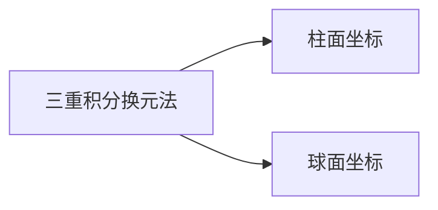

## 三、小结

三重积分换元法

（1）柱面坐标的体积元素

$$
d x d y d z=r d r d \theta d z
$$

（2）球面坐标的体积元素

$$
d x d y d z=\rho^{2} \sin \varphi d \rho d \theta d \varphi
$$

## 三重积分的计算小结

| 坐标系 | 体积元素 | 适用情况 |
| :---: | :---: | :---: |
| 直角坐标系 | $\mathrm{d} x \mathrm{~d} y \mathrm{~d} z$ |  |
| 柱面坐标系 | $r \mathrm{~d} r \mathrm{~d} \theta \mathrm{~d} z$ |  |
| 球面坐标系 | $\rho^{2} \sin \varphi \mathrm{~d} \rho \mathrm{~d} \varphi \mathrm{~d} \theta$ |  |

其它换元法
说明：
三重积分类似于二重积分也可以利用对称性计算。
