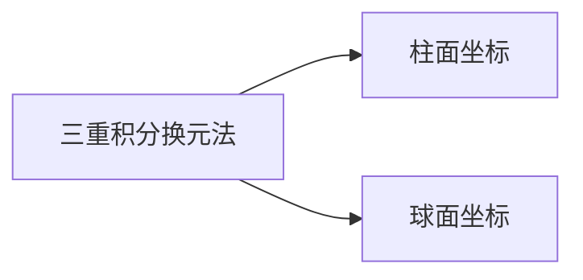

## 三、小结

三重积分换元法

```mermaid
flowchart LR
    A["三重积分换元法"] --> A1["柱面坐标"]
    A --> A2["球面坐标"]
```
（1）柱面坐标的体积元素

$$
d x d y d z=r d r d \theta d z
$$

（2）球面坐标的体积元素

$$
d x d y d z=\rho^{2} \sin \varphi d \rho d \theta d \varphi
$$
