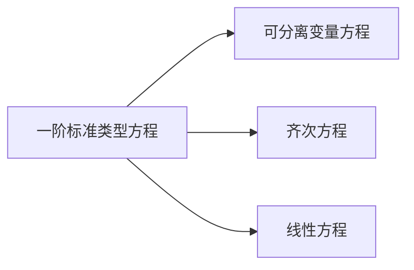
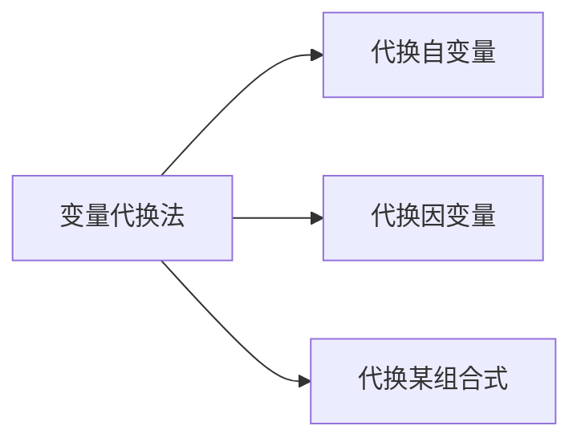

## 一阶微分方程求解

1．一阶标准类型方程求解
三个标准类型

关键：辨别方程类型，掌握求解步骤
2．一阶非标准类型方程求解
变量代换法

例1．求下列方程的通解
（1）$y^{\prime}+\frac{1}{y^{2}} \mathrm{e}^{y^{3}+x}=0$ ；
（2）$y^{\prime}=\frac{3 x^{2}+y^{2}}{2 x y}$ ；
（3）$x y^{\prime}=\sqrt{x^{2}-y^{2}}+y$ ；
（4）$y^{\prime}=\frac{1}{2 x-y^{2}}$ ．

例2．求下列方程的通解：
（1）$x y^{\prime}+y=y(\ln x+\ln y)$
（2） $2 x \ln x \mathrm{~d} y+y\left(y^{2} \ln x-1\right) \mathrm{d} x=0$
（3）$y^{\prime}=\frac{3 x^{2}+y^{2}-6 x+3}{2 x y-2 y}$

例1．求下列方程的通解
（1）$y^{\prime}+\frac{1}{y^{2}} \mathrm{e}^{y^{3}+x}=0$ ；
（2）$y^{\prime}=\frac{3 x^{2}+y^{2}}{2 x y}$ ；
（3）$x y^{\prime}=\sqrt{x^{2}-y^{2}}+y$ ；
（4）$y^{\prime}=\frac{1}{2 x-y^{2}}$ ．

提示：（1）因 $\mathrm{e}^{y^{3}+x}=\mathrm{e}^{y^{3}} \mathrm{e}^{x}$ ，故为分离变量方程：

$$
-y^{2} \mathrm{e}^{-y^{3}} \mathrm{~d} y=\mathrm{e}^{x} \mathrm{~d} x
$$

通解

$$
\frac{1}{3} \mathrm{e}^{-y^{3}}=\mathrm{e}^{x}+C
$$

（2）这是一个齐次方程，令 $y=u x$ ，化为分离变量方程：

$$
\frac{2 u \mathrm{~d} u}{3-u^{2}}=\frac{\mathrm{d} x}{x}
$$

（3）$x y^{\prime}=\sqrt{x^{2}-y^{2}}+y$
方程两边同除以 $\boldsymbol{x}$ 即为齐次方程，令 $\boldsymbol{y}=\boldsymbol{u} \boldsymbol{x}$ ，化为分离变量方程。
$x>0$ 时，$y^{\prime}=\sqrt{1-\left(\frac{y}{x}\right)^{2}}+\frac{y}{x} \Longrightarrow x u^{\prime}=\sqrt{1-u^{2}}$
$x<0$ 时，$y^{\prime}=-\sqrt{1-\left(\frac{y}{x}\right)^{2}}+\frac{y}{x} \Longrightarrow x u^{\prime}=-\sqrt{1-u^{2}}$
（4）$y^{\prime}=\frac{1}{2 x-y^{2}}$
调换自变量与因变量的地位，化为 $\frac{\mathrm{d} x}{\mathrm{~d} y}-2 x=-y^{2}$ ，用线性方程通解公式求解．

例2．求下列方程的通解：
（1）$x y^{\prime}+y=y(\ln x+\ln y)$
（2） $2 x \ln x \mathrm{~d} y+y\left(y^{2} \ln x-1\right) \mathrm{d} x=0$
（3）$y^{\prime}=\frac{3 x^{2}+y^{2}-6 x+3}{2 x y-2 y}$
提示：（1）原方程化为 $(x y)^{\prime}=y \ln (x y)$
令 $\boldsymbol{u}=\boldsymbol{x} \boldsymbol{y}$ ，得 $\frac{\mathrm{d} u}{\mathrm{~d} x}=\frac{u}{x} \ln u \quad$（分离变量方程）
（2）将方程改写为
$\frac{\mathrm{d} y}{\mathrm{~d} x}-\frac{1}{2 x \ln x} y=-\frac{y^{3}}{2 x} \quad$（伯努利方程）令 $z=y^{-2}$
（3）$y^{\prime}=\frac{3 x^{2}+y^{2}-6 x+3}{2 x y-2 y}$
化方程为 $\frac{\mathrm{d} y}{\mathrm{~d} x}=\frac{3(x-1)^{2}+y^{2}}{2 y(x-1)}$
令 $t=\boldsymbol{x}-\mathbf{1}$ ，则 $\frac{\mathrm{d} y}{\mathrm{~d} x}=\frac{\mathrm{d} y}{\mathrm{~d} t} \frac{\mathrm{~d} t}{\mathrm{~d} x}=\frac{\mathrm{d} y}{\mathrm{~d} t} \frac{\mathrm{d} y}{\mathrm{~d} t}=\frac{3 t^{2}+y^{2}}{2 t y}$（齐次方程）

令 $y=u t$
可分离变量方程求解

习题1 求以 $(x+C)^{2}+y^{2}=1$ 为通解的微分方程．
提示：$\left\{\begin{array}{l}(x+C)^{2}+y^{2}=1 \\ 2(x+C)+2 y y^{\prime}=0\end{array}\right.$ 消去 C 得 $y^{2}\left(y^{\prime 2}+1\right)=1$
习题2 求下列微分方程的通解：
（1）$x y^{\prime}+y=2 \sqrt{x y}$
提示：令 $\boldsymbol{u}=\boldsymbol{x} \boldsymbol{y}$ ，化成可分离变量方程：$\quad u^{\prime}=2 \sqrt{u}$
（2）$x y^{\prime} \ln x+y=a x(\ln x+1)$
提示：这是一阶线性方程，其中

$$
P(x)=\frac{1}{x \ln x}, \quad Q(x)=a\left(1-\frac{1}{\ln x}\right)
$$

（3）$\frac{\mathrm{d} y}{\mathrm{~d} x}=\frac{y}{2(\ln y-x)}$
提示：可化为关于 $\boldsymbol{x}$ 的一阶线性方程 $\frac{\mathrm{d} x}{\mathrm{~d} y}+\frac{2}{y} x=\frac{2 \ln y}{y}$
${ }^{*}(4) \frac{\mathrm{d} y}{\mathrm{~d} x}+x y-x^{3} y^{3}=0$
提示：为伯努利方程，令 $z=y^{-2}$
（6）$y y^{\prime \prime}-y^{\prime 2}-1=0$
提示：为可降阶方程，令 $\quad p=y^{\prime} \quad(p=p(y))$
${ }^{*}(9)\left(y^{4}-3 x^{2}\right) \mathrm{d} y+x y \mathbf{d} x=0$
提示：可化为伯努利方程令 $z=x^{2}$

$$
y \frac{\mathrm{~d} x}{\mathrm{~d} y}-3 x=-\frac{y^{4}}{x}
$$

（10）$y^{\prime}+x=\sqrt{x^{2}+y}$
提示：令 $u=\sqrt{x^{2}+y}-x$ ，即 $y=2 x u+u^{2}$ ，则

$$
\frac{\mathrm{d} y}{\mathrm{~d} x}=2 u+2 x \frac{\mathrm{~d} u}{\mathrm{~d} x}+2 u \frac{\mathrm{~d} u}{\mathrm{~d} x}
$$

原方程化为

$$
\begin{aligned}
& 2 u+2(x+u) \frac{\mathrm{d} u}{\mathrm{~d} x}=u \Longrightarrow \frac{\mathrm{~d} x}{\mathrm{~d} u}+\frac{2}{u} x=-2 \\
& x=\mathrm{e}^{-\int \frac{2}{u} \mathrm{~d} u}\left[\int-2 \mathrm{e}^{\int \frac{2}{u} \mathrm{~d} u} \mathrm{~d} u+C\right] \\
& \quad=\frac{1}{u^{2}}\left[\int-2 u^{2} \mathrm{~d} u+C\right]=-\frac{2}{3} u^{2}+\frac{C}{u^{2}}
\end{aligned}
$$

故原方程通解 $\quad \sqrt{\left(x^{2}+y\right)^{3}}=x^{3}+\frac{3}{2} x y+C$
