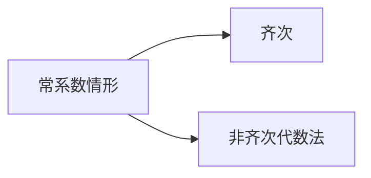

## 两类二阶微分方程的解法

1．可降阶微分方程的解法—降阶法

- $\frac{\mathrm{d}^{2} y}{\mathrm{~d} x^{2}}=f(x) \longrightarrow$ 逐次积分求解
- $\frac{\mathrm{d}^{2} y}{\mathrm{~d} x^{2}}=f\left(x, \frac{\mathrm{~d} y}{\mathrm{~d} x}\right) \xrightarrow{\text { 令 } p(x)=\frac{\mathrm{d} y}{\mathrm{~d} x}} \frac{\mathrm{~d} p}{\mathrm{~d} x}=f(x, p)$
- $\frac{\mathrm{d}^{2} y}{\mathrm{~d} x^{2}}=f\left(y, \frac{\mathrm{~d} y}{\mathrm{~d} x}\right) \xrightarrow{\text { 令 } p(y)=\frac{\mathrm{d} y}{\mathrm{~d} x}} p \frac{\mathrm{~d} p}{\mathrm{~d} y}=f(y, p)$

2．二阶线性微分方程的解法

- 常系数情形

- 欧拉方程

$$
\begin{gathered}
x^{2} y^{\prime \prime}+p x y^{\prime}+q y=f(x) \\
\downarrow \text { 令 } x=\mathrm{e}^{t}, D=\frac{\mathrm{d}}{\mathrm{~d} t} \\
{[D(D-1)+p D+q] y=f\left(\mathrm{e}^{t}\right)}
\end{gathered}
$$

例3 求微分方程 $\left\{\begin{array}{ll}y^{\prime \prime}+y=x, & x \leq \frac{\pi}{2} \\ y^{\prime \prime}+4 y=0, & x>\frac{\pi}{2}\end{array}\right.$ 满足条件 $\left.y\right|_{x=0}=0,\left.y^{\prime}\right|_{x=0}=0$ ，在 $x=\frac{\pi}{2}$ 处连续且可微的解．例4 设函数 $y=y(x)$ 在 $(-\infty,+\infty)$ 内具有连续二阶导数，且 $y^{\prime} \neq 0, x=x(y)$ 是 $y=y(x)$ 的反函数，
（1）试将 $x=x(y)$ 所满足的微分方程

$$
\frac{\mathrm{d}^{2} x}{\mathrm{~d} y^{2}}+(y+\sin x)\left(\frac{\mathrm{d} x}{\mathrm{~d} y}\right)^{3}=0
$$

变换为 $y=y(x)$ 所满足的微分方程；
（2）求变换后的微分方程满足初始条件 $y(0)=0$ ， $y^{\prime}(0)=\frac{3}{2}$ 的解．
（2003考研）

例5 设 $y^{\prime \prime}+p(x) y^{\prime}=f(x)$ 有一特解为 $\frac{1}{x}$ ，对应的齐次方程有一特解为 $x^{2}$ ，试求：
（1）$p(x), f(x)$ 的表达式；
（2）此方程的通解。

例3 求微分方程 $\left\{\begin{array}{ll}y^{\prime \prime}+y=x, & x \leq \frac{\pi}{2} \\ y^{\prime \prime}+4 y=0, & x>\frac{\pi}{2}\end{array}\right.$ 满足条件 $\left.y\right|_{x=0}=0,\left.y^{\prime}\right|_{x=0}=0$ ，在 $x=\frac{\pi}{2}$ 处连续且可微的解．

提示：当 $x \leq \frac{\pi}{2}$ 时，解满足 $\left\{\begin{array}{l}y^{\prime \prime}+y=x \\ \left.y\right|_{x=0}=0,\left.y^{\prime}\right|_{x=0}=0\end{array}\right.$
特征根：$r_{1,2}= \pm \mathrm{i}$ ，
设特解：$y^{*}=A x+B$ ，代入方程定 $\boldsymbol{A}, \boldsymbol{B}$ ，得 $\quad y^{*}=x$
故通解为 $y=C_{1} \cos x+C_{2} \sin x+x$
利用 $\left.y\right|_{x=0}=0,\left.y^{\prime}\right|_{x=0}=0$ ，得

$$
y=-\sin x+x \quad\left(x \leq \frac{\pi}{2}\right)
$$

由 $x=\frac{\pi}{2}$ 处的衔接条件可知，当 $x>\frac{\pi}{2}$ 时，解满足

$$
\left\{\begin{array}{l}
y^{\prime \prime}+4 y=0 \\
\left.y\right|_{x=\frac{\pi}{2}}=-1+\frac{\pi}{2},\left.\quad y^{\prime}\right|_{x=\frac{\pi}{2}}=1
\end{array}\right.
$$

其通解：$y=C_{1} \sin 2 x+C_{2} \cos 2 x$
定解问题的解：$\quad y=-\frac{1}{2} \sin 2 x+\left(1-\frac{\pi}{2}\right) \cos 2 x, x \geq \frac{\pi}{2}$故所求解为

$$
y= \begin{cases}-\sin x+x, & x<\frac{\pi}{2} \\ -\frac{1}{2} \sin 2 x+\left(1-\frac{\pi}{2}\right) \cos 2 x, & x \geq \frac{\pi}{2}\end{cases}
$$

例4 设函数 $y=y(x)$ 在 $(-\infty,+\infty)$ 内具有连续二阶导数，且 $y^{\prime} \neq 0, x=x(y)$ 是 $y=y(x)$ 的反函数，
（1）试将 $x=x(y)$ 所满足的微分方程

$$
\frac{\mathrm{d}^{2} x}{\mathrm{~d} y^{2}}+(y+\sin x)\left(\frac{\mathrm{d} x}{\mathrm{~d} y}\right)^{3}=0
$$

变换为 $y=y(x)$ 所满足的微分方程；
（2）求变换后的微分方程满足初始条件 $y(0)=0$ ， $y^{\prime}(0)=\frac{3}{2}$ 的解．
（2003考研）
解：（1）由反函数的导数公式知 $\frac{\mathrm{d} x}{\mathrm{~d} y}=\frac{1}{y^{\prime}}$ ，即 $y^{\prime} \frac{\mathrm{d} x}{\mathrm{~d} y}=1$ ，上式两端对 $x$ 求导，得

$$
\begin{gathered}
y^{\prime \prime} \frac{\mathrm{d} x}{\mathrm{~d} y}+\frac{\mathrm{d}^{2} x}{\mathrm{~d} y^{2}}\left(y^{\prime}\right)^{2}=0 \\
\therefore \quad \frac{\mathrm{~d}^{2} x}{\mathrm{~d} y^{2}}=-\frac{y^{\prime \prime} \frac{\mathrm{d} x}{\mathrm{~d} y}}{\left(y^{\prime}\right)^{2}}=-\frac{y^{\prime \prime}}{\left(y^{\prime}\right)^{3}}
\end{gathered}
$$

代入原微分方程得

$$
\begin{equation*}
y^{\prime \prime}-y=\sin x \tag{1}
\end{equation*}
$$

（2）方程（1）的对应齐次方程的通解为

$$
Y=C_{1} \mathrm{e}^{x}+C_{2} \mathrm{e}^{-x}
$$

设（1）的特解为

$$
y^{*}=A \cos x+B \sin x,
$$

代入（1）得 $\boldsymbol{A}=\mathbf{0}, B=-\frac{1}{2}$ ，故 $y^{*}=-\frac{1}{2} \sin x$ ，
从而得（1）的通解：

$$
y=C_{1} \mathrm{e}^{x}+C_{2} \mathrm{e}^{-x}-\frac{1}{2} \sin x
$$

由初始条件 $y(0)=0, y^{\prime}(0)=\frac{3}{2}$ ，得

$$
C_{1}=1, C_{2}=-1
$$

故所求初值问题的解为

$$
y=\mathrm{e}^{x}-\mathrm{e}^{-x}-\frac{1}{2} \sin x
$$

例5 设 $y^{\prime \prime}+p(x) y^{\prime}=f(x)$ 有一特解为 $\frac{1}{x}$ ，对应的齐次方程有一特解为 $x^{2}$ ，试求：
（1）$p(x), f(x)$ 的表达式；
（2）此方程的通解。
解（1）由题设可得：

$$
\left\{\begin{array}{l}
2+p(x) 2 x=0, \\
\frac{2}{x^{3}}+p(x)\left(-\frac{1}{x^{2}}\right)=f(x),
\end{array} \text { 解此方程组, }\right. \text {, 得 }
$$

$$
\varphi(x)=-\frac{1}{x}, \quad f(x)=\frac{3}{x^{3}} .
$$

（2）原方程为 $y^{\prime \prime}-\frac{1}{x} y^{\prime}=\frac{3}{x^{3}}$ ．
显见 $y_{1}=1, y_{2}=x^{2}$ 是原方程对应的齐次方 程的两个线性无关的特解，

又 $y^{*}=\frac{1}{x}$ 是原方程的一个特解，由解的结构定理得方程的通解为

$$
y=C_{1}+C_{2} x^{2}+\frac{1}{x} .
$$

习题3 求以 $y=C_{1} \mathrm{e}^{x}+C_{2} \mathrm{e}^{2 x}$ 为通解的微分方程．
提示：由通解式可知特征方程的根为 $\quad r_{1}=1, r_{2}=2$ ，故特征方程为 $(r-1)(r-2)=0$ ，即 $r^{2}-3 r+2=0$
因此微分方程为 $\quad y^{\prime \prime}-3 y^{\prime}+2 y=0$
习题4 求下列微分方程的通解
（1）$y y^{\prime \prime}-y^{\prime 2}-1=0$ ，（2）$y^{\prime \prime}+2 y^{\prime}+5 y=\sin 2 x$ ．
提示：（1）令 $y^{\prime}=p(y)$ ，则方程变为
$y p \frac{\mathrm{~d} p}{\mathrm{~d} y}-p^{2}-1=0$ ，即 $\frac{p \mathrm{~d} p}{1+p^{2}}=\frac{\mathrm{d} y}{y}$
（2）$y^{\prime \prime}+2 y^{\prime}+5 y=\sin 2 x$ ．
特征根：$r_{1,2}=-1 \pm 2 \mathrm{i}$ ，
齐次方程通解：

$$
Y=\mathrm{e}^{-x}\left(C_{1} \cos 2 x+C_{2} \sin 2 x\right)
$$

令非齐次方程特解为

$$
y^{*}=A \cos 2 x+B \sin 2 x
$$

代入方程可得

$$
A=1 / 17, \quad B=-4 / 17
$$

原方程通解为

$$
\begin{array}{r}
y=\mathrm{e}^{-x}\left(C_{1} \cos 2 x+C_{2} \sin 2 x\right) \\
+\frac{1}{17} \cos 2 x-\frac{4}{17} \sin 2 x
\end{array}
$$
