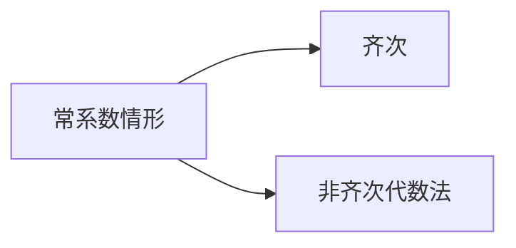

## 两类二阶微分方程的解法

1．可降阶微分方程的解法—降阶法

- $\frac{\mathrm{d}^{2} y}{\mathrm{~d} x^{2}}=f(x) \longrightarrow$ 逐次积分求解
- $\frac{\mathrm{d}^{2} y}{\mathrm{~d} x^{2}}=f\left(x, \frac{\mathrm{~d} y}{\mathrm{~d} x}\right) \xrightarrow{\text { 令 } p(x)=\frac{\mathrm{d} y}{\mathrm{~d} x}} \frac{\mathrm{~d} p}{\mathrm{~d} x}=f(x, p)$
- $\frac{\mathrm{d}^{2} y}{\mathrm{~d} x^{2}}=f\left(y, \frac{\mathrm{~d} y}{\mathrm{~d} x}\right) \xrightarrow{\text { 令 } p(y)=\frac{\mathrm{d} y}{\mathrm{~d} x}} p \frac{\mathrm{~d} p}{\mathrm{~d} y}=f(y, p)$

2．二阶线性微分方程的解法

- 常系数情形

- 欧拉方程

$$
\begin{gathered}
x^{2} y^{\prime \prime}+p x y^{\prime}+q y=f(x) \\
\downarrow \text { 令 } x=\mathrm{e}^{t}, D=\frac{\mathrm{d}}{\mathrm{~d} t} \\
{[D(D-1)+p D+q] y=f\left(\mathrm{e}^{t}\right)}
\end{gathered}
$$

例3 求微分方程 $\left\{\begin{array}{ll}y^{\prime \prime}+y=x, & x \leq \frac{\pi}{2} \\ y^{\prime \prime}+4 y=0, & x>\frac{\pi}{2}\end{array}\right.$ 满足条件 $\left.y\right|_{x=0}=0,\left.y^{\prime}\right|_{x=0}=0$ ，在 $x=\frac{\pi}{2}$ 处连续且可微的解．例4 设函数 $y=y(x)$ 在 $(-\infty,+\infty)$ 内具有连续二阶导数，且 $y^{\prime} \neq 0, x=x(y)$ 是 $y=y(x)$ 的反函数，
（1）试将 $x=x(y)$ 所满足的微分方程

$$
\frac{\mathrm{d}^{2} x}{\mathrm{~d} y^{2}}+(y+\sin x)\left(\frac{\mathrm{d} x}{\mathrm{~d} y}\right)^{3}=0
$$

变换为 $y=y(x)$ 所满足的微分方程；
（2）求变换后的微分方程满足初始条件 $y(0)=0$ ， $y^{\prime}(0)=\frac{3}{2}$ 的解．
（2003考研）

例5 设 $y^{\prime \prime}+p(x) y^{\prime}=f(x)$ 有一特解为 $\frac{1}{x}$ ，对应的齐次方程有一特解为 $x^{2}$ ，试求：
（1）$p(x), f(x)$ 的表达式；
（2）此方程的通解。

例3 求微分方程 $\left\{\begin{array}{ll}y^{\prime \prime}+y=x, & x \leq \frac{\pi}{2} \\ y^{\prime \prime}+4 y=0, & x>\frac{\pi}{2}\end{array}\right.$ 满足条件 $\left.y\right|_{x=0}=0,\left.y^{\prime}\right|_{x=0}=0$ ，在 $x=\frac{\pi}{2}$ 处连续且可微的解．

提示：当 $x \leq \frac{\pi}{2}$ 时，解满足 $\left\{\begin{array}{l}y^{\prime \prime}+y=x \\ \left.y\right|_{x=0}=0,\left.y^{\prime}\right|_{x=0}=0\end{array}\right.$
特征根：$r_{1,2}= \pm \mathrm{i}$ ，
设特解：$y^{*}=A x+B$ ，代入方程定 $\boldsymbol{A}, \boldsymbol{B}$ ，得 $\quad y^{*}=x$
故通解为 $y=C_{1} \cos x+C_{2} \sin x+x$
利用 $\left.y\right|_{x=0}=0,\left.y^{\prime}\right|_{x=0}=0$ ，得

$$
y=-\sin x+x \quad\left(x \leq \frac{\pi}{2}\right)
$$

由 $x=\frac{\pi}{2}$ 处的衔接条件可知，当 $x>\frac{\pi}{2}$ 时，解满足

$$
\left\{\begin{array}{l}
y^{\prime \prime}+4 y=0 \\
\left.y\right|_{x=\frac{\pi}{2}}=-1+\frac{\pi}{2},\left.\quad y^{\prime}\right|_{x=\frac{\pi}{2}}=1
\end{array}\right.
$$

其通解：$y=C_{1} \sin 2 x+C_{2} \cos 2 x$
定解问题的解：$\quad y=-\frac{1}{2} \sin 2 x+\left(1-\frac{\pi}{2}\right) \cos 2 x, x \geq \frac{\pi}{2}$故所求解为

$$
y= \begin{cases}-\sin x+x, & x<\frac{\pi}{2} \\ -\frac{1}{2} \sin 2 x+\left(1-\frac{\pi}{2}\right) \cos 2 x, & x \geq \frac{\pi}{2}\end{cases}
$$

例4 设函数 $y=y(x)$ 在 $(-\infty,+\infty)$ 内具有连续二阶导数，且 $y^{\prime} \neq 0, x=x(y)$ 是 $y=y(x)$ 的反函数，
（1）试将 $x=x(y)$ 所满足的微分方程

$$
\frac{\mathrm{d}^{2} x}{\mathrm{~d} y^{2}}+(y+\sin x)\left(\frac{\mathrm{d} x}{\mathrm{~d} y}\right)^{3}=0
$$

变换为 $y=y(x)$ 所满足的微分方程；
（2）求变换后的微分方程满足初始条件 $y(0)=0$ ， $y^{\prime}(0)=\frac{3}{2}$ 的解．
（2003考研）
解：（1）由反函数的导数公式知 $\frac{\mathrm{d} x}{\mathrm{~d} y}=\frac{1}{y^{\prime}}$ ，即 $y^{\prime} \frac{\mathrm{d} x}{\mathrm{~d} y}=1$ ，上式两端对 $x$ 求导，得

$$
\begin{gathered}
y^{\prime \prime} \frac{\mathrm{d} x}{\mathrm{~d} y}+\frac{\mathrm{d}^{2} x}{\mathrm{~d} y^{2}}\left(y^{\prime}\right)^{2}=0 \\
\therefore \quad \frac{\mathrm{~d}^{2} x}{\mathrm{~d} y^{2}}=-\frac{y^{\prime \prime} \frac{\mathrm{d} x}{\mathrm{~d} y}}{\left(y^{\prime}\right)^{2}}=-\frac{y^{\prime \prime}}{\left(y^{\prime}\right)^{3}}
\end{gathered}
$$

代入原微分方程得

$$
\begin{equation*}
y^{\prime \prime}-y=\sin x \tag{1}
\end{equation*}
$$

（2）方程（1）的对应齐次方程的通解为

$$
Y=C_{1} \mathrm{e}^{x}+C_{2} \mathrm{e}^{-x}
$$

设（1）的特解为

$$
y^{*}=A \cos x+B \sin x,
$$

代入（1）得 $\boldsymbol{A}=\mathbf{0}, B=-\frac{1}{2}$ ，故 $y^{*}=-\frac{1}{2} \sin x$ ，
从而得（1）的通解：

$$
y=C_{1} \mathrm{e}^{x}+C_{2} \mathrm{e}^{-x}-\frac{1}{2} \sin x
$$

由初始条件 $y(0)=0, y^{\prime}(0)=\frac{3}{2}$ ，得

$$
C_{1}=1, C_{2}=-1
$$

故所求初值问题的解为

$$
y=\mathrm{e}^{x}-\mathrm{e}^{-x}-\frac{1}{2} \sin x
$$

例5 设 $y^{\prime \prime}+p(x) y^{\prime}=f(x)$ 有一特解为 $\frac{1}{x}$ ，对应的齐次方程有一特解为 $x^{2}$ ，试求：
（1）$p(x), f(x)$ 的表达式；
（2）此方程的通解。
解（1）由题设可得：

$$
\left\{\begin{array}{l}
2+p(x) 2 x=0, \\
\frac{2}{x^{3}}+p(x)\left(-\frac{1}{x^{2}}\right)=f(x),
\end{array} \text { 解此方程组, }\right. \text {, 得 }
$$

$$
\varphi(x)=-\frac{1}{x}, \quad f(x)=\frac{3}{x^{3}} .
$$

（2）原方程为 $y^{\prime \prime}-\frac{1}{x} y^{\prime}=\frac{3}{x^{3}}$ ．
显见 $y_{1}=1, y_{2}=x^{2}$ 是原方程对应的齐次方 程的两个线性无关的特解，

又 $y^{*}=\frac{1}{x}$ 是原方程的一个特解，由解的结构定理得方程的通解为

$$
y=C_{1}+C_{2} x^{2}+\frac{1}{x} .
$$

习题3 求以 $y=C_{1} \mathrm{e}^{x}+C_{2} \mathrm{e}^{2 x}$ 为通解的微分方程．
提示：由通解式可知特征方程的根为 $\quad r_{1}=1, r_{2}=2$ ，故特征方程为 $(r-1)(r-2)=0$ ，即 $r^{2}-3 r+2=0$
因此微分方程为 $\quad y^{\prime \prime}-3 y^{\prime}+2 y=0$
习题4 求下列微分方程的通解
（1）$y y^{\prime \prime}-y^{\prime 2}-1=0$ ，（2）$y^{\prime \prime}+2 y^{\prime}+5 y=\sin 2 x$ ．
提示：（1）令 $y^{\prime}=p(y)$ ，则方程变为
$y p \frac{\mathrm{~d} p}{\mathrm{~d} y}-p^{2}-1=0$ ，即 $\frac{p \mathrm{~d} p}{1+p^{2}}=\frac{\mathrm{d} y}{y}$
（2）$y^{\prime \prime}+2 y^{\prime}+5 y=\sin 2 x$ ．
特征根：$r_{1,2}=-1 \pm 2 \mathrm{i}$ ，
齐次方程通解：

$$
Y=\mathrm{e}^{-x}\left(C_{1} \cos 2 x+C_{2} \sin 2 x\right)
$$

令非齐次方程特解为

$$
y^{*}=A \cos 2 x+B \sin 2 x
$$

代入方程可得

$$
A=1 / 17, \quad B=-4 / 17
$$

原方程通解为

$$
\begin{array}{r}
y=\mathrm{e}^{-x}\left(C_{1} \cos 2 x+C_{2} \sin 2 x\right) \\
+\frac{1}{17} \cos 2 x-\frac{4}{17} \sin 2 x
\end{array}
$$

## 思 考

若（2）中非齐次项改为 $\sin ^{2} x$ ，特解设法有何变化？
提示： $\sin ^{2} x=\frac{1-\cos 2 x}{2}$ ，故 $y^{*}=A \cos 2 x+B \sin 2 x+D$

习题5 求解 $\quad\left\{\begin{array}{c}y^{\prime \prime}-a y^{\prime 2}=0 \\ \left.y\right|_{x=0}=0,\left.\quad y^{\prime}\right|_{x=0}=-1\end{array}\right.$
提示：令 $y^{\prime}=p(x)$ ，则方程变为 $\frac{\mathrm{d} p}{\mathrm{~d} x}=a p^{2}$
积分得 $-\frac{1}{p}=a x+C_{1}$ ，利用 $\left.p\right|_{x=0}=\left.y^{\prime}\right|_{x=0}=-1$ 得 $C_{1}=1$
再解 $\frac{\mathrm{d} y}{\mathrm{~d} x}=\frac{-1}{1+a x}$ ，并利用 $\left.y\right|_{x=0}=0$ ，定常数 $C_{2}$ 。
思考 若问题改为求解 $\left\{\begin{array}{l}y^{\prime \prime}-\frac{1}{2} y^{\prime 3}=0 \\ \left.y\right|_{x=0}=0,\left.y^{\prime}\right|_{x=0}=1\end{array}\right.$
则求解过程中得 $p^{2}=\frac{1}{1-x}$ ，问开方时正负号如何确定？

习题6 设 $\varphi^{\prime}(x)=\mathrm{e}^{x}+\sqrt{x} \int_{0}^{\sqrt{x}} \varphi(\sqrt{x} u) \mathrm{d} u, \varphi(0)=0$,如何求 $\varphi(x)$ ？

提示：对积分换元，令 $t=\sqrt{x} u$ ，则有

$$
\begin{aligned}
\varphi^{\prime}(x) & =\mathrm{e}^{x}+\int_{0}^{x} \varphi(t) \mathrm{d} t \\
\varphi^{\prime \prime}(x) & =\mathrm{e}^{x}+\varphi(x)
\end{aligned}
$$

解初值问题：$\left\{\begin{array}{l}\varphi^{\prime \prime}(x)-\varphi(x)=\mathrm{e}^{x} \\ \varphi(0)=0, \varphi^{\prime}(0)=1\end{array}\right.$
答案：$\varphi(x)=\frac{1}{4} \mathrm{e}^{x}(2 x+1)-\frac{1}{4} \mathrm{e}^{-x}$

## 微分方程的应用

1．建立数学模型 —列微分方程问题

$$
\begin{array}{ll}
\text { 建立微分方程 (共性 ) } & \left\{\begin{array}{l}
\text { 利用物理规律 } \\
\text { 利用几何关系 }
\end{array}\right. \\
\text { 确定定解条件 (个性 ) } & \left\{\begin{array}{l}
\text { 初始条件 } \\
\text { 边界条件 } \\
\text { 可能还有衔接条件 }
\end{array}\right.
\end{array}
$$

2 ．解微分方程问题
3．分析解所包含的实际意义

例6 设二阶非齐次方程 $y^{\prime \prime}+\psi(x) y^{\prime}=f(x)$ 有特解 $y=\frac{1}{x}$ ，而对应齐次方程有解 $y=x^{2}$ ，求 $\psi(x), f(x)$ 及微分方程的通解。

例7 设函数 $u=f(r), r=\sqrt{x^{2}+y^{2}+z^{2}}$ 在 $\boldsymbol{r}>\mathbf{0}$ 内满足拉普拉斯方程 $\frac{\partial^{2} u}{\partial x^{2}}+\frac{\partial^{2} u}{\partial y^{2}}+\frac{\partial^{2} u}{\partial z^{2}}=0$ ，其中 $f(r)$ 二阶可导，且 $f(1)=f^{\prime}(1)=1$ ，试将方程化为以 $r$ 为自变量的常微分方程，并求 $f(r)$ 。

例8 欲向宇宙发射一颗人造卫星，为使其摆脱地球引力，初始速度应不小于第二宇宙速度，试计算此速度．

例9已知一质量为 $\boldsymbol{m}$ 的质点作直线运动，作用在质点上的力 $\boldsymbol{F}$ 所作的功与经过的时间 $\boldsymbol{t}$ 成正比（比例系数为 $\boldsymbol{k}$ ），初始位移为 $s_{0}$ ，初始速度为 $v_{0}$ ，求质点的运动规律 $s=s(t)$.

例6 设二阶非齐次方程 $y^{\prime \prime}+\psi(x) y^{\prime}=f(x)$ 有特解 $y=\frac{1}{x}$ ，而对应齐次方程有解 $y=x^{2}$ ，求 $\psi(x), f(x)$ 及微分方程的通解。

解：将 $y=x^{2}$ 代入 $y^{\prime \prime}+\psi(x) y^{\prime}=0$ ，得 $\psi(x)=-\frac{1}{x}$
再将 $y=\frac{1}{x}$ 代入 $y^{\prime \prime}-\frac{1}{x} y^{\prime}=f(x)$ 得 $f(x)=\frac{3}{x^{3}}$
故所给二阶非齐次方程为 $y^{\prime \prime}-\frac{1}{x} y^{\prime}=\frac{3}{x^{3}}$
令 $y^{\prime}=p(x)$ ，方程化为 $p^{\prime}-\frac{1}{x} p=\frac{3}{x^{3}}$

J

$$
p^{\prime}-\frac{1}{x} p=\frac{3}{x^{3}}
$$

故

$$
\begin{aligned}
y^{\prime} & =p=\mathrm{e}^{\int \frac{1}{x} \mathrm{~d} x}\left[\int \frac{3}{x^{3}} \mathrm{e}^{-\int \frac{1}{x} \mathrm{~d} x} \mathrm{~d} x+C_{1}^{\prime}\right] \\
& =-\frac{1}{x^{2}}+C_{1}^{\prime} x
\end{aligned}
$$

再积分得通解 $y=\frac{1}{x}+C_{1} x^{2}+C_{2} \quad\left(C_{1}=\frac{1}{2} C_{1}^{\prime}\right)$
复习：一阶线性微分方程 $\quad y^{\prime}+P(x) y=f(x)$
通解公式：

$$
y=\mathrm{e}^{-\int P(x) \mathrm{d} x}\left[\int f(x) \mathrm{e}^{\int P(x) \mathrm{d} x} \mathrm{~d} x+C\right]
$$

例7 设函数 $u=f(r), r=\sqrt{x^{2}+y^{2}+z^{2}}$ 在 $r>0$ 内满足拉普拉斯方程 $\frac{\partial^{2} u}{\partial x^{2}}+\frac{\partial^{2} u}{\partial y^{2}}+\frac{\partial^{2} u}{\partial z^{2}}=0$ ，其中 $f(r)$ 二阶可导，且 $f(1)=f^{\prime}(1)=1$ ，试将方程化为以 $r$ 为自变量的常微分方程，并求 $f(r)$ ．

提示：$\frac{\partial u}{\partial x}=f^{\prime}(r) \frac{x}{r} \quad \frac{\partial^{2} u}{\partial x^{2}}=f^{\prime \prime}(r) \frac{x^{2}}{r^{2}}+f^{\prime}(r)\left(\frac{1}{r}-\frac{x^{2}}{r^{3}}\right)$利用对称性，原方程可化为

$$
f^{\prime \prime}(r)+\frac{2}{r} f^{\prime}(r)=0
$$

即

$$
r^{2} f^{\prime \prime}(r)+2 r f^{\prime}(r)=0 \text { (欧拉方程 ) }
$$

解初值问题：$\left\{\begin{array}{l}r^{2} f^{\prime \prime}(r)+2 r f^{\prime}(r)=0 \\ f(1)=f^{\prime}(1)=1\end{array}\right.$
令 $t=\ln r$ ，记 $D=\frac{\mathrm{d}}{\mathrm{d} t}$ ，则原方程化为

$$
[D(D-1)+2 D] f=0 \text { 即 }\left[D^{2}+D\right] f=0
$$

通解：$f(r)=C_{1}+C_{2} \mathrm{e}^{-t}=C_{1}+C_{2} \frac{1}{r}$
利用初始条件得特解：

$$
f(r)=2-\frac{1}{r}
$$

例8 欲向宇宙发射一颗人造卫星，为使其摆脱地球引力，初始速度应不小于第二宇宙速度，试计算此速度．

解：设人造地球卫星质量为 $m$ ，地球质量为 $M$ ，卫星的质心到地心的距离为 $h$ ，由牛顿第二定律得：
$m \frac{\mathrm{~d}^{2} h}{\mathrm{~d} t^{2}}=-\frac{G M m}{h^{2}}$（ $\boldsymbol{G}$ 为引力系数）
又设卫星的初速度为 $v_{0}$ ，已知地球半径 $R \approx 63 \times 10^{5}$ ，则有初值问题：

$$
\left\{\begin{array}{l}
\frac{\mathrm{d}^{2} h}{\mathrm{~d} t^{2}}=-\frac{G M}{h^{2}}  \tag{2}\\
\left.h\right|_{t=0}=R,\left.\quad \frac{\mathrm{~d} h}{\mathrm{~d} t}\right|_{t=0}=v_{0}
\end{array}\right.
$$

设 $\frac{\mathrm{d} h}{\mathrm{~d} t}=v(h)$ ，则 $\frac{\mathrm{d}^{2} h}{\mathrm{~d} t^{2}}=v \frac{\mathrm{~d} v}{\mathrm{~d} h}$ ，代入原方程（2），得

$$
v \frac{\mathrm{~d} v}{\mathrm{~d} h}=-\frac{G M}{h^{2}} \longrightarrow v \mathrm{~d} v=-\frac{G M}{h^{2}} \mathrm{~d} h
$$

两边积分得

$$
\frac{1}{2} v^{2}=\frac{G M}{h}+C
$$

利用初始条件（3），得

$$
C=\frac{1}{2} v_{0}^{2}-\frac{G M}{R}
$$

因此 $\frac{1}{2} v^{2}=\frac{1}{2} v_{0}^{2}+G M\left(\frac{1}{h}-\frac{1}{R}\right)$
注意到 $\lim _{h \rightarrow+\infty} \frac{1}{2} v^{2}=\frac{1}{2} v_{0}^{2}-G M \frac{1}{R}$

为使 $v \geq 0, v_{0}$ 应满足

$$
\begin{equation*}
v_{0} \geq \sqrt{\frac{2 G M}{R}} \tag{4}
\end{equation*}
$$

因为当 $h=R$（在地面上）时，引力 $=$ 重力，即

$$
\frac{G M m}{R^{2}}=m g \quad\left(g=9.81 \mathrm{~m} / \mathrm{s}^{2}\right)
$$

故 $G M=R^{2} g$ ，代入（4）即得

$$
\begin{aligned}
v_{0} & \geq \sqrt{2 R g}=\sqrt{2 \times 63 \times 10^{5} \times 9.81} \\
& \approx 11.2 \times 10^{3}(\mathrm{~m} / \mathrm{s})
\end{aligned}
$$

这说明第二宇宙速度为 $11.2 \mathrm{~km} / \mathrm{s}$

例9已知一质量为 $\boldsymbol{m}$ 的质点作直线运动，作用在质点上的力 $\boldsymbol{F}$ 所作的功与经过的时间 $\boldsymbol{t}$ 成正比（比例系数为 $k$ ），初始位移为 $s_{0}$ ，初始速度为 $v_{0}$ ，求质点的运动规律 $s=s(t)$.
提示：由题设 $\int_{S_{0}}^{s} F \mathrm{~d} s=k t$ ，两边对 $\boldsymbol{s}$ 求导得：

$$
\begin{aligned}
& F=k \frac{\mathrm{~d} t}{\mathrm{~d} s} \xrightarrow[\text { 牛顿第二定律 }]{ } m \frac{\mathrm{~d}^{2} s}{\mathrm{~d} t^{2}}=k \frac{\mathrm{~d} t}{\mathrm{~d} s} \\
& \longrightarrow \frac{\mathrm{~d} s}{\mathrm{~d} t} \frac{\mathrm{~d}^{2} s}{\mathrm{~d} t^{2}}=\frac{k}{m} \longrightarrow \frac{\mathrm{~d}}{\mathrm{~d} t}\left[\frac{\mathrm{~d} s}{\mathrm{~d} t}\right]^{2}=\frac{2 k}{m} \\
& \longrightarrow\left[\frac{\mathrm{~d} s}{\mathrm{~d} t}\right]^{2}=\frac{2 k}{m} t+C_{1} \cdots \text { 开方如何定 }+\cdots ?
\end{aligned}
$$

习题7 已知某曲线经过点 $(\mathbf{1}, \mathbf{1})$ ，它的切线在纵轴上的截距等于切点的横坐标，求它的方程。

提示：设曲线上的动点为 $M(x, y)$ ，此点处切线方程为

$$
Y-y=y^{\prime}(X-x)
$$

令 $\boldsymbol{X}=\mathbf{0}$ ，得截距 $Y=y-y^{\prime} x$ ，由题意知微分方程为

即

$$
\begin{gathered}
y-y^{\prime} x=x \\
y^{\prime}-\frac{1}{x} y=-1
\end{gathered}
$$

定解条件为 $\left.y\right|_{x=1}=1$ ．
思考：能否根据草图列方程？

习题8 已知某车间的容积为 $30 \times 30 \times 6 \mathrm{~m}^{3}$ ，其中含 $0.12 \%$ 的 $\mathrm{CO}_{2}$ ，现以含 $0.04 \% \mathrm{CO}_{2}$ 的新鲜空气输入，问每分钟应输入多少才能在 $\mathbf{3 0}$ 分钟后使车间空气中 $\mathrm{CO}_{2}$ 的含量不超过 $\mathbf{0 . 0 6 \%}$ ？（假定输入的新鲜空气与原有空气很快混合均匀后，以相同的流量排出）5400

提示：设每分钟应输入 $k \mathrm{~m}^{3}, \boldsymbol{t}$ 时刻车间空气中含 $\mathrm{CO}_{2}$为 $x \mathrm{~m}^{3}$ ，则在 $[t, t+\Delta t]$ 内车间内 $\mathrm{CO}_{2}$ 的改变量为

$$
\Delta x=k \cdot \frac{0.04}{100} \Delta t-k \cdot \frac{x}{5400} \Delta t
$$

两端除以 $\Delta t$ ，并令 $\Delta t \rightarrow 0$

得微分方程 $\frac{\mathrm{d} x}{\mathrm{~d} t}+\frac{k}{5400} x=\frac{k}{2500}$

初始条件 $\left.\quad x\right|_{t=0}=\frac{0.12}{100} \times 5400=0.12 \times 54$
解定解问题 $\left\{\begin{array}{l}\frac{\mathrm{d} x}{\mathrm{~d} t}+\frac{k}{5400} x=\frac{k}{2500} \\ \left.x\right|_{t=0}=0.12 \times 54\end{array}\right.$
得 $\quad x=54\left(0.08 \mathrm{e}^{\frac{-k}{5400} t}+0.04\right) \quad \boldsymbol{k}=$ ？

$$
\begin{aligned}
& \quad \boldsymbol{t}=\mathbf{3 0} \text { 时 } \quad x=\frac{0.06}{100} \times 5400=0.06 \times 54 \\
& k=180 \ln 4 \approx 250
\end{aligned}
$$

因此每分钟应至少输入 $\mathbf{2 5 0} \mathrm{m}^{3}$ 新鲜空气。
